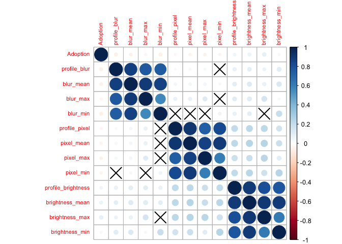
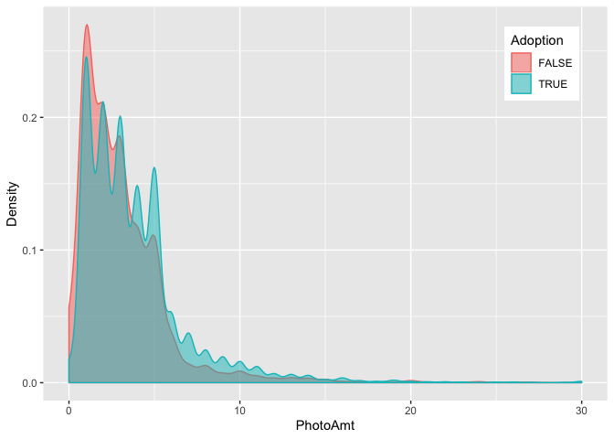
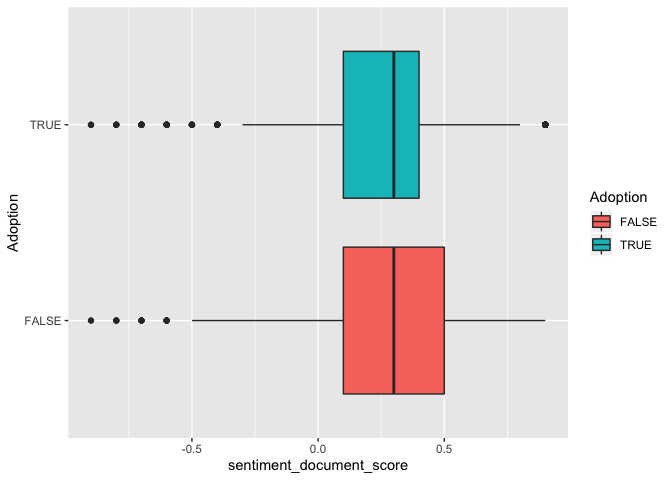

DataExploration\_v4
================

# libraries

``` r
library(Hmisc)
```

    ## Loading required package: lattice

    ## Loading required package: survival

    ## Loading required package: Formula

    ## Loading required package: ggplot2

    ## 
    ## Attaching package: 'Hmisc'

    ## The following objects are masked from 'package:base':
    ## 
    ##     format.pval, units

``` r
library(readxl)
library(corrplot)
```

    ## corrplot 0.84 loaded

``` r
library(NLP)
```

    ## 
    ## Attaching package: 'NLP'

    ## The following object is masked from 'package:ggplot2':
    ## 
    ##     annotate

``` r
library(ggplot2)
library(ggmosaic)
library(tm)
library(wordcloud)
```

    ## Loading required package: RColorBrewer

``` r
library(GGally)
```

    ## Registered S3 method overwritten by 'GGally':
    ##   method from   
    ##   +.gg   ggplot2

    ## 
    ## Attaching package: 'GGally'

    ## The following object is masked from 'package:ggmosaic':
    ## 
    ##     happy

``` r
library(lsr)
library(dplyr)
```

    ## 
    ## Attaching package: 'dplyr'

    ## The following object is masked from 'package:GGally':
    ## 
    ##     nasa

    ## The following objects are masked from 'package:Hmisc':
    ## 
    ##     src, summarize

    ## The following objects are masked from 'package:stats':
    ## 
    ##     filter, lag

    ## The following objects are masked from 'package:base':
    ## 
    ##     intersect, setdiff, setequal, union

Datasets from
DataImport.Rmd

``` r
train_df <- read.csv("/Users/carinaland/Documents/Thesis/05 Data/train_df_v2.csv")[,-1]
test_df <- read.csv("/Users/carinaland/Documents/Thesis/05 Data/test_df_v2.csv")[,-1]
```

Adjust Datatypes and Check Datasets

``` r
print("Train Set")
```

    ## [1] "Train Set"

``` r
train_df$Description <- as.character(train_df$Description)
train_df$Name <- as.character(train_df$Name)
train_df$PetID <- as.character(train_df$PetID)
train_df$RescuerID <- as.character(train_df$RescuerID)
str(train_df) 
```

    ## 'data.frame':    9252 obs. of  45 variables:
    ##  $ RescuerID                   : chr  "0008ef529da74e9701db7eaaa4d9115a" "000a5830787b64da2d61b0bbceb7676d" "000a5830787b64da2d61b0bbceb7676d" "000acff3d6148772579b3e623988131b" ...
    ##  $ Type                        : Factor w/ 2 levels "cat","dog": 2 1 1 2 1 2 1 2 1 2 ...
    ##  $ Name                        : chr  "Nutella" "Momo" "Mimi" "Brownie" ...
    ##  $ Age                         : int  2 2 2 10 24 48 36 84 6 11 ...
    ##  $ Gender                      : Factor w/ 2 levels "female","male": 1 1 1 2 2 1 1 1 2 1 ...
    ##  $ MaturitySize                : Factor w/ 4 levels "extra large",..: 3 4 4 3 4 3 3 4 4 3 ...
    ##  $ FurLength                   : Factor w/ 3 levels "long","medium",..: 3 3 3 2 3 3 2 1 3 2 ...
    ##  $ Vaccinated                  : Factor w/ 3 levels "no","not sure",..: 3 1 1 3 2 3 3 3 3 2 ...
    ##  $ Dewormed                    : Factor w/ 3 levels "no","not sure",..: 3 1 1 1 3 3 3 3 3 3 ...
    ##  $ Sterilized                  : Factor w/ 3 levels "no","not sure",..: 1 1 1 1 1 3 3 3 3 2 ...
    ##  $ Health                      : Factor w/ 3 levels "healthy","minor injury",..: 1 1 1 1 2 1 1 1 1 1 ...
    ##  $ Fee                         : int  0 0 0 0 150 100 120 180 100 200 ...
    ##  $ VideoAmt                    : int  0 0 0 0 0 0 0 0 0 0 ...
    ##  $ Description                 : chr  "She used to follow a pack of adult dogs near my office area. But my office area is not a dog-friendly place. On"| __truncated__ "Colour : calico Umur : 2 months Sex : Female Remarks: - the kitten is very healty n active - dh ble mkn kibble "| __truncated__ "Details: Colour : calico Umur : 2 months Sex : Female Remarks: - the kitten is very healty n active - dh ble mk"| __truncated__ "He is healthy and tough, less than 1 year old, male. He is a bit mixture of German Shepherd, 4ft tall when stan"| __truncated__ ...
    ##  $ PetID                       : chr  "d7f938acd" "21655a8bc" "f0982978a" "06fda20a2" ...
    ##  $ PhotoAmt                    : int  4 3 3 1 2 3 3 3 3 3 ...
    ##  $ BreedName1                  : Factor w/ 156 levels "Abyssinian","Akita",..: 92 52 52 92 52 92 52 124 52 92 ...
    ##  $ BreedName2                  : Factor w/ 117 levels "Abyssinian","Affenpinscher",..: NA NA NA 55 NA NA NA NA NA NA ...
    ##  $ ColorName1                  : Factor w/ 7 levels "Black","Brown",..: 2 1 1 2 4 3 2 4 1 3 ...
    ##  $ ColorName2                  : Factor w/ 6 levels "Brown","Cream",..: NA 3 3 NA 6 5 6 5 1 5 ...
    ##  $ ColorName3                  : Factor w/ 5 levels "Cream","Golden",..: NA 4 4 NA NA NA 4 NA 4 NA ...
    ##  $ StateName                   : Factor w/ 13 levels "Johor","Kedah",..: 12 4 4 4 12 12 12 12 12 12 ...
    ##  $ sentiment_document_score    : num  0 0.2 0.4 0.4 0.3 0.6 0.9 0.7 0.1 0.4 ...
    ##  $ sentiment_document_magnitude: num  1.5 0.2 0.4 0.8 2.7 2.6 1.8 3.5 3.1 1.4 ...
    ##  $ sentiment_document_language : Factor w/ 5 levels "de","en","unknown",..: 2 2 2 2 2 2 2 2 2 2 ...
    ##  $ profile_blur                : num  555.7 243.8 87.7 483.9 1135.8 ...
    ##  $ profile_pixel               : num  409600 120000 120000 120000 172800 ...
    ##  $ profile_brightness          : num  117.1 49.3 50 114.9 128.5 ...
    ##  $ pixel_mean                  : num  265600 120000 120000 120000 172800 ...
    ##  $ blur_mean                   : num  808 391 284 484 1000 ...
    ##  $ brightness_mean             : num  105.6 60 53.4 114.9 129 ...
    ##  $ pixel_min                   : num  172800 120000 120000 120000 172800 ...
    ##  $ blur_min                    : num  256.6 243.8 87.7 483.9 864.5 ...
    ##  $ brightness_min              : num  85.4 49.3 50 114.9 128.5 ...
    ##  $ pixel_max                   : num  409600 120000 120000 120000 172800 ...
    ##  $ blur_max                    : num  1286 568 638 484 1136 ...
    ##  $ brightness_max              : num  117.1 67.9 58.3 114.9 129.4 ...
    ##  $ no_name                     : logi  FALSE FALSE FALSE FALSE FALSE FALSE ...
    ##  $ no_description              : logi  FALSE FALSE FALSE FALSE FALSE FALSE ...
    ##  $ pure_breed                  : int  0 0 0 0 0 0 0 1 0 0 ...
    ##  $ vet_count                   : int  2 0 0 1 1 3 3 3 3 1 ...
    ##  $ col_count                   : int  1 3 3 1 2 2 3 2 3 2 ...
    ##  $ Adoption                    : logi  TRUE TRUE TRUE TRUE FALSE FALSE ...
    ##  $ RescuerFreq                 : int  0 1 1 0 0 51 51 51 51 51 ...
    ##  $ RescuerFreq2                : int  0 2 2 0 0 58 58 58 58 58 ...

``` r
summary(train_df)
```

    ##   RescuerID          Type          Name                Age        
    ##  Length:9252        cat:3987   Length:9252        Min.   :  0.00  
    ##  Class :character   dog:5265   Class :character   1st Qu.:  2.00  
    ##  Mode  :character              Mode  :character   Median :  4.00  
    ##                                                   Mean   : 11.76  
    ##                                                   3rd Qu.: 12.00  
    ##                                                   Max.   :255.00  
    ##                                                                   
    ##     Gender          MaturitySize   FurLength       Vaccinated       Dewormed   
    ##  female:5151   extra large:  22   long  : 576   no      :3937   no      :2446  
    ##  male  :4101   large      : 841   medium:3303   not sure:1223   not sure:1150  
    ##                medium     :6398   short :5373   yes     :4092   yes     :5656  
    ##                small      :1991                                                
    ##                                                                                
    ##                                                                                
    ##                                                                                
    ##     Sterilized              Health          Fee             VideoAmt      
    ##  no      :5975   healthy       :8891   Min.   :   0.00   Min.   :0.00000  
    ##  not sure:1085   minor injury  : 336   1st Qu.:   0.00   1st Qu.:0.00000  
    ##  yes     :2192   serious injury:  25   Median :   0.00   Median :0.00000  
    ##                                        Mean   :  24.25   Mean   :0.05221  
    ##                                        3rd Qu.:   0.00   3rd Qu.:0.00000  
    ##                                        Max.   :2000.00   Max.   :6.00000  
    ##                                                                           
    ##  Description           PetID              PhotoAmt     
    ##  Length:9252        Length:9252        Min.   : 0.000  
    ##  Class :character   Class :character   1st Qu.: 2.000  
    ##  Mode  :character   Mode  :character   Median : 3.000  
    ##                                        Mean   : 3.597  
    ##                                        3rd Qu.: 5.000  
    ##                                        Max.   :30.000  
    ##                                                        
    ##                 BreedName1                  BreedName2    ColorName1  
    ##  Mixed Breed         :3672   Mixed Breed         :1031   Black :4185  
    ##  Domestic Short Hair :2109   Domestic Short Hair : 261   Brown :2484  
    ##  Domestic Medium Hair: 708   Domestic Medium Hair: 168   Cream : 625  
    ##  Tabby               : 195   Tabby               :  74   Golden: 626  
    ##  Domestic Long Hair  : 176   Domestic Long Hair  :  70   Gray  : 447  
    ##  Siamese             : 164   (Other)             : 823   White : 471  
    ##  (Other)             :2228   NA's                :6825   Yellow: 414  
    ##   ColorName2    ColorName3             StateName    sentiment_document_score
    ##  Brown :1734   Cream : 190   Selangor       :5439   Min.   :-0.9000         
    ##  Cream : 637   Golden:  86   Kuala Lumpur   :2366   1st Qu.: 0.1000         
    ##  Golden: 366   Gray  : 150   Pulau Pinang   : 530   Median : 0.3000         
    ##  Gray  : 542   White :1509   Johor          : 305   Mean   : 0.2899         
    ##  White :2365   Yellow:  88   Perak          : 250   3rd Qu.: 0.4000         
    ##  Yellow: 428   NA's  :7229   Negeri Sembilan: 130   Max.   : 0.9000         
    ##  NA's  :3180                 (Other)        : 232                           
    ##  sentiment_document_magnitude sentiment_document_language  profile_blur    
    ##  Min.   : 0.000               de     :   2                Min.   :    0.0  
    ##  1st Qu.: 0.900               en     :8865                1st Qu.:  234.3  
    ##  Median : 1.700               unknown: 306                Median :  535.0  
    ##  Mean   : 2.138               zh     :  55                Mean   : 1055.9  
    ##  3rd Qu.: 2.800               zh-Hant:  24                3rd Qu.: 1228.9  
    ##  Max.   :32.000                                           Max.   :27061.4  
    ##                                                                            
    ##  profile_pixel    profile_brightness   pixel_mean        blur_mean      
    ##  Min.   :     0   Min.   :  0.0      Min.   :      0   Min.   :    0.0  
    ##  1st Qu.:120000   1st Qu.:102.6      1st Qu.: 120000   1st Qu.:  302.3  
    ##  Median :120000   Median :120.7      Median : 121600   Median :  635.1  
    ##  Mean   :155192   Mean   :118.4      Mean   : 155464   Mean   : 1067.0  
    ##  3rd Qu.:172800   3rd Qu.:137.6      3rd Qu.: 172800   3rd Qu.: 1286.6  
    ##  Max.   :409600   Max.   :229.3      Max.   :1287066   Max.   :27061.4  
    ##                                                                         
    ##  brightness_mean   pixel_min         blur_min       brightness_min  
    ##  Min.   :  0.0   Min.   :     0   Min.   :    0.0   Min.   :  0.00  
    ##  1st Qu.:105.6   1st Qu.:112400   1st Qu.:  131.7   1st Qu.: 87.37  
    ##  Median :120.3   Median :120000   Median :  306.5   Median :106.62  
    ##  Mean   :118.2   Mean   :138772   Mean   :  656.8   Mean   :104.34  
    ##  3rd Qu.:134.4   3rd Qu.:172800   3rd Qu.:  707.6   3rd Qu.:124.23  
    ##  Max.   :229.2   Max.   :409600   Max.   :27061.4   Max.   :229.21  
    ##                                                                     
    ##    pixel_max          blur_max       brightness_max   no_name       
    ##  Min.   :      0   Min.   :    0.0   Min.   :  0.0   Mode :logical  
    ##  1st Qu.: 120000   1st Qu.:  417.5   1st Qu.:116.6   FALSE:8695     
    ##  Median : 129600   Median :  947.8   Median :133.9   TRUE :557      
    ##  Mean   : 174434   Mean   : 1656.9   Mean   :131.7                  
    ##  3rd Qu.: 230400   3rd Qu.: 2031.2   3rd Qu.:150.6                  
    ##  Max.   :5705728   Max.   :27061.4   Max.   :252.8                  
    ##                                                                     
    ##  no_description    pure_breed       vet_count       col_count    
    ##  Mode :logical   Min.   :0.0000   Min.   :0.000   Min.   :1.000  
    ##  FALSE:9246      1st Qu.:0.0000   1st Qu.:0.000   1st Qu.:1.000  
    ##  TRUE :6         Median :0.0000   Median :1.000   Median :2.000  
    ##                  Mean   :0.2259   Mean   :1.291   Mean   :1.875  
    ##                  3rd Qu.:0.0000   3rd Qu.:2.000   3rd Qu.:2.000  
    ##                  Max.   :1.0000   Max.   :3.000   Max.   :3.000  
    ##                                                                  
    ##   Adoption        RescuerFreq      RescuerFreq2   
    ##  Mode :logical   Min.   :  0.00   Min.   :  0.00  
    ##  FALSE:2461      1st Qu.:  0.00   1st Qu.:  0.00  
    ##  TRUE :6791      Median :  4.00   Median :  4.00  
    ##                  Mean   : 34.98   Mean   : 44.46  
    ##                  3rd Qu.: 24.00   3rd Qu.: 31.00  
    ##                  Max.   :352.00   Max.   :440.00  
    ## 

``` r
print("Test Set")
```

    ## [1] "Test Set"

``` r
test_df$Description <- as.character(test_df$Description)
test_df$Name <- as.character(test_df$Name)
test_df$PetID <- as.character(test_df$PetID)
test_df$RescuerID <- as.character(test_df$RescuerID)
str(test_df)  
```

    ## 'data.frame':    2313 obs. of  45 variables:
    ##  $ RescuerID                   : chr  "000a5830787b64da2d61b0bbceb7676d" "001e42763024f9d4abe31e79472b1827" "001e42763024f9d4abe31e79472b1827" "001e42763024f9d4abe31e79472b1827" ...
    ##  $ Type                        : Factor w/ 2 levels "cat","dog": 1 2 2 2 1 1 1 1 2 1 ...
    ##  $ Name                        : chr  "Cik Mau" "Bella" "Sel" "Mask" ...
    ##  $ Age                         : int  5 2 72 8 12 3 8 11 36 24 ...
    ##  $ Gender                      : Factor w/ 2 levels "female","male": 1 1 1 2 1 2 2 1 1 1 ...
    ##  $ MaturitySize                : Factor w/ 4 levels "extra large",..: 3 3 4 3 3 3 3 3 3 3 ...
    ##  $ FurLength                   : Factor w/ 3 levels "long","medium",..: 3 2 1 2 2 3 3 3 3 3 ...
    ##  $ Vaccinated                  : Factor w/ 3 levels "no","not sure",..: 1 1 3 1 3 3 3 3 1 1 ...
    ##  $ Dewormed                    : Factor w/ 3 levels "no","not sure",..: 1 1 3 1 3 3 3 3 3 3 ...
    ##  $ Sterilized                  : Factor w/ 3 levels "no","not sure",..: 1 1 3 1 3 1 3 3 3 3 ...
    ##  $ Health                      : Factor w/ 3 levels "healthy","minor injury",..: 1 1 1 1 1 1 1 1 1 1 ...
    ##  $ Fee                         : int  60 0 0 0 0 120 0 100 0 50 ...
    ##  $ VideoAmt                    : int  0 0 0 0 0 0 0 0 0 0 ...
    ##  $ Description                 : chr  "Sangat manja dan comel Sihat & active Location : Pandan Indah, KL Call" "Bella is a very smart puppy. Easy to train. Friendly and cute. Please contact Michelle directly at ‪+‑‬ if you wi"| __truncated__ "Sel is a lovely dog, fully house trained. She has one eye but does not have any problem moving about. She is sp"| __truncated__ "Mask is Patch's brother. Adopter to bear his neutering bill." ...
    ##  $ PetID                       : chr  "ac6089da8" "3c25f4969" "bc4bbcef1" "f33f3512e" ...
    ##  $ PhotoAmt                    : int  2 2 1 2 4 4 2 4 5 2 ...
    ##  $ BreedName1                  : Factor w/ 102 levels "Abyssinian","American Curl",..: 37 65 84 65 35 37 37 37 65 37 ...
    ##  $ BreedName2                  : Factor w/ 74 levels "American Curl",..: NA NA NA NA NA NA NA NA 41 NA ...
    ##  $ ColorName1                  : Factor w/ 7 levels "Black","Brown",..: 4 1 4 1 6 1 3 1 3 1 ...
    ##  $ ColorName2                  : Factor w/ 6 levels "Brown","Cream",..: NA 1 5 5 NA 5 NA 6 NA 2 ...
    ##  $ ColorName3                  : Factor w/ 5 levels "Cream","Golden",..: NA 4 NA NA NA NA NA 4 NA NA ...
    ##  $ StateName                   : Factor w/ 14 levels "Johor","Kedah",..: 4 13 13 13 13 13 13 13 13 4 ...
    ##  $ sentiment_document_score    : num  0.3 0.5 0.2 0 0.2 0.2 0.5 0.5 0.5 0.9 ...
    ##  $ sentiment_document_magnitude: num  1.7 2.8 1.1 0.1 3.2 1.8 3.3 2.7 4.7 1.9 ...
    ##  $ sentiment_document_language : Factor w/ 4 levels "en","unknown",..: 2 1 1 1 1 1 1 1 1 1 ...
    ##  $ profile_blur                : num  2146.9 308.3 141.5 848.3 66.3 ...
    ##  $ profile_pixel               : int  120000 121801 120000 120000 120000 76480 67500 172320 120000 110400 ...
    ##  $ profile_brightness          : num  110.7 152.6 153.9 98.2 114.2 ...
    ##  $ pixel_mean                  : num  120000 147300 120000 120000 120000 ...
    ##  $ blur_mean                   : num  2147 637 142 4214 342 ...
    ##  $ brightness_mean             : num  111 148 154 112 130 ...
    ##  $ pixel_min                   : int  120000 121801 120000 120000 120000 76480 67500 141120 120000 109725 ...
    ##  $ blur_min                    : num  2146.9 308.3 141.5 848.3 66.3 ...
    ##  $ brightness_min              : num  110.7 144 153.9 98.2 114.2 ...
    ##  $ pixel_max                   : int  120000 172800 120000 120000 120000 408960 67500 408960 120000 110400 ...
    ##  $ blur_max                    : num  2147 965 142 7580 776 ...
    ##  $ brightness_max              : num  111 153 154 126 142 ...
    ##  $ no_name                     : logi  FALSE FALSE FALSE FALSE FALSE FALSE ...
    ##  $ no_description              : logi  FALSE FALSE FALSE FALSE FALSE FALSE ...
    ##  $ pure_breed                  : int  0 0 1 0 1 0 0 0 0 0 ...
    ##  $ vet_count                   : int  0 0 3 0 3 2 3 3 2 2 ...
    ##  $ col_count                   : int  1 3 2 2 1 2 1 3 1 2 ...
    ##  $ Adoption                    : logi  TRUE FALSE TRUE TRUE TRUE TRUE ...
    ##  $ RescuerFreq                 : int  0 6 6 6 6 6 6 6 0 0 ...
    ##  $ RescuerFreq2                : int  2 58 58 58 58 58 58 58 0 1 ...

``` r
summary(test_df)
```

    ##   RescuerID          Type          Name                Age        
    ##  Length:2313        cat: 956   Length:2313        Min.   :  0.00  
    ##  Class :character   dog:1357   Class :character   1st Qu.:  2.00  
    ##  Mode  :character              Mode  :character   Median :  4.00  
    ##                                                   Mean   : 11.86  
    ##                                                   3rd Qu.: 12.00  
    ##                                                   Max.   :255.00  
    ##                                                                   
    ##     Gender          MaturitySize   FurLength       Vaccinated       Dewormed   
    ##  female:1327   extra large:   6   long  : 137   no      :1027   no      : 624  
    ##  male  : 986   large      : 200   medium: 862   not sure: 296   not sure: 271  
    ##                medium     :1618   short :1314   yes     : 990   yes     :1418  
    ##                small      : 489                                                
    ##                                                                                
    ##                                                                                
    ##                                                                                
    ##     Sterilized              Health          Fee            VideoAmt      
    ##  no      :1535   healthy       :2232   Min.   :  0.00   Min.   :0.00000  
    ##  not sure: 261   minor injury  :  76   1st Qu.:  0.00   1st Qu.:0.00000  
    ##  yes     : 517   serious injury:   5   Median :  0.00   Median :0.00000  
    ##                                        Mean   : 23.01   Mean   :0.05923  
    ##                                        3rd Qu.:  0.00   3rd Qu.:0.00000  
    ##                                        Max.   :750.00   Max.   :6.00000  
    ##                                                                          
    ##  Description           PetID              PhotoAmt     
    ##  Length:2313        Length:2313        Min.   : 0.000  
    ##  Class :character   Class :character   1st Qu.: 1.000  
    ##  Mode  :character   Mode  :character   Median : 3.000  
    ##                                        Mean   : 3.652  
    ##                                        3rd Qu.: 5.000  
    ##                                        Max.   :30.000  
    ##                                                        
    ##                 BreedName1                 BreedName2    ColorName1  
    ##  Mixed Breed         :962   Mixed Breed         : 284   Black :1076  
    ##  Domestic Short Hair :498   Domestic Short Hair :  71   Brown : 594  
    ##  Domestic Medium Hair:157   Domestic Medium Hair:  31   Cream : 141  
    ##  Tabby               : 49   Tabby               :  27   Golden: 165  
    ##  Domestic Long Hair  : 47   Terrier             :  17   Gray  : 129  
    ##  Siamese             : 39   (Other)             : 217   White : 122  
    ##  (Other)             :561   NA's                :1666   Yellow:  86  
    ##   ColorName2   ColorName3             StateName    sentiment_document_score
    ##  Brown :480   Cream :  45   Selangor       :1396   Min.   :-0.8000         
    ##  Cream :151   Golden:  25   Kuala Lumpur   : 561   1st Qu.: 0.1000         
    ##  Golden: 98   Gray  :  48   Pulau Pinang   : 124   Median : 0.3000         
    ##  Gray  :118   White : 359   Perak          :  66   Mean   : 0.3016         
    ##  White :560   Yellow:  36   Johor          :  54   3rd Qu.: 0.5000         
    ##  Yellow:108   NA's  :1800   Negeri Sembilan:  37   Max.   : 0.9000         
    ##  NA's  :798                 (Other)        :  75                           
    ##  sentiment_document_magnitude sentiment_document_language  profile_blur    
    ##  Min.   : 0.000               en     :2226                Min.   :    0.0  
    ##  1st Qu.: 0.900               unknown:  60                1st Qu.:  245.5  
    ##  Median : 1.700               zh     :  20                Median :  525.8  
    ##  Mean   : 2.177               zh-Hant:   7                Mean   : 1057.7  
    ##  3rd Qu.: 2.900                                           3rd Qu.: 1154.2  
    ##  Max.   :20.500                                           Max.   :19958.8  
    ##                                                                            
    ##  profile_pixel    profile_brightness   pixel_mean       blur_mean      
    ##  Min.   :     0   Min.   :  0.0      Min.   :     0   Min.   :    0.0  
    ##  1st Qu.:120000   1st Qu.:101.9      1st Qu.:119829   1st Qu.:  301.8  
    ##  Median :120000   Median :120.0      Median :120400   Median :  604.2  
    ##  Mean   :153009   Mean   :118.5      Mean   :153414   Mean   : 1069.5  
    ##  3rd Qu.:172800   3rd Qu.:137.2      3rd Qu.:172800   3rd Qu.: 1229.0  
    ##  Max.   :409600   Max.   :222.0      Max.   :409600   Max.   :19958.8  
    ##                                                                        
    ##  brightness_mean   pixel_min         blur_min       brightness_min 
    ##  Min.   :  0.0   Min.   :     0   Min.   :    0.0   Min.   :  0.0  
    ##  1st Qu.:105.5   1st Qu.:107600   1st Qu.:  140.6   1st Qu.: 87.8  
    ##  Median :120.4   Median :120000   Median :  306.4   Median :106.6  
    ##  Mean   :118.3   Mean   :137558   Mean   :  665.6   Mean   :104.6  
    ##  3rd Qu.:134.6   3rd Qu.:172320   3rd Qu.:  665.2   3rd Qu.:123.9  
    ##  Max.   :198.6   Max.   :409600   Max.   :19958.8   Max.   :198.6  
    ##                                                                    
    ##    pixel_max         blur_max       brightness_max   no_name       
    ##  Min.   :     0   Min.   :    0.0   Min.   :  0.0   Mode :logical  
    ##  1st Qu.:120000   1st Qu.:  424.0   1st Qu.:116.8   FALSE:2190     
    ##  Median :129600   Median :  913.9   Median :134.3   TRUE :123      
    ##  Mean   :170767   Mean   : 1666.8   Mean   :131.8                  
    ##  3rd Qu.:209280   3rd Qu.: 1977.7   3rd Qu.:151.4                  
    ##  Max.   :409600   Max.   :19958.8   Max.   :223.8                  
    ##                                                                    
    ##  no_description    pure_breed      vet_count       col_count    
    ##  Mode :logical   Min.   :0.000   Min.   :0.000   Min.   :1.000  
    ##  FALSE:2310      1st Qu.:0.000   1st Qu.:0.000   1st Qu.:1.000  
    ##  TRUE :3         Median :0.000   Median :1.000   Median :2.000  
    ##                  Mean   :0.224   Mean   :1.265   Mean   :1.877  
    ##                  3rd Qu.:0.000   3rd Qu.:2.000   3rd Qu.:2.000  
    ##                  Max.   :1.000   Max.   :3.000   Max.   :3.000  
    ##                                                                 
    ##   Adoption        RescuerFreq     RescuerFreq2   
    ##  Mode :logical   Min.   : 0.00   Min.   :  0.00  
    ##  FALSE:619       1st Qu.: 0.00   1st Qu.:  0.00  
    ##  TRUE :1694      Median : 1.00   Median :  5.00  
    ##                  Mean   :10.41   Mean   : 48.36  
    ##                  3rd Qu.: 6.00   3rd Qu.: 33.00  
    ##                  Max.   :87.00   Max.   :440.00  
    ## 

create new dataframes for the datasets which will later be used for the
models (grouping of categories (binning) and feature selection will be
performed)

``` r
train_bin <- data.frame(train_df) 
test_bin <- data.frame(test_df)
```

Outline: - Type - State - BreedGroup - RefBreed - SecondBreed - Age -
Name - NameCleaned (failed –\> omitted) - ImgQuality: Brightness,
PixelCount, Sharpness (profile) - ImgQuality: Appendix - PhotoAmt -
VideoAmt - DescrMagnitude - DescrScore - Relationship DescrMagnitude,
DescrScore - Fee - VetCount - MosaicPlot: VetCount - Sterilized,
Dewormed, Vaccinated - Correlation VetCount - Fee - Sterilized,
Dewormed, Vaccinated - Correlation: Sterilized - Age - Health -
RescuerExperience - others: Color, MaturitySize, FurLength (Appendix)

# Type: dog

``` r
prop.table(table(train_df$Type))
```

    ## 
    ##       cat       dog 
    ## 0.4309339 0.5690661

``` r
prop.table(table(train_df$Adoption, train_df$Type),2)
```

    ##        
    ##               cat       dog
    ##   FALSE 0.2468021 0.2805318
    ##   TRUE  0.7531979 0.7194682

``` r
levels(train_df$Type)
```

    ## [1] "cat" "dog"

``` r
print('Chisq test')
```

    ## [1] "Chisq test"

``` r
chisq.test(table(train_df$Adoption,train_df$Type))
```

    ## 
    ##  Pearson's Chi-squared test with Yates' continuity correction
    ## 
    ## data:  table(train_df$Adoption, train_df$Type)
    ## X-squared = 13.049, df = 1, p-value = 0.0003035

``` r
print('Cramers V')
```

    ## [1] "Cramers V"

``` r
cramersV(table(train_df$Adoption,train_df$Type))
```

    ## [1] 0.0375548

# State: Johor

### Adoptionrates

``` r
prop.table(table(train_df$Adoption, train_df$StateName),2)
```

    ##        
    ##             Johor     Kedah  Kelantan Kuala Lumpur    Melaka Negeri Sembilan
    ##   FALSE 0.2721311 0.2647059 0.1666667    0.3021978 0.5949367       0.3923077
    ##   TRUE  0.7278689 0.7352941 0.8333333    0.6978022 0.4050633       0.6076923
    ##        
    ##            Pahang     Perak Pulau Pinang     Sabah   Sarawak  Selangor
    ##   FALSE 0.2439024 0.2920000    0.3339623 0.4285714 0.5714286 0.2338665
    ##   TRUE  0.7560976 0.7080000    0.6660377 0.5714286 0.4285714 0.7661335
    ##        
    ##         Terengganu
    ##   FALSE  0.2352941
    ##   TRUE   0.7647059

### Visualizations

``` r
# Barplot: Number of Records per State
statetab <- as.data.frame(prop.table(table(train_df$Adoption, train_df$StateName),2))
statetab <- statetab[statetab$Var1 == TRUE,]
statetab <- subset(statetab, select=-Var1)
colnames(statetab) <- c("StateName", "AdoptionRate")
tab <- as.data.frame(table(train_df$StateName))
statetab$Freq <- tab$Freq
statetab <- statetab[order(statetab$AdoptionRate),]
statetab
```

    ##          StateName AdoptionRate Freq
    ## 10          Melaka    0.4050633   79
    ## 22         Sarawak    0.4285714    7
    ## 20           Sabah    0.5714286   14
    ## 12 Negeri Sembilan    0.6076923  130
    ## 18    Pulau Pinang    0.6660377  530
    ## 8     Kuala Lumpur    0.6978022 2366
    ## 16           Perak    0.7080000  250
    ## 2            Johor    0.7278689  305
    ## 4            Kedah    0.7352941   68
    ## 14          Pahang    0.7560976   41
    ## 26      Terengganu    0.7647059   17
    ## 24        Selangor    0.7661335 5439
    ## 6         Kelantan    0.8333333    6

``` r
statetab <- statetab[order(statetab$Freq),]
StateOrderFreq <- statetab$StateName

statetab$StateName <- ordered(statetab$StateName, levels= StateOrderFreq)

ggplot(statetab, aes(x=StateName, y=Freq))+
  geom_bar(stat="identity",fill="darkcyan")+
  scale_y_continuous(limits = c(0, 6000))+
  coord_flip()+
  geom_text(aes(label=Freq),hjust=-0.2)+
  xlab("State")+
  ylab("Number of records")
```

<!-- -->

``` r
train_df$StateName <- ordered(train_df$StateName, levels = c("Melaka","Sarawak","Sabah", "Negeri Sembilan","Pulau Pinang","Kuala Lumpur","Perak","Johor","Kedah", "Pahang","Terengganu","Selangor","Kelantan"))

# Mosaic Plot: Adoption Rate by State
train_df2 <- train_df  # used to switch order in Adoption axis
train_df2$Adoption <- relevel(factor(train_df2$Adoption),"TRUE")

train_df2$StateName <- ordered(train_df$StateName, levels = c("Melaka","Sarawak","Sabah", "Negeri Sembilan","Pulau Pinang","Kuala Lumpur","Perak","Johor","Kedah", "Pahang","Terengganu","Selangor","Kelantan"))

ggplot(train_df2)+geom_mosaic(aes(x=product(Adoption,StateName),fill=Adoption))+
  labs(x="State", y="Adoption Rate")+
  geom_hline(aes(yintercept=0.7340035,linetype="overall"), color="gray35")+
  theme(axis.text.x = element_text(angle = 90), legend.position = "bottom")+
  scale_linetype_manual(name="Adoption Rate",values=c(2),guide=guide_legend(override.aes = list(color="gray35")))+
  scale_y_continuous(labels = scales::percent_format(accuracy = 1))+ scale_fill_manual(values = c("#00BFC4", "#F8766D"))
```

<!-- -->

``` r
train_df$StateName <- ordered(train_df$StateName, levels= StateOrderFreq)
train_df$StateName <- as.factor(train_df$StateName)
```

group together underrepresented states with similar adoption
probabilities –\> bin : (Melaka, Sarawak, Sabah, Labuan) - low adoption
rates. West Malaysia a bit off (less urbanised), hasn’t spread yet
(Advertisement?) Melaka? Maybe good local organisations?

(Terengganu, Kelantan, Kedah, Pahang) - high adoption rates, Angebot
Nachfrage (Melaka ausnahme?)

### Binning (Grouping)

``` r
train_bin$StateName <- as.character(train_bin$StateName)
test_bin$StateName <- as.character(test_bin$StateName)

train_bin$StateName[train_bin$StateName %in% c("Melaka","Sarawak","Sabah","Labuan")] <- "Melaka|Labuan|Sabah|Sarawak"
train_bin$StateName[train_bin$StateName %in% c("Kelantan","Kedah","Pahang","Terengganu")] <-"Kedah|Kelantan|Pahang|Terengganu"

test_bin$StateName[test_bin$StateName %in% c("Melaka","Sarawak","Sabah","Labuan")] <- "Melaka|Labuan|Sabah|Sarawak"
test_bin$StateName[test_bin$StateName %in% c("Kelantan","Kedah","Pahang","Terengganu")] <-"Kedah|Kelantan|Pahang|Terengganu"
```

``` r
#check if no underrepresented categories anymore
table(train_bin$StateName)
```

    ## 
    ##                            Johor Kedah|Kelantan|Pahang|Terengganu 
    ##                              305                              132 
    ##                     Kuala Lumpur      Melaka|Labuan|Sabah|Sarawak 
    ##                             2366                              100 
    ##                  Negeri Sembilan                            Perak 
    ##                              130                              250 
    ##                     Pulau Pinang                         Selangor 
    ##                              530                             5439

``` r
prop.table(table(train_bin$StateName))
```

    ## 
    ##                            Johor Kedah|Kelantan|Pahang|Terengganu 
    ##                       0.03296585                       0.01426719 
    ##                     Kuala Lumpur      Melaka|Labuan|Sabah|Sarawak 
    ##                       0.25572849                       0.01080847 
    ##                  Negeri Sembilan                            Perak 
    ##                       0.01405102                       0.02702118 
    ##                     Pulau Pinang                         Selangor 
    ##                       0.05728491                       0.58787289

Selangor \> Kuala Lumpur \> Pulau Pinang \> Perak …

### Relevel

``` r
prop.table(table(train_bin$Adoption,train_bin$StateName),2)
```

    ##        
    ##             Johor Kedah|Kelantan|Pahang|Terengganu Kuala Lumpur
    ##   FALSE 0.2721311                        0.2500000    0.3021978
    ##   TRUE  0.7278689                        0.7500000    0.6978022
    ##        
    ##         Melaka|Labuan|Sabah|Sarawak Negeri Sembilan     Perak Pulau Pinang
    ##   FALSE                   0.5700000       0.3923077 0.2920000    0.3339623
    ##   TRUE                    0.4300000       0.6076923 0.7080000    0.6660377
    ##        
    ##          Selangor
    ##   FALSE 0.2338665
    ##   TRUE  0.7661335

``` r
train_bin$StateName <- factor(train_bin$StateName)
test_bin$StateName <- factor(test_bin$StateName)

str(train_bin$StateName)
```

    ##  Factor w/ 8 levels "Johor","Kedah|Kelantan|Pahang|Terengganu",..: 8 3 3 3 8 8 8 8 8 8 ...

``` r
str(test_bin$StateName)
```

    ##  Factor w/ 8 levels "Johor","Kedah|Kelantan|Pahang|Terengganu",..: 3 8 8 8 8 8 8 8 8 3 ...

Johor is chosen as reference level, is fine since the overall chance of
Adoption is 0.73

### Chisq, CramersV

``` r
tab <- table(train_bin$Adoption,train_bin$StateName)
chisq.test(tab)
```

    ## 
    ##  Pearson's Chi-squared test
    ## 
    ## data:  tab
    ## X-squared = 116.24, df = 7, p-value < 2.2e-16

``` r
cramersV(tab)
```

    ## [1] 0.1120859

### Remove

variables that aren’t needed anymore

``` r
rm(tab, statetab)
```

# Breed

## RefBreed, SecondBreed(, PureBreed) - Adoptionrates, Chisq, CramersV

refbreed: Breed1 is not MixedBreed and not Domestic Short Hair \<
CramersV: 0.1085

secondBreed: Breed2 is entered \< CramersV 0.0495

pure\_breed (omitted): only one breed entered, and it is not RefBreed or
Cat6 \< CramersV: 0.076 \< refbreed is more meaningful

–\> use refbreed and secondbreed refBreed and pureBreed is correlated
second Breed is aditional information to refBreed, additional
information: either another lookalike or with mixedBreed that they are
not sure

``` r
# RefBreed
refbreed <- (train_df$BreedName1 %in% c("Mixed Breed","Domestic Short Hair"))
print("ReferenceBreed: Mixed Breed (dogs) & Domestic Short Hair (cats)")
```

    ## [1] "ReferenceBreed: Mixed Breed (dogs) & Domestic Short Hair (cats)"

``` r
print("Adoption rates by refbreed")
```

    ## [1] "Adoption rates by refbreed"

``` r
tab <- table(train_df$Adoption, refbreed)
prop.table(tab,2)
```

    ##        refbreed
    ##             FALSE      TRUE
    ##   FALSE 0.2039758 0.3032347
    ##   TRUE  0.7960242 0.6967653

``` r
chisq.test(tab)
```

    ## 
    ##  Pearson's Chi-squared test with Yates' continuity correction
    ## 
    ## data:  tab
    ## X-squared = 108.93, df = 1, p-value < 2.2e-16

``` r
cramersV(tab)
```

    ## [1] 0.108509

``` r
# SecondBreed
secondbreed <- !is.na(train_df$BreedName2)
print("Adoption rates by secondbreed")
```

    ## [1] "Adoption rates by secondbreed"

``` r
tab <- table(train_df$Adoption, secondbreed)
prop.table(tab,2)
```

    ##        secondbreed
    ##             FALSE      TRUE
    ##   FALSE 0.2791209 0.2290894
    ##   TRUE  0.7208791 0.7709106

``` r
chisq.test(tab)
```

    ## 
    ##  Pearson's Chi-squared test with Yates' continuity correction
    ## 
    ## data:  tab
    ## X-squared = 22.698, df = 1, p-value = 1.896e-06

``` r
cramersV(tab)
```

    ## [1] 0.04953085

``` r
# PureBreed - omitted
table(train_bin$pure_breed)
```

    ## 
    ##    0    1 
    ## 7162 2090

``` r
tab <- table(train_bin$Adoption,train_bin$pure_breed)
prop.table(tab,2)
```

    ##        
    ##                 0         1
    ##   FALSE 0.2812064 0.2138756
    ##   TRUE  0.7187936 0.7861244

``` r
chisq.test(tab)
```

    ## 
    ##  Pearson's Chi-squared test with Yates' continuity correction
    ## 
    ## data:  tab
    ## X-squared = 37.222, df = 1, p-value = 1.054e-09

``` r
cramersV(tab)
```

    ## [1] 0.06342832

``` r
#Adapt PureBreed by excluding Cat6
Cat6 <- c("Calico","Dilute Calico","Dilute Tortoiseshell","Extra-Toes Cat (Hemingway Polydactyl)","Munchkin","Silver","Tabby","Tiger","Torbie","Tortoiseshell","Tuxedo")

PureBreed <- train_bin$pure_breed
PureBreed[train_bin$BreedName1 %in% Cat6] <- FALSE

chisq.test(table(train_bin$Adoption,PureBreed))
```

    ## 
    ##  Pearson's Chi-squared test with Yates' continuity correction
    ## 
    ## data:  table(train_bin$Adoption, PureBreed)
    ## X-squared = 54.696, df = 1, p-value = 1.407e-13

``` r
cramersV(table(train_bin$Adoption,PureBreed))
```

    ## [1] 0.07688859

``` r
# create features
train_bin$pure_breed[train_bin$BreedName1 %in% Cat6] <- FALSE  # purebreed removed at the end of the file
test_bin$pure_breed[test_bin$BreedName1 %in% Cat6] <- FALSE  # purebreed removed at the end of the file

train_bin$refbreed <- (train_bin$BreedName1 %in% c("Mixed Breed","Domestic Short Hair"))
test_bin$refbreed <- (test_bin$BreedName1 %in% c("Mixed Breed","Domestic Short Hair"))

train_bin$SecondBreed <- !is.na(train_bin$BreedName2)
test_bin$SecondBreed <- !is.na(test_bin$BreedName2)
```

``` r
#check 
prop.table(table(train_bin$Adoption,train_bin$refbreed),2)
```

    ##        
    ##             FALSE      TRUE
    ##   FALSE 0.2039758 0.3032347
    ##   TRUE  0.7960242 0.6967653

``` r
#later relevel TRUE
prop.table(table(train_bin$Adoption,train_bin$SecondBreed),2)
```

    ##        
    ##             FALSE      TRUE
    ##   FALSE 0.2791209 0.2290894
    ##   TRUE  0.7208791 0.7709106

``` r
#later relevel FALSE
```

## BreedGroup1: RefBreed

### DataCleaning

datacleaning\! cats have dogbreed\! \#\#\#\# \< Load AKC UKC Breed
Groups, Relevel <http://fifeweb.org/wp/breeds/breeds_prf_stn.php>
<https://www.ukcdogs.com/breed-groups>

``` r
UKC_FIF <- read_excel("/Users/carinaland/Documents/Thesis/05 Data/02 Additional Data/UKC_FIF.xlsx",col_types = c("text", "text"))
```

  - Summarized Dog Breed Groups Scenthound & SighthoundPariah, not all
    given dog breeds were in the breed list of UKC, allocated them in
    all conscience
  - Summarized Cat Breed Groups 1&2, not all given cat breeds were in
    the breed list of FIF, allocated them in all conscience

<!-- end list -->

``` r
train_bin <-  merge(train_bin,UKC_FIF,by="BreedName1")
test_bin <- merge(test_bin,UKC_FIF,by="BreedName1")

### choose Refbreed (domestic shorthair&mixed breed) as reference level: overall prob 0.67
train_bin$UKC_FIF <- factor(train_bin$UKC_FIF)
train_bin$UKC_FIF <- relevel(train_bin$UKC_FIF,"RefBreed")
test_bin$UKC_FIF <- factor(test_bin$UKC_FIF)
test_bin$UKC_FIF <- relevel(test_bin$UKC_FIF ,"RefBreed")
```

Cats with dog breeds, or wrong type entered –\> also check with
images

``` r
train_bin[(train_bin$Type == "cat") & (train_bin$UKC_FIF %in% c("Companion","Herding","MixedBreed","Terrier") | train_bin$BreedName1=="Mixed Breed") ,]
```

    ##                      BreedName1                        RescuerID Type
    ## 90            Australian Kelpie ec0c78ffa25dae7dffdb9669b9ac9e95  cat
    ## 185  Belgian Shepherd Laekenois 4e271c777d05f0d87034c9db0ea6663f  cat
    ## 477                      Collie 35ca0af7f781e96744e8371c35b07944  cat
    ## 4259                Mixed Breed 266264e8a363155bf1468a89ad33382d  cat
    ## 4278                Mixed Breed 27798b29cd4d37d2d2295ac2056142ca  cat
    ## 5517                Mixed Breed 4ae03d5929455f19fb51629315ae2307  cat
    ## 8511                   Shih Tzu 0e9d19f9046c000d494f2f7496ef6482  cat
    ## 9101                    Terrier 35ca0af7f781e96744e8371c35b07944  cat
    ##                            Name Age Gender MaturitySize FurLength Vaccinated
    ## 90                       Munchi   1   male        small     short         no
    ## 185                       Shuka   3 female        small     short         no
    ## 477                     Mao Mao   1 female        small     short         no
    ## 4259                     Mizamo  12 female       medium     short        yes
    ## 4278                      Tabby   3 female        small     short   not sure
    ## 5517                  Mr.Mishoo   1   male        small     short         no
    ## 8511 Bobby The Smiling Shih Tzu  36   male       medium      long   not sure
    ## 9101                     Mo-Joe   1   male        large      long         no
    ##      Dewormed Sterilized  Health Fee VideoAmt
    ## 90         no         no healthy   0        0
    ## 185       yes         no healthy   0        0
    ## 477       yes         no healthy   0        0
    ## 4259      yes        yes healthy   0        0
    ## 4278 not sure   not sure healthy   0        0
    ## 5517       no   not sure healthy   0        0
    ## 8511 not sure         no healthy   0        0
    ## 9101       no         no healthy  25        0
    ##                                                                                                                                                                                                                                                                                                                                                                                                                                                                                                                                                                                                                                                                                                                                                                                                                                                                                                                                                                                                                                                                                                                                                                                                                                                                                                                                                                                                                                                                                                                                                                                                                                                                                                                                                                                                                                                                                                                                                                                                                                                                                                                                                                                                                                                                                                                                                                                                                                                                                                                                                                                                                                                                                                                                                                                                                                                    Description
    ## 90                                                                                                                                                                                                                                                                                                                                                                                                                                                                                                                                                                                                                                                                                                                                                                                                                                                                                                                                                                                                                                                                                                                                                                                                                                                                                                                                                                                                                                                                                                                                                                                                                                                                                                                                                                                                                                                                                                                                                                                                                                                                                                                                                                                                                                                                                                                                                                                                                                                                                                                                                                                                                                                                                                                                                                                                                               He's very naughty and cute ..
    ## 185                                                                                                                                                                                                                                                                                                                                                                                                                                                                                                                                                                                                                                                                                                                                                                                                                                                                                                                                                                                                                                                                                                                                                                                                                                                                                                                                                                                                                                                                                                                                                                                                                                                                                                                                                                                                                                                                                                                                                                                                                                                                                                                                                                                                                                                                                                                                                                                                                                                                                                                                                                                                                                                                                                                                                                                                                                           so cute and kind
    ## 477                                                                                                                                                                                                                                                                                                                                                                                                                                                                                                                                                                                                                                                                                                                                                                                                                                                                                                                                                                                                                                                                                                                                                                                                                                                                                                                                                                                                                                                                                                                                                                                                                                                                                                                                                                                                                                                                                                                                                                                                                                                                                                                                                                                                                                                                                                                                                                                                                                                                                                                                                                         i rescued mao mao last two weeks or 3 weeks ago. She was very small but able to survive and now is so healthy. She is a frend to sister beline, merry and berry..adopted together with Merry on 9 Jan . mummy pray for ur happiness mao2..so too Merry. Take care of each other k.
    ## 4259                                                                                                                                                                                                                                                                                                                                                                                                                                                                                                                                                                                                                                                                                                                                                                                                                                                                                                                                                                                                                                                                                                                                                                                                                                                                                                                                                                                                                                                                                                                                                                                                                                                                                                                                                                                                                                                                                                                                                                                                                                                                                                                                                                                                                                                                                                                                                                                                                                                                                                                                                                                                                                                                                                                                                                                                                 very cut very lovely very nice for people
    ## 4278                                                                                                                                                                                                                                                                                                                                                                                                                                                                                                                                                                                                                                                                                                                                                                                                                                                                                                                                                                                                                                                                                                                                                                                                                                                                                                                                                                                                                                                                                                                                                                                                                                                                                                                                                                                                                                                                                                                                                                                                                                                                                                                                                                                                                                                                                                                                                                                                                                                                                                                                                                                                            I just rescue this kitty at pm near my apartment,she beg for food,keep follow me while i dog run my dog with me,current this kitty temporary keep by my aunty because I be away from //. Please contact Wendy if would could give her home,tq.
    ## 5517                                                                                                                                                                                                                                                                                                                                                                                                                                                                                                                                                                                                                                                                                                                                                                                                                                                                                                                                                                                                                                                                                                                                                                                                                                                                                                                                                                                                                                                                                                                                                                                                                                                                                                                                                                                                                                                                                                                                                                                                                                                                                                                                                                                                                                                                                                                         Hello ,My name is Mishoo, I 'm a one month black and white kitty...My momy loves me so much...but she described to me because she has asthma ...and her asthma attacks are becomg more and more after adopting me ,she cant take care of me any more...so I m searching for a new happy family.i am a calm but also nauthy boy...i love toplay a a lot...i am also so smart I drink catmilk in bowl and know how to use sand box...I m waiting for your call..PLZ adoptme if you really really can love me :) and take care of me
    ## 8511 How he was found: Bobby was abandoned and was roaming around our neighbourhood one rainy afternoon - all the kids were mad happy upon his arrival. People played with him, but, as night came and heavy rain poured in, all the doors were shut and nobody let the dog in. He was begging for shelter from house to house. Bobby's conditions (health, behaviour, friendliness & etc.): Bobby is a friendly dog who enjoys being petted and brushed. He is also very playful and he requires being taken out for a walk everyday. When we first found him, his health was at a very bad stake. He smelled bad and his fur all matted. He had sensitive stomach - he suffered from diarrhoea during the first week and couldn't digest kibbles. We fed him boiled chicken/liver and very soft rice for a fortnight and now he can eat anything (healthy for a dog). I trimmed his fur the first week and brush him on a daily basis. Now he looks as charming as the ones at a dog show. We noted several behavioural problems caused by the previous owner. In other words, Bobby's owner had abused him and kicked him out of the house. Several issues were observed, e.g. Bobby is shit scared of broom stick and he shows aggression as we wear slippers in front of him (was beaten by the previous owner with broom stick/kicked with shoes on). He doesn't trust strangers (especially adults); but with patience and obedience training and a lot of treats (what we did), now he jumps around us shaking his tail happily all the time. Why we couldn't let him stay We are a cat-lover family and we currently have 2 cats at our household (more are coming). As much as I love Bobby and try to help him, my cats show strong objections and disagreements against having a dog in our house. In the end of the day, I believe Bobby deserves a better/more experienced dog owner. Terms and conditions: There is no adoption fee and no money involved. You could take him to your home as long as you agree to/that - 1. Take him out for (at least) a walk everyday 2. Brush him on a daily basis, otherwise Bobby would have a matted fur 3. Strictly NO punishment in any form. You can correct him if he does anything wrong, but - you have to understand that he was abused by his previous owner and doesn't trust human a bit, therefore he regards punishment, aggression and violence differently - so, no punishment. What we do is that when he does something right, we give him treats and praise him (a little bit of drama and exaggeration involved); when he does something that we don't like, we show him that we don't like it and ignore him for a while. He wants to please you, so he will do anything if it makes you happy and avoid letting you down. For more details, kindly give me a call at during daytime.
    ## 9101                                                                                                                                                                                                                                                                                                                                                                                                                                                                                                                                                                                                                                                                                                                                                                                                                                                                                                                                                                                                                                                                                                                                                                                                                                                                                                                                                                                                                                                                                                                                                                                                                                                                                                                                                                                                                                                                                                                                                                                                                                                                                                                                                                                                                                                                                                                                                                                                                                                                                                                Mo-joe is adopted and is in good hand with sofia..im proud of him in any where coz even he so cute and adorable, he is the most behave kitten i have..the cutest among all..Mummy wish u all the best in your life baby..of coz u not going to be a lawyer or something.. :) but mummy hope you will grow up as a good gentlemen..love ya.
    ##          PetID PhotoAmt BreedName2 ColorName1 ColorName2 ColorName3
    ## 90   85ec1aac0        1       <NA>      Black      White       <NA>
    ## 185  15a206d0d        2       <NA>       Gray       <NA>       <NA>
    ## 477  6a72cfda7        3      Akita      Brown       <NA>       <NA>
    ## 4259 7ec261d88        3       <NA>      Black      White       <NA>
    ## 4278 44f198a24        7       <NA>      Black     Golden      White
    ## 5517 40dfeeb65        2       <NA>      Black      White       <NA>
    ## 8511 6c399cb06        2       <NA>      Brown      Cream      White
    ## 9101 699a81c51        3    Terrier      Brown      White       <NA>
    ##                        StateName sentiment_document_score
    ## 90   Melaka|Labuan|Sabah|Sarawak                      0.7
    ## 185                 Kuala Lumpur                      0.8
    ## 477                     Selangor                      0.3
    ## 4259                Kuala Lumpur                      0.9
    ## 4278                Kuala Lumpur                      0.0
    ## 5517                    Selangor                      0.9
    ## 8511                       Johor                      0.0
    ## 9101                    Selangor                      0.9
    ##      sentiment_document_magnitude sentiment_document_language profile_blur
    ## 90                            0.7                          en    306.19266
    ## 185                           0.8                          en    176.88087
    ## 477                           1.3                          en    691.02970
    ## 4259                          0.9                          en    264.55578
    ## 4278                          0.4                          en    766.82067
    ## 5517                          0.9                          en     17.24825
    ## 8511                         13.0                          en   1043.72805
    ## 9101                          0.9                          en     16.17852
    ##      profile_pixel profile_brightness pixel_mean  blur_mean brightness_mean
    ## 90          120000           98.73217     120000  306.19266        98.73217
    ## 185         106800          155.25237      98200  293.94186       169.94549
    ## 477         120000          131.55833     120000  567.49759       140.69799
    ## 4259         67500          160.57451      85000  665.16708       149.75521
    ## 4278        129600          116.53993     129600  694.87490       110.09906
    ## 5517        120000           39.94162     120000  299.26000        42.86051
    ## 8511        120000          120.82261     120000 1108.95251       101.57117
    ## 9101        120000           75.66706     120000   45.99273        87.98386
    ##      pixel_min   blur_min brightness_min pixel_max   blur_max brightness_max
    ## 90      120000  306.19266       98.73217    120000  306.19266       98.73217
    ## 185      89600  176.88087      155.25237    106800  411.00284      184.63861
    ## 477     120000  322.88166      131.55833    120000  691.02970      147.62978
    ## 4259     67500  264.55578      136.31970    120000 1040.15394      160.57451
    ## 4278    129600   90.99964       84.95764    129600 1317.70545      148.94006
    ## 5517    120000   17.24825       39.94162    120000  581.27176       45.77941
    ## 8511    120000 1043.72805       82.31974    120000 1174.17697      120.82261
    ## 9101    120000   16.17852       75.66706    120000   82.63486      102.53923
    ##      no_name no_description pure_breed vet_count col_count Adoption RescuerFreq
    ## 90     FALSE          FALSE          1         0         2    FALSE           4
    ## 185    FALSE          FALSE          1         1         1    FALSE           0
    ## 477    FALSE          FALSE          0         1         1     TRUE          14
    ## 4259   FALSE          FALSE          0         3         2    FALSE           0
    ## 4278   FALSE          FALSE          0         0         3    FALSE           5
    ## 5517   FALSE          FALSE          0         0         2    FALSE           1
    ## 8511   FALSE          FALSE          1         0         3     TRUE           4
    ## 9101   FALSE          FALSE          0         0         2     TRUE          14
    ##      RescuerFreq2 refbreed SecondBreed   UKC_FIF
    ## 90              4    FALSE       FALSE   Herding
    ## 185             1    FALSE       FALSE   Herding
    ## 477            19    FALSE        TRUE   Herding
    ## 4259            1     TRUE       FALSE  RefBreed
    ## 4278            5     TRUE       FALSE  RefBreed
    ## 5517            1     TRUE       FALSE  RefBreed
    ## 8511            4    FALSE       FALSE Companion
    ## 9101           19    FALSE        TRUE   Terrier

``` r
test_bin[(test_bin$Type == "cat") & (test_bin$UKC_FIF %in% c("Companion","Herding","Mixed Breed","Terrier") | test_bin$BreedName1 =="Mixed Breed"),]
```

    ##  [1] BreedName1                   RescuerID                   
    ##  [3] Type                         Name                        
    ##  [5] Age                          Gender                      
    ##  [7] MaturitySize                 FurLength                   
    ##  [9] Vaccinated                   Dewormed                    
    ## [11] Sterilized                   Health                      
    ## [13] Fee                          VideoAmt                    
    ## [15] Description                  PetID                       
    ## [17] PhotoAmt                     BreedName2                  
    ## [19] ColorName1                   ColorName2                  
    ## [21] ColorName3                   StateName                   
    ## [23] sentiment_document_score     sentiment_document_magnitude
    ## [25] sentiment_document_language  profile_blur                
    ## [27] profile_pixel                profile_brightness          
    ## [29] pixel_mean                   blur_mean                   
    ## [31] brightness_mean              pixel_min                   
    ## [33] blur_min                     brightness_min              
    ## [35] pixel_max                    blur_max                    
    ## [37] brightness_max               no_name                     
    ## [39] no_description               pure_breed                  
    ## [41] vet_count                    col_count                   
    ## [43] Adoption                     RescuerFreq                 
    ## [45] RescuerFreq2                 refbreed                    
    ## [47] SecondBreed                  UKC_FIF                     
    ## <0 rows> (or 0-length row.names)

``` r
train_bin[(train_bin$Type == "dog") & (train_bin$UKC_FIF %in% c("Cat1_2","Cat3","Cat4","Cat5","Cat6")),]
```

    ##  [1] BreedName1                   RescuerID                   
    ##  [3] Type                         Name                        
    ##  [5] Age                          Gender                      
    ##  [7] MaturitySize                 FurLength                   
    ##  [9] Vaccinated                   Dewormed                    
    ## [11] Sterilized                   Health                      
    ## [13] Fee                          VideoAmt                    
    ## [15] Description                  PetID                       
    ## [17] PhotoAmt                     BreedName2                  
    ## [19] ColorName1                   ColorName2                  
    ## [21] ColorName3                   StateName                   
    ## [23] sentiment_document_score     sentiment_document_magnitude
    ## [25] sentiment_document_language  profile_blur                
    ## [27] profile_pixel                profile_brightness          
    ## [29] pixel_mean                   blur_mean                   
    ## [31] brightness_mean              pixel_min                   
    ## [33] blur_min                     brightness_min              
    ## [35] pixel_max                    blur_max                    
    ## [37] brightness_max               no_name                     
    ## [39] no_description               pure_breed                  
    ## [41] vet_count                    col_count                   
    ## [43] Adoption                     RescuerFreq                 
    ## [45] RescuerFreq2                 refbreed                    
    ## [47] SecondBreed                  UKC_FIF                     
    ## <0 rows> (or 0-length row.names)

``` r
test_bin[(test_bin$Type == "dog") & (test_bin$UKC_FIF %in% c("Cat1_2","Cat3","Cat4","Cat5","Cat6")),]
```

    ##  [1] BreedName1                   RescuerID                   
    ##  [3] Type                         Name                        
    ##  [5] Age                          Gender                      
    ##  [7] MaturitySize                 FurLength                   
    ##  [9] Vaccinated                   Dewormed                    
    ## [11] Sterilized                   Health                      
    ## [13] Fee                          VideoAmt                    
    ## [15] Description                  PetID                       
    ## [17] PhotoAmt                     BreedName2                  
    ## [19] ColorName1                   ColorName2                  
    ## [21] ColorName3                   StateName                   
    ## [23] sentiment_document_score     sentiment_document_magnitude
    ## [25] sentiment_document_language  profile_blur                
    ## [27] profile_pixel                profile_brightness          
    ## [29] pixel_mean                   blur_mean                   
    ## [31] brightness_mean              pixel_min                   
    ## [33] blur_min                     brightness_min              
    ## [35] pixel_max                    blur_max                    
    ## [37] brightness_max               no_name                     
    ## [39] no_description               pure_breed                  
    ## [41] vet_count                    col_count                   
    ## [43] Adoption                     RescuerFreq                 
    ## [45] RescuerFreq2                 refbreed                    
    ## [47] SecondBreed                  UKC_FIF                     
    ## <0 rows> (or 0-length row.names)

“85ec1aac0”: Australian Kelpie - cat –\> domestic shorthair “15a206d0d”:
Belgian Shepherd Laekenois –\> cat –\> domestic shorthair “6a72cfda7”:
Collie\&Akita –\> cat –\> domestic shorthair & NA “7ec261d88”: Mixed
Breed –\> cat –\> domestic shorthair “44f198a24”: Mixed Breed –\> cat
–\> domestic shorthair “40dfeeb65”: Mixed Breed –\> cat –\> domestic
shorthair “699a81c51”: Terrier, Terrier –\> cat –\> domestic shorthair
“6c399cb06”: Shih Tzu –\> dog\!\!

``` r
#adjust breed or type:

train_bin[train_bin$PetID %in% c("85ec1aac0","15a206d0d","6a72cfda7","7ec261d88","44f198a24","40dfeeb65","6c399cb06"),]
```

    ##                      BreedName1                        RescuerID Type
    ## 90            Australian Kelpie ec0c78ffa25dae7dffdb9669b9ac9e95  cat
    ## 185  Belgian Shepherd Laekenois 4e271c777d05f0d87034c9db0ea6663f  cat
    ## 477                      Collie 35ca0af7f781e96744e8371c35b07944  cat
    ## 4259                Mixed Breed 266264e8a363155bf1468a89ad33382d  cat
    ## 4278                Mixed Breed 27798b29cd4d37d2d2295ac2056142ca  cat
    ## 5517                Mixed Breed 4ae03d5929455f19fb51629315ae2307  cat
    ## 8511                   Shih Tzu 0e9d19f9046c000d494f2f7496ef6482  cat
    ##                            Name Age Gender MaturitySize FurLength Vaccinated
    ## 90                       Munchi   1   male        small     short         no
    ## 185                       Shuka   3 female        small     short         no
    ## 477                     Mao Mao   1 female        small     short         no
    ## 4259                     Mizamo  12 female       medium     short        yes
    ## 4278                      Tabby   3 female        small     short   not sure
    ## 5517                  Mr.Mishoo   1   male        small     short         no
    ## 8511 Bobby The Smiling Shih Tzu  36   male       medium      long   not sure
    ##      Dewormed Sterilized  Health Fee VideoAmt
    ## 90         no         no healthy   0        0
    ## 185       yes         no healthy   0        0
    ## 477       yes         no healthy   0        0
    ## 4259      yes        yes healthy   0        0
    ## 4278 not sure   not sure healthy   0        0
    ## 5517       no   not sure healthy   0        0
    ## 8511 not sure         no healthy   0        0
    ##                                                                                                                                                                                                                                                                                                                                                                                                                                                                                                                                                                                                                                                                                                                                                                                                                                                                                                                                                                                                                                                                                                                                                                                                                                                                                                                                                                                                                                                                                                                                                                                                                                                                                                                                                                                                                                                                                                                                                                                                                                                                                                                                                                                                                                                                                                                                                                                                                                                                                                                                                                                                                                                                                                                                                                                                                                                    Description
    ## 90                                                                                                                                                                                                                                                                                                                                                                                                                                                                                                                                                                                                                                                                                                                                                                                                                                                                                                                                                                                                                                                                                                                                                                                                                                                                                                                                                                                                                                                                                                                                                                                                                                                                                                                                                                                                                                                                                                                                                                                                                                                                                                                                                                                                                                                                                                                                                                                                                                                                                                                                                                                                                                                                                                                                                                                                                               He's very naughty and cute ..
    ## 185                                                                                                                                                                                                                                                                                                                                                                                                                                                                                                                                                                                                                                                                                                                                                                                                                                                                                                                                                                                                                                                                                                                                                                                                                                                                                                                                                                                                                                                                                                                                                                                                                                                                                                                                                                                                                                                                                                                                                                                                                                                                                                                                                                                                                                                                                                                                                                                                                                                                                                                                                                                                                                                                                                                                                                                                                                           so cute and kind
    ## 477                                                                                                                                                                                                                                                                                                                                                                                                                                                                                                                                                                                                                                                                                                                                                                                                                                                                                                                                                                                                                                                                                                                                                                                                                                                                                                                                                                                                                                                                                                                                                                                                                                                                                                                                                                                                                                                                                                                                                                                                                                                                                                                                                                                                                                                                                                                                                                                                                                                                                                                                                                         i rescued mao mao last two weeks or 3 weeks ago. She was very small but able to survive and now is so healthy. She is a frend to sister beline, merry and berry..adopted together with Merry on 9 Jan . mummy pray for ur happiness mao2..so too Merry. Take care of each other k.
    ## 4259                                                                                                                                                                                                                                                                                                                                                                                                                                                                                                                                                                                                                                                                                                                                                                                                                                                                                                                                                                                                                                                                                                                                                                                                                                                                                                                                                                                                                                                                                                                                                                                                                                                                                                                                                                                                                                                                                                                                                                                                                                                                                                                                                                                                                                                                                                                                                                                                                                                                                                                                                                                                                                                                                                                                                                                                                 very cut very lovely very nice for people
    ## 4278                                                                                                                                                                                                                                                                                                                                                                                                                                                                                                                                                                                                                                                                                                                                                                                                                                                                                                                                                                                                                                                                                                                                                                                                                                                                                                                                                                                                                                                                                                                                                                                                                                                                                                                                                                                                                                                                                                                                                                                                                                                                                                                                                                                                                                                                                                                                                                                                                                                                                                                                                                                                            I just rescue this kitty at pm near my apartment,she beg for food,keep follow me while i dog run my dog with me,current this kitty temporary keep by my aunty because I be away from //. Please contact Wendy if would could give her home,tq.
    ## 5517                                                                                                                                                                                                                                                                                                                                                                                                                                                                                                                                                                                                                                                                                                                                                                                                                                                                                                                                                                                                                                                                                                                                                                                                                                                                                                                                                                                                                                                                                                                                                                                                                                                                                                                                                                                                                                                                                                                                                                                                                                                                                                                                                                                                                                                                                                                         Hello ,My name is Mishoo, I 'm a one month black and white kitty...My momy loves me so much...but she described to me because she has asthma ...and her asthma attacks are becomg more and more after adopting me ,she cant take care of me any more...so I m searching for a new happy family.i am a calm but also nauthy boy...i love toplay a a lot...i am also so smart I drink catmilk in bowl and know how to use sand box...I m waiting for your call..PLZ adoptme if you really really can love me :) and take care of me
    ## 8511 How he was found: Bobby was abandoned and was roaming around our neighbourhood one rainy afternoon - all the kids were mad happy upon his arrival. People played with him, but, as night came and heavy rain poured in, all the doors were shut and nobody let the dog in. He was begging for shelter from house to house. Bobby's conditions (health, behaviour, friendliness & etc.): Bobby is a friendly dog who enjoys being petted and brushed. He is also very playful and he requires being taken out for a walk everyday. When we first found him, his health was at a very bad stake. He smelled bad and his fur all matted. He had sensitive stomach - he suffered from diarrhoea during the first week and couldn't digest kibbles. We fed him boiled chicken/liver and very soft rice for a fortnight and now he can eat anything (healthy for a dog). I trimmed his fur the first week and brush him on a daily basis. Now he looks as charming as the ones at a dog show. We noted several behavioural problems caused by the previous owner. In other words, Bobby's owner had abused him and kicked him out of the house. Several issues were observed, e.g. Bobby is shit scared of broom stick and he shows aggression as we wear slippers in front of him (was beaten by the previous owner with broom stick/kicked with shoes on). He doesn't trust strangers (especially adults); but with patience and obedience training and a lot of treats (what we did), now he jumps around us shaking his tail happily all the time. Why we couldn't let him stay We are a cat-lover family and we currently have 2 cats at our household (more are coming). As much as I love Bobby and try to help him, my cats show strong objections and disagreements against having a dog in our house. In the end of the day, I believe Bobby deserves a better/more experienced dog owner. Terms and conditions: There is no adoption fee and no money involved. You could take him to your home as long as you agree to/that - 1. Take him out for (at least) a walk everyday 2. Brush him on a daily basis, otherwise Bobby would have a matted fur 3. Strictly NO punishment in any form. You can correct him if he does anything wrong, but - you have to understand that he was abused by his previous owner and doesn't trust human a bit, therefore he regards punishment, aggression and violence differently - so, no punishment. What we do is that when he does something right, we give him treats and praise him (a little bit of drama and exaggeration involved); when he does something that we don't like, we show him that we don't like it and ignore him for a while. He wants to please you, so he will do anything if it makes you happy and avoid letting you down. For more details, kindly give me a call at during daytime.
    ##          PetID PhotoAmt BreedName2 ColorName1 ColorName2 ColorName3
    ## 90   85ec1aac0        1       <NA>      Black      White       <NA>
    ## 185  15a206d0d        2       <NA>       Gray       <NA>       <NA>
    ## 477  6a72cfda7        3      Akita      Brown       <NA>       <NA>
    ## 4259 7ec261d88        3       <NA>      Black      White       <NA>
    ## 4278 44f198a24        7       <NA>      Black     Golden      White
    ## 5517 40dfeeb65        2       <NA>      Black      White       <NA>
    ## 8511 6c399cb06        2       <NA>      Brown      Cream      White
    ##                        StateName sentiment_document_score
    ## 90   Melaka|Labuan|Sabah|Sarawak                      0.7
    ## 185                 Kuala Lumpur                      0.8
    ## 477                     Selangor                      0.3
    ## 4259                Kuala Lumpur                      0.9
    ## 4278                Kuala Lumpur                      0.0
    ## 5517                    Selangor                      0.9
    ## 8511                       Johor                      0.0
    ##      sentiment_document_magnitude sentiment_document_language profile_blur
    ## 90                            0.7                          en    306.19266
    ## 185                           0.8                          en    176.88087
    ## 477                           1.3                          en    691.02970
    ## 4259                          0.9                          en    264.55578
    ## 4278                          0.4                          en    766.82067
    ## 5517                          0.9                          en     17.24825
    ## 8511                         13.0                          en   1043.72805
    ##      profile_pixel profile_brightness pixel_mean blur_mean brightness_mean
    ## 90          120000           98.73217     120000  306.1927        98.73217
    ## 185         106800          155.25237      98200  293.9419       169.94549
    ## 477         120000          131.55833     120000  567.4976       140.69799
    ## 4259         67500          160.57451      85000  665.1671       149.75521
    ## 4278        129600          116.53993     129600  694.8749       110.09906
    ## 5517        120000           39.94162     120000  299.2600        42.86051
    ## 8511        120000          120.82261     120000 1108.9525       101.57117
    ##      pixel_min   blur_min brightness_min pixel_max  blur_max brightness_max
    ## 90      120000  306.19266       98.73217    120000  306.1927       98.73217
    ## 185      89600  176.88087      155.25237    106800  411.0028      184.63861
    ## 477     120000  322.88166      131.55833    120000  691.0297      147.62978
    ## 4259     67500  264.55578      136.31970    120000 1040.1539      160.57451
    ## 4278    129600   90.99964       84.95764    129600 1317.7055      148.94006
    ## 5517    120000   17.24825       39.94162    120000  581.2718       45.77941
    ## 8511    120000 1043.72805       82.31974    120000 1174.1770      120.82261
    ##      no_name no_description pure_breed vet_count col_count Adoption RescuerFreq
    ## 90     FALSE          FALSE          1         0         2    FALSE           4
    ## 185    FALSE          FALSE          1         1         1    FALSE           0
    ## 477    FALSE          FALSE          0         1         1     TRUE          14
    ## 4259   FALSE          FALSE          0         3         2    FALSE           0
    ## 4278   FALSE          FALSE          0         0         3    FALSE           5
    ## 5517   FALSE          FALSE          0         0         2    FALSE           1
    ## 8511   FALSE          FALSE          1         0         3     TRUE           4
    ##      RescuerFreq2 refbreed SecondBreed   UKC_FIF
    ## 90              4    FALSE       FALSE   Herding
    ## 185             1    FALSE       FALSE   Herding
    ## 477            19    FALSE        TRUE   Herding
    ## 4259            1     TRUE       FALSE  RefBreed
    ## 4278            5     TRUE       FALSE  RefBreed
    ## 5517            1     TRUE       FALSE  RefBreed
    ## 8511            4    FALSE       FALSE Companion

``` r
train_bin$BreedName1[train_bin$PetID %in% c("85ec1aac0","15a206d0d","6a72cfda7","7ec261d88","44f198a24","40dfeeb65","6c399cb06")] <- "Domestic Short Hair"
train_bin$BreedName2[train_bin$PetID =="6a72cfda7"] <- NA

train_bin$Type[train_bin$PetID=="699a81c51"] <- "dog" #Terrier
```

### Adoptionrates

check dogbreeds

``` r
table(test_bin$UKC_FIF[test_bin$Type=="dog"])
```

    ## 
    ##  RefBreed    Cat1_2      Cat3      Cat4      Cat5      Cat6 Companion  Guardian 
    ##       962         0         0         0         0         0       109        45 
    ##       Gun   Herding     Hound  Northern   Terrier 
    ##        73        48        24        32        64

``` r
table(train_bin$UKC_FIF[train_bin$Type=="dog"])
```

    ## 
    ##  RefBreed    Cat1_2      Cat3      Cat4      Cat5      Cat6 Companion  Guardian 
    ##      3669         0         0         0         0         0       453       188 
    ##       Gun   Herding     Hound  Northern   Terrier 
    ##       326       143       123       128       236

``` r
prop.table(table(train_bin$Adoption[train_bin$Type=="dog"],train_bin$UKC_FIF[train_bin$Type=="dog"]),2)
```

    ##        
    ##          RefBreed Cat1_2 Cat3 Cat4 Cat5 Cat6 Companion  Guardian       Gun
    ##   FALSE 0.3270646                            0.1633554 0.1648936 0.1472393
    ##   TRUE  0.6729354                            0.8366446 0.8351064 0.8527607
    ##        
    ##           Herding     Hound  Northern   Terrier
    ##   FALSE 0.1608392 0.1707317 0.2109375 0.2245763
    ##   TRUE  0.8391608 0.8292683 0.7890625 0.7754237

–\> no dogs with catbreeds

check catbreeds

``` r
table(train_bin$UKC_FIF[train_bin$Type=="cat"])
```

    ## 
    ##  RefBreed    Cat1_2      Cat3      Cat4      Cat5      Cat6 Companion  Guardian 
    ##      2112       213       153       289       884       331         1         0 
    ##       Gun   Herding     Hound  Northern   Terrier 
    ##         0         3         0         0         0

``` r
prop.table(table(test_bin$UKC_FIF[test_bin$Type=="cat"]))
```

    ## 
    ##   RefBreed     Cat1_2       Cat3       Cat4       Cat5       Cat6  Companion 
    ## 0.52092050 0.05020921 0.05857741 0.07008368 0.21338912 0.08682008 0.00000000 
    ##   Guardian        Gun    Herding      Hound   Northern    Terrier 
    ## 0.00000000 0.00000000 0.00000000 0.00000000 0.00000000 0.00000000

``` r
prop.table(table(train_bin$Adoption[train_bin$Type=="cat"],train_bin$UKC_FIF[train_bin$Type=="cat"]),2) 
```

    ##        
    ##          RefBreed    Cat1_2      Cat3      Cat4      Cat5      Cat6 Companion
    ##   FALSE 0.2618371 0.1502347 0.3071895 0.2422145 0.2104072 0.2839879 0.0000000
    ##   TRUE  0.7381629 0.8497653 0.6928105 0.7577855 0.7895928 0.7160121 1.0000000
    ##        
    ##         Guardian Gun   Herding Hound Northern Terrier
    ##   FALSE              0.6666667                       
    ##   TRUE               0.3333333

–\> no cats with dogbreeds anymore

### Chisq, CramersV

``` r
chi <- chisq.test(table(train_bin$Adoption,train_bin$UKC_FIF))
chi
```

    ## 
    ##  Pearson's Chi-squared test
    ## 
    ## data:  table(train_bin$Adoption, train_bin$UKC_FIF)
    ## X-squared = 146.94, df = 12, p-value < 2.2e-16

``` r
chi$residuals
```

    ##        
    ##           RefBreed     Cat1_2       Cat3       Cat4       Cat5       Cat6
    ##   FALSE  5.4897440 -3.2757977  0.9879413 -0.7838978 -3.2046408  0.6346588
    ##   TRUE  -3.3047684  1.9719959 -0.5947303  0.4718983  1.9291602 -0.3820580
    ##        
    ##          Companion   Guardian        Gun    Herding      Hound   Northern
    ##   FALSE -4.2553094 -2.6878476 -4.1574883 -2.2201396 -2.0485529 -1.2078017
    ##   TRUE   2.5616518  1.6180562  2.5027645  1.3365008  1.2332074  0.7270840
    ##        
    ##            Terrier
    ##   FALSE -1.2337607
    ##   TRUE   0.7427110

``` r
cramersV(table(train_bin$Adoption,train_bin$UKC_FIF))
```

    ## [1] 0.1260238

### Visualization

``` r
train_bin$Adoption <- relevel(as.factor(train_bin$Adoption),"TRUE")

p <- ggplot(train_bin)+geom_mosaic(aes(x=product(Adoption,UKC_FIF),fill=Adoption))+
  labs(x="Breed Group", y="Adoption Rate")+
  theme(text=element_text(size=12))+
  geom_hline(aes(yintercept=0.7340035,linetype="overall"), color="gray35")+
  theme(axis.text.x = element_text(angle = 90),legend.position = "bottom")+
  scale_linetype_manual(name="Adoption Rate",values=c(2),guide=guide_legend(override.aes = list(color="gray35")))+
  scale_y_continuous(labels = scales::percent_format(accuracy = 1))+ scale_fill_manual(values = c("#00BFC4", "#F8766D"))
p
```

<!-- -->

``` r
# Mosaic Plot with Labels
tab <- prop.table(table(train_bin$Adoption,train_bin$UKC_FIF),2)
#round(tab,digits=3)

tab <- as.data.frame(round(tab,digits=2)*100)
tab$Freq <- paste0(as.character(tab$Freq),'%')

p +  geom_text(data = ggplot_build(p)$data[[1]], aes(x = (xmin+xmax)/2, y = (ymin+ymax)/2, label=tab$Freq),size=2.4)
```

<!-- -->

``` r
train_bin$Adoption <- as.logical(train_bin$Adoption)
```

### top breeds, banned breeds

dog breeds - Top
    10

``` r
head(summary(train_df$BreedName1[train_df$Type == "dog"]),10)
```

    ##         Mixed Breed  Labrador Retriever            Shih Tzu              Poodle 
    ##                3669                 145                 144                 140 
    ##    Golden Retriever             Terrier              Beagle          Rottweiler 
    ##                 111                 106                  72                  72 
    ## German Shepherd Dog               Spitz 
    ##                  70                  58

cat breeds - Top 10

``` r
head(summary(train_df$BreedName1[train_df$Type == "cat"]),10)
```

    ##  Domestic Short Hair Domestic Medium Hair                Tabby 
    ##                 2109                  708                  195 
    ##   Domestic Long Hair              Siamese              Persian 
    ##                  176                  164                  143 
    ##               Calico  Oriental Short Hair   American Shorthair 
    ##                   54                   48                   46 
    ##               Bengal 
    ##                   41

banned breeds
<http://www.dvs.gov.my/dvs/resources/auto%20download%20images/56499641c998c.pdf>
10 in trainingset 4 adopted (2 SecondBreed Mixed Breed) 6 not
adopted

``` r
BannedBreeds <- c("Pit Bull Terrier", "American Staffordshire Terrier", "American Bulldog", "Neapolitan Mastiff", "Tosa Inu", "Akita", "Dogo Argentino","Fila Brasileiro")

train_bin[train_bin$BreedName1 %in% BannedBreeds,]
```

    ##                          BreedName1                        RescuerID Type
    ## 20                            Akita 5eaa98f8a38a7365ef5f84be280165c7  dog
    ## 21                            Akita aa66486163b6cbc25ea62a34b11c9b91  dog
    ## 22                 American Bulldog bc0a790a768d5815166483c3970e588e  dog
    ## 78   American Staffordshire Terrier 1d3441a8f19d8fc42969688b4d2be2f6  dog
    ## 79   American Staffordshire Terrier 41fe1118eb61063bd10f3268953936da  dog
    ## 80   American Staffordshire Terrier 41fe1118eb61063bd10f3268953936da  dog
    ## 8045               Pit Bull Terrier 772b52610644a59536b5ea6678d986fd  dog
    ## 8046               Pit Bull Terrier 2e97e0d7e2b6fc510822c592b7fc7f25  dog
    ## 8047               Pit Bull Terrier 7b107e61f7d24a581e46e0abc4d2a7a7  dog
    ## 8048               Pit Bull Terrier 0cdcb3e1b60d367c0bea3520f22f82e6  dog
    ## 8049               Pit Bull Terrier 04190b7028ad7eb45266ba57e85635b9  dog
    ## 8050               Pit Bull Terrier 88a21c30883ab70a93e09035e0a9a754  dog
    ## 8051               Pit Bull Terrier 6842e4eee37d89afb73e4254fd198bcb  dog
    ## 8052               Pit Bull Terrier 7f8c5a7dbb243a2c4f245cca33df66e5  dog
    ## 8053               Pit Bull Terrier fe0c69137699320417b017d7f80edd4e  dog
    ## 8054               Pit Bull Terrier 2d9d2d0074277b7dab8fc3a222931c42  dog
    ## 8055               Pit Bull Terrier 9d5ca919a4d6461560e0f7f7824461f0  dog
    ## 8056               Pit Bull Terrier 760f7918bcc85929c4aa3f6dcc494606  dog
    ## 8057               Pit Bull Terrier 76b52573d0f4c07c5efb11011eca42c2  dog
    ## 8058               Pit Bull Terrier 88a21c30883ab70a93e09035e0a9a754  dog
    ##                       Name Age Gender MaturitySize FurLength Vaccinated
    ## 20            Puppy Boncit   0 female        small     short         no
    ## 21                   Murni  24 female       medium    medium        yes
    ## 22                    <NA>  14   male       medium     short        yes
    ## 78                   Happy  21 female       medium     short        yes
    ## 79                Sophieee  60 female       medium     short        yes
    ## 80            Prince  Pitb  84   male       medium     short        yes
    ## 8045                Tommie   9   male       medium     short        yes
    ## 8046                Blacky  18 female       medium     short   not sure
    ## 8047                  Miki  48 female       medium     short        yes
    ## 8048                  Mojo  12 female       medium     short        yes
    ## 8049             Lala-chan   8 female        large     short        yes
    ## 8050                 Mikey  60   male       medium     short        yes
    ## 8051 Adopt, Don't Buy: EAR  12 female       medium     short        yes
    ## 8052                 Dusky  18   male       medium     short        yes
    ## 8053               Monster   4   male       medium     short         no
    ## 8054                   Max  48   male        large     short        yes
    ## 8055                Caesar   3   male       medium     short        yes
    ## 8056                 Sassy  48 female       medium     short         no
    ## 8057                 Buffy  16 female        large     short   not sure
    ## 8058                 Jenny   6 female       medium     short        yes
    ##      Dewormed Sterilized       Health Fee VideoAmt
    ## 20         no         no minor injury   0        0
    ## 21        yes        yes      healthy   0        0
    ## 22        yes   not sure      healthy 500        0
    ## 78        yes        yes minor injury   0        0
    ## 79        yes        yes      healthy   0        0
    ## 80        yes         no      healthy   0        0
    ## 8045      yes         no      healthy   0        0
    ## 8046      yes        yes      healthy 200        0
    ## 8047      yes        yes      healthy 300        0
    ## 8048      yes         no      healthy   0        0
    ## 8049      yes         no      healthy 100        0
    ## 8050      yes        yes      healthy 300        0
    ## 8051      yes        yes      healthy 100        0
    ## 8052      yes         no      healthy  10        0
    ## 8053       no         no      healthy   0        0
    ## 8054      yes        yes      healthy 350        0
    ## 8055      yes         no      healthy   0        0
    ## 8056       no         no      healthy   0        0
    ## 8057      yes        yes      healthy 200        0
    ## 8058      yes         no      healthy   0        0
    ##                                                                                                                                                                                                                                                                                                                                                                                                                                                                                                                                                                                                                                                                                                                                                                                                                                                                                                                                                                                                                                                                                                                                                                                                                                                                                                                                                                                                                                                                                                                                                                                                                                              Description
    ## 20                                                                                                                                                                                                                                                                                                                                                                                                                                                                                                                                                                                                                                                                                                                                                                                                                                                                                                                                                                                                                                                                                                                                             hye..i rescued this puppy because it was so weak n lying at my door house..when she look at u, u can see from her eyes that she is aking for help n to be rescue..after we fed her, she can walk n very playful..short tail to be exact, so cute..hehehe..her tail is so cute..hehehe..it seems like she dont have a tail..hehehhe actually, i'm not sure whether she is a he or he is a she,hehehe..from which breed also i'm not sure..=) anyone who is interested with dis cute puppy can all me..tq..
    ## 21                                                                                                                                                                                                                                                                                                                                                                                                                                                                                                                                                                                                                                                                                                                                                                                                                                                                                                                                                                                                                                                                                                                                                                                                                                                                                                                                                                                                                                      Murni is a happy doggie but can be shy around new people. She has a happy nature and understands simple commands. Adopter will bear neutering and vaccination cost. Please call if you can give her a good home.
    ## 22                                                                                                                                                                                                                                                                                                                                                                                                                                                                                                                                                                                                                                                                                                                                                                                                                                                                                                                                                                                                                                                                                                                                                                                                                                                                                                                                                                                                                                                                                                                                                                                                                friendly dog.too much dog to take care
    ## 78                                                                                                                                                                                                                                                                                                                                                                                                                                                                                                                                                                                                                                                                                                                                                                                                                                                                                                                                                                                                                                                                                                                                                                                                                                        For adoption, Happy, staffordshire mix, spayed female, 1year and 9months old..friendly and cute.. slight skin problem, owner don't want to take care ald.. one week period to rehome or else xxx.. for those who willing to treat her skin and take care of her sincerely only.. selangor area.. Urgent!!! Pls call if interest, office hour tue-fri 9am-6.30pm, sat-sun 10am-4.30pm. Contact thru phone only!
    ## 79                                                                                                                                                                                                                                                                                                                                                                                                                                                                                                                                                                                                                                                                                                                                                                                                                                                                                                                                                                                                                                                                                                                                                                                                                                                                                                                                                                                                                                                                                                                                          gentle and playful female pit. owner migrating. will give some money to new owner for taking care of sophie.
    ## 80                                                                                                                                                                                                                                                                                                                                                                                                                                                                                                                                                                                                                                                                                                                                                                                                                                                                                                                                                                                                                                                                                                                                                                                                                                                                                                                                                                                                                                                                                                              good temperament and healthy male pit looking for new home. owner migrating. will give some money to new owner for taking care of prince
    ## 8045                                                                                                                                                                                                                                                                                                                                                                                                                                                                                                                                                                                                                                                                                                                                                                                                                                                                                                                                                                                                                                                                                                                                                                                                                                                                                                                                                                                                                                                                                                                                                                                            Tommy is a friendly and happy dog. He loves to have fun.
    ## 8046                                                                                                                                                                                                                                                                                                                                                                                                                                                                                                                                                                                                                                                                                                                                                                                                                                                                                                                                                                                                                                                                                                                                                                                                                                                                                       This is blacky. She lives in the school I am attached to. Our school guard and some of my colleagues take care of her. She is always very lonely and I really want her to get a loving owner and lots of attention. She is not fierce and she is extremely loving. If you are serious about adopting her and you can take care of her, please give me a call.
    ## 8047                                                                                                                                                                                                                                                                                                                                                                                                                                                                                                                                                                                                                                                                                                                                                                                                                                                                                                                                                                                                                                                                                                                                                                                                                                                                                                                                                                                                                                                                                                                                                                                                                                      Super friendly
    ## 8048                                                                                                                                                                                                                                                                                                                                                                                                                                                                                                                                                                                                                                                                                                                                                                                                                                                                                                                                                                                                                                                                                                                                                                                                                                                                                                                                                                               dog's name is mojo.very loving and quiet pitbull,knows all the basic command and good with children and needs a caring home.Mojo is very active.giving away for adoption with no charges.vaccination and dewormed.will provide cage and dog leash.please contact me .
    ## 8049                                                                                                                                                                                                                                                                                                                                                                                                                                                                                                                                                                                                                                                                                                                                                                                                                                                                Lala was rescued from a not very well maintained dog kennels and she was in very bad shape when she first came. Slowly she became a very social and sensitive dog. She is very loving and loyal to humans and has very good social skills with other dogs and even small animals such as cats and squirrels. She is a very good listener and responds well to training. She loves to do what she is told to make her owner happy. Very active and loves to go outdoors and responds well with leash and collar training. Knows how to come, sit, go and to pee in the right place. She is not a guard dog, she is a family dog that spends most of her time indoors with the family rather than outside snooping around ! If you cannot reach me by phone call please whatsapp me on
    ## 8050 We took Mikey in when he was found looking lost on the road. He appeared to be someone's pet as he was clean and neat. We later found out that he was left behind with two other dogs when his owner moved out. Mikey is friendly to human however he is territorial and doesn't enjoy mixing with other dogs/cats. He is a good guard dog and extremely alert. Our preference is for an experienced dog owner without any dogs or pets to adopt Mikey so he can adjust in well. Bull is energetic and athletic thus regular exercise is required. If you are interested, here is our requirement : 1) Adopter must be a Malaysian or a PR. 2) Adopter must be an animal lover and preferably have experience in handling dog. 3) Neutering and vaccination has been done. We will be charging RM which is the total sum of his medical fee. 4) No long hour of caging or tied on leash. 5) Provide necessary medical needs (vaccinations, deworming, flea/tick/heartworm prevention etc.) 6) Adopter must add us on Facebook so we can receive his progress update. 7) We would like to view the condition of your home before deciding. 8)During the initial stage of adoption, allow visitation so we can ensure Mikey is adjusting well to his new environment. For this reason, adopter residing in Klang Valley is highly preferred. 9) Approval for this adoption is only for the successful adopter. Mike cannot be transferred to third party without seeking our permission. If you're interested to adopt Mikey, leave your comments below or contact me. Provide us your details (particular, type of house and experience with dogs)..
    ## 8051                                                                                                                                                                                                                                                                                                                                                                                                                                                                                                                                                                                                                                                                                                                                                                                                                                                                                                                                                                                                                                                                                                                                                                                                                                                                                      Ear weighs at 13kg and loves to cuddle with her human buddies. She is generally a calm dog, sociable and adapts well into my pack of 4 dogs. Perfect companion for a family with kids. Trained to poop and pee on grass outside of house. Knows how to sit and stay. Easy to train, affectionate (she will lick-lick-lick) and very well-mannered for a puppy!
    ## 8052                                                                                                                                                                                                                                                                                                                                                                                                                                                                                                                                                                                                                                                                                                                                                                                                                                                                                                                                                A homely Pitbull (they all are) needs a new home as i am relocating to Sabah. Family dog, eats sleeps with me, has no aggression issues with humans but will be suspicious at strangers who come at night, create noise or are sneaky in general. Dominant by nature towards other animals so a experience hand is required. Very loving, typical of such breads. Healthy , no dropping of fur . Eats Bill Jack doggie food , twice a day . Needs a family to take care off and vise versa Dusky is in Petaling Jaya section 6 , contact for meet up Only for true dog lovers , no wana be tough guy need tough dog kinda person , this is a good loving dog and aggression has never been tolerated
    ## 8053                                                                                                                                                                                                                                                                                                                                                                                                                                                                                                                                                                                                                                                                                                                                                                                                                                                                                                                                                                                                                                                                                                                                                                                                                                                                                                                                                                                                                                                                                                                                                                 Very cute puppy, clean and smart, friendly. Mixed Dalmation with PitBull. 4 months.
    ## 8054                                                                                                                                                                                                                                                                                                                                                                                                                                                                                                                                                                                                                                                                                                                                                                                                                                                                                                                                                                                                                                                                                                                                                                                                                                                                                                                          Pls give him a home....Max friendly with human but not friendly with another dog....if u don't have another dog at home and u not consider to take another dog then u can adopt max... The adoption fees is included neutred and vaccine fees... Terms and conditions applies. .. If u interested pls contact me ( Cammy )
    ## 8055                                                                                                                                                                                                                                                                                                                                                                                                                                                                                                                                                                                                                                                                                                                                                                                                                                                                                                                                                                                                                                                                                                                                                                                                                                                                                                                                                        He is pitbull-mix breed. (Mother is pitbull). He is very friendly and lovely. A good boy. to check on his photos and videos, do follow my instagram mellaniekrish Looking for new owner as babysitter is shifting to new town and cannot find new babysitter. Whatsapp me for fastest reply.
    ## 8056                                                                                                                                                                                                                                                                                                                                                                                                                                                                                                                                                                                                                                                                                                                                                                                 Here's Sassy's story. She used to be a stray dog on the streets, she gave birth to a few puppies who died. Opposite the street that she lived in was another female dog and her puppies. Unfortunately this dog died and Sassy decided to feed this new litter of puppies. She was also very protective of this litter of puppies that she whined whenever my dad and I tried to take them away (so sweet right?). She managed to nurture 2 puppies back to health but the rest died. We took her in after a while and she was an amazing pet. She is so tame and was able to learn the rules in our house in no time (much faster than my own dogs). She is loving and a wonderful guard dog. Unfortunately we have to give all our dogs a way. So i hope someone who appreciates a good pet, watchful guard dog and a gentle companion is willing to take her in.
    ## 8057                                                                                                                                                                                                                                                                                                                                                                                                                                                                                                                                                                                                                                                                                                                                                                                                                                                                                                                                                                                                                                                                                                                                                                                                                                                                                                                                                                                                     Friendly dog, good with children and very energetic. I am looking to give away Buffy to a responsible owner as soon as possible or else will be passing over to SPCA end of this month as I am moving to a condo and wont be able to have pets.
    ## 8058                                                                                                                                                                                                                                                                                                                                                                                                                                                                                                                                                                                                                                                                                                                                                                                                                                                                                                                                                                               At 6 months old, Jenny looks big for her age but this gentle giant is a loving baby. Jenny was abandoned by her owner at a factory. Jenny is now looking for a loving home. Adopter ideally needs to have large compound for the dog to run around and daily walk is needed. Jenny must be neutered before we surrender her. Neutering fee shall be borned by adopter. Our requirement is simple : a) Adopter must be an animal lover. We don't want the dog to end up again on the street. b) No long hour of caging or tied on leash. c) Provide necessary medical attention d) Plenty of exercise and daily walk. If you keen to find out more, please contact me.
    ##          PetID PhotoAmt                     BreedName2 ColorName1 ColorName2
    ## 20   cb0e74ef1        2                           <NA>      Black      Brown
    ## 21   c1ed7562f        2                    Mixed Breed     Golden      Cream
    ## 22   11a3fb06e        2                           <NA>      Brown       <NA>
    ## 78   c2cad7ef6        2                    Mixed Breed      Brown      White
    ## 79   48b418070        2                           <NA>      Black      White
    ## 80   b53990a1d        1                           <NA>      Brown       <NA>
    ## 8045 23c4874d8        2                    Mixed Breed      Brown      Cream
    ## 8046 9579ad7a1        2                    Mixed Breed      Black      White
    ## 8047 283d778d2        3                           <NA>      Black      White
    ## 8048 4edc9ecc5        5                           <NA>      Black      White
    ## 8049 01958f464        4                           <NA>      Brown      White
    ## 8050 3828225de        1                    Mixed Breed      Brown      White
    ## 8051 39ec77c60        1                    Mixed Breed      Brown       <NA>
    ## 8052 5b0355a1b        2                           <NA>       Gray       <NA>
    ## 8053 66bf65c82        4                      Dalmatian      Black      Brown
    ## 8054 117059fe3        5                           <NA>      Brown      White
    ## 8055 7f6cdf26b        1                    Mixed Breed      Brown       <NA>
    ## 8056 9a9f6c753        4                    Mixed Breed      Brown       <NA>
    ## 8057 e554a9066        2 American Staffordshire Terrier      Brown      White
    ## 8058 f49099d52        3                           <NA>      Black      White
    ##      ColorName3    StateName sentiment_document_score
    ## 20         <NA> Kuala Lumpur                      0.8
    ## 21         <NA>     Selangor                      0.5
    ## 22         <NA>        Perak                      0.2
    ## 78         <NA>     Selangor                      0.0
    ## 79         <NA> Kuala Lumpur                      0.4
    ## 80         <NA> Kuala Lumpur                      0.4
    ## 8045      White Kuala Lumpur                      0.9
    ## 8046       <NA> Kuala Lumpur                      0.3
    ## 8047       <NA>     Selangor                      0.9
    ## 8048       <NA>     Selangor                      0.8
    ## 8049       <NA>     Selangor                      0.3
    ## 8050       <NA>     Selangor                      0.2
    ## 8051       <NA>     Selangor                      0.6
    ## 8052       <NA>     Selangor                      0.3
    ## 8053      White     Selangor                      0.4
    ## 8054       <NA>     Selangor                     -0.3
    ## 8055       <NA>        Johor                      0.3
    ## 8056       <NA>     Selangor                      0.2
    ## 8057       <NA>     Selangor                      0.2
    ## 8058       <NA>     Selangor                      0.3
    ##      sentiment_document_magnitude sentiment_document_language profile_blur
    ## 20                            0.8                          en     83.22445
    ## 21                            2.1                          en    715.27731
    ## 22                            0.2                          en   6789.59829
    ## 78                            1.1                          en    568.66054
    ## 79                            1.2                          en   1345.40027
    ## 80                            1.2                          en   3658.09388
    ## 8045                          1.8                          en   1277.84766
    ## 8046                          2.2                          en   1468.57713
    ## 8047                          0.9                          en    709.76273
    ## 8048                          0.8                          en    508.88541
    ## 8049                          6.1                          en    122.64962
    ## 8050                          6.9                          en   1352.12873
    ## 8051                          4.7                          en    622.86256
    ## 8052                          4.1                          en   2577.16774
    ## 8053                          1.0                          en    141.21732
    ## 8054                          1.7                          en   2391.50236
    ## 8055                          3.0                          en    493.20870
    ## 8056                          5.2                          en    849.26295
    ## 8057                          1.4                          en  12138.31863
    ## 8058                          4.9                          en    821.40762
    ##      profile_pixel profile_brightness pixel_mean  blur_mean brightness_mean
    ## 20          120000          142.87341   120000.0   97.70779       135.53091
    ## 21          272640          133.01918   251520.0  597.43647       111.39449
    ## 22          172800          122.05057   172800.0 5972.35309       110.14959
    ## 78          120000          116.36584   120000.0  580.44768       105.18200
    ## 79          120000          127.90469   120000.0 2386.45185       119.09098
    ## 80          120000          130.92771   120000.0 3658.09388       130.92771
    ## 8045        172800          108.86532   151200.0 1057.49486       122.69006
    ## 8046        172800          150.35066   172800.0 1328.38832       151.29871
    ## 8047        170045           85.58072   235788.3 1472.08319       122.31266
    ## 8048        120000           95.37179   120000.0  675.56821       101.66850
    ## 8049        409600          182.06673   350400.0  582.94446       130.27465
    ## 8050        160000          114.49746   160000.0 1352.12873       114.49746
    ## 8051        409600           82.32397   409600.0  622.86256        82.32397
    ## 8052        230400          107.38195   230400.0 1432.76634       116.40901
    ## 8053        106000           96.25219   116500.0  184.52347       107.85374
    ## 8054         90000          162.31411    90000.0 2159.93285       125.83080
    ## 8055        409600          127.62197   409600.0  493.20870       127.62197
    ## 8056        120000          165.09314   120000.0  582.68650       148.43241
    ## 8057         19602          106.18326    19401.0 7003.35678       111.85821
    ## 8058        104000           75.06602   117733.3 2502.51016        79.58768
    ##      pixel_min   blur_min brightness_min pixel_max   blur_max brightness_max
    ## 20      120000   83.22445      128.18841    120000   112.1911      142.87341
    ## 21      230400  479.59563       89.76980    272640   715.2773      133.01918
    ## 22      172800 5155.10788       98.24860    172800  6789.5983      122.05057
    ## 78      120000  568.66054       93.99816    120000   592.2348      116.36584
    ## 79      120000 1345.40027      110.27727    120000  3427.5034      127.90469
    ## 80      120000 3658.09388      130.92771    120000  3658.0939      130.92771
    ## 8045    129600  837.14206      108.86532    172800  1277.8477      136.51479
    ## 8046    172800 1188.19951      150.35066    172800  1468.5771      152.24675
    ## 8047    170045  709.76273       85.58072    273920  2287.8828      152.89622
    ## 8048    120000  224.75445       91.31207    120000  1332.1069      124.08056
    ## 8049    172800  122.64962       91.11844    409600  1066.7166      182.06673
    ## 8050    160000 1352.12873      114.49746    160000  1352.1287      114.49746
    ## 8051    409600  622.86256       82.32397    409600   622.8626       82.32397
    ## 8052    230400  288.36495      107.38195    230400  2577.1677      125.43607
    ## 8053    106000   52.48514       89.64988    120000   416.5964      129.25727
    ## 8054     90000  736.68123      108.71419     90000  3053.5794      162.31411
    ## 8055    409600  493.20870      127.62197    409600   493.2087      127.62197
    ## 8056    120000  182.74479      121.69451    120000   968.5364      173.64044
    ## 8057     19200 1868.39493      106.18326     19602 12138.3186      117.53317
    ## 8058    103600  821.40762       65.68242    145600  3868.5986       98.01461
    ##      no_name no_description pure_breed vet_count col_count Adoption RescuerFreq
    ## 20     FALSE          FALSE          1         0         2     TRUE           0
    ## 21     FALSE          FALSE          0         3         2    FALSE         205
    ## 22      TRUE          FALSE          1         2         1    FALSE           0
    ## 78     FALSE          FALSE          0         3         2     TRUE          22
    ## 79     FALSE          FALSE          1         3         2     TRUE           1
    ## 80     FALSE          FALSE          1         2         1     TRUE           1
    ## 8045   FALSE          FALSE          0         2         3    FALSE           2
    ## 8046   FALSE          FALSE          0         2         2    FALSE           0
    ## 8047   FALSE          FALSE          1         3         2    FALSE          32
    ## 8048   FALSE          FALSE          1         2         2     TRUE           0
    ## 8049   FALSE          FALSE          1         2         2    FALSE           1
    ## 8050   FALSE          FALSE          0         3         2     TRUE          33
    ## 8051   FALSE          FALSE          0         3         1     TRUE           7
    ## 8052   FALSE          FALSE          1         2         1     TRUE           0
    ## 8053   FALSE          FALSE          0         0         3    FALSE           0
    ## 8054   FALSE          FALSE          1         3         2    FALSE           0
    ## 8055   FALSE          FALSE          0         2         1     TRUE           0
    ## 8056   FALSE          FALSE          0         0         1    FALSE           0
    ## 8057   FALSE          FALSE          0         2         2     TRUE           0
    ## 8058   FALSE          FALSE          1         2         2     TRUE          33
    ##      RescuerFreq2 refbreed SecondBreed  UKC_FIF
    ## 20              0    FALSE       FALSE Northern
    ## 21            276    FALSE        TRUE Northern
    ## 22              0    FALSE       FALSE Guardian
    ## 78             27    FALSE        TRUE  Terrier
    ## 79              1    FALSE       FALSE  Terrier
    ## 80              1    FALSE       FALSE  Terrier
    ## 8045            2    FALSE        TRUE  Terrier
    ## 8046            0    FALSE        TRUE  Terrier
    ## 8047           45    FALSE       FALSE  Terrier
    ## 8048            0    FALSE       FALSE  Terrier
    ## 8049            2    FALSE       FALSE  Terrier
    ## 8050           43    FALSE        TRUE  Terrier
    ## 8051            8    FALSE        TRUE  Terrier
    ## 8052            0    FALSE       FALSE  Terrier
    ## 8053            0    FALSE        TRUE  Terrier
    ## 8054            0    FALSE       FALSE  Terrier
    ## 8055            0    FALSE        TRUE  Terrier
    ## 8056            0    FALSE        TRUE  Terrier
    ## 8057            0    FALSE        TRUE  Terrier
    ## 8058           43    FALSE       FALSE  Terrier

``` r
rm(BannedBreeds, p, tab, chi, UKC_FIF)
```

# Age

### AgeBin for Plots

Bins (AgeGroups from Petfinder.my website (advanced search))

``` r
train_bin$AgeBin <- "≥10 years"
train_bin$AgeBin[train_bin$Age < 120] <- "7-9 years"
train_bin$AgeBin[train_bin$Age < 84] <- "4-6 years"
train_bin$AgeBin[train_bin$Age < 48] <- "1-3 years"
train_bin$AgeBin[train_bin$Age < 13] <- "7-12 months"
train_bin$AgeBin[train_bin$Age < 7] <- "0-6 months"

train_bin$AgeBin <- factor(train_bin$AgeBin, levels=c("0-6 months","7-12 months","1-3 years", "4-6 years", "7-9 years", "≥10 years"))
```

``` r
table(train_bin$AgeBin)
```

    ## 
    ##  0-6 months 7-12 months   1-3 years   4-6 years   7-9 years   ≥10 years 
    ##        5884        1404        1316         468         139          41

``` r
prop.table(table(train_bin$Adoption,train_bin$AgeBin),2)
```

    ##        
    ##         0-6 months 7-12 months 1-3 years 4-6 years 7-9 years ≥10 years
    ##   FALSE  0.1964650   0.4038462 0.4080547 0.2884615 0.3309353 0.4878049
    ##   TRUE   0.8035350   0.5961538 0.5919453 0.7115385 0.6690647 0.5121951

### Visualization

``` r
# Barplot: Age distribution
ggplot(train_bin, aes(x=Age))+geom_bar(aes(fill=AgeBin))+xlim(0,100)+xlab("Age [months]")
```

    ## Warning: Removed 61 rows containing non-finite values (stat_count).

    ## Warning: Removed 2 rows containing missing values (geom_bar).

<!-- -->

``` r
# Bubbleplot: Adoption rate vs Age
tab <- prop.table(table(train_df$Adoption, train_df$Age),2)
tab <- as.data.frame(tab)
tab <- tab[tab$Var1 == TRUE,]
tab <- subset(tab, select=-Var1)
colnames(tab) <- c("Age", "AdoptionRate")

tab2 <- as.data.frame(table(train_df$Age))
tab$Freq <- tab2$Freq
tab$Age <- as.numeric(as.character(tab$Age))

tab$AgeBin <- "≥10 years"
tab$AgeBin[tab$Age < 120] <- "7-9 years"
tab$AgeBin[tab$Age < 84] <- "4-6 years"
tab$AgeBin[tab$Age < 48] <- "1-3 years"
tab$AgeBin[tab$Age < 13] <- "7-12 months"
tab$AgeBin[tab$Age < 7] <- "0-6 months"

tab$AgeBin <- factor(tab$AgeBin, levels=c("0-6 months","7-12 months","1-3 years", "4-6 years", "7-9 years", "≥10 years"))

ggplot(tab, aes(Age, AdoptionRate, size= Freq, color = AgeBin))+ geom_point(alpha=0.8)+
  scale_size(range = c(1,10), name="Number of records (Age)") + #
  geom_hline(aes(yintercept = 0.7398640 , linetype="overall"), color = "gray35", size=0.5)+
  scale_linetype_manual(name="Adoption rate",values=c(2),guide=guide_legend(override.aes = list(color="gray35")))+
  xlab("Age [months]")
```

<!-- -->

``` r
# Boxplot Age - Adopted vs Non-Adopted
ggplot(train_df, aes(x=Adoption,y=Age,fill=Adoption))+geom_boxplot()+ coord_flip()+theme(text=element_text(size=15))
```

<!-- -->

``` r
print("Adoption TRUE")
```

    ## [1] "Adoption TRUE"

``` r
summary(train_df$Age[train_df$Adoption==TRUE])
```

    ##    Min. 1st Qu.  Median    Mean 3rd Qu.    Max. 
    ##    0.00    2.00    3.00   10.43   10.00  180.00

``` r
print("Adoption FALSE")
```

    ## [1] "Adoption FALSE"

``` r
summary(train_df$Age[train_df$Adoption==FALSE])
```

    ##    Min. 1st Qu.  Median    Mean 3rd Qu.    Max. 
    ##    0.00    3.00    8.00   15.45   18.00  255.00

``` r
# Density Plots Age - Adopted vs Non-Adopted
ggplot(train_df, aes(x=Age,color=Adoption,fill=Adoption))+geom_density(alpha=0.3) 
```

<!-- -->

``` r
#zoomed in
ggplot(train_df, aes(x=Age,color=Adoption,fill=Adoption))+geom_density(alpha=0.3)+
  scale_x_continuous(limits = c(0, 100))
```

    ## Warning: Removed 61 rows containing non-finite values (stat_density).

<!-- -->

``` r
#with transformation (^1/5) to get an almost normal distribution
ggplot(train_df, aes(x=Age^(1/5),color=Adoption,fill=Adoption))+geom_density(alpha=0.3)
```

<!-- -->

### Wilcox Test, T.test with Trafo, Spearman Correlation

``` r
#Note that in the two-sample case the estimator for the difference in location parameters does not estimate the difference in medians (a common misconception) but rather the median of the difference between a sample from x and a sample from y.
wilcox.test(Age~Adoption, data=train_df, conf.int=TRUE, conf.level= 0.99)
```

    ## 
    ##  Wilcoxon rank sum test with continuity correction
    ## 
    ## data:  Age by Adoption
    ## W = 10954213, p-value < 2.2e-16
    ## alternative hypothesis: true location shift is not equal to 0
    ## 99 percent confidence interval:
    ##  2.000058 2.999972
    ## sample estimates:
    ## difference in location 
    ##                2.00005

``` r
t.test(Age^(1/5)~Adoption, data=train_df) # t-test for nomal distr
```

    ## 
    ##  Welch Two Sample t-test
    ## 
    ## data:  Age^(1/5) by Adoption
    ## t = 19.069, df = 4393.2, p-value < 2.2e-16
    ## alternative hypothesis: true difference in means is not equal to 0
    ## 95 percent confidence interval:
    ##  0.1538252 0.1890802
    ## sample estimates:
    ## mean in group FALSE  mean in group TRUE 
    ##            1.550691            1.379238

``` r
cor.test(as.numeric(train_df$Adoption),train_df$Age,method="spearman")
```

    ## Warning in cor.test.default(as.numeric(train_df$Adoption), train_df$Age, :
    ## Cannot compute exact p-value with ties

    ## 
    ##  Spearman's rank correlation rho
    ## 
    ## data:  as.numeric(train_df$Adoption) and train_df$Age
    ## S = 1.6365e+11, p-value < 2.2e-16
    ## alternative hypothesis: true rho is not equal to 0
    ## sample estimates:
    ##        rho 
    ## -0.2397911

Remove variables that are not needed anymore

``` r
rm(tab, tab2)
```

# Name

### wordcloud

–\> nicer visualization in Python (used for Thesis)

``` r
# Create Corpus
cat_corp <- Corpus(VectorSource(filter(train_df,Type=="cat")$Name))
dog_corp <- Corpus(VectorSource(filter(train_df,Type=="dog")$Name))
# Look at corpus
#cat_corp[[1]][1]

# Cleaning function
clean_corpus <- function(corpus){
  corpus <- tm_map(corpus, tolower) #content_transformer(tolower) 
  corpus <- tm_map(corpus, removePunctuation)
  corpus <- tm_map(corpus, removeWords, c("the",stopwords("english"))) #"and","for"
  corpus <- tm_map(corpus, stripWhitespace)
}

cat_corp <- clean_corpus(cat_corp)
```

    ## Warning in tm_map.SimpleCorpus(corpus, tolower): transformation drops documents

    ## Warning in tm_map.SimpleCorpus(corpus, removePunctuation): transformation drops
    ## documents

    ## Warning in tm_map.SimpleCorpus(corpus, removeWords, c("the",
    ## stopwords("english"))): transformation drops documents

    ## Warning in tm_map.SimpleCorpus(corpus, stripWhitespace): transformation drops
    ## documents

``` r
dog_corp <- clean_corpus(dog_corp)
```

    ## Warning in tm_map.SimpleCorpus(corpus, tolower): transformation drops documents

    ## Warning in tm_map.SimpleCorpus(corpus, removePunctuation): transformation drops
    ## documents

    ## Warning in tm_map.SimpleCorpus(corpus, removeWords, c("the",
    ## stopwords("english"))): transformation drops documents

    ## Warning in tm_map.SimpleCorpus(corpus, stripWhitespace): transformation drops
    ## documents

``` r
#cat_corp[[1]][1] 

DTM_cat <- TermDocumentMatrix(cat_corp)
DTM_cat <- as.matrix(DTM_cat)
f_cat <- sort(rowSums(DTM_cat),decreasing=TRUE)
dat_cat <- data.frame(word = names(f_cat),freq=f_cat)
#head(dat_cat, 5)

DTM_dog <- TermDocumentMatrix(dog_corp)
DTM_dog <- as.matrix(DTM_dog)
f_dog <- sort(rowSums(DTM_dog),decreasing=TRUE)
dat_dog <- data.frame(word = names(f_dog), freq=f_dog)
```

``` r
set.seed(100)
wordcloud(dat_cat$word, dat_cat$freq, max.words=150, rot.per=0.5, use.r.layout = FALSE, random.order = FALSE,
          color=brewer.pal(8,"RdYlBu"))
```

<!-- -->

``` r
wordcloud(dat_dog$word, dat_dog$freq, max.words=150, rot.per=0.5, use.r.layout = FALSE, random.order = FALSE,
          color=brewer.pal(8,"RdYlBu"))
```

<!-- -->

### no\_name - Chisq, CramersV

``` r
print("Distribution of no_name")
```

    ## [1] "Distribution of no_name"

``` r
prop.table(table(train_df$no_name)) # 6% not many without a name!
```

    ## 
    ##     FALSE      TRUE 
    ## 0.9397968 0.0602032

``` r
prop.table(table(train_df$Adoption,train_df$no_name),2)
```

    ##        
    ##             FALSE      TRUE
    ##   FALSE 0.2624497 0.3213645
    ##   TRUE  0.7375503 0.6786355

``` r
chisq.test(table(train_df$Adoption,train_df$no_name))
```

    ## 
    ##  Pearson's Chi-squared test with Yates' continuity correction
    ## 
    ## data:  table(train_df$Adoption, train_df$no_name)
    ## X-squared = 9.0067, df = 1, p-value = 0.00269

``` r
cramersV(table(train_df$Adoption,train_df$no_name))
```

    ## [1] 0.03120075

``` r
ggplot(train_df)+geom_mosaic(aes(x=product(no_name),fill=Adoption))
```

<!-- -->

### (meaningful name: cleaning - REMOVED\!)

meaningless names? it’s not a real name with one character only or a
number in the name –\> set to NA: names with less than two characters
and names with less than 3 characters and a number

``` r
train_bin$Name <- as.character(train_bin$Name)
#names like JJ, MJ  
no_meanname <- train_bin[nchar(train_bin$Name)==1 | (grepl("\\d", train_bin$Name) & nchar(train_bin$Name)<4),]
no_meanname <- no_meanname$Name

MeanName <- train_bin$Name
MeanName[nchar(train_bin$Name)==1 | (grepl("\\d", train_bin$Name) & nchar(train_bin$Name)<4)] <- NA
```

``` r
sum(is.na(MeanName))/9252
```

    ## [1] 0.07468655

``` r
sum(is.na(train_bin$Name))/9252
```

    ## [1] 0.0602032

``` r
no_MeanName <- ifelse(is.na(MeanName),1,0)

prop.table(table(train_bin$Adoption,no_MeanName),2)
```

    ##        no_MeanName
    ##                 0         1
    ##   FALSE 0.2649223 0.2793054
    ##   TRUE  0.7350777 0.7206946

``` r
chisq.test(table(train_bin$Adoption,no_MeanName))
```

    ## 
    ##  Pearson's Chi-squared test with Yates' continuity correction
    ## 
    ## data:  table(train_bin$Adoption, no_MeanName)
    ## X-squared = 0.60581, df = 1, p-value = 0.4364

``` r
cramersV(table(train_bin$Adoption,no_MeanName))
```

    ## [1] 0.008091903

``` r
rcorr(train_bin$Adoption,no_MeanName)
```

    ##       x     y
    ## x  1.00 -0.01
    ## y -0.01  1.00
    ## 
    ## n= 9252 
    ## 
    ## 
    ## P
    ##   x      y     
    ## x        0.4105
    ## y 0.4105

don’t do datacleaning for name\! no significant correlation anymore\!
–\>
remove

``` r
rm(cat_corp, dog_corp, clean_corpus, DTM_cat, f_cat, dat_cat, DTM_dog, f_dog, dat_dog, no_meanname, MeanName, no_MeanName)
```

# Image Quality

–\> see Jupyter Notebook
ImageQuality\_Samples

### Load Sharpness Score Results with Gaussian Filter

``` r
blurgauss_df <- read_excel("/Users/carinaland/Documents/Thesis/05 Data/blur_withgauss.xlsx")[,-1]
```

    ## New names:
    ## * `` -> ...1

``` r
summary(blurgauss_df)
```

    ##     PetID           profile_blurg        blurg_mean         blurg_min       
    ##  Length:14652       Min.   :   2.642   Min.   :   3.307   Min.   :   1.807  
    ##  Class :character   1st Qu.:  40.788   1st Qu.:  47.727   1st Qu.:  25.505  
    ##  Mode  :character   Median :  72.878   Median :  80.426   Median :  45.401  
    ##                     Mean   : 114.859   Mean   : 113.834   Mean   :  75.397  
    ##                     3rd Qu.: 142.709   3rd Qu.: 143.113   3rd Qu.:  86.485  
    ##                     Max.   :2159.534   Max.   :1516.623   Max.   :1308.509  
    ##    blurg_max       
    ##  Min.   :   3.307  
    ##  1st Qu.:  63.962  
    ##  Median : 116.778  
    ##  Mean   : 167.979  
    ##  3rd Qu.: 218.431  
    ##  Max.   :2159.534

``` r
train_df_blurg <- merge(train_df,blurgauss_df,by="PetID",all.x = TRUE)
train_df_blurg$blurg_max[is.na(train_df_blurg$blurg_max)] <-0
train_df_blurg$blurg_min[is.na(train_df_blurg$blurg_min)] <- 0
train_df_blurg$blurg_mean[is.na(train_df_blurg$blurg_mean)] <- 0
train_df_blurg$profile_blurg[is.na(train_df_blurg$profile_blurg)] <- 0

rm(blurgauss_df)
```

### Correlation plots

#### w/ Gauss

``` r
imgqual_df <- subset(train_df_blurg, select = c(Adoption, profile_blur, blur_mean, blur_max, blur_min, profile_pixel, pixel_mean, pixel_max, pixel_min, profile_brightness, brightness_mean, brightness_max, brightness_min))

corr_imgqual <- cor(as.matrix(imgqual_df))

# Plot 1
corrplot.mixed(corr_imgqual,lower.col = "black", number.cex = .7, tl.cex = .7, tl.pos="lt", tl.col="black")
```

<!-- -->

``` r
# Plot 2 significance
res2 <- cor.mtest(imgqual_df, conf.level = .99)

corrplot(corr_imgqual, p.mat = res2$p, sig.level = .01, tl.pos="lt", tl.cex=.7)
```

<!-- -->
pixel and blur is counterintuitive\!\! only brightness goes with
intuition (low value, but significant), choose brightness\_max? however
correlation for linear relationship (bad visibility for both, high and
low)

## Visualizations

for Profile Img, for all Images (Appendix): Minimum Sharpness Score, Avg
Score, Max Score for interpretation: remember that we set values to zero
when there were no images when judging meaningfullness of measures don’t
show large differences, often counterintuitive –\> exclude measures

Sharpness w/ Gauss: whole picture is blurry –\> lower score if only
background blurry, slightly higher score but what about high quality
pictures with a very high value? maybe the background represents large
fraction

highly right skewed –\> sqrt-transform to better recognize what’s going
on (alternatively exclude zeros (commented out)) looks like gaussian,
mean of curve for false is farer to the right, i.e. adopted pets seem to
have a higher sharpness score, counter intuitive same shape for false
and true

Brightness: visibility, can also depend on fraction of Background

Pixel Count: peeks due to common formate of pictures, maybe also upload
limit? need to decrease upload size –\> lower pixel size pixelsize
depends on resource used for shrinkage pixelsize only needs to be large
enougth to view it in good quality on
laptop/smartphone

## Profile

## ggpairs of brightness, profile and pixel using profile

``` r
ggpairs(train_df, mapping=aes(color=Adoption),columns=c("profile_blur","profile_brightness","profile_pixel"))
```

<!-- -->
checked correlation values in matrix
above

#### Visualizations

``` r
# Brightness: values in middle range the best? not extremely dark, not extremely bright, dark also less friendly impression
# Problem: value doesn't always mean good visibility
plot1 <- ggplot(train_df,aes(x=profile_brightness,color=Adoption,fill=Adoption))+geom_density(alpha=0.5)+xlab("Profile Image Brightness")+ylab("Density")+theme(legend.position = c(.95, .95),legend.justification = c("right", "top"))

# Pixel count: large values are better
# problem: filters and collages, don't represent actual image quality, upload limit, depends on which software is used to shrink size for upload
# peaks visible: common measures
plot2 <- ggplot(train_df,aes(x=profile_pixel,color=Adoption,fill=Adoption))+geom_density(alpha=0.5)+xlab("Profile Image Pixel Count")+ylab("Density")+theme(legend.position = c(.95, .95),legend.justification = c("right", "top"))

# Profile Sharpness: low value blurry, high value: sharp
# problem blurred background
plot3 <- ggplot(train_df_blurg,aes(x=sqrt(profile_blurg),color=Adoption,fill=Adoption))+geom_density(alpha=0.5)+xlab(expression(sqrt("Profile Image Sharpness Score")))+ylab("Density")+theme(legend.position = c(.95, .95),legend.justification = c("right", "top"))

plot1
```

<!-- -->

``` r
plot2
```

<!-- -->

``` r
plot3
```

<!-- -->

#### t-Test, Wilcox, pearson, spearman for Profile Image

``` r
print('ProfileBrightness w/o zero')
```

    ## [1] "ProfileBrightness w/o zero"

``` r
t.test(profile_brightness~Adoption, data=train_df[train_df$PhotoAmt!=0,], conf.int=TRUE, conf.level= 0.99 )
```

    ## 
    ##  Welch Two Sample t-test
    ## 
    ## data:  profile_brightness by Adoption
    ## t = -0.096073, df = 4176.9, p-value = 0.9235
    ## alternative hypothesis: true difference in means is not equal to 0
    ## 99 percent confidence interval:
    ##  -1.763796  1.637011
    ## sample estimates:
    ## mean in group FALSE  mean in group TRUE 
    ##            120.8528            120.9162

``` r
print("Pearson correlation: Profile Brigthness w/o zeros")
```

    ## [1] "Pearson correlation: Profile Brigthness w/o zeros"

``` r
cor(as.numeric(train_df$Adoption[train_df$PhotoAmt!=0]),train_df$profile_brightness[train_df$PhotoAmt!=0]) #perason
```

    ## [1] 0.001001165

``` r
print('ProfileSharpness w/o zero')
```

    ## [1] "ProfileSharpness w/o zero"

``` r
wilcox.test(profile_blurg~Adoption, data=train_df_blurg[train_df_blurg$PhotoAmt!=0,], conf.int=TRUE, conf.level= 0.99)
```

    ## 
    ##  Wilcoxon rank sum test with continuity correction
    ## 
    ## data:  profile_blurg by Adoption
    ## W = 8646886, p-value = 6.944e-12
    ## alternative hypothesis: true location shift is not equal to 0
    ## 99 percent confidence interval:
    ##   5.839275 12.945874
    ## sample estimates:
    ## difference in location 
    ##               9.368503

``` r
cor(as.numeric(train_df_blurg$Adoption[train_df_blurg$PhotoAmt!=0]),train_df_blurg$profile_blurg[train_df_blurg$PhotoAmt!=0],  method="spearman")
```

    ## [1] -0.07204652

``` r
print('ProfilePixelcount w/o zero')
```

    ## [1] "ProfilePixelcount w/o zero"

``` r
wilcox.test(profile_pixel~Adoption, data=train_df[train_df$PhotoAmt!=0,], conf.int=TRUE, conf.level= 0.99)
```

    ## 
    ##  Wilcoxon rank sum test with continuity correction
    ## 
    ## data:  profile_pixel by Adoption
    ## W = 8697000, p-value = 1.181e-13
    ## alternative hypothesis: true location shift is not equal to 0
    ## 99 percent confidence interval:
    ##  3.395756e-05 3.600000e+03
    ## sample estimates:
    ## difference in location 
    ##           4.912184e-05

``` r
cor(as.numeric(train_df$Adoption[train_df$PhotoAmt!=0]),train_df$profile_pixel[train_df$PhotoAmt!=0],  method="spearman")
```

    ## [1] -0.07792949

## Appendix

``` r
# Brightness: values in middle range the best? not extremely dark, not extremely bright, dark also less friendly impression
# Problem: value doesn't always mean good visibility

plot1 <- ggplot(train_df,aes(x=brightness_min,color=Adoption,fill=Adoption))+geom_density(alpha=0.5)+xlab("Minimum Brightness")+ylab("Density")+theme(legend.position = 'none' )

plot4 <- ggplot(train_df,aes(x=brightness_mean,color=Adoption,fill=Adoption))+geom_density(alpha=0.5)+xlab("Average Brightness")+ylab("Density")+theme(legend.position = 'none' )

plot7 <- ggplot(train_df,aes(x=brightness_max,color=Adoption,fill=Adoption))+geom_density(alpha=0.5)+xlab("Maximum Brightness")+ylab("Density")+theme(legend.position = 'none')

# Pixel count: large values are better
# problem: filters and collages, don't represent actual image quality, upload limit, depends on which software is used to shrink size for upload
# peaks visible: common measures
plot2 <- ggplot(train_df,aes(x=pixel_min,color=Adoption,fill=Adoption))+geom_density(alpha=0.5)+xlab("Minimum Pixel Count")+ylab("Density")+theme(legend.position = 'none' )

plot5 <- ggplot(train_df,aes(x=pixel_mean,color=Adoption,fill=Adoption))+geom_density(alpha=0.5)+xlab("Average Pixel Count (<500,000)")+ylab("Density")+theme(legend.position = 'none' )+xlim(0,500000)

plot8 <- ggplot(train_df,aes(x=pixel_max,color=Adoption,fill=Adoption))+geom_density(alpha=0.5)+xlab("Maximum Pixel Count (<500,000)")+ylab("Density")+theme(legend.position = 'none' )+xlim(0,500000)

# Profile Sharpness: low value blurry, high value: sharp
# problem blurred background
plot3 <- ggplot(train_df_blurg,aes(x=sqrt(blurg_min),color=Adoption,fill=Adoption))+geom_density(alpha=0.5)+xlab(expression(sqrt("Minimum Sharpness Score")))+ylab("Density")+theme(legend.position = 'none')

plot6 <- ggplot(train_df_blurg,aes(x=sqrt(blurg_mean),color=Adoption,fill=Adoption))+geom_density(alpha=0.5)+xlab(expression(sqrt("Average Sharpness Score")))+ylab("Density")+theme(legend.position = 'none' )

plot9 <- ggplot(train_df_blurg,aes(x=sqrt(blurg_max),color=Adoption,fill=Adoption))+geom_density(alpha=0.5)+xlab(expression(sqrt("Maximum Sharpness Score")))+ylab("Density")+theme(legend.position = 'none' )


library(gridExtra)
```

    ## 
    ## Attaching package: 'gridExtra'

    ## The following object is masked from 'package:dplyr':
    ## 
    ##     combine

``` r
grid.arrange(plot1, plot2, plot3, plot4, plot5, plot6, plot7, plot8, plot9, ncol=3)
```

    ## Warning: Removed 1 rows containing non-finite values (stat_density).
    
    ## Warning: Removed 1 rows containing non-finite values (stat_density).

<!-- -->
red: FALSE, blue:
TRUE

``` r
rm(train_df_blurg, imgqual_df, res1, res2, corr_imgqual, plot1, plot2, plot3, plot4, plot5, plot6, plot7, plot8, plot9)
```

    ## Warning in rm(train_df_blurg, imgqual_df, res1, res2, corr_imgqual, plot1, :
    ## Objekt 'res1' nicht gefunden

# PhotoAmt

### Wilcox, Spearman corr

``` r
print("Pearson Correlation w/ zeros")
```

    ## [1] "Pearson Correlation w/ zeros"

``` r
rcorr(train_df$PhotoAmt,train_df$Adoption)
```

    ##      x    y
    ## x 1.00 0.11
    ## y 0.11 1.00
    ## 
    ## n= 9252 
    ## 
    ## 
    ## P
    ##   x  y 
    ## x     0
    ## y  0

``` r
print("Wilcox test: Profile Pixel Count w/ zeros")
```

    ## [1] "Wilcox test: Profile Pixel Count w/ zeros"

``` r
wilcox.test(PhotoAmt~Adoption, data=train_df, conf.int=TRUE, conf.level= 0.99 )
```

    ## 
    ##  Wilcoxon rank sum test with continuity correction
    ## 
    ## data:  PhotoAmt by Adoption
    ## W = 6992290, p-value < 2.2e-16
    ## alternative hypothesis: true location shift is not equal to 0
    ## 99 percent confidence interval:
    ##  -9.999773e-01 -3.246559e-05
    ## sample estimates:
    ## difference in location 
    ##             -0.9999777

``` r
print("Spearman correlation: Profile Pixel Count w/ zeros")
```

    ## [1] "Spearman correlation: Profile Pixel Count w/ zeros"

``` r
cor(as.numeric(train_df$Adoption),train_df$PhotoAmt,  method="spearman")
```

    ## [1] 0.1266421

proportion of pets adopted increases with number of pictures then
stagnates (starting from
5)

### Visualization

``` r
ggplot(train_df,aes(x=PhotoAmt,color=Adoption,fill=Adoption))+geom_density(alpha=0.5)+ylab("Density")+theme(legend.position = c(.95, .95),legend.justification = c("right", "top"))
```

<!-- -->

``` r
#ggplot(data=train_df) + geom_mosaic(aes(x=product(Adoption,PhotoAmt),fill=Adoption))

#plot adoption rate vs PhotoAmt
tab <- prop.table(table(train_df$Adoption, train_df$PhotoAmt),2)
tab <- as.data.frame(tab)
tab <- tab[tab$Var1 == TRUE,]
tab <- subset(tab, select=-Var1)
colnames(tab) <- c("PhotoAmt", "AdoptionRate")

tab2 <- as.data.frame(table(train_df$PhotoAmt))
tab$Freq <- tab2$Freq
tab$PhotoAmt <- as.numeric(as.character(tab$PhotoAmt))

ggplot(tab, aes(PhotoAmt, AdoptionRate, size= Freq))+ geom_point(alpha=0.8, color="darkcyan")+
    scale_size(range = c(1, 10), name="Number of records") +
    geom_hline(aes(yintercept = 0.7398640   , linetype="overall"), color = "gray35", size=0.5)+
    scale_linetype_manual(name="Adoption rate",values=c(2),guide=guide_legend(override.aes = list(color="gray35")))+
    xlab("PhotoAmt")+xlim(0,40)
```

<!-- -->

# VideoAmt

videoAmt is numerical feature, seems to have positive influence overall
- very small positive correlation (not significant on 0.05 significance
level) - no linear relationship –\> small correlation overall - check
with chisq test (better use test for categorical - continous) - sparse
variable, only 4% of petprofiles with video –\> check correlation of
logical variable

### Wilcox, Spearman

``` r
print("Distribution VideoAmt")
```

    ## [1] "Distribution VideoAmt"

``` r
table(train_df$VideoAmt)
```

    ## 
    ##    0    1    2    3    4    5    6 
    ## 8905  258   60   19    4    4    2

``` r
prop.table(table(train_df$VideoAmt))
```

    ## 
    ##            0            1            2            3            4            5 
    ## 0.9624945958 0.0278858625 0.0064850843 0.0020536100 0.0004323390 0.0004323390 
    ##            6 
    ## 0.0002161695

``` r
print("Adoption Rates by VideoAmt")
```

    ## [1] "Adoption Rates by VideoAmt"

``` r
prop.table(table(train_df$Adoption,train_df$VideoAmt),2)
```

    ##        
    ##                 0         1         2         3         4         5         6
    ##   FALSE 0.2685008 0.2170543 0.1333333 0.2105263 0.2500000 0.2500000 0.0000000
    ##   TRUE  0.7314992 0.7829457 0.8666667 0.7894737 0.7500000 0.7500000 1.0000000

``` r
print("Correlation VideoAmt - Adoption")
```

    ## [1] "Correlation VideoAmt - Adoption"

``` r
cor(train_df$Adoption,train_df$VideoAmt, method="spearman")
```

    ## [1] 0.02888106

``` r
print("Wilcox Test")
```

    ## [1] "Wilcox Test"

``` r
wilcox.test(VideoAmt~Adoption, data=train_df, conf.int =TRUE, conf.level= 0.99)
```

    ## 
    ##  Wilcoxon rank sum test with continuity correction
    ## 
    ## data:  VideoAmt by Adoption
    ## W = 8252537, p-value = 0.005472
    ## alternative hypothesis: true location shift is not equal to 0
    ## 99 percent confidence interval:
    ##  -5.327646e-05  5.708677e-05
    ## sample estimates:
    ## difference in location 
    ##           -6.96699e-06

### Video logical

significant chisq test, but only 4% –\> very small effect size CramersV
\< 0.05 –\> don’t include it

``` r
# influence video vs no video
print("Distribution of video vs no video")
```

    ## [1] "Distribution of video vs no video"

``` r
prop.table(table(train_df$VideoAmt !=0))
```

    ## 
    ##     FALSE      TRUE 
    ## 0.9624946 0.0375054

``` r
print("Adoption Rate for video and no video")
```

    ## [1] "Adoption Rate for video and no video"

``` r
prop.table(table(train_df$Adoption,train_df$VideoAmt != 0 ),2)
```

    ##        
    ##             FALSE      TRUE
    ##   FALSE 0.2685008 0.2017291
    ##   TRUE  0.7314992 0.7982709

``` r
print("Two-sided Chisq Test")
```

    ## [1] "Two-sided Chisq Test"

``` r
chisq.test(table(train_df$Adoption, train_df$VideoAmt != 0))
```

    ## 
    ##  Pearson's Chi-squared test with Yates' continuity correction
    ## 
    ## data:  table(train_df$Adoption, train_df$VideoAmt != 0)
    ## X-squared = 7.2886, df = 1, p-value = 0.006939

``` r
print("CramersV")
```

    ## [1] "CramersV"

``` r
cramersV(table(train_df$Adoption, train_df$VideoAmt != 0))
```

    ## [1] 0.0280675

# Description

### no\_description

underrepresented, only 6 in total –\> won’t use it

``` r
table(train_df$no_description) 
```

    ## 
    ## FALSE  TRUE 
    ##  9246     6

``` r
prop.table(table(train_df$Adoption,train_df$no_description),2)
```

    ##        
    ##             FALSE      TRUE
    ##   FALSE 0.2659528 0.3333333
    ##   TRUE  0.7340472 0.6666667

``` r
print("Two-sided Chisq Test")
```

    ## [1] "Two-sided Chisq Test"

``` r
chisq.test(table(train_df$Adoption, train_df$no_description))
```

    ## Warning in chisq.test(table(train_df$Adoption, train_df$no_description)): Chi-
    ## squared approximation may be incorrect

    ## 
    ##  Pearson's Chi-squared test with Yates' continuity correction
    ## 
    ## data:  table(train_df$Adoption, train_df$no_description)
    ## X-squared = 1.3024e-25, df = 1, p-value = 1

``` r
print("CramersV")
```

    ## [1] "CramersV"

``` r
cramersV(table(train_df$Adoption, train_df$no_description))
```

    ## Warning in chisq.test(...): Chi-squared approximation may be incorrect

    ## [1] 3.751892e-15

## Language: English

### Adoption rates

``` r
table(train_df$sentiment_document_language)
```

    ## 
    ##      de      en unknown      zh zh-Hant 
    ##       2    8865     306      55      24

``` r
prop.table(table(train_df$Adoption, train_df$sentiment_document_language),2)
```

    ##        
    ##                de        en   unknown        zh   zh-Hant
    ##   FALSE 0.0000000 0.2639594 0.2614379 0.5090909 0.5416667
    ##   TRUE  1.0000000 0.7360406 0.7385621 0.4909091 0.4583333

### Bin and Relevel

bin “unknown” and “de” to “Other” bin “zh” and “zh-Hant” to “Chinese”
“English” as reference
level

``` r
train_bin$Language <- as.character(train_bin$sentiment_document_language)
train_bin$Language[train_bin$Language %in% c("zh","zh-Hant")] <- "Chinese"
train_bin$Language[train_bin$Language %in% c("de","unknown")] <- "Other"
train_bin$Language[train_bin$Language == "en"] <- "English"
train_bin$Language <- factor(train_bin$Language)
train_bin$Language <- relevel(train_bin$Language, ref= "English")

test_bin$Language <- as.character(test_bin$sentiment_document_language)
test_bin$Language[test_bin$Language %in% c("zh","zh-Hant")] <- "Chinese"
test_bin$Language[test_bin$Language %in% c("de","unknown")] <- "Other"
test_bin$Language[test_bin$Language == "en"] <- "English"
test_bin$Language <- factor(test_bin$Language)
test_bin$Language <- relevel(test_bin$Language, ref= "English")
```

### New Distribution, Chisq, CramersV

``` r
# check distribution, still underrepresented categories? 
print("Distribution of Language in Train Set")
```

    ## [1] "Distribution of Language in Train Set"

``` r
table(train_bin$Language)
```

    ## 
    ## English Chinese   Other 
    ##    8865      79     308

``` r
prop.table(table(train_bin$Language))
```

    ## 
    ##     English     Chinese       Other 
    ## 0.958171206 0.008538694 0.033290099

``` r
print("Adoption Rates by Language in Train Set")
```

    ## [1] "Adoption Rates by Language in Train Set"

``` r
prop.table(table(train_bin$Adoption,train_bin$Language),2)
```

    ##        
    ##           English   Chinese     Other
    ##   FALSE 0.2639594 0.5189873 0.2597403
    ##   TRUE  0.7360406 0.4810127 0.7402597

``` r
print("Chisq Test")
```

    ## [1] "Chisq Test"

``` r
chisq.test(train_bin$Language,train_bin$Adoption)
```

    ## 
    ##  Pearson's Chi-squared test
    ## 
    ## data:  train_bin$Language and train_bin$Adoption
    ## X-squared = 26.148, df = 2, p-value = 2.099e-06

``` r
print("Language")
```

    ## [1] "Language"

``` r
cramersV(table(train_bin$Adoption, train_bin$Language))
```

    ## [1] 0.05316196

don’t take English and Other (mostly Malay, also some English, Google
API doesn’t recognize Malay) together\! it could be a combination of
factors that has an important influence

## DescrMangitude

Defintion: magnitude indicates the overall strength of emotion (both
positive and negative) within the given text, between 0.0 and +inf.
Unlike score, magnitude is not normalized; each expression of emotion
within the text (both positive and negative) contributes to the text’s
magnitude (so longer text blocks may have greater magnitudes)

``` r
# determine imputation value
mean(train_df$sentiment_document_magnitude[train_df$sentiment_document_language=="unknown"])
```

    ## [1] 1.666667

``` r
sqrt(1.66667)
```

    ## [1] 1.290996

### Visualization

``` r
ggplot(train_df,aes(x=sqrt(sentiment_document_magnitude),color=Adoption,fill=Adoption))+geom_density(alpha=0.5)+theme(text=element_text(size=20),legend.position = c(.95, .95),legend.justification = c("right","top"))+xlab(expression(sqrt("Description Magnitude")))+ylab("Density")
```

<!-- -->

``` r
ggplot(train_df,aes(y=sqrt(sentiment_document_magnitude),x=Adoption,fill=Adoption))+geom_boxplot()
```

<!-- -->
peak from imputation here: higher magnitude (emotion) is better\!
positive influence, significant\! correlated with length\! longer
texts\!

### Wilcox, Spearman

``` r
print("Wilcox test:  Magnitude w/ zeros")
```

    ## [1] "Wilcox test:  Magnitude w/ zeros"

``` r
wilcox.test(sentiment_document_magnitude~Adoption, data=train_df, conf.int=TRUE, conf.level= 0.99 )
```

    ## 
    ##  Wilcoxon rank sum test with continuity correction
    ## 
    ## data:  sentiment_document_magnitude by Adoption
    ## W = 7973106, p-value = 0.0007323
    ## alternative hypothesis: true location shift is not equal to 0
    ## 99 percent confidence interval:
    ##  -1.999124e-01 -5.829947e-05
    ## sample estimates:
    ## difference in location 
    ##            -0.09994787

``` r
cor(train_df$Adoption,train_df$sentiment_document_magnitude, method="spearman")
```

    ## [1] 0.03511236

### min max values

``` r
max(train_df$sentiment_document_magnitude)
```

    ## [1] 32

``` r
head(train_df$Description[train_df$sentiment_document_magnitude== max(train_df$sentiment_document_magnitude)])
```

    ## [1] "Gabby is a beautiful sleek black puppy, estimated to be at 3 months old when she turned up. That was in March . Gabby is a lovely quiet dog that hardly barks. She loves to sit and watch us when we are gardening, or sit with us when we are at ease at the porch area. Our friends who visited us, remarked what a gentle soul Gabby is. The children had no problems playing with her as Gabby is not rough. We have recently had a BBQ party & we've received encouraging remarks that Gabby does not paw, bite or disturb any of the guests when they eat or drink. Gabby was lured to our neighborhood by an irresponsible family who was unable to care for her. We gave our home as Gabby's shelter, in order for Gabby to be safe from traffic, pedestrian abuse and harsh outdoor weather. This beautiful puppy is growing up in our compound and is turning out to be a gentle dog who loves long walks, tummy rubs, sitting with us during evenings, and lots of loving attention. We would like to find Gabby a forever home with a loving family as we are unable to be home at all times. Our job takes us on long outstation trips, and it makes it difficult for us to care for her in the long term. While we are not around, our neighbours are understanding enough to watch over her until we get back. Should anyone be interested in adopting this gentle black female pup, do contact me. I will reply as soon as I am able. FAQs Q : Is Gabby trained in anyway? A : Yes. Gabby's been sent for a Temperament Testing by a professional dog trainer. Gabby is also trained to know Basic Obedience commands (eg; Sit, Stay, Down...etc). Should Gabby's adoption be successful, the adopter will inherit her original file as proof of the training she has gone through, including the contacts of the dog trainer. Q : Will Gabby defecate / soil our porch area? A : No. We have trained her to understand that she is to do her business only while outside of the home. The adopter(s) must commit to walking Gabby twice a day. Once in the morning and once in the evening, everyday. Q : How long should these dog walks be? A : Anything from 15mins and above should do the trick. As long as Gabby gets her walks, gets to do her business, she will be a happy dog. And a happy dog makes a happy master :) Q : Is Gabby spayed, dewormed and generally checked for good health? A : Yes. Her medical records are all with our trusted vet. You will also be given her medical book for proof and as a reference to her visits to the vet. Q : Why the fees? A : We have taken pains to ensure that Gabby's properly vaccinated, dewormed, anti-flea/ticks, fed healthily, socialised (used to human interactions) and above all, trained for Basic Obedience commands to allow the adopter to have a much more easier time with the new pet. Our fees includes : 1. A sleeping cot 2. her favourite toys 3. medical book 4. file & certificate (certified by a pro trainer) 5. Walking leash & collar Q : I / We have never had a pet dog before, how will I know if I am doing the right thing? A : Don't worry. We will spend time with you and Gabby to teach you how to maintain her good habits and training in order for the transition to go smoothly. This will usually take about 2 to 3 hours. Should you have any questions, you may contact us for further advise as well. We will be happy to help you feel at ease with your newly adopted pet until you are ready to be on your own with Gabby. Temperament Testing & The Suitable Adopter : As Gabby has undergone a professional Temperament Test by our trusted dog trainer, we are delighted to share with you on the sort of suitable owner(s) she will be comfortable with. 1. If you are a family, your children should be at the age of 12 or above, and will not be afraid of dogs. All family members should also be responsible, take turns for practising & maintaining Gabby's training to ensure her obedience. 2. If you are a single person, you should be one of a stable routine & with a commitment to taking care of Gabby for the rest of her life. In return, you will have the most loyal and affectionate companion for life. 3. Gabby has been tested as a gentle dog with a friendly disposition. She is not aggressive nor is she territorial. She will love any attention you can give her, but she is also capable of being on her own most of the times as long as her basic needs (daily walks, food, drinks, play, training) are met. 4. Gabby is good on her own as the only dog in the household. If you have another dog, and would like to adopt Gabby as a companion, it would be advisable if your dog is also given a temperament test to determine if your dog is compatible with Gabby. Gabby is Not Good with aggressive and dominant dogs. Also note, if you wish to have Gabby as a companion to your existing dog, all her training could be for naught if your dog is not trained to listen to commands. Preferential treatment will render all of Gabby's training useless. 5. If you have a cat, have no fear! Gabby is friendly and docile towards felines of all kinds. In fact, Gabby is a cat-magnet in our neighbourhood. To date, she has \"rescued\" two kittens (one adopted, one in foster care) and is not aggressive towards cats, she just wants to play with them mostly. 6. Gabby has received the first Basic Obedience Training. Should you wish to pursue the next course, she is ready for the second stage : Intermediate Training (with more detailed & varied disciplinary commands). Requirements for adoption : As we have faced many set backs in regards to the adoption of our rescued pets, we would like for any potential adopters to meet these basic criterias before contacting us : 1. As an adopter, you should have your own landed property (not rental - neither owned by the company you work for nor renting under another name). This is to avoid any future problems such as re-homing the pet. 2. As an adopter, you should have a stable & existing job to provide for the adopted pet's every need. 3. Adopted pets should never ever be abandoned again if you feel incapable in providing for them. 4. As an adopter, you must realise that when you take on a pet, they will be an addition to your life in every aspect of every way. Adopting a pet is akin to adopting another family member. Love is not enough as all manner of care, responsibility & commitment to their happiness will be in your hands. If you have any doubts, please carefully reconsider all these points mentioned above, so that we may spare the pet (and us) of any unnecessary stress. We love all of our rescues and treat them like our own kids, but we also discipline them without favour. We'd like you to think of them as your own kids too."

``` r
min(train_df$sentiment_document_magnitude[train_df$sentiment_document_magnitude!=0])
```

    ## [1] 0.1

``` r
head(train_df$Description[train_df$sentiment_document_magnitude == 0.1])
```

    ## [1] "Puppy for adoption"                                        
    ## [2] "active"                                                    
    ## [3] "~pls call"                                                 
    ## [4] "Dog for adoption"                                          
    ## [5] "It can behave aggresively sometimes."                      
    ## [6] "location: IIUM/UIA Gombak contact no: (text/call/whatsapp)"

might even be better indicator than length of text\! check that\!
doesn’t provide much information\!

### Corr with length

``` r
library(ngram)
train_df$Description <- as.character(train_df$Description)
CharCount <- nchar(train_df$Description)
CharCount[is.na(CharCount)] <- 0

WordCount <- sapply(train_df$Description, wordcount)
WordCount <- as.data.frame(WordCount)$WordCount
print("Correlation of Length of Descriptin with Adoption")
```

    ## [1] "Correlation of Length of Descriptin with Adoption"

``` r
rcorr(CharCount,train_df$Adoption)
```

    ##      x    y
    ## x 1.00 0.04
    ## y 0.04 1.00
    ## 
    ## n= 9252 
    ## 
    ## 
    ## P
    ##   x     y    
    ## x       5e-04
    ## y 5e-04

``` r
print("Correlation of CharCount with Sentiment Magnitude")
```

    ## [1] "Correlation of CharCount with Sentiment Magnitude"

``` r
cor(CharCount,train_df$sentiment_document_magnitude)
```

    ## [1] 0.8526881

``` r
print("Correlation of WordCount with Sentiment Magnitude")
```

    ## [1] "Correlation of WordCount with Sentiment Magnitude"

``` r
cor(WordCount,train_df$sentiment_document_magnitude)
```

    ## [1] 0.8502306

slightly positive influence, but only 0.04 –\> remove length of
description highly correlated with document magnitude\!

``` r
rm(CharCount, WordCount)
```

## DescrScore

Definition: score of the sentiment ranges between -1.0 (negative) and
1.0 (positive) and corresponds to the overall emotional leaning of the
text.

why are there peaks?\! Peak at 0.29 is from imputation no extreme
values\! balanced are preferred (is not equal neutral, see magnitude)
imputed with:
mean

``` r
mean(train_df$sentiment_document_score[train_df$sentiment_document_language=="unknown"])
```

    ## [1] 0.2941176

### Wilcox, Spearman

``` r
# high score is negative! maybe too emotional, or means that they need special care
rcorr(train_df$Adoption,train_df$sentiment_document_score)
```

    ##       x     y
    ## x  1.00 -0.05
    ## y -0.05  1.00
    ## 
    ## n= 9252 
    ## 
    ## 
    ## P
    ##   x  y 
    ## x     0
    ## y  0

``` r
cor(train_df$Adoption,train_df$sentiment_document_score, method="spearman")
```

    ## [1] -0.05122228

``` r
wilcox.test(sentiment_document_score~Adoption, train_df, conf.int= TRUE, conf.level=0.99)
```

    ## 
    ##  Wilcoxon rank sum test with continuity correction
    ## 
    ## data:  sentiment_document_score by Adoption
    ## W = 8910963, p-value = 8.365e-07
    ## alternative hypothesis: true location shift is not equal to 0
    ## 99 percent confidence interval:
    ##  4.405164e-05 2.422832e-05
    ## sample estimates:
    ## difference in location 
    ##           5.570105e-05

### Visualization

``` r
ggplot(train_df,aes(x=sentiment_document_score,color=Adoption,fill=Adoption))+geom_density(alpha=0.5)+theme(legend.position = c(.95, .95),legend.justification = c("right", "top"))+xlab("Description Score")+ylab("Density")
```

<!-- -->

``` r
# smooth out
ggplot(train_df,aes(x=sentiment_document_score,color=Adoption,fill=Adoption))+geom_density(alpha=0.5, adjust=1.75)+theme(legend.position = c(.95, .95),legend.justification = c("right", "top"))+xlab("Description Score")+ylab("Density")
```

<!-- -->

``` r
ggplot(train_df,aes(y=sentiment_document_score,x=Adoption,fill=Adoption))+geom_violin(alpha=0.4)+ geom_boxplot(width=0.2)+coord_flip()
```

<!-- -->

``` r
ggplot(train_df,aes(y=sentiment_document_score,x=Adoption,fill=Adoption))+geom_boxplot()+ coord_flip()
```

<!-- -->

### min max values

top bottom scores check out texts with highest sentiments short –\>
easier to geht high rate compared to
magnitude

``` r
max(train_df$sentiment_document_score)
```

    ## [1] 0.9

``` r
head(train_df$Description[train_df$sentiment_document_score == max(train_df$sentiment_document_score)])
```

    ## [1] "Tia is 3 yrs old. she is a lovely cat, gentle and confident. Mostly quiet.. good with dogs, cats n rabbits."
    ## [2] "Cleo is very loving and Handsome Petite and cute"                                                           
    ## [3] "Active, And Super Cute, let's the picture explain its self~...whatsapp me for more pictures."               
    ## [4] "Healthy and active..cute"                                                                                   
    ## [5] "loving puppy and easy to care for"                                                                          
    ## [6] "Adorable shy cat."

``` r
min(train_df$sentiment_document_score)
```

    ## [1] -0.9

``` r
head(train_df[train_df$sentiment_document_score== min(train_df$sentiment_document_score),])
```

    ##                             RescuerID Type         Name Age Gender MaturitySize
    ## 1289 28e243609d26154f0fff5f73ce94b3de  dog         <NA>  36 female       medium
    ## 3549 719987dce7aeb027fdfa91b480800199  dog Brown Poodle  24   male        small
    ## 3882 7a0f7990c25c75e4b903d5029dc11f26  dog       Pepper  96   male        small
    ## 7599 d97b3ef5fd1419b312dcb441a5f2715e  cat         Jack   2   male        small
    ## 7647 dae7aca2c78b8a92d9ced2fabcb86194  dog         <NA>   1 female       medium
    ##      FurLength Vaccinated Dewormed Sterilized  Health Fee VideoAmt
    ## 1289     short   not sure not sure   not sure healthy 300        0
    ## 3549      long        yes      yes         no healthy 150        0
    ## 3882    medium        yes      yes         no healthy   0        0
    ## 7599     short         no       no        yes healthy   0        0
    ## 7647     short         no      yes         no healthy   0        0
    ##                                                                                                                                                                                                                             Description
    ## 1289                                                                                                                                                                                     Abandon for along time.Looking for a good home
    ## 3549                   the previous owner is not interested to take care of the dog...the dog has been used to staying in the cage all day long and so neighbors complaint due to excessive barking n so the dog was put for adoption..
    ## 3882                                                                                                                                   Miniature schnauzer for adoption as current owner fell sick and no longer able care for the dog.
    ## 7599 -he is one of Momi kittens which is my cat -he looks like wearing a jacket wit mask -very spoiled and playful -toilet trained -i have to let him go bcause my acc condition is not stable just give me a call, text or email -afiq
    ## 7647                                                                                                                                               Female 1 mth old Abandon by dam Found in drain is Free.. jus provide her a good home
    ##          PetID PhotoAmt          BreedName1           BreedName2 ColorName1
    ## 1289 662011890        1            Shar Pei                 <NA>      Brown
    ## 3549 a5767a3da        0              Poodle                 <NA>      Brown
    ## 3882 1c59513dd        1           Schnauzer                 <NA>       Gray
    ## 7599 e17f6ac56        4 Domestic Short Hair Domestic Medium Hair      Black
    ## 7647 bd7b805ba        1         Mixed Breed                 <NA>      Black
    ##      ColorName2 ColorName3    StateName sentiment_document_score
    ## 1289       <NA>       <NA> Kuala Lumpur                     -0.9
    ## 3549       <NA>       <NA>     Selangor                     -0.9
    ## 3882       <NA>       <NA>     Selangor                     -0.9
    ## 7599      White       <NA>     Selangor                     -0.9
    ## 7647      White       <NA> Kuala Lumpur                     -0.9
    ##      sentiment_document_magnitude sentiment_document_language profile_blur
    ## 1289                          0.9                          en   3470.95065
    ## 3549                          0.9                          en      0.00000
    ## 3882                          0.9                          en    835.90811
    ## 7599                          0.9                          en   1344.41999
    ## 7647                          0.9                          en     84.93778
    ##      profile_pixel profile_brightness pixel_mean  blur_mean brightness_mean
    ## 1289        321280          105.28488     321280 3470.95065       105.28488
    ## 3549             0            0.00000          0    0.00000         0.00000
    ## 3882        172800          143.24938     172800  835.90811       143.24938
    ## 7599        119600          106.79371     119600  681.59208        94.45841
    ## 7647        120000           90.26224     120000   84.93778        90.26224
    ##      pixel_min   blur_min brightness_min pixel_max   blur_max brightness_max
    ## 1289    321280 3470.95065      105.28488    321280 3470.95065      105.28488
    ## 3549         0    0.00000        0.00000         0    0.00000        0.00000
    ## 3882    172800  835.90811      143.24938    172800  835.90811      143.24938
    ## 7599    119600  338.96502       86.55251    119600 1344.41999      106.79371
    ## 7647    120000   84.93778       90.26224    120000   84.93778       90.26224
    ##      no_name no_description pure_breed vet_count col_count Adoption RescuerFreq
    ## 1289    TRUE          FALSE          1         0         1    FALSE           0
    ## 3549   FALSE          FALSE          1         2         1     TRUE           3
    ## 3882   FALSE          FALSE          1         2         1     TRUE           0
    ## 7599   FALSE          FALSE          0         1         2     TRUE           1
    ## 7647    TRUE          FALSE          0         1         2    FALSE           0
    ##      RescuerFreq2
    ## 1289            0
    ## 3549            3
    ## 3882            0
    ## 7599            2
    ## 7647            0

\[2\] not interested, complaint, excessive, cage stories about
abandonment

## Relationship

``` r
# score == 0 but magnitude !=0 is possible
head(filter(train_df, sentiment_document_score==0.0 & sentiment_document_language!="unknown"))
```

    ##                          RescuerID Type     Name Age Gender MaturitySize
    ## 1 0008ef529da74e9701db7eaaa4d9115a  dog  Nutella   2 female       medium
    ## 2 001e42763024f9d4abe31e79472b1827  cat    Tammy  12 female       medium
    ## 3 001e42763024f9d4abe31e79472b1827  dog      Dex   5   male        small
    ## 4 001e42763024f9d4abe31e79472b1827  cat Isabella   3 female       medium
    ## 5 001e42763024f9d4abe31e79472b1827  cat    Alley  12   male        large
    ## 6 001e42763024f9d4abe31e79472b1827  dog    Bosco  84   male        small
    ##   FurLength Vaccinated Dewormed Sterilized  Health Fee VideoAmt
    ## 1     short        yes      yes         no healthy   0        0
    ## 2      long        yes      yes        yes healthy   0        0
    ## 3    medium        yes      yes        yes healthy   0        0
    ## 4     short        yes      yes        yes healthy 100        0
    ## 5     short        yes      yes        yes healthy 100        0
    ## 6      long        yes      yes        yes healthy 200        0
    ##                                                                                                                                                                                                                                                                                                                                                                                                                                         Description
    ## 1                                                                                  She used to follow a pack of adult dogs near my office area. But my office area is not a dog-friendly place. One restaurant here always complain to DBKL (which could have caught all the adult dogs of her pack). So, yesterday she was left alone and deserted. Please, anyone can giv her a home? I have about 20cats. Seriously can't afford to take her in.
    ## 2                                                                                                                                                                                                                    Tammy is a lovely cat but shy . She needs time to settle down. Will be Scared of sudden sound if she is not used to her surrounding. Talks a lot when asking for food. Not fussy eater. Needs grooming. Must be fully indoors.
    ## 3 Dexter is a result of bad breeding pup... with poor gait and hunch back. He is toilet trained and knows few tricks. Easily trained. Adopter must cook for his meals. He is vet checked, dewormed, vaccinated, blood test done, tick free and skin problem treated. He will be neutered before release. Would appreciate if adopters call me instead of sms because i need to ask you some questions.. It is too difficult to just sms. thank you.
    ## 4                                                                                                                                                                                                                                                                                                                                    Isa is very sweet n shy. Needs time to settle down. She is litter trained. She will be spayed before adoption.
    ## 5                                                                                                                                                                                                                                                    Alley is a very smart cat. He is a watch and learn cat so you have to be careful not to show him how to open window, door etc. He gets along well with most cat but not so with dominant male.
    ## 6                                                                                                                                                                                                                                                                                                                                    Bosco is a small sized dog, needs grooming. MUst be kept indoors. Needs grooming. He is neutered and dewormed.
    ##       PetID PhotoAmt               BreedName1         BreedName2 ColorName1
    ## 1 d7f938acd        4              Mixed Breed               <NA>      Brown
    ## 2 147bd18e0        4                  Persian Domestic Long Hair      Black
    ## 3 f05665d6d        2                   Poodle               <NA>      Brown
    ## 4 81a815ef5        1      Domestic Short Hair               <NA>      Cream
    ## 5 2d9dd14b1        4      Domestic Short Hair               <NA>     Yellow
    ## 6 1aa39ed52        1 Yorkshire Terrier Yorkie               <NA>     Golden
    ##   ColorName2 ColorName3 StateName sentiment_document_score
    ## 1       <NA>       <NA>  Selangor                        0
    ## 2      Cream      White  Selangor                        0
    ## 3       <NA>       <NA>  Selangor                        0
    ## 4       Gray      White  Selangor                        0
    ## 5       <NA>       <NA>  Selangor                        0
    ## 6       Gray       <NA>  Selangor                        0
    ##   sentiment_document_magnitude sentiment_document_language profile_blur
    ## 1                          1.5                          en     555.6638
    ## 2                          1.7                          en     321.6831
    ## 3                          4.0                          en     437.1623
    ## 4                          1.2                          en     913.9691
    ## 5                          0.7                          en    2498.6405
    ## 6                          0.3                          en     509.2216
    ##   profile_pixel profile_brightness pixel_mean blur_mean brightness_mean
    ## 1        409600          117.10705     265600  807.8546       105.61404
    ## 2        307200          124.47258     332800  615.3973       100.48245
    ## 3        120000           78.87401     120000  488.0589        88.50488
    ## 4        172800          126.37712     172800  913.9691       126.37712
    ## 5        120000          104.07118     120000  875.4148       109.80930
    ## 6        119600           91.52172     119600  509.2216        91.52172
    ##   pixel_min blur_min brightness_min pixel_max  blur_max brightness_max no_name
    ## 1    172800 256.6241       85.36028    409600 1286.0478      117.10705   FALSE
    ## 2    307200 234.9992       63.51770    409600 1531.0229      128.85780   FALSE
    ## 3    120000 437.1623       78.87401    120000  538.9556       98.13574   FALSE
    ## 4    172800 913.9691      126.37712    172800  913.9691      126.37712   FALSE
    ## 5    120000 130.2289       84.75612    120000 2498.6405      131.80276   FALSE
    ## 6    119600 509.2216       91.52172    119600  509.2216       91.52172   FALSE
    ##   no_description pure_breed vet_count col_count Adoption RescuerFreq
    ## 1          FALSE          0         2         1     TRUE           0
    ## 2          FALSE          0         3         3     TRUE          51
    ## 3          FALSE          1         3         1     TRUE          51
    ## 4          FALSE          0         3         3    FALSE          51
    ## 5          FALSE          0         3         1     TRUE          51
    ## 6          FALSE          1         3         2     TRUE          51
    ##   RescuerFreq2
    ## 1            0
    ## 2           58
    ## 3           58
    ## 4           58
    ## 5           58
    ## 6           58

``` r
# magnitude == 0 but score!=0 not possible!
head(filter(train_df, sentiment_document_magnitude==0.0 & sentiment_document_language!="unknown" &
sentiment_document_score!=0.0))
```

    ##  [1] RescuerID                    Type                        
    ##  [3] Name                         Age                         
    ##  [5] Gender                       MaturitySize                
    ##  [7] FurLength                    Vaccinated                  
    ##  [9] Dewormed                     Sterilized                  
    ## [11] Health                       Fee                         
    ## [13] VideoAmt                     Description                 
    ## [15] PetID                        PhotoAmt                    
    ## [17] BreedName1                   BreedName2                  
    ## [19] ColorName1                   ColorName2                  
    ## [21] ColorName3                   StateName                   
    ## [23] sentiment_document_score     sentiment_document_magnitude
    ## [25] sentiment_document_language  profile_blur                
    ## [27] profile_pixel                profile_brightness          
    ## [29] pixel_mean                   blur_mean                   
    ## [31] brightness_mean              pixel_min                   
    ## [33] blur_min                     brightness_min              
    ## [35] pixel_max                    blur_max                    
    ## [37] brightness_max               no_name                     
    ## [39] no_description               pure_breed                  
    ## [41] vet_count                    col_count                   
    ## [43] Adoption                     RescuerFreq                 
    ## [45] RescuerFreq2                
    ## <0 rows> (or 0-length row.names)

``` r
# magnitude == 0 
head(filter(train_df, sentiment_document_magnitude==0.0 & sentiment_document_language!="unknown"))
```

    ##                          RescuerID Type      Name Age Gender MaturitySize
    ## 1 019a3fb36a0996891914b6238e8fcba2  dog Chocolate   1 female        small
    ## 2 0248051b4b1f36ebb7cc7ec602bb91fc  dog      Lily  60 female       medium
    ## 3 0702ec6132be96d597c9e4ed37356449  dog        99  15   male       medium
    ## 4 086b127285cf268a1bff66683bf8a9c6  cat     Comel   2   male        small
    ## 5 086b127285cf268a1bff66683bf8a9c6  cat    Kelabu   6   male       medium
    ## 6 0b988e2ea168cb196edeba5e297e3bcc  cat      Momo  12 female       medium
    ##   FurLength Vaccinated Dewormed Sterilized  Health Fee VideoAmt
    ## 1     short         no       no         no healthy   0        0
    ## 2    medium        yes      yes         no healthy 500        0
    ## 3     short        yes      yes        yes healthy   0        0
    ## 4    medium         no       no         no healthy   0        0
    ## 5     short   not sure not sure         no healthy   0        0
    ## 6     short        yes      yes        yes healthy  50        0
    ##                                                                                                                                                                                                                                                                                                                                                                                Description
    ## 1                                                                                                                                                                                                                It is given by our friend but due to my girlfriend is allergy to the fur of animal getting asthma, therefore wish its can get good home...if interested please contact me
    ## 2                                                                                                                                                                                                                                                                  German shepherd 5 years old.Sable Colour. With MKA certificate.Import from Germany.Inside Ears has been tattoo numbers.
    ## 3                                                                                                                                                                                                                                                                                                A stray.. bully by human One day hit by car now recover need find a forever home Friendly
    ## 4 This kitten was found alone here in my campus.he really likes to play with the grass n trees because nobody can play with him all the times.he always following other people that passing by around.i am afraid that the terminator who is frequently come to my campus will capture him easily since he is so tame.those who can give him much love and proper family can contact me at
    ## 5                                                                                                                                                                                                      need an urgent adopter here because terminator will come to this university and catch this cat by next week.anyone interested to provide a home for this poor cat pls contact me at
    ## 6                                                                                                                                                                                                                                                                                                                                                                              Rescued cat
    ##       PetID PhotoAmt          BreedName1 BreedName2 ColorName1 ColorName2
    ## 1 0d7247d3e        3         Mixed Breed       <NA>      Brown       <NA>
    ## 2 d8876247a        3 German Shepherd Dog       <NA>      Black       <NA>
    ## 3 a05674125        4         Mixed Breed       <NA>      Cream      White
    ## 4 4f629151c        3 Domestic Short Hair       <NA>     Yellow      White
    ## 5 3f568e3a2        5        Russian Blue       <NA>      Black      Brown
    ## 6 5a181c011        2 Domestic Short Hair       <NA>       Gray       <NA>
    ##   ColorName3    StateName sentiment_document_score sentiment_document_magnitude
    ## 1       <NA>     Selangor                        0                            0
    ## 2       <NA>     Selangor                        0                            0
    ## 3       <NA>     Selangor                        0                            0
    ## 4       <NA>     Selangor                        0                            0
    ## 5       Gray     Selangor                        0                            0
    ## 6       <NA> Kuala Lumpur                        0                            0
    ##   sentiment_document_language profile_blur profile_pixel profile_brightness
    ## 1                          en     109.0405        138240           106.9514
    ## 2                          en    1077.3088         73080           172.3803
    ## 3                          en    2575.7477        164640           151.3269
    ## 4                          en     452.1942        120000           126.2064
    ## 5                          en     757.8644        104440           135.5396
    ## 6                          en     410.9803        230400           147.1957
    ##   pixel_mean blur_mean brightness_mean pixel_min  blur_min brightness_min
    ## 1   121600.0  151.1131        116.3460     88320 109.04054      106.95137
    ## 2   177960.0  891.3001        178.3729     73080 481.86416      124.24654
    ## 3   165753.8 1990.9757        138.3172    164640 932.20349       93.63074
    ## 4   120000.0  202.9439        110.9028    120000  48.69711      102.20431
    ## 5   116888.0  385.4246        133.6393    104440 156.41050      116.16689
    ## 6   230400.0  337.6528        131.6327    230400 264.32530      116.06967
    ##   pixel_max  blur_max brightness_max no_name no_description pure_breed
    ## 1    138240  218.8613       133.2927   FALSE          FALSE          0
    ## 2    230400 1114.7272       238.4919   FALSE          FALSE          1
    ## 3    168480 2575.7477       163.8199   FALSE          FALSE          0
    ## 4    120000  452.1942       126.2064   FALSE          FALSE          0
    ## 5    120000  757.8644       144.9705   FALSE          FALSE          1
    ## 6    230400  410.9803       147.1957   FALSE          FALSE          0
    ##   vet_count col_count Adoption RescuerFreq RescuerFreq2
    ## 1         0         1     TRUE           0            0
    ## 2         2         1     TRUE           0            1
    ## 3         3         2     TRUE           0            0
    ## 4         0         2     TRUE          13           16
    ## 5         0         3     TRUE          13           16
    ## 6         3         1     TRUE           1            1

### Relationship Score and Magnitude

Scatterplot

``` r
ggplot(train_df, aes(sentiment_document_score, sentiment_document_magnitude,colour=Adoption)) +
  geom_jitter(size=1)+theme(legend.position = c(.95, .95),legend.justification = c("right","top"))+labs(x="Description Score",y="Description Magnitude")
```

<!-- -->
no clear clustering possible (e.g. clearly positive, clearly negative,
blanaced, neutral etc) :but documents with higher magnitude tend to be
better

no correlation between magnitude and score\! but interplay\!

Clearly Positive\* “score”: 0.8, “magnitude”: 3.0 Clearly Negative\*
“score”: -0.6, “magnitude”: 4.0 Neutral “score”: 0.1, “magnitude”: 0.0
Mixed “score”: 0.0, “magnitude”: 4.0

# Fee

  - skewed

### NoFee

``` r
NoFee <- ifelse(train_df$Fee ==0,1,0)
prop.table(table(NoFee))
```

    ## NoFee
    ##         0         1 
    ## 0.1735841 0.8264159

``` r
prop.table(table(train_df$Adoption,NoFee),2)
```

    ##        NoFee
    ##                 0         1
    ##   FALSE 0.2938979 0.2601360
    ##   TRUE  0.7061021 0.7398640

``` r
cramersV(table(train_df$Adoption,NoFee))
```

    ## [1] 0.02861676

``` r
chisq.test(table(train_df$Adoption,NoFee))
```

    ## 
    ##  Pearson's Chi-squared test with Yates' continuity correction
    ## 
    ## data:  table(train_df$Adoption, NoFee)
    ## X-squared = 7.5766, df = 1, p-value = 0.005913

### Wilcox, Spearman

``` r
print("Mann-Whitney Test")
```

    ## [1] "Mann-Whitney Test"

``` r
wilcox.test(Fee~Adoption, train_df, conf.int= TRUE, conf.level=0.99)
```

    ## 
    ##  Wilcoxon rank sum test with continuity correction
    ## 
    ## data:  Fee by Adoption
    ## W = 8561742, p-value = 0.006108
    ## alternative hypothesis: true location shift is not equal to 0
    ## 99 percent confidence interval:
    ##  -1.197243e-05  5.529758e-05
    ## sample estimates:
    ## difference in location 
    ##           2.205677e-06

``` r
print("Correlation (spearman)")
```

    ## [1] "Correlation (spearman)"

``` r
cor.test(as.numeric(train_df$Adoption),train_df$Fee,method="spearman")
```

    ## Warning in cor.test.default(as.numeric(train_df$Adoption), train_df$Fee, :
    ## Cannot compute exact p-value with ties

    ## 
    ##  Spearman's rank correlation rho
    ## 
    ## data:  as.numeric(train_df$Adoption) and train_df$Fee
    ## S = 1.3576e+11, p-value = 0.006101
    ## alternative hypothesis: true rho is not equal to 0
    ## sample estimates:
    ##         rho 
    ## -0.02850798

### Visualization

Boxplot: doesn’t help much –\> scroll down for Bubbleplot highly skewed,
sqrt doesn’t help, exclude zeros instead

``` r
#print("Summary of Fee, Adoption = TRUE")
#summary(train_df$Fee[train_df$Adoption==TRUE])
#print("Summary of Fee, Adoption = FALSE")
#summary(train_df$Fee[train_df$Adoption==FALSE])

#ggplot(train_df,aes(y=Fee,x=Adoption,fill=Adoption))+geom_boxplot()

#Exclude zeros
print("Summary of Fee !=0 , Adoption = TRUE")
```

    ## [1] "Summary of Fee !=0 , Adoption = TRUE"

``` r
summary(train_df$Fee[train_df$Adoption==TRUE & train_df$Fee!=0])
```

    ##    Min. 1st Qu.  Median    Mean 3rd Qu.    Max. 
    ##       1      50     100     145     200    2000

``` r
print("Summary of Fee !=0, Adoption = FALSE")
```

    ## [1] "Summary of Fee !=0, Adoption = FALSE"

``` r
summary(train_df$Fee[train_df$Adoption==FALSE & train_df$Fee!=0])
```

    ##    Min. 1st Qu.  Median    Mean 3rd Qu.    Max. 
    ##       1      50     100     127     200     650

``` r
ggplot(train_df[train_df$Fee!=0,],aes(y=Fee,x=Adoption,fill=Adoption))+geom_boxplot()
```

<!-- -->

Plot Adoption rate vs Fee - table tab: Fee, Adoptionrate,
Frequency(Total, i.e. True and False) \< Peeks at 0, 1, 10, 20, 30, 50,
80, 100, 150, 200, 250, 300, 350, 500 - bubblechart (including Fee=0) -
bublechart (excluding Fee=0): \< trends: + low to medium Fee (0 \< Fee
\< 125 or even 250?): only considering big bubbles, decreasing adoption
rate + high Fee ( Fee \> 250: excluding 600 and 650 (“outliers”), higher
Adoption rate \< considering overall Adoption rate of 73% –\>
classification + none: Fee = 0 + low: Fee \< 50 + medium: 50 \< Fee \<
350 + high: 350 \< Fee

  - densityplot Fee comparing Adoption=True, Adoption=False

  - densityplot Fee\<350 comparing Adoption=True, Adoption=False: \< for
    now Fee (Fee = 0): higher density for Adoption \< for low Fee ( 0 \<
    Fee \< 125): higher density for no Adoption (exception Fee= 50) \<
    for medium Fee (125 \<= Fee \<=350 ): same density \< for high Fee
    (350 \< Fee): higher density for no Adoption

  - Fee won’t work for logistic regression –\> no interactions, also
    difficult for kNN (but cluster), not Linear, but interaction with
    other variables but could work for DecisionTrees, interaction
    (“filtering”) for other variables

<!-- end list -->

``` r
#plot adoption rate vs Fee
tab <- prop.table(table(train_df$Adoption, train_df$Fee),2)
tab <- as.data.frame(tab)
tab <- tab[tab$Var1 == TRUE,]
tab <- subset(tab, select=-Var1)
colnames(tab) <- c("Fee", "AdoptionRate")

tab2 <- as.data.frame(table(train_df$Fee))
tab$Freq <- tab2$Freq
tab$Fee <- as.numeric(as.character(tab$Fee))
tab$FeeGroup <- ifelse(tab$Fee == 0, "none", "yes")
tab$FeeGroup[tab$Fee>350] <- "high (350 < Fee)"
tab$FeeGroup[tab$Fee <=50 & tab$Fee !=0] <- "low (0 < Fee ≤ 50)"
tab$FeeGroup[tab$FeeGroup == "yes"] <- "medium (50 < Fee ≤ 350)"
tab$FeeGroup <- factor(tab$FeeGroup, levels=c("low (0 < Fee ≤ 50)","medium (50 < Fee ≤ 350)","high (350 < Fee)"))

#tab

ggplot(tab[tab$Fee !=0,], aes(Fee, AdoptionRate, size= Freq, color=FeeGroup))+ geom_point(alpha=0.7)+
  scale_size(range = c(1, 10), name="Number of records (Fee)") +
  geom_hline(aes(yintercept = 0.7398640 , linetype="overall"), color = "gray35", size=0.5)+
  scale_linetype_manual(name="Adoption rate",values=c(2),guide=guide_legend(override.aes = list(color="gray35")))+
  theme(legend.position = c(.95, .9),legend.justification = c("right", "top"))
```

<!-- -->

``` r
#ggplot(train_df, aes(x=Fee,color=Adoption,fill=Adoption))+geom_density(alpha=0.3) 

#zoom in
#range 1
ggplot(train_df, aes(x=Fee,color=Adoption,fill=Adoption))+geom_density(alpha=0.3)+
  scale_x_continuous(limits = c(0, 350))
```

    ## Warning: Removed 99 rows containing non-finite values (stat_density).

<!-- -->

``` r
#range 2
ggplot(train_df, aes(x=Fee,color=Adoption,fill=Adoption))+geom_density(alpha=0.5)+
  scale_x_continuous(limits = c(350, 2000))+ ylab("Density")+theme(text=element_text(size=20),legend.position = c(.95, .95),legend.justification = c("right", "top"))
```

    ## Warning: Removed 9112 rows containing non-finite values (stat_density).

<!-- -->
pattern “clustering”: good adoption rates for high fees, –\> new
variable: FeeGroup with levels none, low, medium, high: CramersV 0.0564
–\> new variable: FeeGroup2 with levels low, medium, high: CramersV:
0.0564

``` r
FeeGroup <- ifelse(train_bin$Fee == 0, "none", "yes")
FeeGroup[train_bin$Fee>350] <- "high"
FeeGroup[(train_bin$Fee <= 50) & (train_bin$Fee !=0)] <- "low"
FeeGroup[FeeGroup == "yes"] <- "medium"
FeeGroup2 <- FeeGroup
FeeGroup2[FeeGroup2 =="none"] <- "low"
FeeGroup <- factor(FeeGroup, levels = c("none","low","medium","high"))
FeeGroup2 <- factor(FeeGroup2, levels = c("low","medium","high"))
```

### Chisq, CramersV for FeeGroup

``` r
table(FeeGroup)
```

    ## FeeGroup
    ##   none    low medium   high 
    ##   7646    624    883     99

``` r
print("none, low, medium, high")
```

    ## [1] "none, low, medium, high"

``` r
tab1 <- table(train_bin$Adoption,FeeGroup)
prop.table(tab1,2)
```

    ##        FeeGroup
    ##              none       low    medium      high
    ##   FALSE 0.2601360 0.2628205 0.3329558 0.1414141
    ##   TRUE  0.7398640 0.7371795 0.6670442 0.8585859

``` r
chisq.test(tab1)
```

    ## 
    ##  Pearson's Chi-squared test
    ## 
    ## data:  tab1
    ## X-squared = 29.524, df = 3, p-value = 1.737e-06

``` r
cramersV(tab1)
```

    ## [1] 0.05649023

``` r
rm(tab1)

print("low, medium, high")
```

    ## [1] "low, medium, high"

``` r
tab1 <- table(train_bin$Adoption,FeeGroup2)
prop.table(tab1,2)
```

    ##        FeeGroup2
    ##               low    medium      high
    ##   FALSE 0.2603386 0.3329558 0.1414141
    ##   TRUE  0.7396614 0.6670442 0.8585859

``` r
chisq.test(tab1)
```

    ## 
    ##  Pearson's Chi-squared test
    ## 
    ## data:  tab1
    ## X-squared = 29.503, df = 2, p-value = 3.922e-07

``` r
cramersV(tab1)
```

    ## [1] 0.05646985

FeeGroup for Train and Test (not used for model building, but for
further data exploration (see Vet Treatments))

``` r
### levels "none, low, medium and high"
train_bin$FeeGroup <- ifelse(train_bin$Fee != 0, "none", "yes")
train_bin$FeeGroup[train_bin$Fee>350] <- "high"
train_bin$FeeGroup[(train_bin$Fee <= 50) & (train_bin$Fee !=0)] <- "low"
train_bin$FeeGroup[train_bin$FeeGroup == "yes"] <- "medium"
train_bin$FeeGroup <- factor(train_bin$FeeGroup, ordered=TRUE, levels=c("none","low","medium","high"))

test_bin$FeeGroup <- ifelse(test_bin$Fee != 0, "none", "yes")
test_bin$FeeGroup[test_bin$Fee>350] <- "high"
test_bin$FeeGroup[(test_bin$Fee <= 50) & (test_bin$Fee !=0)] <- "low"
test_bin$FeeGroup[test_bin$FeeGroup == "yes"] <- "medium"
test_bin$FeeGroup <- factor(test_bin$FeeGroup, ordered=TRUE, levels=c("none","low","medium","high"))
```

``` r
rm(FeeGroup,FeeGroup2,tab, tab1, tab2)
```

# Dewormed - Sterilized - Vaccinated - VetCount: yes - not sure - not sure

SUMMARY:preferences

Dewormed: yes \> no \> not sure Vaccinated: no \> not sure = yes
Sterilized: no \>\> not sure = yes; BIG GAP\!

IN DETAIL: Dewormed: 61% yes - 26% no - 12% not sure \< Adoptionrate:
73% - 76% - 67% \< chisq Test: 35.96 (p-value: 1.6e-0.8) \< cramersV:
0.062 \* roughly the same Adoption rates, majority is dewormed

Vaccinated: 44% yes - 43% no - 13% not sure \< Adoptionrate: 69% - 79% -
69% \< chisq Test: 129.6 (p-value: \<2.2e-16) \< cramersV: 0.118 \*
yes=~not sure \* higher Adoptionrate for no

0.2369217 0.6458063 0.1172719 Sterilized: 24% yes - 65% no - 12% not
sure \< Adoptionrate: 61% - 80% - 61% \< chisq Test: 421.56 (p.value
\<2.2e-16) \< cramersV: 0.213 \* yes=~not sure \* even bigger difference
in Adoptionrate: very low for yes, maybe due to age: puppies preferred,
can’t be sterilized yet \* don’t care if sterilized, maybe too young to
be sterilized, or they want puppies \* high effectsize\!

VetCount: 35% 0 - 21% 1 - 26% 2 - 19% 3 \< Adoptionrate: 76% - 79% - 74%
- 61%  
\< rcorr: -0.1 (p-value: 0) \* adoption rate very low for vetcount=3 –\>
zurückzuführen auf steriliziation \* adoption rate highest for
vetcount=0 and =1

same rates for yes and not sure for Vaccinated and Sterilized, don’t
summarize, interactions might be important? –\> explore interactions
with mosaicplot

## Adoptionrates, Chisq, CramersV

``` r
print("Distribution of Dewormed")
```

    ## [1] "Distribution of Dewormed"

``` r
prop.table(table(train_df$Dewormed))
```

    ## 
    ##        no  not sure       yes 
    ## 0.2643753 0.1242974 0.6113273

``` r
tab <- table(train_df$Adoption,train_df$Dewormed)
prop.table(tab,2)
```

    ##        
    ##                no  not sure       yes
    ##   FALSE 0.2326247 0.3269565 0.2680339
    ##   TRUE  0.7673753 0.6730435 0.7319661

``` r
chisq.test(tab)
```

    ## 
    ##  Pearson's Chi-squared test
    ## 
    ## data:  tab
    ## X-squared = 35.961, df = 2, p-value = 1.553e-08

``` r
cramersV(tab)
```

    ## [1] 0.06234434

``` r
print("Distribution of Vaccinated")
```

    ## [1] "Distribution of Vaccinated"

``` r
prop.table(table(train_df$Vaccinated))
```

    ## 
    ##        no  not sure       yes 
    ## 0.4255296 0.1321876 0.4422827

``` r
tab <- table(train_df$Adoption, train_df$Vaccinated)
prop.table(tab,2)
```

    ##        
    ##                no  not sure       yes
    ##   FALSE 0.2052324 0.3107114 0.3110948
    ##   TRUE  0.7947676 0.6892886 0.6889052

``` r
chisq.test(tab)
```

    ## 
    ##  Pearson's Chi-squared test
    ## 
    ## data:  tab
    ## X-squared = 129.6, df = 2, p-value < 2.2e-16

``` r
cramersV(tab)
```

    ## [1] 0.1183566

``` r
print("Distribution of Sterilized")
```

    ## [1] "Distribution of Sterilized"

``` r
prop.table(table(train_df$Sterilized))
```

    ## 
    ##        no  not sure       yes 
    ## 0.6458063 0.1172719 0.2369217

``` r
tab <- table(train_df$Adoption, train_df$Sterilized)
prop.table(tab,2)
```

    ##        
    ##                no  not sure       yes
    ##   FALSE 0.1961506 0.3907834 0.3946168
    ##   TRUE  0.8038494 0.6092166 0.6053832

``` r
chisq.test(tab)
```

    ## 
    ##  Pearson's Chi-squared test
    ## 
    ## data:  tab
    ## X-squared = 421.56, df = 2, p-value < 2.2e-16

``` r
cramersV(tab)
```

    ## [1] 0.2134582

``` r
print("Distribution of vet_count")
```

    ## [1] "Distribution of vet_count"

``` r
prop.table(table(train_df$vet_count))
```

    ## 
    ##         0         1         2         3 
    ## 0.3461954 0.2064419 0.2579983 0.1893645

``` r
prop.table(table(train_df$Adoption,train_df$vet_count),2)
```

    ##        
    ##                 0         1         2         3
    ##   FALSE 0.2428973 0.2057592 0.2551320 0.3886986
    ##   TRUE  0.7571027 0.7942408 0.7448680 0.6113014

``` r
rcorr(train_df$Adoption,train_df$vet_count)
```

    ##      x    y
    ## x  1.0 -0.1
    ## y -0.1  1.0
    ## 
    ## n= 9252 
    ## 
    ## 
    ## P
    ##   x  y 
    ## x     0
    ## y  0

## Visualization

``` r
ggplot(train_df2)+geom_mosaic(aes(x=product(Adoption,Dewormed),fill=Adoption))+
  labs(x="Dewormed", y="Adoption Rate")+
  geom_hline(aes(yintercept=0.7340035,linetype="overall"), color="gray35")+
  theme(axis.text.x = element_text(angle = 90), legend.position = "bottom")+
  scale_linetype_manual(name="Adoption Rate",values=c(2),guide=guide_legend(override.aes = list(color="gray35")))+
  scale_y_continuous(labels = scales::percent_format(accuracy = 1))+ scale_fill_manual(values = c("#00BFC4", "#F8766D"))
```

<!-- -->

``` r
ggplot(train_df2)+geom_mosaic(aes(x=product(Adoption,Vaccinated),fill=Adoption))+
  labs(x="Vaccinated", y="Adoption Rate")+
  geom_hline(aes(yintercept=0.7340035,linetype="overall"), color="gray35")+
  theme(axis.text.x = element_text(angle = 90), legend.position = "bottom")+
  scale_linetype_manual(name="Adoption Rate",values=c(2),guide=guide_legend(override.aes = list(color="gray35")))+
  scale_y_continuous(labels = scales::percent_format(accuracy = 1))+ scale_fill_manual(values = c("#00BFC4", "#F8766D"))
```

<!-- -->

``` r
ggplot(train_df2)+geom_mosaic(aes(x=product(Adoption,Sterilized),fill=Adoption))+
  labs(x="Sterilized", y="Adoption Rate")+
  geom_hline(aes(yintercept=0.7340035,linetype="overall"), color="gray35")+
  theme(axis.text.x = element_text(angle = 90), legend.position = "bottom")+
  scale_linetype_manual(name="Adoption Rate",values=c(2),guide=guide_legend(override.aes = list(color="gray35")))+
  scale_y_continuous(labels = scales::percent_format(accuracy = 1))+ scale_fill_manual(values = c("#00BFC4", "#F8766D"))
```

<!-- -->

## Relevel

one-hot-encoding: don’t want to loose information for sterilized yes-no,
set reference level to not sure

``` r
# current levels
levels(train_df$Dewormed)
```

    ## [1] "no"       "not sure" "yes"

``` r
levels(train_df$Vaccinated)
```

    ## [1] "no"       "not sure" "yes"

``` r
levels(train_df$Sterilized)
```

    ## [1] "no"       "not sure" "yes"

``` r
train_bin$Dewormed <- relevel(train_bin$Dewormed,"yes")
train_bin$Vaccinated <- relevel(train_bin$Vaccinated, "yes")
train_bin$Sterilized <- relevel(train_bin$Sterilized, "no")

test_bin$Dewormed <- relevel(test_bin$Dewormed,"yes")
test_bin$Vaccinated <- relevel(test_bin$Vaccinated, "yes")
test_bin$Sterilized <- relevel(test_bin$Sterilized, "no")
```

``` r
# new levels
levels(train_bin$Dewormed)
```

    ## [1] "yes"      "no"       "not sure"

``` r
levels(train_bin$Vaccinated)
```

    ## [1] "yes"      "no"       "not sure"

``` r
levels(train_bin$Sterilized)
```

    ## [1] "no"       "not sure" "yes"

## MosaicPlot Visualization

``` r
# Plot 1 - Sterilized Most uncommon
ggplot(data=train_df) + geom_mosaic(aes(x=product(Dewormed,Vaccinated),fill=Dewormed))+facet_wrap(~Sterilized)+labs(x="Vaccinated",y="Dewormed",title="Sterilized")
```

<!-- -->

``` r
# Plot 2 - Dewormed Most Common
#ggplot(data=train_df) + geom_mosaic(aes(x=product(Vaccinated,Sterilized),fill=Vaccinated))+facet_wrap(~Dewormed)+labs(x="Sterilized",y="Vaccinated",title="Dewormed") 

# Plot3 - Dewormed Most Common
ggplot(data=train_df) + geom_mosaic(aes(x=product(Sterilized,Vaccinated),fill=Sterilized))+facet_wrap(~Dewormed)+labs(x="Vaccinated",y="Sterilized",title="Dewormed") 
```

<!-- -->
plot 1: majority not sterilized if sterilized, also vaccinated and
dewormed if not sterilized, majority still dewormed and a reasonable
amount is vaccinated if not sure about sterilization, mostly also not
sure about vaccination, but majority is vaccinated

plot 3 not sure if dewormed –\> also not sure about Vaccination (higher
percentage of no’s for sterilization) not dewormed –\> not vaccinated
AND not sterilized dewormed –\> high percentage vaccinated, almost half
is sterilized\!

## Relationship Fee - VetCount

assumption: fee for sterilized is highest? not considered as needed, or
maybe want to let upcoming owner decide prices of 2016:
<https://waggymeal.com/blogs/resource-centre/4-ways-to-make-owning-a-pet-cheaper>
dog: sterilization: 200, vaccination \&medical exams (yearly): 150 cat:
sterilization: 150. vaccomatopm \&medical exams (yearly): 150 “the fees
typically include all first-time vaccinations and spaying/neutering
procedures of the animal as well as other rescued animals too.” one-time
medical expenses: cat: 100, dog: 130

The high cost of vaccinations, treatments, sterilization and the fear of
post-operative complications scare people away from having interventions
done on their dogs. Urbanization and the increase of edible waste,
especially in developing and transition countries, appear to contribute
to a rise in dog populations.

### Visualization

no big difference in sterilization and fee, but vaccinations and
Sterilization\! more expensive dogs are dewormed and
sterilized

``` r
ggplot(data=train_bin) + geom_mosaic(aes(x=product(Vaccinated,Sterilized),fill=Vaccinated))+facet_wrap(~FeeGroup)+labs(x="Sterilized",y="Vaccinated")
```

<!-- -->

``` r
ggplot(data=train_bin) + geom_mosaic(aes(x=product(Vaccinated,Dewormed),fill=Vaccinated))+facet_wrap(~FeeGroup)+labs(x="Dewormed",y="Vaccinated")
```

<!-- -->

``` r
ggplot(train_df[train_df$Fee !=0,], aes(x=Fee,color=factor(vet_count),fill=factor(vet_count)))+geom_density(alpha=0.5)+xlim(0,750)+labs(colour="VetCount")+ylab("Density")+theme(text=element_text(size=25),legend.position = "none")
```

    ## Warning: Removed 7 rows containing non-finite values (stat_density).

<!-- -->

``` r
ggplot(train_df[train_df$Fee !=0,], aes(x=Fee,color=Dewormed,fill=Dewormed))+geom_density(alpha=0.5)+xlim(0,750)
```

    ## Warning: Removed 7 rows containing non-finite values (stat_density).

<!-- -->

``` r
ggplot(train_df[train_df$Fee !=0,], aes(x=Fee,color=Vaccinated,fill=Vaccinated))+geom_density(alpha=0.5)+xlim(0,750)
```

    ## Warning: Removed 7 rows containing non-finite values (stat_density).

<!-- -->

``` r
ggplot(train_df[train_df$Fee !=0,], aes(x=Fee,color=Sterilized,fill=Sterilized))+geom_density(alpha=0.5)+xlim(0,750)
```

    ## Warning: Removed 7 rows containing non-finite values (stat_density).

<!-- -->
0 excluded, would distort density plot –\> bad visibility for
differences, kann weniger erkennen, high fractions of profiles without a
fee (82.6%)

observation: more vet treatments –\> more expensive

### Correlation

``` r
print("Correlation Vet_count and Fee")
```

    ## [1] "Correlation Vet_count and Fee"

``` r
rcorr(train_df$vet_count,train_df$Fee)
```

    ##      x    y
    ## x 1.00 0.14
    ## y 0.14 1.00
    ## 
    ## n= 9252 
    ## 
    ## 
    ## P
    ##   x  y 
    ## x     0
    ## y  0

## Relationship Sterilization - Age

<https://www.akc.org/expert-advice/health/spaying-and-neutering-your-dog-faqs/>
recommendation: spay before first heat (can occur as early as 5 months
of age, but might be too early, not everything is developed)

<https://dogtime.com/dog-health/general/45-neutering-your-male> A male
dog can be neutered any time after eight weeks of age. A few years ago,
most veterinarians advised waiting until puberty hit at about six months
and some still make that recommendation In general, dogs neutered before
they go into puberty grow a bit bigger than those neutered after puberty
because testosterone is involved in bone growth; sometimes that growth
is preferable and sometimes it’s not. Most dogs are sexually mature by
the age of five or six month.

<https://dogtime.com/dog-health/general/42-spaying-your-female> Most
female dogs can be spayed any time after eight weeks of age, and
preferably before their first heat for the best health benefits.The
first heat cycle occurs somewhere around six to seven months of age,
depending on the breed. Many vets will wait until a dog is close to that
age to spay because they are more likely to tolerate the necessary
anesthesia.

### Visualization

boxplot limitation to Age \<4 to better recognize especially for younger
ones, no or not sure (can be sure when its a very young litter)

there definitely is a correlation between sterilization and age\! can
observe that in
boxplot

``` r
ggplot(train_df[train_df$Age <=48,],aes(x=Sterilized,y=Age,fill=Sterilized))+geom_boxplot()+labs(y="Age[months] ≤ 48")+theme(legend.position = 'none')
```

<!-- -->

``` r
print('below 2 years)')
```

    ## [1] "below 2 years)"

``` r
print("STERILIZED")
```

    ## [1] "STERILIZED"

``` r
summary(filter(train_df,Age<=48,Sterilized=="yes")$Age)
```

    ##    Min. 1st Qu.  Median    Mean 3rd Qu.    Max. 
    ##    0.00    6.00   12.00   15.88   24.00   48.00

``` r
print("NOT STERILIZED")
```

    ## [1] "NOT STERILIZED"

``` r
summary(filter(train_df,Age<=48,Sterilized=="no")$Age)
```

    ##    Min. 1st Qu.  Median    Mean 3rd Qu.    Max. 
    ##   0.000   2.000   3.000   5.002   4.000  48.000

``` r
print("UNSURE")
```

    ## [1] "UNSURE"

``` r
summary(filter(train_df,Age<=48,Sterilized=="not sure")$Age)
```

    ##    Min. 1st Qu.  Median    Mean 3rd Qu.    Max. 
    ##    0.00    3.00    6.00   11.67   15.00   48.00

``` r
kruskal.test(train_df$Age~train_df$Sterilized)
```

    ## 
    ##  Kruskal-Wallis rank sum test
    ## 
    ## data:  train_df$Age by train_df$Sterilized
    ## Kruskal-Wallis chi-squared = 2614.6, df = 2, p-value < 2.2e-16

compare adoption rates for pets older than 24 with sterilization to
adoption rates for pets independent of age

### Adoptionrates

Adoption rate for ‘adopted’ slightly increased, for no it decreased
much\!, also decreased for not sure. Of course overall decrease due to
age, as we saw that lower adoption rate for pets of lower age more
intuitive\!

``` r
#Relationship Sterilized - Age

print("Adoptionrates by Sterilized")
```

    ## [1] "Adoptionrates by Sterilized"

``` r
prop.table(table(train_df$Adoption,train_df$Sterilized),2)
```

    ##        
    ##                no  not sure       yes
    ##   FALSE 0.1961506 0.3907834 0.3946168
    ##   TRUE  0.8038494 0.6092166 0.6053832

``` r
print("Adoptionrates by Sterilized for pets >12 months") # old enough to be sterilized
```

    ## [1] "Adoptionrates by Sterilized for pets >12 months"

``` r
tab <- table(filter(train_df,Age>12)$Adoption,filter(train_df,Age>12)$Sterilized)
prop.table(tab,2)
```

    ##        
    ##                no  not sure       yes
    ##   FALSE 0.3106457 0.3994413 0.4036786
    ##   TRUE  0.6893543 0.6005587 0.5963214

after 12 months, age where a pet can be sterilized (recommendations say
to sterilize a pet 6-9 months of age). compare adoption rates for
sterilization states considering pets

for yes and not sure stayed the same adoption rate decreased for
non-sterilized pets, but still higher than overall adoptionrate, but yes
not sure is not much lower than average now\!

still seems like they prefer unsterilized pets

### Chisq, CramersV

``` r
prop.table(table(train_df$Adoption))
```

    ## 
    ##     FALSE      TRUE 
    ## 0.2659965 0.7340035

``` r
prop.table(table(filter(train_df,Age > 12)$Adoption))
```

    ## 
    ##     FALSE      TRUE 
    ## 0.3757637 0.6242363

``` r
#compare effectsize of Sterilization, Adoption
chisq.test(table(train_df$Adoption, train_df$Sterilized))
```

    ## 
    ##  Pearson's Chi-squared test
    ## 
    ## data:  table(train_df$Adoption, train_df$Sterilized)
    ## X-squared = 421.56, df = 2, p-value < 2.2e-16

``` r
cramersV(table(train_df$Adoption, train_df$Sterilized))
```

    ## [1] 0.2134582

``` r
chisq.test(table(train_df$Adoption[train_df$Age > 12], train_df$Sterilized[train_df$Age > 12]))
```

    ## 
    ##  Pearson's Chi-squared test
    ## 
    ## data:  table(train_df$Adoption[train_df$Age > 12], train_df$Sterilized[train_df$Age >     12])
    ## X-squared = 14.646, df = 2, p-value = 0.0006603

``` r
cramersV(table(train_df$Adoption[train_df$Age > 12], train_df$Sterilized[train_df$Age > 12]))
```

    ## [1] 0.0863545

effect size decreased\!\! from 0.21 to 0.08, both are still significant

# Health

## Distribution, Adoptionrate, Chisq, CramersV

``` r
print("Distribution Health in Test Set")
```

    ## [1] "Distribution Health in Test Set"

``` r
table(test_df$Health)
```

    ## 
    ##        healthy   minor injury serious injury 
    ##           2232             76              5

``` r
print("Distribution Health in Train Set")
```

    ## [1] "Distribution Health in Train Set"

``` r
prop.table(table(train_df$Health))
```

    ## 
    ##        healthy   minor injury serious injury 
    ##    0.960981409    0.036316472    0.002702118

``` r
print("Adoption Rate by Health State in Train Set")
```

    ## [1] "Adoption Rate by Health State in Train Set"

``` r
prop.table(table(train_df$Adoption,train_df$Health),2)
```

    ##        
    ##           healthy minor injury serious injury
    ##   FALSE 0.2622877    0.3541667      0.4000000
    ##   TRUE  0.7377123    0.6458333      0.6000000

``` r
print('Chisq Test')
```

    ## [1] "Chisq Test"

``` r
chisq.test(table(train_df$Adoption,train_df$Health))
```

    ## 
    ##  Pearson's Chi-squared test
    ## 
    ## data:  table(train_df$Adoption, train_df$Health)
    ## X-squared = 16.304, df = 2, p-value = 0.0002881

``` r
print('Cramers V')
```

    ## [1] "Cramers V"

``` r
cramersV(table(train_df$Adoption,train_df$Health))
```

    ## [1] 0.04197903

65 & 60 compared to 74 without injury underrepresented

## convert to numeric?

used in KNN and logreg

difference in adoption rate healthy to minor injury: 0.1 difference in
adoption rate minor injury to serious injury: 0.05

summarizing using logical variable injured OR convert to numeric with
1,3,4? –\> not losing information

``` r
health <- as.numeric(train_df$Health)
health[health == 3] <- 4
health[health == 2] <- 3

print("Correlation of Health State and Adoption")
```

    ## [1] "Correlation of Health State and Adoption"

``` r
rcorr(health,train_df$Adoption)
```

    ##       x     y
    ## x  1.00 -0.04
    ## y -0.04  1.00
    ## 
    ## n= 9252 
    ## 
    ## 
    ## P
    ##   x  y 
    ## x     0
    ## y  0

``` r
print("Adoption rates by logical injured")
```

    ## [1] "Adoption rates by logical injured"

``` r
injured <- train_df$Health != "healthy"
prop.table(table(train_df$Adoption,injured),2)
```

    ##        injured
    ##             FALSE      TRUE
    ##   FALSE 0.2622877 0.3573407
    ##   TRUE  0.7377123 0.6426593

``` r
print("Correlation of Injured and Adoption")
```

    ## [1] "Correlation of Injured and Adoption"

``` r
rcorr(train_df$Adoption, injured)
```

    ##       x     y
    ## x  1.00 -0.04
    ## y -0.04  1.00
    ## 
    ## n= 9252 
    ## 
    ## 
    ## P
    ##   x  y 
    ## x     0
    ## y  0

Health is ordered factor –\> numerize it, according to adoption rate,
distance between healthy and minor injury larger –\> 1,3,4

``` r
train_bin$Health_num <- as.numeric(train_bin$Health)
train_bin$Health_num[train_bin$Health_num == 3] <- 4
train_bin$Health_num[train_bin$Health_num == 2] <- 3
test_bin$Health_num <- as.numeric(test_bin$Health)
test_bin$Health_num[test_bin$Health_num == 3] <- 4
test_bin$Health_num[test_bin$Health_num == 2] <- 3

# no relevel needed
levels(train_bin$Health)
```

    ## [1] "healthy"        "minor injury"   "serious injury"

# Rescuer Experience

(RescuerFreq: calculated after split - omitted) RescuerFreq2: calculated
before split

profiles with up to 400 rescuers, 276, 227 \!\! must be professional
organisations/ animal shelters

``` r
describe(train_df$RescuerFreq2)
```

    ## train_df$RescuerFreq2 
    ##        n  missing distinct     Info     Mean      Gmd      .05      .10 
    ##     9252        0       54    0.982    44.46    72.37        0        0 
    ##      .25      .50      .75      .90      .95 
    ##        0        4       31      133      276 
    ## 
    ## lowest :   0   1   2   3   4, highest: 133 205 227 276 440

biggest correlation so far, and significant\!\! these might be animal
shelters –\> adoptions may not have happened via website –\> adopted
pets could have had bad
profiles

``` r
print('Spearman')
```

    ## [1] "Spearman"

``` r
cor(train_df$Adoption,train_df$RescuerFreq2,method='spearman')
```

    ## [1] 0.2197152

``` r
print('Wilcoxon')
```

    ## [1] "Wilcoxon"

``` r
wilcox.test(RescuerFreq2~Adoption, data=train_bin, conf.int=TRUE, conf.level= 0.99 )
```

    ## 
    ##  Wilcoxon rank sum test with continuity correction
    ## 
    ## data:  RescuerFreq2 by Adoption
    ## W = 5979198, p-value < 2.2e-16
    ## alternative hypothesis: true location shift is not equal to 0
    ## 99 percent confidence interval:
    ##  -3.000041 -2.000022
    ## sample estimates:
    ## difference in location 
    ##              -2.000023

Top 10 Rescuers and their Adoption Rates

``` r
top10resc_train2 <- train_df[train_df$RescuerFreq2 >= 73,]
prop.table(table(top10resc_train2$Adoption,top10resc_train2$RescuerFreq2),2)
```

    ##        
    ##                 73         79         84        106        122        133
    ##   FALSE 0.04273504 0.25373134 0.11678832 0.04819277 0.57000000 0.00000000
    ##   TRUE  0.95726496 0.74626866 0.88321168 0.95180723 0.43000000 1.00000000
    ##        
    ##                205        227        276        440
    ##   FALSE 0.07142857 0.04571429 0.19902913 0.01416431
    ##   TRUE  0.92857143 0.95428571 0.80097087 0.98583569

check out rescuer with 123 profiles\! might be a bad shelter? –\>
checking out profile descriptions: many pets rescued from dog pound in
Kuala Lumpur before
    euthanization

``` r
train_df[train_df$RescuerFreq2==122,]
```

    ##                             RescuerID Type                              Name
    ## 8212 ee2747ce26468ec44c7194e7d1d9dad9  dog                              Huey
    ## 8213 ee2747ce26468ec44c7194e7d1d9dad9  dog                         K-30 Momo
    ## 8214 ee2747ce26468ec44c7194e7d1d9dad9  dog                              Jack
    ## 8215 ee2747ce26468ec44c7194e7d1d9dad9  cat                             Missy
    ## 8216 ee2747ce26468ec44c7194e7d1d9dad9  dog                    K-4 Cute Ethan
    ## 8217 ee2747ce26468ec44c7194e7d1d9dad9  dog                         Ting Ting
    ## 8218 ee2747ce26468ec44c7194e7d1d9dad9  dog                    K-18 Tiger Boy
    ## 8219 ee2747ce26468ec44c7194e7d1d9dad9  dog                 Good Morning Sir.
    ## 8220 ee2747ce26468ec44c7194e7d1d9dad9  cat             Healthy Active Kitten
    ## 8221 ee2747ce26468ec44c7194e7d1d9dad9  dog                          Sophie T
    ## 8222 ee2747ce26468ec44c7194e7d1d9dad9  dog                      Love Puppy 3
    ## 8223 ee2747ce26468ec44c7194e7d1d9dad9  dog                           Mini Cc
    ## 8224 ee2747ce26468ec44c7194e7d1d9dad9  dog                       K-20 Serena
    ## 8225 ee2747ce26468ec44c7194e7d1d9dad9  dog                         4 Puppies
    ## 8226 ee2747ce26468ec44c7194e7d1d9dad9  dog                           Monsoon
    ## 8227 ee2747ce26468ec44c7194e7d1d9dad9  dog                     Mr. Handsome3
    ## 8228 ee2747ce26468ec44c7194e7d1d9dad9  dog           Save Me Or I'll Die #20
    ## 8229 ee2747ce26468ec44c7194e7d1d9dad9  dog                       K-11 Herbie
    ## 8230 ee2747ce26468ec44c7194e7d1d9dad9  cat                      Kofi (annan)
    ## 8231 ee2747ce26468ec44c7194e7d1d9dad9  dog          K-6 Meeeeeeeeeeeeeeeeee!
    ## 8232 ee2747ce26468ec44c7194e7d1d9dad9  dog                              Mimi
    ## 8233 ee2747ce26468ec44c7194e7d1d9dad9  dog        Minnie (looking For Carer)
    ## 8234 ee2747ce26468ec44c7194e7d1d9dad9  dog                             Hazel
    ## 8235 ee2747ce26468ec44c7194e7d1d9dad9  dog                   Smiley Michelle
    ## 8236 ee2747ce26468ec44c7194e7d1d9dad9  cat                             Nadia
    ## 8237 ee2747ce26468ec44c7194e7d1d9dad9  dog                       The Prince!
    ## 8238 ee2747ce26468ec44c7194e7d1d9dad9  dog                Energetic Guy/Hojo
    ## 8239 ee2747ce26468ec44c7194e7d1d9dad9  dog               Smiling Brown Doggy
    ## 8240 ee2747ce26468ec44c7194e7d1d9dad9  dog                       K-28 Hunter
    ## 8241 ee2747ce26468ec44c7194e7d1d9dad9  dog            Save Me Or I'll Die #6
    ## 8242 ee2747ce26468ec44c7194e7d1d9dad9  dog                  2 Little Puppies
    ## 8243 ee2747ce26468ec44c7194e7d1d9dad9  dog                 K-24 Captain Kips
    ## 8244 ee2747ce26468ec44c7194e7d1d9dad9  dog                          K-7 Haki
    ## 8245 ee2747ce26468ec44c7194e7d1d9dad9  dog                               Jil
    ## 8246 ee2747ce26468ec44c7194e7d1d9dad9  dog                             Wafer
    ## 8247 ee2747ce26468ec44c7194e7d1d9dad9  dog                              Lili
    ## 8248 ee2747ce26468ec44c7194e7d1d9dad9  dog                             Sissy
    ## 8249 ee2747ce26468ec44c7194e7d1d9dad9  dog           Save ME Or I'll Die #48
    ## 8250 ee2747ce26468ec44c7194e7d1d9dad9  dog                             Kimba
    ## 8251 ee2747ce26468ec44c7194e7d1d9dad9  dog                       K-8 Charley
    ## 8252 ee2747ce26468ec44c7194e7d1d9dad9  dog                              Mumu
    ## 8253 ee2747ce26468ec44c7194e7d1d9dad9  dog                            Sherry
    ## 8254 ee2747ce26468ec44c7194e7d1d9dad9  dog                            Mohawk
    ## 8255 ee2747ce26468ec44c7194e7d1d9dad9  dog          K-5 Friendly Fierce Fred
    ## 8256 ee2747ce26468ec44c7194e7d1d9dad9  dog                     Mr. Handsome1
    ## 8257 ee2747ce26468ec44c7194e7d1d9dad9  dog                          K-9 Tani
    ## 8258 ee2747ce26468ec44c7194e7d1d9dad9  dog                             Megan
    ## 8259 ee2747ce26468ec44c7194e7d1d9dad9  dog                   2 Lucky Puppies
    ## 8260 ee2747ce26468ec44c7194e7d1d9dad9  dog                      Love Puppy 1
    ## 8261 ee2747ce26468ec44c7194e7d1d9dad9  dog         K-26  Hojo/ Energetic Guy
    ## 8262 ee2747ce26468ec44c7194e7d1d9dad9  dog                         K-14 Knox
    ## 8263 ee2747ce26468ec44c7194e7d1d9dad9  dog           Save ME Or I'll Die #46
    ## 8264 ee2747ce26468ec44c7194e7d1d9dad9  dog                         K-29 Kina
    ## 8265 ee2747ce26468ec44c7194e7d1d9dad9  dog                2 Soft Fur Puppies
    ## 8266 ee2747ce26468ec44c7194e7d1d9dad9  dog                           Jin Jin
    ## 8267 ee2747ce26468ec44c7194e7d1d9dad9  dog                     Mr. Handsome4
    ## 8268 ee2747ce26468ec44c7194e7d1d9dad9  dog               K-22 Little Tigress
    ## 8269 ee2747ce26468ec44c7194e7d1d9dad9  dog                             Bruno
    ## 8270 ee2747ce26468ec44c7194e7d1d9dad9  dog                             Vicky
    ## 8271 ee2747ce26468ec44c7194e7d1d9dad9  cat                           Shin Wa
    ## 8272 ee2747ce26468ec44c7194e7d1d9dad9  dog                          Kimberly
    ## 8273 ee2747ce26468ec44c7194e7d1d9dad9  dog                            Phoebe
    ## 8274 ee2747ce26468ec44c7194e7d1d9dad9  dog                     Happy Puppy 5
    ## 8275 ee2747ce26468ec44c7194e7d1d9dad9  dog         K-31 Fantastic Mr. Fox :)
    ## 8276 ee2747ce26468ec44c7194e7d1d9dad9  dog                              Paul
    ## 8277 ee2747ce26468ec44c7194e7d1d9dad9  dog                           Miss M.
    ## 8278 ee2747ce26468ec44c7194e7d1d9dad9  dog Did Someone Say Australian Dingo?
    ## 8279 ee2747ce26468ec44c7194e7d1d9dad9  dog                  K-12 Auntie Moca
    ## 8280 ee2747ce26468ec44c7194e7d1d9dad9  dog                  Cute Black Doggy
    ## 8281 ee2747ce26468ec44c7194e7d1d9dad9  dog   Soft Golden Fur.. Spirited Eyes
    ## 8282 ee2747ce26468ec44c7194e7d1d9dad9  dog                            Sunway
    ## 8283 ee2747ce26468ec44c7194e7d1d9dad9  dog                               Mia
    ## 8284 ee2747ce26468ec44c7194e7d1d9dad9  dog                               Rex
    ## 8285 ee2747ce26468ec44c7194e7d1d9dad9  dog                           Rex Boy
    ## 8286 ee2747ce26468ec44c7194e7d1d9dad9  dog                        Skipper T.
    ## 8287 ee2747ce26468ec44c7194e7d1d9dad9  cat    Malaysian Cats Are Beautiful .
    ## 8288 ee2747ce26468ec44c7194e7d1d9dad9  dog                      Pepper(pots)
    ## 8289 ee2747ce26468ec44c7194e7d1d9dad9  dog    K-25 Granddaddy - Carer Needed
    ## 8290 ee2747ce26468ec44c7194e7d1d9dad9  dog           Elle / Good Morning Sir
    ## 8291 ee2747ce26468ec44c7194e7d1d9dad9  dog                              Dana
    ## 8292 ee2747ce26468ec44c7194e7d1d9dad9  dog     K-19 Sniffffffff, Click Me :)
    ## 8293 ee2747ce26468ec44c7194e7d1d9dad9  dog                         K13- Joey
    ## 8294 ee2747ce26468ec44c7194e7d1d9dad9  dog                             FiFi.
    ## 8295 ee2747ce26468ec44c7194e7d1d9dad9  dog                          Tiny Tot
    ## 8296 ee2747ce26468ec44c7194e7d1d9dad9  cat                              Flow
    ## 8297 ee2747ce26468ec44c7194e7d1d9dad9  dog                           Jasmine
    ## 8298 ee2747ce26468ec44c7194e7d1d9dad9  dog                            Carmen
    ## 8299 ee2747ce26468ec44c7194e7d1d9dad9  dog             K-27 Courtney Love :)
    ## 8300 ee2747ce26468ec44c7194e7d1d9dad9  dog            Save Me Or I'll Die #9
    ## 8301 ee2747ce26468ec44c7194e7d1d9dad9  dog                       Mr.Handsome
    ## 8302 ee2747ce26468ec44c7194e7d1d9dad9  dog                             Chuck
    ## 8303 ee2747ce26468ec44c7194e7d1d9dad9  dog                              Baby
    ## 8304 ee2747ce26468ec44c7194e7d1d9dad9  dog                              Fifi
    ## 8305 ee2747ce26468ec44c7194e7d1d9dad9  cat                         Hans Solo
    ## 8306 ee2747ce26468ec44c7194e7d1d9dad9  dog                                D2
    ## 8307 ee2747ce26468ec44c7194e7d1d9dad9  dog                             Muffy
    ## 8308 ee2747ce26468ec44c7194e7d1d9dad9  dog                           Fat Fat
    ## 8309 ee2747ce26468ec44c7194e7d1d9dad9  dog                             Sally
    ## 8310 ee2747ce26468ec44c7194e7d1d9dad9  dog                               Fay
    ## 8311 ee2747ce26468ec44c7194e7d1d9dad9  dog              Found At Klang Pound
    ##      Age Gender MaturitySize FurLength Vaccinated Dewormed Sterilized
    ## 8212  36   male       medium     short        yes      yes   not sure
    ## 8213  24 female       medium    medium        yes      yes        yes
    ## 8214   5   male       medium     short        yes      yes        yes
    ## 8215  24 female       medium     short         no      yes        yes
    ## 8216  24   male        small    medium   not sure not sure   not sure
    ## 8217  12 female       medium     short        yes      yes   not sure
    ## 8218  24   male       medium    medium   not sure not sure   not sure
    ## 8219   6 female       medium     short        yes      yes        yes
    ## 8220   4   male       medium    medium   not sure      yes   not sure
    ## 8221   5 female       medium     short   not sure not sure   not sure
    ## 8222   2 female       medium    medium   not sure not sure        yes
    ## 8223   4 female        small     short        yes      yes   not sure
    ## 8224  24 female       medium    medium        yes      yes   not sure
    ## 8225   2 female        small     short        yes      yes        yes
    ## 8226   3   male       medium    medium        yes      yes   not sure
    ## 8227  24   male       medium     short   not sure not sure   not sure
    ## 8228  12   male       medium    medium   not sure not sure   not sure
    ## 8229  36   male       medium    medium   not sure not sure   not sure
    ## 8230   2   male       medium     short         no      yes         no
    ## 8231  12 female       medium    medium   not sure not sure   not sure
    ## 8232  12 female       medium    medium        yes      yes        yes
    ## 8233   3 female       medium     short        yes      yes         no
    ## 8234  24 female       medium     short        yes      yes        yes
    ## 8235   2 female       medium    medium        yes      yes         no
    ## 8236   8 female       medium    medium        yes      yes        yes
    ## 8237  10   male       medium     short        yes      yes        yes
    ## 8238  24   male       medium     short        yes      yes         no
    ## 8239  12   male       medium     short        yes      yes        yes
    ## 8240  24 female       medium    medium   not sure not sure   not sure
    ## 8241  12   male        small    medium   not sure not sure   not sure
    ## 8242   1 female       medium     short        yes      yes         no
    ## 8243  12   male        small     short        yes      yes        yes
    ## 8244  60   male       medium    medium   not sure not sure   not sure
    ## 8245  18 female       medium     short        yes      yes        yes
    ## 8246  12   male       medium     short        yes      yes        yes
    ## 8247   8 female       medium     short        yes      yes        yes
    ## 8248   9 female       medium     short        yes      yes        yes
    ## 8249  12   male       medium    medium   not sure not sure   not sure
    ## 8250  24   male       medium     short        yes      yes        yes
    ## 8251  24   male       medium    medium        yes      yes        yes
    ## 8252  12 female       medium    medium        yes      yes        yes
    ## 8253  12 female       medium     short        yes      yes        yes
    ## 8254  18   male       medium     short        yes      yes        yes
    ## 8255  24   male       medium    medium   not sure not sure   not sure
    ## 8256  24   male       medium     short   not sure not sure   not sure
    ## 8257  36 female       medium    medium   not sure not sure   not sure
    ## 8258   3 female       medium     short        yes      yes         no
    ## 8259   1 female       medium     short        yes      yes         no
    ## 8260   2   male       medium    medium         no not sure         no
    ## 8261  24   male       medium    medium        yes      yes         no
    ## 8262  12   male       medium    medium        yes      yes        yes
    ## 8263   6 female       medium     short   not sure not sure   not sure
    ## 8264  24 female       medium    medium        yes      yes        yes
    ## 8265   1 female       medium    medium         no      yes         no
    ## 8266   2 female       medium     short        yes      yes         no
    ## 8267  24   male       medium     short   not sure not sure   not sure
    ## 8268  24 female       medium    medium        yes      yes        yes
    ## 8269  36   male       medium    medium        yes      yes         no
    ## 8270   3 female       medium     short        yes      yes        yes
    ## 8271  30 female        small     short         no      yes        yes
    ## 8272  12 female       medium     short        yes      yes        yes
    ## 8273   9 female       medium    medium        yes      yes        yes
    ## 8274   5   male       medium    medium        yes      yes         no
    ## 8275  12   male       medium    medium        yes      yes   not sure
    ## 8276   9   male       medium     short        yes      yes        yes
    ## 8277  12 female       medium    medium        yes      yes        yes
    ## 8278  12 female       medium     short        yes      yes   not sure
    ## 8279  48 female       medium    medium   not sure not sure   not sure
    ## 8280   8 female       medium     short        yes      yes        yes
    ## 8281   5 female       medium    medium   not sure      yes         no
    ## 8282   5   male       medium     short        yes      yes        yes
    ## 8283   9 female       medium    medium        yes      yes   not sure
    ## 8284   3   male       medium     short        yes      yes   not sure
    ## 8285  12   male       medium    medium        yes      yes        yes
    ## 8286  12   male       medium     short        yes      yes        yes
    ## 8287   8   male       medium    medium        yes      yes   not sure
    ## 8288   6 female       medium     short        yes      yes         no
    ## 8289 108   male       medium    medium   not sure not sure   not sure
    ## 8290  12 female       medium     short        yes      yes        yes
    ## 8291   3 female       medium     short        yes      yes         no
    ## 8292  12 female        small    medium        yes      yes   not sure
    ## 8293  24   male       medium    medium   not sure not sure   not sure
    ## 8294   6   male       medium    medium        yes      yes   not sure
    ## 8295   1   male       medium    medium        yes      yes         no
    ## 8296   8 female       medium    medium        yes      yes        yes
    ## 8297   2 female       medium      long        yes      yes         no
    ## 8298  12 female       medium     short        yes      yes        yes
    ## 8299  12 female        small    medium        yes      yes        yes
    ## 8300  12   male       medium    medium   not sure not sure   not sure
    ## 8301  24   male       medium     short   not sure not sure   not sure
    ## 8302   2   male       medium     short        yes      yes         no
    ## 8303   9   male       medium     short        yes      yes        yes
    ## 8304  10 female       medium     short        yes      yes        yes
    ## 8305   1   male       medium    medium        yes      yes         no
    ## 8306  12   male       medium    medium        yes      yes   not sure
    ## 8307   4 female       medium    medium        yes      yes        yes
    ## 8308   8   male       medium     short        yes      yes        yes
    ## 8309   6 female       medium     short        yes      yes        yes
    ## 8310   5 female       medium     short        yes      yes        yes
    ## 8311  12   male        small    medium   not sure not sure   not sure
    ##            Health Fee VideoAmt
    ## 8212      healthy   0        0
    ## 8213      healthy   0        0
    ## 8214      healthy   0        0
    ## 8215      healthy   0        0
    ## 8216      healthy   0        0
    ## 8217      healthy   0        0
    ## 8218      healthy   0        0
    ## 8219      healthy   0        0
    ## 8220      healthy   0        0
    ## 8221      healthy   0        0
    ## 8222      healthy   0        0
    ## 8223      healthy   0        0
    ## 8224      healthy   0        0
    ## 8225      healthy   0        0
    ## 8226      healthy   0        0
    ## 8227      healthy   0        0
    ## 8228      healthy   0        0
    ## 8229      healthy   0        0
    ## 8230      healthy   0        0
    ## 8231      healthy   0        0
    ## 8232      healthy   0        0
    ## 8233      healthy   0        0
    ## 8234      healthy   0        0
    ## 8235      healthy   0        0
    ## 8236      healthy   0        0
    ## 8237      healthy   0        0
    ## 8238      healthy   0        0
    ## 8239      healthy   0        0
    ## 8240      healthy   0        0
    ## 8241      healthy   0        0
    ## 8242      healthy   0        0
    ## 8243      healthy   0        0
    ## 8244      healthy   0        0
    ## 8245      healthy   0        0
    ## 8246      healthy   0        0
    ## 8247      healthy   0        0
    ## 8248      healthy   0        0
    ## 8249 minor injury   0        0
    ## 8250      healthy   0        0
    ## 8251      healthy   0        0
    ## 8252      healthy   0        0
    ## 8253      healthy   0        0
    ## 8254      healthy   0        0
    ## 8255      healthy   0        0
    ## 8256      healthy   0        0
    ## 8257      healthy   0        0
    ## 8258      healthy   0        0
    ## 8259      healthy   0        0
    ## 8260      healthy   0        0
    ## 8261      healthy   0        0
    ## 8262      healthy   0        0
    ## 8263 minor injury   0        0
    ## 8264      healthy   0        0
    ## 8265      healthy   0        0
    ## 8266      healthy   0        0
    ## 8267      healthy   0        0
    ## 8268      healthy   0        0
    ## 8269      healthy   0        0
    ## 8270      healthy   0        0
    ## 8271      healthy   0        0
    ## 8272      healthy   0        0
    ## 8273      healthy   0        0
    ## 8274      healthy   0        0
    ## 8275      healthy   0        0
    ## 8276      healthy   0        0
    ## 8277      healthy   0        0
    ## 8278      healthy   0        0
    ## 8279      healthy   0        0
    ## 8280      healthy   0        0
    ## 8281      healthy   0        0
    ## 8282      healthy   0        0
    ## 8283      healthy   0        0
    ## 8284      healthy   0        0
    ## 8285      healthy   0        0
    ## 8286      healthy   0        0
    ## 8287      healthy   0        0
    ## 8288      healthy   0        0
    ## 8289 minor injury   0        0
    ## 8290      healthy   0        0
    ## 8291      healthy   0        0
    ## 8292      healthy   0        0
    ## 8293      healthy   0        0
    ## 8294      healthy   0        0
    ## 8295      healthy   0        0
    ## 8296      healthy   0        0
    ## 8297      healthy   0        0
    ## 8298      healthy   0        0
    ## 8299      healthy   0        0
    ## 8300      healthy   0        0
    ## 8301      healthy   0        0
    ## 8302      healthy   0        0
    ## 8303      healthy   0        0
    ## 8304      healthy   0        0
    ## 8305      healthy   0        0
    ## 8306      healthy   0        0
    ## 8307      healthy   0        0
    ## 8308      healthy   0        0
    ## 8309      healthy   0        0
    ## 8310      healthy   0        0
    ## 8311      healthy   0        0
    ##                                                                                                                                                                                                                                                                                                                                                                                                                                                                                                                                                                                                                                                                                                                                                                                                                                                                                                                                                                                                                                                                                                                                                                                                                                                                                                                                                                                                                                                                                                                                                                                                                                                                                                                                                                                                                                                                                                                                                                                                                                                                                                                                                                                                                                 Description
    ## 8212                                                                                                                                                                                                                                                                                                                                                                                                                                                                                                                                                                                                                                                                                                                                                                                                                                                                                                                                                                                                                                                                                                                                                                                                                                                                                                                                                                                                                                                                                                                                                                                                                                                                                                                                                                                                                                                                                                                                                                                                                                                                               Huey is a very tame and friendly dog. He loves to walk, run and play with others easily like normal dog. He's looking for people who love him very much.
    ## 8213                                                                                                                                                                                                                                                                                                                                                                                                                                                                                                                                                                                                                                                                                                                                                                                                                                                                                                                                                                                                                                                                                                                                                                                                                                                                                                                                                                                                                                                                                                                                                                                                                                                                                             "This dog is one of the dogs rescued from the Klang Pound in April just before D-day (when they are put to death). It has been rehabilitated and urgently needs a loving home as we have limited resources. It is unfortunate that due to the aggressiveness of the contracted dogcatchers, most of these beautiful dogs are not strays and previously had homes. Hence, most of them are sociable and loving. Serving the voiceless, SAS Volunteer. P/s: Please contact Jackie by calling or texting her at, she's a grandma at emails. "
    ## 8214                                                                                                                                                                                                                                                                                                                                                                                                                                                                                                                                                                                                                                                                                                                                                                                                                                                                                                                                                                                                                                                                                                                                                                                                                                                                                                                                                                                                                                                                                                                                                                                                                                                                                                                                                                                                                                                                                                                                                                                  Jack is a Jack Russell crossed. He is very friendly, active, playful, and joyful. He has four short legs and a stubby tail.Still it will wags vigourously atwhat delights him.You should see how he & his age gang troop around our garden & terrace.
    ## 8215                                                                                                                                                                                                                                                                                                                                                                                                                                                                                                                                                                                                                                                                                                                                                                                                                                                                                                                                                                                                                                                                                                                                                                                                                                                                                                                                                                                                                                                                                                                                                                                                                                                                                                                                                                                                                                                                                                                                                                                       Missy is tall & slender & will not be overlooked by others. She announces when she comes home after her walk & reports to you where she has been. She will then have tea & retires to her spot as there are quite a few other cat here she said.
    ## 8216                                                                                                                                                                                                                                                                                                                                                                                                                                                                                                                                                                                                                                                                                                                                                                                                                                                                                                                                                                                                                                                                                                                                                                                                                                                                                                                                                                                                                                                                                                                                                                                                                                                                                                         Ethan is an alert, cute pooch! Great with kids and ever ready to please. "This dog is one of the dogs rescued from the Klang Pound in April just before D-day (when they are put to death). It has been rehabilitated and urgently needs a loving home as we have limited resources. It is unfortunate that due to the aggressiveness of the contracted dogcatchers, most of these beautiful dogs are not strays and previously had homes. Hence, most of them are sociable and loving. Serving the voiceless, SAS Volunteer."
    ## 8217                                                                                                                                                                                                                                                                                                                                                                                                                                                                                                                                                                                                                                                                                                                                                                                                                                                                                                                                                                                                                                                                                                                                                                                                                                                                                                                                                                                                                                                                                                                                                                                                                                                                                                                                                                                                                                                                                                                                                                                                                                                                                                                                                          sweet and gentle. chrisy is suitable for most homes looking for a family dog.
    ## 8218                                                                                                                                                                                                                                                                                                                                                                                                                                                                                                                                                                                                                                                                                                                                                                                                                                                                                                                                                                                                                                                                                                                                                                                                                                                                                                                                                                                                                                                                                                                                                                                                                                      Tiger is such a handsome boy. Strong and friendly too! "This dog is one of the dogs rescued from the Klang Pound in April just before D-day (when they are put to death). It has been rehabilitated and urgently needs a loving home as we have limited resources. It is unfortunate that due to the aggressiveness of the contracted dogcatchers, most of these beautiful dogs are not strays and previously had homes. Hence, most of them are sociable and loving. Serving the voiceless, SAS Volunteer. P/s: Please contact Jackie by calling or texting her at, she's a grandma at emails. "
    ## 8219                                                                                                                                                                                                                                                                                                                                                                                                                                                                                                                                                                                                                                                                                                                                                                                                                                                                                                                                                                                                                                                                                                                                                                                                                                                                                                                                                                                                                                                                                                                                                                                                                                                                                                                                                                                                                                                                                                        rescued with 29 other puppies from Klang Pound a night before their euthaniasia on the 29th of April,.Much work was done to restore her to excellent health as she is now. Always on the alert to any alien.Yes. Good Morning Sir,......... Incidentally,her name is ELLE . Pls refer to her other profile. Interested pls call
    ## 8220                                                                                                                                                                                                                                                                                                                                                                                                                                                                                                                                                                                                                                                                                                                                                                                                                                                                                                                                                                                                                                                                                                                                                                                                                                                                                                                                                                                                                                                                                                                                                                                                                                                                                                                                                                                                                                                                                                                                                                                                                                                                                                                                                                                 rescued, lovable and active kitten looking for a home.
    ## 8221                                                                                                                                                                                                                                                                                                                                                                                                                                                                                                                                                                                                                                                                                                                                                                                                                                                                                                                                                                                                                                                                                                                                                                                                                                                                                                                                                                                                                                                                                                                                                                                                                                                                                                                                                                                                                                                                                                                                                                                                        sophie has such a natural glossy black coat, she's a little shy and very gentle, always ready for love and to love you back! she's a gem. if you're interested in sophie, do consider her sister too! they love being together.
    ## 8222                                                                                                                                                                                                                                                                                                                                                                                                                                                                                                                                                                                                                                                                                                                                                                                                                                                                                                                                                                                                                                                                                                                                                                                                                                                                                                                                                                                                                                                                                                                                                                                                                                                                                                                                                                                                                                                                                                                                                                                                                                                                                                      Nine puppies!!! That's what a rescued mummy dog produced! Now this lovely pup needs a caring, warm homes. Please call. Thank you.
    ## 8223                                                                                                                                                                                                                                                                                                                                                                                                                                                                                                                                                                                                                                                                                                                                                                                                                                                                                                                                                                                                                                                                                                                                                                                                                                                                                                                                                                                                                                                                                                                                                                                                                                                                                                                                                                                                                                                                                                                                                                                    "despite my friendliness and eagerness to please, i was dumped outside someone's home during a massive storm!" minnie's got such expressive eyes and is a very loving, playful dog. she's small and compact and would be great with older children.
    ## 8224                                                                                                                                                                                                                                                                                                                                                                                                                                                                                                                                                                                                                                                                                                                                                                                                                                                                                                                                                                                                                                                                                                                                                                                                                                                                                                                                                                                                                                                                                                           Serena is a very pretty dog who has had it a little rough since she lost her home. I believe she will be a beauty with some love and a place to call home. She's intelligent too! "This dog is one of the dogs rescued from the Klang Pound in April just before D-day (when they are put to death). It has been rehabilitated and urgently needs a loving home as we have limited resources. It is unfortunate that due to the aggressiveness of the contracted dogcatchers, most of these beautiful dogs are not strays and previously had homes. Hence, most of them are sociable and loving. Serving the voiceless, SAS Volunteer. P/s: Please contact Jackie by calling or texting her at, she's a grandma at emails. "
    ## 8225                                                                                                                                                                                                                                                                                                                                                                                                                                                                                                                                                                                                                                                                                                                                                                                                                                                                                                                                                                                                                                                                                                                                                                                                                                                                                                                                                                                                                                                                                                                                                                                                                                                                                                                                                                                                                                                                                                                                                                                                                                                                                                                                                                                                                               asdf asd
    ## 8226                                                                                                                                                                                                                                                                                                                                                                                                                                                                                                                                                                                                                                                                                                                                                                                                                                                                                                                                                                                                                                                                                                                                                                                                                                                                                                                                                                                                                                                                                                                                                                                                                                                                                                                                                                                                                                                                                                                                                                                                                                                                                                                                                                                                            Leader of the Monsoon pack.
    ## 8227                                                                                                                                                                                                                                                                                                                                                                                                                                                                                                                                                                                                                                                                                                                                                                                                                                                                                                                                                                                                                                                                                                                                                                                                                                                                                                                                                                                                                                                                                                                                                                                                                                                                                                                                                                                                                                                                                                                                                                                                                                                                                                                                                      THis is one gorgeous dog... Help him find a home.. For more enquiries please call
    ## 8228                                                                                                                                                                                                                                                                                                                                                                                                                                                                                                                                                                                                        PLEASE RESCUE/ADOPT ME FROM KLANG POUND OR I WILL BE PUT TO DEATH BY THIS WEEK, 14/3/10. I don't want to die,and I will love you immensely for saving me. Help!!! Please call ----------------------------------------------------- Adoption Procedure: This dog has been caught by Majlis Perbandaran Klang, and if nobody comes forward to adopt it, it will be euthanized within a few days. Even owned dogs are also often caught, and the owners are not aware for it. Those wishing to adopt this pet from Klang Dog Pound, please follow the procedures below: 1. Drive to Pusat Kurungan Haiwan Lebuh Sultan Muhammad Kawasan Perindustrian Bandar Sultan Sulaiman Pelabuhan Klang Tel : (For Sat & Sun, opening hours are 8am - 12pm) 2. Secure a Borang Permohonan Tuntutan Anjing, Selepas Tempoh 7 hari. Complete it & ensure it is endorsed by the relevant officier & stamped with relevant chop. 3. Provide a photostated copy of your Identification Card or Passport with each application * policies & requirements stiffen day by day * Advisable to provide a copy of IC/Passport per application (Just in case) * Secure extra application if there is any inkling of additional adoption. * Don't expect any leniency (Even we committee members, slaves & beggars don't have any unless OK by big guy) 4. Please be compassionate. Put yourself in their shoes: locked inside knowing its over. THEY DO KNOW. 5. I have seen them wasted much close to D days. Don't tell me they didn't undergo heightened enxiety & despair in anticipation of the end. What's worse their owners never came for them.
    ## 8229                                                                                                                                                                                                                                                                                                                                                                                                                                                                                                                                                                                                                                                                                                                                                                                                                                                                                                                                                                                                                                                                                                                                                                                                                                                                                                                                                                                                                                                                                                                                                                               I guess dogs like Herbie at not the ones you pick out immediately, but bear in mind the heart of gold he has. "This dog is one of the dogs rescued from the Klang Pound in April just before D-day (when they are put to death). It has been rehabilitated and urgently needs a loving home as we have limited resources. It is unfortunate that due to the aggressiveness of the contracted dogcatchers, most of these beautiful dogs are not strays and previously had homes. Hence, most of them are sociable and loving. Serving the voiceless, SAS Volunteer. P/s: Please contact Jackie by calling or texting her at, she's a grandma at emails. "
    ## 8230                                                                                                                                                                                                                                                                                                                                                                                                                                                                                                                                                                                                                                                                                                                                                                                                                                                                                                                                                                                                                                                                                                                                                                                                                                                                                                                                                                                                                                                                                                                                                                                                                                                                                                                                                                                                                                                                                                                                                                                                                  kofi's clever, cute, and compact.As a testament to that he toilet trained himself to use the litter box at one month old! Extremely energetic, he's a little go getter looking for a lovely home and someone to love.
    ## 8231                                                                                                                                                                                                                                                                                                                                                                                                                                                                                                                                                                                                                                                                                                                                                                                                                                                                                                                                                                                                                                                                                                                                                                                                                                                                                                                                                                                                                                                                                                                                                                                                                                       cute compact and loving. please take meeeeeeeeeeee :) "This dog is one of the dogs rescued from the Klang Pound in April just before D-day (when they are put to death). It has been rehabilitated and urgently needs a loving home as we have limited resources. It is unfortunate that due to the aggressiveness of the contracted dogcatchers, most of these beautiful dogs are not strays and previously had homes. Hence, most of them are sociable and loving. Serving the voiceless, SAS Volunteer. P/s: Please contact Jackie by calling or texting her at, she's a grandma at emails. "
    ## 8232                                                                                                                                                                                                                                                                                                                                                                                                                                                                                                                                                                                                                                                                                                                                                                                                                                                                                                                                                                                                                                                                                                                                                                                                                                                                                                                                                                                                                                                                                                                                                                                                                                                                                                                                                                                                                                                                                                                                                                                                                                                                                                                                                                                  Rescue from BDKL. More details please contact Jacklyn
    ## 8233                                                                                                                                                                                                                                                                                                                                                                                                                                                                                                                                                                                                                                                                                                                                                                                                                                                                                                                                                                                                                                                                                                                                                                                                                                                                                                                                                                                                Minnie is only about 3 months old & her lower body & hind limbs are wasted. Unlike Max, she is so young & her forelimbs are not strong enough to give that push like Max, she has to push herself forward for far. Minnie will be seeing Dr Yeoh at the earliest. She was to be put down but Dr. Bun held on. Unlike Max who has Kim, Minnie is hanging on in the clinic.We understand her rescuer has kindly offered to sponsor her rehabilitation & support. The Team will see to all Minnie's need but she NEEDS A MUM. Otherwise, she will just be maintained alive. Her fur is soft. Not only are her eyes soft; they are TOO SOULFUL for a 3 MONTH OLD. Could anyone love her please. Kindly contact Jackie at if anyone could look after her & give her loves that she deserve. Thank you! Update: Minnie is still with us here.
    ## 8234                                                                                                                                                                                                                                                                                                                                                                                                                                                                                                                                                                                                                                                                                                                                                                                                                                                                                                                                                                                                                                                                                                                                                                                                                                                                                                                                                                                                                                                                                                                                                                                                                                                                                                                                                                                                                                                                                                                                                                                                                                                                                                                                    Hazel's size is medium to large, very good-looking and has a shiny coat. She's also a good guardog.
    ## 8235                                                                                                                                                                                                                                                                                                                                                                                                                                                                                                                                                                                                                                                                                                                                                                                                                                                                                                                                                                                                                                                                                                                                                                                                                                                                                                                                                                                                                                                                                                                                                                                                                                                                                                                                                                                                                                                                                                                                                                                                                                                                                                                                    Michelle is such a smiley happy puppy with a genuinely lovely personality. Do contact to adopt her.
    ## 8236                                                                                                                                                                                                                                                                                                                                                                                                                                                                                                                                                                                                                                                                                                                                                                                                                                                                                                                                                                                                                                                                                                                                                                                                                                                                                                                                                                                                                                                                                                                                                                                                                                                                                                                                                                                                                                                                                                                                                                                                                                                                                                                                                                           Rescued from BDKL. More details please contact Jacqueline at
    ## 8237                                                                                                                                                                                                                                                                                                                                                                                                                                                                                                                                                                                                                                                                                                                                                                                                                                                                                                                                                                                                                                                                                                                                                                                                                                                                                                                                                                                                                                                                                                                                                                                                                                                                                                                                                                                                                                                                                                                                                                                                                                                                                                                                                                                                          The prince has a shinny coat.
    ## 8238                                                                                                                                                                                                                                                                                                                                                                                                                                                                                                                                                                                                                                                                                                                                                                                                                                                                                                                                                                                                                                                                                                                                                                                                                                                                                                                                                                                                                                                                                                                                                                                                                                                                                                                                                                                                                                                                                                                                                                                                                                         A rescued from Klang Pound back in May,. He is strong,healthy & vibrant now with endless energy & loud bark. Diligent too. He is called Hojo. Pls refer to that profile of his. contact me at:
    ## 8239                                                                                                                                                                                                                                                                                                                                                                                                                                                                                                                                                                                                                                                                                                                                                                                                                                                                                                                                                                                                                                                                                                                                                                                                                                                                                                                                                                                                                                                                                                                                                                                                                                                                                                                                                                                                                                                                                                                                                                                                                                                                                                                                                                                     If interested to adopt, pls call for more details.
    ## 8240                                                                                                                                                                                                                                                                                                                                                                                                                                                                                                                                                                                                                                                                                                                                                                                                                                                                                                                                                                                                                                                                                                                                                                                                                                                                                                                                                                                                                                                                                                                                                                                                                                        Hunter has a lovely black coat and intelligent eyes. "This dog is one of the dogs rescued from the Klang Pound in April just before D-day (when they are put to death). It has been rehabilitated and urgently needs a loving home as we have limited resources. It is unfortunate that due to the aggressiveness of the contracted dogcatchers, most of these beautiful dogs are not strays and previously had homes. Hence, most of them are sociable and loving. Serving the voiceless, SAS Volunteer. P/s: Please contact Jackie by calling or texting her at, she's a grandma at emails. "
    ## 8241                                                                                                                                                                                                                                                                                                                                                                                                                                                                                                                                                                                                         PLEASE RESCUE/ADOPT ME FROM KLANG POUND OR I WILL BE PUT TO DEATH BY THIS WEEK, 7/3/10. I don't want to die,and I will love you immensely for saving me. Help!!! Please call ----------------------------------------------------- Adoption Procedure: This dog has been caught by Majlis Perbandaran Klang, and if nobody comes forward to adopt it, it will be euthanized within a few days. Even owned dogs are also often caught, and the owners are not aware for it. Those wishing to adopt this pet from Klang Dog Pound, please follow the procedures below: 1. Drive to Pusat Kurungan Haiwan Lebuh Sultan Muhammad Kawasan Perindustrian Bandar Sultan Sulaiman Pelabuhan Klang Tel : (For Sat & Sun, opening hours are 8am - 12pm) 2. Secure a Borang Permohonan Tuntutan Anjing, Selepas Tempoh 7 hari. Complete it & ensure it is endorsed by the relevant officier & stamped with relevant chop. 3. Provide a photostated copy of your Identification Card or Passport with each application * policies & requirements stiffen day by day * Advisable to provide a copy of IC/Passport per application (Just in case) * Secure extra application if there is any inkling of additional adoption. * Don't expect any leniency (Even we committee members, slaves & beggars don't have any unless OK by big guy) 4. Please be compassionate. Put yourself in their shoes: locked inside knowing its over. THEY DO KNOW. 5. I have seen them wasted much close to D days. Don't tell me they didn't undergo heightened enxiety & despair in anticipation of the end. What's worse their owners never came for them.
    ## 8242                                                                                                                                                                                                                                                                                                                                                                                                                                                                                                                                                                                                                                                                                                                                                                                                                                                                                                                                                                                                                                                                                                                                                                                                                                                                                                                                                                                                                                                                                                                                                                                                                                                                                                                                                                                                                                                                                                                                                                                                                                                                                                  These puppies are about 6 weeks old. They love to run around and play with people's legs. If interested, pls call to arrange a visit.
    ## 8243                                                                                                                                                                                                                                                                                                                                                                                                                                                                                                                                                                                                                                                                                                                                                                                                                                                                                                                                                                                                                                                                                                                                                                                                                                                           What a happy gorgeous dog Captain Kip is! He weighs around 10kgs and full of jest. Wait ! He is fearless and would go for bigger dogs. His mum is a Miniature Pincher you see. Regardless the fact that he's been thrown into a pound and had to endure hard and harsh times he just bounced back from it all with such a happy playful heart! This a testament to his will and character. Top dog i would say. Come and see him. "This dog is one of the dogs rescued from the Klang Pound in April just before D-day (when they are put to death). It has been rehabilitated and urgently needs a loving home as we have limited resources. It is unfortunate that due to the aggressiveness of the contracted dogcatchers, most of these beautiful dogs are not strays and previously had homes. Hence, most of them are sociable and loving. Serving the voiceless, SAS Volunteer. P/s: Please contact Jackie by calling or texting her at, she's a grandma at emails. "
    ## 8244                                                                                                                                                                                                                                                                                                                                                                                                                                                                                                                                                                                                                                                                                                                                                                                                                                                                                                                                                                                                                                                                                                                                                                                                                                                                                                                                                                                                                                                                                                                                                                                                                                         Haki is a stout manly man who's soft on the inside. "This dog is one of the dogs rescued from the Klang Pound in April just before D-day (when they are put to death). It has been rehabilitated and urgently needs a loving home as we have limited resources. It is unfortunate that due to the aggressiveness of the contracted dogcatchers, most of these beautiful dogs are not strays and previously had homes. Hence, most of them are sociable and loving. Serving the voiceless, SAS Volunteer. P/s: Please contact Jackie by calling or texting her at, she's a grandma at emails. "
    ## 8245                                                                                                                                                                                                                                                                                                                                                                                                                                                                                                                                                                                                                                                                                                                                                                                                                                                                                                                                                                                                                                                                                                                                                                                                                                                                                                                                                                                                                                                                                         Jil & Jack are siblings taken care of by an executive in Proton, Glenmarie. One day both were caught by Shah Alam Authorities. He seeked my advice.He reclaimed them out at full fees, sorted out by the vets & came to us since april,. Jack was lucky & was adopted by a gentleman in June,. Jil stays on with the rest here growing up strongly to this handsome dog today. I think she has a chip on her shoulder for being left behind. Someone could change that merely by loving her & give her a home. Are you the one ? Otherwise, she is normal like all the dogs here maybe a bit apprehensive at times but suerly will join in when all other dogs crowd round us. She doesn't want to miss out either. More details, pls contact.
    ## 8246                                                                                                                                                                                                                                                                                                                                                                                                                                                                                                                                                                                                                                                                                                                                                                                                                                                                                                                                                                                                                                                                                                                                                                                                                                                                                                                                                                                                                                                                                                                                                                                                                                                                                                                                                                                                                                                                                                                                                                                                                                                                                                       Wafer was a very active dog, he's very mischevious and playful, he too rescue from BDKL. He would be a great out door companion.
    ## 8247                                                                                                                                                                                                                                                                                                                                                                                                                                                                                                                                                                                                                                                                                                                                                                                                                                                                                                                                                                                                                                                                                                                                                                                                                                                                                                                                                                                                                                                                                                                                                                                                                                                                                                                                                                                                                                                                                                                                                                                                                                                                                                                                                    Lili is Haley's daughter and also fat fat's sister. She's very friendly and lovely.
    ## 8248                                                                                                                                                                                                                                                                                                                                                                                                                                                                                                                                                                                                                                                                                                                                                                                                                                                                                                                                                                                                                                                                                                                                                                                                                                                                                                                                                                                                                                                                                                                                                                                                                                                                                                                                                                                                                                                                                                                                                                                                                                                            Sissy is a pleasant Beagle Mix with shiny coat and good character. She's very tame, friendly and love to play with people. These characteristics make her a good companion!
    ## 8249 PLEASE RESCUE/ADOPT ME FROM KLANG POUND OR I WILL BE PUT TO DEATH BY THIS WEEK, 28/3/10. I don't want to die,and I will love you immensely for saving me. Help!!! Please call ----------------------------------------------------- Adoption Procedure: This dog has been caught by Majlis Perbandaran Klang, and if nobody comes forward to adopt it, it will be euthanized within a few days. Even owned dogs are also often caught, and the owners are not aware for it. Those wishing to adopt this pet from Klang Dog Pound, please follow the procedures below: 1. Drive to Pusat Kurungan Haiwan Lebuh Sultan Muhammad Kawasan Perindustrian Bandar Sultan Sulaiman Pelabuhan Klang Tel : (For Sat & Sun, opening hours are 8am - 12pm) 2. Secure a Borang Permohonan Tuntutan Anjing, Selepas Tempoh 7 hari. Complete it & ensure it is endorsed by the relevant officier & stamped with relevant chop. 3. Provide a photostated copy of your Identification Card or Passport with each application * policies & requirements stiffen day by day * Advisable to provide a copy of IC/Passport per application (Just in case) * Secure extra application if there is any inkling of additional adoption. * Don't expect any leniency (Even we committee members, slaves & beggars don't have any unless OK by big guy) 4. Please be compassionate. Put yourself in their shoes: locked inside knowing its over. THEY DO KNOW. 5. I have seen them wasted much close to D days. Don't tell me they didn't undergo heightened enxiety & despair in anticipation of the end. What's worse their owners never came for them. Directions to Klang Dog Pound ================================ 1) Use Kesas Highway 2) Head for North Port till you see the signboard that writes "Melbourne 14 Days", then turn Right 3) Keep Left and turn Left at traffic light 4) Stay beside flyover and turn Right at immediate traffic light 5) Drive towards Sultan Sulaiman Industrial Estate 6) Go up first set of flyover 7) Keep Left till you see Pusat Kurungan Haiwan signboard 8) Turn Left 9) Drive on till you see gravel road work beside retention pond at the right 10) Turn in and turn Right till you reach a blue-roofed pound
    ## 8250                                                                                                                                                                                                                                                                                                                                                                                                                                                                                                                                                                                                                                                                                                                                                                                                                                                                                                                                                                                                                                                                                                                                                                                                                                                                                                                                                                                                                                                                                                                                                                                                                                                                                                                                                                                                                                                                                                                                                                                                                            I have a pair of nice yellow eyes.. I have a clean cream fur.. and you will definitely love me..!! I will devote all my time for you and love you with my heart.. please consider me and contact: thankyou!
    ## 8251                                                                                                                                                                                                                                                                                                                                                                                                                                                                                                                                                                                                                                                                                                                                                                                                                                                                                                                                                                                                                                                                                                                                                                                                                                                                                                                                                                                                                                                                                                                                                                                                                                                                                        "This dog is one of the dogs rescued from the Klang Pound in April just before D-day (when they are put to death). It has been rehabilitated and urgently needs a loving home as we have limited resources. It is unfortunate that due to the aggressiveness of the contracted dogcatchers, most of these beautiful dogs are not strays and previously had homes. Hence, most of them are sociable and loving. The Serving the voiceless, SAS Volunteer. P/s: Please contact Jackie by calling or texting her at, she's at grandma at emails. "
    ## 8252                                                                                                                                                                                                                                                                                                                                                                                                                                                                                                                                                                                                                                                                                                                                                                                                                                                                                                                                                                                                                                                                                                                                                                                                                                                                                                                                                                                                                                                                                                                                                                                                                                                                                                                                                                                                                                                                                                                                                                                                                                                                  Mumu has very short and soft white fur, she very kuai, like to be sayang, her temperament is clame and quite, she dont make much noise. she will be a good house dog.
    ## 8253                                                                                                                                                                                                                                                                                                                                                                                                                                                                                                                                                                                                                                                                                                                                                                                                                                                                                                                                                                                                                                                                                                                                                                                                                                                                                                                                                                                                                                                                                                                                                                                                                                                                                                                                                                                                                                                                                                                                                                                                                                                                                                                                              Sherry was rescue from BDKL. She's very friendly, good character and has a shinning coat.
    ## 8254                                                                                                                                                                                                                                                                                                                                                                                                                                                                                                                                                                                                                                                                                                                                                                                                                             In June,,Mohawk was trapped.Never in his life was he ever confined or looked at 2 feet away by crowd of inquisitive eyes with hostility.Worst still, he was struck on the skull ended up with a medusa shaped wound with raw flesh exposed ( Pic 2 ). Naturally, He was very traumatised. Could we blamed him for behaving aggressively to all near his cage. He was just trying to frighten intruders away to save his own skin. How else ? He is an animal & confined in a cage amidst a crowd of milling people.He was to be euthanized but SAS thought otherwise. It took us 4 months for him to trust us.We named him Mohawk. His colouring is like an Red Indian with a band of white against rich brown diagonally across his neck.His ears are upright.His chest is white & he has white socks too with a bushy tail. Furthermore, he moves as if he is on a hunt. Mohawk is not aggressive at all. Infact, he plays like a child. All our Ketum dogs play like kids. They don't play in any aggressive manners. For a time , he likes to come near & lift the kennel hand's skirt.He loves his name & pricks up his ears whenever called. 2 teenagers lads told their dad he looks like a film star. Indeed, he does & wants him. Mohawk ia a beauty who must have space & one who cares enough to build up a bond with him. When you do , you willbe proud of him for he will give you presence.
    ## 8255                                                                                                                                                                                                                                                                                                                                                                                                                                                                                                                                                                                                                                                                                                                                                                                                                                                                                                                                                                                                                                                                                                                                                                                                                                                                                                                                                                                                                                                                                                                                                                                                                                     Fred plays nice and guards nicely. Come check out Fred. "This dog is one of the dogs rescued from the Klang Pound in April just before D-day (when they are put to death). It has been rehabilitated and urgently needs a loving home as we have limited resources. It is unfortunate that due to the aggressiveness of the contracted dogcatchers, most of these beautiful dogs are not strays and previously had homes. Hence, most of them are sociable and loving. Serving the voiceless, SAS Volunteer. P/s: Please contact Jackie by calling or texting her at, she's a grandma at emails. "
    ## 8256                                                                                                                                                                                                                                                                                                                                                                                                                                                                                                                                                                                                                                                                                                                                                                                                                                                                                                                                                                                                                                                                                                                                                                                                                                                                                                                                                                                                                                                                                                                                                                                                                                                                                                                                                                                                                                                                                                                                                                                                                                                                                                                                                      THis is one gorgeous dog... Help him find a home.. For more enquiries please call
    ## 8257                                                                                                                                                                                                                                                                                                                                                                                                                                                                                                                                                                                                                                                                                                                                                                                                                                                                                                                                                                                                                                                                                                                                                                                                                                                                                                                                                                                                                                                                                                                                                                                               Tani has a lovely coat. all she needs is a bit of soap and water to bring it out. lovely dog. "This dog is one of the dogs rescued from the Klang Pound in April just before D-day (when they are put to death). It has been rehabilitated and urgently needs a loving home as we have limited resources. It is unfortunate that due to the aggressiveness of the contracted dogcatchers, most of these beautiful dogs are not strays and previously had homes. Hence, most of them are sociable and loving. Serving the voiceless, SAS Volunteer. P/s: Please contact Jackie by calling or texting her at, she's a grandma at emails. "
    ## 8258                                                                                                                                                                                                                                                                                                                                                                                                                                                                                                                                                                                                                                                                                                                                                                                                                                                                                                                                                                                                                                                                                                                                                                                                                                                                                                                                                                                                                                                                                                                                                                                                                                                                                                                                                                                                                                                                                                                                                                                                                           Megan's fur is brown with red colour. She loves to follow people everywhere in the house, easily mix with other doggies and kittens. She always went to kitten's toilet to pee... is a toilet-trained puppy!
    ## 8259                                                                                                                                                                                                                                                                                                                                                                                                                                                                                                                                                                                                                                                                                                                                                                                                                                                                                                                                                                                                                                                                                                                                                                                                                                                                       These 2 puppies are indeed lucky. They and their 3 other now deceased siblings were notified to us by a NST reporter covering a story in a demolished housing area in Jinjang. This litter of pups & their mum were abandoned when their owner moved out. Not only were they hungry & thirsty; they were covered with red ants all over their tiny bodies.One pup was dead by the time our Photographer cum volunteer arrived. FeiLing quickly brought the remaining 4 straight to one of our supporting veterinary clinics.Inspite of their pain,their hunger took over.Even the weakest ate but it died within hours. The third died the next morning. These two are indeed the lucky ones. We hope you could complete their salvation by giving them a home.They have strengthened and eat like tiny foals;forever playful and are most happy when showered with love. Infact, from their looks & behaviour, I would describe them as Malaysian Jack Russell.
    ## 8260                                                                                                                                                                                                                                                                                                                                                                                                                                                                                                                                                                                                                                                                                                                                                                                                                                                                                                                                                                                                                                                                                                                                                                                                                                                                                                                                                                                                                                                                                                                                                                                                                                                                                                                                                                                                                                                                                                                                                                                                                                                                                                      Nine puppies!!! That's what a rescued mummy dog produced! Now this lovely pup needs a caring, warm homes. Please call. Thank you.
    ## 8261                                                                                                                                                                                                                                                                                                                                                                                                                                                                                                                                                                                                                                                                                                                                                                                                                                                                                                                                                                                                                                                                                                                                                                                                                                                                                                                                                                                                                                                                                                                                                                                                            Hojo is now a strong , healthy & vibrant lad with boundless energy & loud bark.. "This dog is one of the dogs rescued from the Klang Pound in April just before D-day (when they are put to death). It has been rehabilitated and urgently needs a loving home as we have limited resources. It is unfortunate that due to the aggressiveness of the contracted dogcatchers, most of these beautiful dogs are not strays and previously had homes. Hence, most of them are sociable and loving. Serving the voiceless, SAS Volunteer. P/s: Please contact Jackie by calling or texting her at, she's a grandma at emails. "
    ## 8262                                                                                                                                                                                                                                                                                                                                                                                                                                                                                                                                                                                                                                                                                                                                                                                                                                                                                                                                                                                                                                                                                                                                                                                                                                                                                                                                                                                                      Knox has a beautiful golden fur coat and a good temperament. He will make an excellent family dog. He actually escaped from the clinic whilst awaiting neutering. MAYBE HE IS STATING HE DOESN'T WANT TO BE DONE. Thank god he responded to our calling after seeking him for 4 hours. "This dog is one of the dogs rescued from the Klang Pound in April just before D-day (when they are put to death). It has been rehabilitated and urgently needs a loving home as we have limited resources. It is unfortunate that due to the aggressiveness of the contracted dogcatchers, most of these beautiful dogs are not strays and previously had homes. Hence, most of them are sociable and loving. Serving the voiceless, SAS Volunteer. P/s: Please contact Jackie by calling or texting her at, she's a grandma at emails. "
    ## 8263 PLEASE RESCUE/ADOPT ME FROM KLANG POUND OR I WILL BE PUT TO DEATH BY THIS WEEK, 28/3/10. I don't want to die,and I will love you immensely for saving me. Help!!! Please call ----------------------------------------------------- Adoption Procedure: This dog has been caught by Majlis Perbandaran Klang, and if nobody comes forward to adopt it, it will be euthanized within a few days. Even owned dogs are also often caught, and the owners are not aware for it. Those wishing to adopt this pet from Klang Dog Pound, please follow the procedures below: 1. Drive to Pusat Kurungan Haiwan Lebuh Sultan Muhammad Kawasan Perindustrian Bandar Sultan Sulaiman Pelabuhan Klang Tel : (For Sat & Sun, opening hours are 8am - 12pm) 2. Secure a Borang Permohonan Tuntutan Anjing, Selepas Tempoh 7 hari. Complete it & ensure it is endorsed by the relevant officier & stamped with relevant chop. 3. Provide a photostated copy of your Identification Card or Passport with each application * policies & requirements stiffen day by day * Advisable to provide a copy of IC/Passport per application (Just in case) * Secure extra application if there is any inkling of additional adoption. * Don't expect any leniency (Even we committee members, slaves & beggars don't have any unless OK by big guy) 4. Please be compassionate. Put yourself in their shoes: locked inside knowing its over. THEY DO KNOW. 5. I have seen them wasted much close to D days. Don't tell me they didn't undergo heightened enxiety & despair in anticipation of the end. What's worse their owners never came for them. Directions to Klang Dog Pound ================================ 1) Use Kesas Highway 2) Head for North Port till you see the signboard that writes "Melbourne 14 Days", then turn Right 3) Keep Left and turn Left at traffic light 4) Stay beside flyover and turn Right at immediate traffic light 5) Drive towards Sultan Sulaiman Industrial Estate 6) Go up first set of flyover 7) Keep Left till you see Pusat Kurungan Haiwan signboard 8) Turn Left 9) Drive on till you see gravel road work beside retention pond at the right 10) Turn in and turn Right till you reach a blue-roofed pound
    ## 8264                                                                                                                                                                                                                                                                                                                                                                                                                                                                                                                                                                                                                                                                                                                                                                                                                                                                                                                                                                                                                                                                                                                                                                                                                                                                                                                                                                                                                                                                                                                                                                                                                                                                                             "This dog is one of the dogs rescued from the Klang Pound in April just before D-day (when they are put to death). It has been rehabilitated and urgently needs a loving home as we have limited resources. It is unfortunate that due to the aggressiveness of the contracted dogcatchers, most of these beautiful dogs are not strays and previously had homes. Hence, most of them are sociable and loving. Serving the voiceless, SAS Volunteer. P/s: Please contact Jackie by calling or texting her at, she's a grandma at emails. "
    ## 8265                                                                                                                                                                                                                                                                                                                                                                                                                                                                                                                                                                                                                                                                                                                                                                                                                                                                                                                                                                                                                                                                                                                                                                                                                                                                                                                                                                                                                                                                                                                                                                                                                                                                                       Auntie Sally went to a market in Kepong.Out of the blue she heard puppies whining from a rubbish crate filled with vegetable rejects. "God bless my soul. How could they ? " From their teeth,these puppies are less than a month old. They were covered in ticks which are all cleared now.Both are soft & furry. One is one and a half time larger than the other.A lovely girl she is with white eye lashes on one eye and brown ones on the other. The sister must be the last pup; and a compact fluff she is. Pls call to arrange a visit.
    ## 8266                                                                                                                                                                                                                                                                                                                                                                                                                                                                                                                                                                                                                                                                                                                                                                                                                                                                                                                                                                                                                                                                                                                                                                                                                                                                                                                                                                                                                                                                        Jin Jin is the only pup of 5 that could be caught. one sibling was already ran over & the rest were shuttling around the streets in Sri Damasara. She came in dehydrated & had to be hydrated with oral hydration fluid with a syringe. Today, she is full of beans. One true bred Malaysian Dog with slix short shining black hair.We are very proud to say we did restored her confidence & she is trained to be independent. Some bypassed her because she looks ordinary. BUT, Auntie Elie & her husband saw the confident independent little soul with slix shining hair & love her instantly. Tomorrow she is going to join 3 6 yrs old aunties who will all fuss over her with SF soace to run. Jin JIn ,your day is made. Pls call Jackie to visit her.
    ## 8267                                                                                                                                                                                                                                                                                                                                                                                                                                                                                                                                                                                                                                                                                                                                                                                                                                                                                                                                                                                                                                                                                                                                                                                                                                                                                                                                                                                                                                                                                                                                                                                                                                                                                                                                                                                                                                                                                                                                                                                                                                                                                                                                                      THis is one gorgeous dog... Help him find a home.. For more enquiries please call
    ## 8268                                                                                                                                                                                                                                                                                                                                                                                                                                                                                                                                                                                                                                                                                                                                                                                                                                                                                                                                                                                                                                                                                                                                                                                                                                                                                                                                                                                                                                                                                                                                                                                                                            She has a lovely tiger marking and nature. Do come to see her :) "This dog is one of the dogs rescued from the Klang Pound in April just before D-day (when they are put to death). It has been rehabilitated and urgently needs a loving home as we have limited resources. It is unfortunate that due to the aggressiveness of the contracted dogcatchers, most of these beautiful dogs are not strays and previously had homes. Hence, most of them are sociable and loving. Serving the voiceless, SAS Volunteer. P/s: Please contact Jackie by calling or texting her at, she's a grandma at emails. "
    ## 8269                                                                                                                                                                                                                                                                                                                                                                                                                                                                                                                                                                                                                                                                                                                                                                                                                                                                                                                                                                                                                                                                                                                                                                                                                                                                                                                                                                                                                                                                                                                                                                                                                                                                                                            Bruno was caught by the Klang Municipality in an appalling state;infected eyes, patchy skin,ribs -caged & weak. We have to booze him up. My, his fur is bear-like & he will not miss out the fun when released...... attack other guys. We have many guys in our May klang pound rescue. They all rush out & up for a good fight when released to sort out each other hierachy.Quite a task to manage. So, all have scheduled time out to ensure some harmony. A bear-like dog ideal companion for senior citizen. pls call
    ## 8270                                                                                                                                                                                                                                                                                                                                                                                                                                                                                                                                                                                                                                                                                                                                                                                                                                                                                                                                                                                                                                                                                                                                                                                                                                                                                                                                                                                                                                                                                                                                                                                                                                                                                                                                                                                                                                                                                                                                                                                                           Vicky is very friendly, active and playful. Her photos was taken 2 weeks ago. Now her fur is much more shinning after bath and take good care of her. If interested to give her a good home, pls do call to arrange a visit.
    ## 8271                                                                                                                                                                                                                                                                                                                                                                                                                                                                                                                                                                                                                                                                                                                                                                                                                                                                                                                                                                                                                                                                                                                                                                                                                                                                                                                                                                                                                                                                                                                                                                                                                                                                                                                                                                                                                                                                                                                                                                                                                                                                          Shin Wa is a shy cat, she likes to hide so that i cannot find her. After u build up a relationship with her, she'll attach to u. Pls call to arrange a visit.
    ## 8272                                                                                                                                                                                                                                                                                                                                                                                                                                                                                                                                                                                                                                                                                                                                                                                                                                                                                                                                                                                                                                                                                                                                                                                                                                                                                                                                                                                                                                                                                                                                                                                                                                                                                                                                                                                                                                                                                                                                                                                                                                      Kimberly is slim, slick with upright ears & moves with speed.More hound like in physique but inquisitive like a dingo. Her hair is short with a darker shade band right down the spine. pls call:
    ## 8273                                                                                                                                                                                                                                                                                                                                                                                                                                                                                                                                                                                                                                                                                                                                                                                                                                                                                                                                                                                                                                                                                                                                                                                                                                                                                                                                                                                                                                                                                                                                                                                                                                                                                                                                                                                                                                                                                                                                                                                                          scruffy lovable terrier mix i am.Young as I am & now that Buffy has taken over Kimmie's job the cat sentry; I am the full fledged Nanny now with special attention to Minnie.I play with her to stretch her limbs & so forth.
    ## 8274                                                                                                                                                                                                                                                                                                                                                                                                                                                                                                                                                                                                                                                                                                                                                                                                                                                                                                                                                                                                                                                                                                                                                                                                                                                                                                                                                                                                                                                                                                                                                                                                                                                                                                                                                                                                                                                                                                                                                                                                                                            These puppies were rescued,loved and rehabilitated and are ready for good loving homes. Please call Jackie at to take one (or more!) of these happy puppies home. Thank you. SAS Volunteer.
    ## 8275                                                                                                                                                                                                                                                                                                                                                                                                                                                                                                                                                                                                                                                                                                                                                                                                                                                                                                                                                                                                                                                                                                                                                                                                                                                                                                                                                                                                                                                                                                                                         Don't you think i look like it ? :) Mr. FMF is a happy-go-lucky guy who's just happy to see people! Come by and give him a pat and see what i mean. "This dog is one of the dogs rescued from the Klang Pound in April just before D-day (when they are put to death). It has been rehabilitated and urgently needs a loving home as we have limited resources. It is unfortunate that due to the aggressiveness of the contracted dogcatchers, most of these beautiful dogs are not strays and previously had homes. Hence, most of them are sociable and loving. Serving the voiceless, SAS Volunteer. P/s: Please contact Jackie by calling or texting her at, she's a grandma at emails. "
    ## 8276                                                                                                                                                                                                                                                                                                                                                                                                                                                                                                                                                                                                                                                                                                                                                                                                                                                                                                                                                                                                                                                                                                                                                                                                                                                                                                                                                                                                                                                                                                                                                                                                                                                                                                                                                                                                                                                                                                                                                                                                Paul was rescue from BDKL, he's such a lovely dog. When i take picture of him, he would stay still and let me take whatever ankle i want :) He follows me every where in the house, he's a good companion and a good guard dog as well.
    ## 8277                                                                                                                                                                                                                                                                                                                                                                                                                                                                                                                                                                                                                                                                                                                                                                                                                                                                                                                                                                                                                                                                                                                                                                                                                                                                                                                                                                                                                                                                                                                                                                                                                                                                                                                                                                                                                                                                                                                                                                                                                                                                                          I've got quite unique ears and an even more unique heart. Do give me a loving home, I was abandoned and would be very grateful for your love.
    ## 8278                                                                                                                                                                                                                                                                                                                                                                                                                                                                                                                                                                                                                                                                                                                                                                                                                                                                                                                                                                                                                                                                                                                                                                                                                                                                                                                                                                                                                                                                                                                                                                                                                                                                                                                                                                                                                                                                                                                                                                                                                                                                                                                       These ears are God-made-sensors :) All the better to pick up on any anomaly when in comes to guarding you house!
    ## 8279                                                                                                                                                                                                                                                                                                                                                                                                                                                                                                                                                                                                                                                                                                                                                                                                                                                                                                                                                                                                                                                                                                                                                                                                                                                                                                                                                                                                                                                                                                                                                                                                                                                                          Adopt Auntieeee... "This dog is one of the dogs rescued from the Klang Pound in April just before D-day (when they are put to death). It has been rehabilitated and urgently needs a loving home as we have limited resources. It is unfortunate that due to the aggressiveness of the contracted dogcatchers, most of these beautiful dogs are not strays and previously had homes. Hence, most of them are sociable and loving. Serving the voiceless, SAS Volunteer. P/s: Please contact Jackie by calling or texting her at, she's a grandma at emails. "
    ## 8280                                                                                                                                                                                                                                                                                                                                                                                                                                                                                                                                                                                                                                                                                                                                                                                                                                                                                                                                                                                                                                                                                                                                                                                                                                                                                                                                                                                                                                                                                                                                                                                                                                                                                                                                                                                                                                                                                                                                                                                                                                                                                                                                                                                                   If interested, pls call for details.
    ## 8281                                                                                                                                                                                                                                                                                                                                                                                                                                                                                                                                                                                                                                                                                                                                                                                                                                                                                                                                                                                                                                                                                                                                                                                                                                                                                                                                                                                                                                                                                                                                                                                                                                                                                                                                                                                                                                                                                                                                                                                                                                       her fur is so soft, it's like cotton when she cups your hand and plays with you. A very special dog that did not deserve to be abandoned. No dog does. She's a keeper looking for a loving home.
    ## 8282                                                                                                                                                                                                                                                                                                                                                                                                                                                                                                                                                                                                                                                                                                                                                                                                                                                                                                                                                                                                                                                                                                                                                                                                                                                                                                                                                                                                                                                                                                                                                                                                                                                                                                                                                                                                                                                                                                              Sunway is our first dog ever whether rescued or surrender who loves the camera. He is a joy to photograph who will just pose quietly and look into your camera.Can you imagine how well you can trauin him and what a loyal pet he will be.He deserves a an owner who coulsd see & appreciates this worthy quality in him
    ## 8283                                                                                                                                                                                                                                                                                                                                                                                                                                                                                                                                                                                                                                                                                                                                                                                                                                                                                                                                                                                                                                                                                                                                                                                                                                                                                                                                                                                                                                                                                                                                                                                                                                                                                                                                                                                                                                                                                                                                                                                                                                                                                                                                                                She's a sweet curious girl thats socialble and looking for a good home!
    ## 8284                                                                                                                                                                                                                                                                                                                                                                                                                                                                                                                                                                                                                                                                                                                                                                                                                                                                                                                                                                                                                                                                                                                                                                                                                                                                                                                                                                                                                                                                                                                                                                                                                                                                                                                                                                                                                                                                                                                                                                                                                                                                                                                    Rex has a beautiful brown color coat. This poor puppy was dumped by people in a heavy rain. Pls call for more info.
    ## 8285                                                                                                                                                                                                                                                                                                                                                                                                                                                                                                                                                                                                                                                                                                                                                                                                                                                                                                                                                                                                                                                                                                                                                                                                                                                                                                                                                                                                                                                                                                                                                                                                                                                                                                                                                                                                                                                                                                                                                                                                                                                                                                                                                                        I'm a sharp one mind you :) Alert and ready to guard your home.
    ## 8286                                                                                                                                                                                                                                                                                                                                                                                                                                                                                                                                                                                                                                                                                                                                                                                                                                                                                                                                                                                                                                                                                                                                                                                                                                                                                                                                                                                                                                                                                                                                                                                                                                                                                                                                                                                                                                                                                                                                                                                                                                                                                                                                                                       i'm a sharp one mind you :) alert and ready to guard your house!
    ## 8287                                                                                                                                                                                                                                                                                                                                                                                                                                                                                                                                                                                                                                                                                                                                                                                                                                                                                                                                                                                                                                                                                                                                                                                                                                                                                                                                                                                                                                                                                                                                                                                                                                                                                                                                                                                                                                                                                                                                                                                                                                                                                                      rescued and bottled fed from 2 week old. Dear Yoda need a loving home. His brother is called Ar2 whose playmate is a pup calls D2
    ## 8288                                                                                                                                                                                                                                                                                                                                                                                                                                                                                                                                                                                                                                                                                                                                                                                                                                                                                                                                                                                                                                                                                                                                                                                                                                                                                                                                                                                                                                                                                                                                                                                                                                                                                                                                                                                                                                                                                                                                                                                                                                                                                                                                                                                                rescued and in need of a home urgently.
    ## 8289                                                                                                                                                                                                                                                                                                                                                                                                                                                                                                                                                                                                                                                                                                                                                                                                                                                                                                                                                                                                                                                                                                                                                                                                                                                                                                                                                                      Granddaddy definitely has had a home and its upsetting that dogcatchers will catch/dognap such dogs. He's an old boy who has eye discharge and needs daily eye drops. If there is a chance he may find a home again, or a carer, it would be a real and an amazing blessing. He hasn't many good years left Thank you. "This dog is one of the dogs rescued from the Klang Pound in April just before D-day (when they are put to death). It has been rehabilitated and urgently needs a loving home as we have limited resources. It is unfortunate that due to the aggressiveness of the contracted dogcatchers, most of these beautiful dogs are not strays and previously had homes. Hence, most of them are sociable and loving. Serving the voiceless, SAS Volunteer. P/s: Please contact Jackie by calling or texting her at, she's a grandma at emails. "
    ## 8290                                                                                                                                                                                                                                                                                                                                                                                                                                                                                                                                                                                                                                                                                                                                                                                                                                                                                                                                                                                                                                                                                                                                                                                                                                                                                                                                                                                                                                                                                                                                                                                                                                                                                                                                                                                                                                                                                                                                                                                       A rescued pup from Klang pound back in May,. She has been ressurrected from ill health & is on the prowl for game , fun & mock fights. Handsome, yes handsome like a dingo. She is also featureed as " Good morning, Sir". please contact me at:
    ## 8291                                                                                                                                                                                                                                                                                                                                                                                                                                                                                                                                                                                                                                                                                                                                                                                                                                                                                                                                                                                                                                                                                                                                                                                                                                                                                                                                                                                                                                                                                                                                                                                                                                                                                                                                                                                                                                                                                                                                                                                                                                                                                                                                                                                  Rescue from BDKL. More details please contact Jacklyn
    ## 8292                                                                                                                                                                                                                                                                                                                                                                                                                                                                                                                                                                                                                                                                                                                                                                                                                                                                                                                                                                                                                                                                                                                                                                                                                                                                                                                                                                                                                                                                                                                             sniffff... is not my real name, but i'm looking forward to one and a home please :) I'm gentle and calm and friendly and will love you and your family to bits! "This dog is one of the dogs rescued from the Klang Pound in April just before D-day (when they are put to death). It has been rehabilitated and urgently needs a loving home as we have limited resources. It is unfortunate that due to the aggressiveness of the contracted dogcatchers, most of these beautiful dogs are not strays and previously had homes. Hence, most of them are sociable and loving. Serving the voiceless, SAS Volunteer. P/s: Please contact Jackie by calling or texting her at, she's a grandma at emails. "
    ## 8293                                                                                                                                                                                                                                                                                                                                                                                                                                                                                                                                                                                                                                                                                                                                                                                                                                                                                                                                                                                                                                                                                                                                                                                                                                                                                                                                                                                                                                                                                                                                                                                                                                               Gorgeous friendly dog in need of loving home. "This dog is one of the dogs rescued from the Klang Pound in April just before D-day (when they are put to death). It has been rehabilitated and urgently needs a loving home as we have limited resources. It is unfortunate that due to the aggressiveness of the contracted dogcatchers, most of these beautiful dogs are not strays and previously had homes. Hence, most of them are sociable and loving. Serving the voiceless, SAS Volunteer. P/s: Please contact Jackie by calling or texting her at, she's a grandma at emails. "
    ## 8294                                                                                                                                                                                                                                                                                                                                                                                                                                                                                                                                                                                                                                                                                                                                                                                                                                                                                                                                                                                                                                                                                                                                                                                                                                                                                                                                                                                                                                                                                                                                                                                                                                                                                                                                                                                                                                                                                                                                                                                                                                                                                                                                                                  healthy, happy and looking for a good home. please adopt me! please:)
    ## 8295                                                                                                                                                                                                                                                                                                                                                                                                                                                                                                                                                                                                                                                                                                                                                                                                                                                                                                                                                                                                                                                                                                                                                                                                                                                                                                                                                                                                                                                                                                                                                                                                                                                                                                                                                                                                                                                                                                                                                                                                                                                               i know i look like a kitten now but just you wait :-) tiny, furry, dozy and looking for a home please. I was thrown to drown in a monsoon drain with my other 9 siblings
    ## 8296                                                                                                                                                                                                                                                                                                                                                                                                                                                                                                                                                                                                                                                                                                                                                                                                                                                                                                                                                                                                                                                                                                                                                                                                                                                                                                                                                                                                                                                                                                                                                                                                                                                                                                                                                                                                                                                                                                                                                                                                                                                                                                                                                                                                    More details please contact Jacklyn
    ## 8297                                                                                                                                                                                                                                                                                                                                                                                                                                                                                                                                                                                                                                                                                                                                                                                                                                                                                                                                                                                                                                                                                                                                                                                                                                                                                                                                                                                                                                                                                                                                                                                                                                                                                                                                                                                                                                                                                                                                                                                                                  With Dana they are sister, both rescue from DBKL. She had beautiful soft and weavy long fur. It requirement maintainance thought :) Please contact me if you like her and really can take the effort of long fur dog.
    ## 8298                                                                                                                                                                                                                                                                                                                                                                                                                                                                                                                                                                                                                                                                                                                                                                                                                                                                                                                                                                                                                                                                                                                                                                                                                                                                                                                                                                                                                                                                                                                                                                                                                                                                                                                                                                                                                                                                                                                                                                                                                                                                      Rescue from BDKL. Carmen is tame & well-behaved. She'll be very friendly if she likes you. She looks more mature compare to previously. More details, pls contact
    ## 8299                                                                                                                                                                                                                                                                                                                                                                                                                                                                                                                                                                                                                                                                                                                                                                                                                                                                                                                                                                                                                                                                                                                                                                                                                                                                                                                                                                                                    Courtney is such a pretty, intelligent girl. To be so cheerful with so little and through the harsh times they had in the pound really shows the quality of the dogs character. For the little love and care you give, she's going to give all her heart to you. She's that kind of dog. "This dog is one of the dogs rescued from the Klang Pound in April just before D-day (when they are put to death). It has been rehabilitated and urgently needs a loving home as we have limited resources. It is unfortunate that due to the aggressiveness of the contracted dogcatchers, most of these beautiful dogs are not strays and previously had homes. Hence, most of them are sociable and loving. Serving the voiceless, SAS Volunteer. P/s: Please contact Jackie by calling or texting her at, she's a grandma at emails. "
    ## 8300                                                                                                                                                                                                                                                                                                                                                                                                                                                                                                                                                                                                         PLEASE RESCUE/ADOPT ME FROM KLANG POUND OR I WILL BE PUT TO DEATH BY THIS WEEK, 7/3/10. I don't want to die,and I will love you immensely for saving me. Help!!! Please call ----------------------------------------------------- Adoption Procedure: This dog has been caught by Majlis Perbandaran Klang, and if nobody comes forward to adopt it, it will be euthanized within a few days. Even owned dogs are also often caught, and the owners are not aware for it. Those wishing to adopt this pet from Klang Dog Pound, please follow the procedures below: 1. Drive to Pusat Kurungan Haiwan Lebuh Sultan Muhammad Kawasan Perindustrian Bandar Sultan Sulaiman Pelabuhan Klang Tel : (For Sat & Sun, opening hours are 8am - 12pm) 2. Secure a Borang Permohonan Tuntutan Anjing, Selepas Tempoh 7 hari. Complete it & ensure it is endorsed by the relevant officier & stamped with relevant chop. 3. Provide a photostated copy of your Identification Card or Passport with each application * policies & requirements stiffen day by day * Advisable to provide a copy of IC/Passport per application (Just in case) * Secure extra application if there is any inkling of additional adoption. * Don't expect any leniency (Even we committee members, slaves & beggars don't have any unless OK by big guy) 4. Please be compassionate. Put yourself in their shoes: locked inside knowing its over. THEY DO KNOW. 5. I have seen them wasted much close to D days. Don't tell me they didn't undergo heightened enxiety & despair in anticipation of the end. What's worse their owners never came for them.
    ## 8301                                                                                                                                                                                                                                                                                                                                                                                                                                                                                                                                                                                                                                                                                                                                                                                                                                                                                                                                                                                                                                                                                                                                                                                                                                                                                                                                                                                                                                                                                                                                                                                                                                                                                                                                                                                                                                                                                                                                                                                                                                                                                                                                                                  Please take a look at this loving dog. For any enquiries please call:
    ## 8302                                                                                                                                                                                                                                                                                                                                                                                                                                                                                                                                                                                                                                                                                                                                                                                                                                                                                                                                                                                                                                                                                                                                                                                                                                                                                                                                                                                                                                                                                                                                                                                                                                                                    Eleven puppies!!! That's what a rescued mummy dog produced!One heartless woman dumped the entire family at an industrial area. A Dear soul fished out all of them from the drian. Now this lovely pup needs a caring, warm homes. Chuck is German for A FREE MAN.He is pretty near the tail end & works very hard to compete with the elder brothers.He always look out & see whether we are watching how hard he could fare equally with the eldest. He NEVER let go in their fights. WELL, A fighter here. Do come and see him for your self. CONTACT. Thank you.
    ## 8303                                                                                                                                                                                                                                                                                                                                                                                                                                                                                                                                                                                                                                                                                                                                                                                                                                                                                                                                                                                                                                                                                                                                                                                                                                                                                                                                                                                                                                                                                                                                                                                                                                                                                                                                                                                                                                                                                                                                                                                                                                Rescue from BDKL. Baby is our alpha male and he's a good guide dog as well. His best friend is Megan(adopted). He's very friendly and love to play with people. Pls call Jacqueline to arrange a visit.
    ## 8304                                                                                                                                                                                                                                                                                                                                                                                                                                                                                                                                                                                                                                                                                                                                                                                                                                                                                                                                                                                                                                                                                                                                                                                                                                                                                                                                                                                                                                                                                                                                                                                                                                                                                                                                                                                                                                                                                                                                                                                                                                                     Fifi is a cute Dachshund Mix with slightly short legs and skiny coat. She loves to play with people and chase cats. She has good behaviour, very friendly and is a good guard dog.
    ## 8305                                                                                                                                                                                                                                                                                                                                                                                                                                                                                                                                                                                                                                                                                                                                                                                                                                                                                                                                                                                                                                                                                                                                                                                                                                                                                                                                                                                                                                                                                                                                                                                                                                                                                                                                                                                                                                                                                                                                                                                                                                                                                                                       Hans solo is a crossed with soft medium fur. GentleInquisitive,playful & full of live. Please call for adoption.
    ## 8306                                                                                                                                                                                                                                                                                                                                                                                                                                                                                                                                                                                                                                                                                                                                                                                                                                                                                                                                                                                                                                                                                                                                                                                                                                                                                                                                                                                                                                                                                                                                                                                                                                                                                                                                                                                                                                                                                                                                                                      Sorry, the photos did no justice to D2. His head is hound-like. So is his built. His buddy is a male Tabby cat & is naturally called R_2. Well, He lives each day fully. Why shouldn't he ? He survived & not put down as scheduled in Klang for the 5th of May,.
    ## 8307                                                                                                                                                                                                                                                                                                                                                                                                                                                                                                                                                                                                                                                                                                                                                                                                                                                                                                                                                                                                                                                                                                                                                                                                                                                                                                                                                                                                                                                                                                                                                                                                                                                                                                                                                                                                                                                                                                                                                                                                                                                                   Muffy likes to play around as she's still a puppy. She's very tame, friendly and has a good character. Her coat is very unique and soft. Muffy & Buffy are siblings.
    ## 8308                                                                                                                                                                                                                                                                                                                                                                                                                                                                                                                                                                                                                                                                                                                                                                                                                                                                                                                                                                                                                                                                                                                                                                                                                                                                                                                                                                                                                                                                                                                                                                                                                                                                                                                                                                                                  Fat Fat "chinese meaning prosperity" :) He had very good build and smooth fur, his mum Haley was adopted but the owner didn't border to spay her, so give birth to 5 pups Fat Fat is one of them, them at last the neighbour of the ex-owner complain they are too noisy and causing him sleeping nights, so the owen just send all of them back to jac.... how sad And we are doing all these endlessly..... pls pray ur adopted pup
    ## 8309                                                                                                                                                                                                                                                                                                                                                                                                                                                                                                                                                                                                                                                                                                                                                                                                                                                                                                                                                                                                                                                                                                                                                                                                                                                                                                                                                                                                                                                                                                                                                                                                                                                                                                                                                                                                                                                                                                                                                                                                                                                                                           Sally is very friendly and quite playful. She has a nice coat and good character as well. She feels very happy when she play and run around.
    ## 8310                                                                                                                                                                                                                                                                                                                                                                                                                                                                                                                                                                                                                                                                                                                                                                                                                                                                                                                                                                                                                                                                                                                                                                                                                                                                                                                                                                                                                                                                                                                                                                                                                                                                                                                                                                                                                                                                                                                                                                                                                                                                                          Fay has a cute face, well-behaved and with good character. It loves to play with people and very friendly. Besides, it also a good guard dog.
    ## 8311                                                                                                                                                                                                                                                                                                                                                                                                                                                                                                                                                                                                        PLEASE RESCUE/ADOPT ME FROM KLANG POUND OR I WILL BE PUT TO DEATH BY THIS WEEK, 14/3/10. I don't want to die,and I will love you immensely for saving me. Help!!! Please call ----------------------------------------------------- Adoption Procedure: This dog has been caught by Majlis Perbandaran Klang, and if nobody comes forward to adopt it, it will be euthanized within a few days. Even owned dogs are also often caught, and the owners are not aware for it. Those wishing to adopt this pet from Klang Dog Pound, please follow the procedures below: 1. Drive to Pusat Kurungan Haiwan Lebuh Sultan Muhammad Kawasan Perindustrian Bandar Sultan Sulaiman Pelabuhan Klang Tel : (For Sat & Sun, opening hours are 8am - 12pm) 2. Secure a Borang Permohonan Tuntutan Anjing, Selepas Tempoh 7 hari. Complete it & ensure it is endorsed by the relevant officier & stamped with relevant chop. 3. Provide a photostated copy of your Identification Card or Passport with each application * policies & requirements stiffen day by day * Advisable to provide a copy of IC/Passport per application (Just in case) * Secure extra application if there is any inkling of additional adoption. * Don't expect any leniency (Even we committee members, slaves & beggars don't have any unless OK by big guy) 4. Please be compassionate. Put yourself in their shoes: locked inside knowing its over. THEY DO KNOW. 5. I have seen them wasted much close to D days. Don't tell me they didn't undergo heightened enxiety & despair in anticipation of the end. What's worse their owners never came for them.
    ##          PetID PhotoAmt           BreedName1         BreedName2 ColorName1
    ## 8212 cc607ef5c        8          Mixed Breed               <NA>      Black
    ## 8213 7ddf00d90        2          Mixed Breed               <NA>      Brown
    ## 8214 671ffc570        6 Jack Russell Terrier        Mixed Breed      White
    ## 8215 8e4a80297        4  Domestic Short Hair               <NA>      Black
    ## 8216 843f45598        9           Pomeranian        Mixed Breed     Yellow
    ## 8217 ed7cde89e        1          Mixed Breed               <NA>      Brown
    ## 8218 d574448ee        3          Mixed Breed               <NA>      Black
    ## 8219 eb90062ec        1          Mixed Breed               <NA>      Black
    ## 8220 56d3aa3ac        1  Domestic Short Hair               <NA>      Cream
    ## 8221 ab309dd09        2          Mixed Breed               <NA>      Black
    ## 8222 3cc9490b8        3          Mixed Breed               <NA>      Black
    ## 8223 7439df9c4        2          Mixed Breed               <NA>      Brown
    ## 8224 6edcc1f1b        3          Mixed Breed              Spitz      Black
    ## 8225 163adc370       10          Mixed Breed               <NA>      Brown
    ## 8226 0a8fc6614        3          Mixed Breed               <NA>      Black
    ## 8227 fb278c21e        2          Mixed Breed               <NA>      Brown
    ## 8228 3536e1efd        2          Mixed Breed            Terrier      Black
    ## 8229 f3c42e04b        3          Mixed Breed               <NA>      Black
    ## 8230 b3101cf5c        3  Domestic Short Hair               <NA>       Gray
    ## 8231 798f4a1e4        3          Mixed Breed               <NA>      Brown
    ## 8232 d1b183683        2          Mixed Breed               <NA>     Yellow
    ## 8233 f522ad8d4       15          Mixed Breed               <NA>      Brown
    ## 8234 d7dd71467        8          Mixed Breed               <NA>      Black
    ## 8235 70337537c        5          Mixed Breed               <NA>      Cream
    ## 8236 35296e056        1              Burmese               <NA>      Black
    ## 8237 fb53fe33d        6          Mixed Breed               <NA>      Black
    ## 8238 3a94fdf2d        2          Mixed Breed               <NA>      Brown
    ## 8239 a4c903a3d        1          Mixed Breed               <NA>      Black
    ## 8240 d919bd302        2          Mixed Breed               <NA>      Black
    ## 8241 2b980afbc        1                Spitz        Mixed Breed      Brown
    ## 8242 3ba4ccb80        5          Mixed Breed               <NA>      Black
    ## 8243 17e6747da        5          Mixed Breed Miniature Pinscher     Golden
    ## 8244 1ac7dad15        4          Mixed Breed               <NA>      Brown
    ## 8245 400eaa6d5        8          Mixed Breed               <NA>      Black
    ## 8246 38f6f3011        4          Mixed Breed               <NA>     Yellow
    ## 8247 56b63bfb3        8          Mixed Breed               <NA>      Brown
    ## 8248 12c071b30        5               Beagle        Mixed Breed      Black
    ## 8249 ab67afee5        1          Mixed Breed               <NA>     Golden
    ## 8250 8167f58bb        1          Mixed Breed               <NA>      Cream
    ## 8251 52f3d0bf9        3          Mixed Breed               <NA>      Brown
    ## 8252 b3408d846        4          Mixed Breed               <NA>     Yellow
    ## 8253 dfb0b0928        8          Mixed Breed               <NA>      Brown
    ## 8254 4cfd0fac0        6          Mixed Breed               <NA>      Brown
    ## 8255 82905a82e        3          Mixed Breed               <NA>      Brown
    ## 8256 65180c32a        1          Mixed Breed               <NA>      Brown
    ## 8257 b2056e185        4                Spitz        Mixed Breed      Black
    ## 8258 10e26690b        7          Mixed Breed               <NA>      Brown
    ## 8259 59d42b6bb        9 Jack Russell Terrier        Mixed Breed      Black
    ## 8260 ad70b1120        5          Mixed Breed               <NA>      Black
    ## 8261 9d4e91ab0        8          Mixed Breed               <NA>     Golden
    ## 8262 918471707        4          Mixed Breed   Golden Retriever      Brown
    ## 8263 271ca0b0e        1          Mixed Breed               <NA>      Black
    ## 8264 1ccd49ce2        2          Mixed Breed               <NA>      Black
    ## 8265 dffc5cef6       15          Mixed Breed               <NA>      Black
    ## 8266 05f84991b       10          Mixed Breed               <NA>      Black
    ## 8267 fea9183f6        1          Mixed Breed               <NA>     Yellow
    ## 8268 2105b697d        1          Mixed Breed               <NA>      Black
    ## 8269 955e7c5cf        1          Mixed Breed               <NA>      Black
    ## 8270 2ff9e9534        5          Mixed Breed               <NA>      Black
    ## 8271 975d32d75        4  Domestic Short Hair               <NA>      Black
    ## 8272 bc6abd32e        3          Mixed Breed               <NA>      Brown
    ## 8273 1eb7eb47a        2              Terrier        Mixed Breed      Black
    ## 8274 8311f29c4        1          Mixed Breed               <NA>      Black
    ## 8275 67af2d880        3          Mixed Breed               <NA>     Golden
    ## 8276 afab70239       14          Mixed Breed               <NA>      Black
    ## 8277 a0909c2bb        2          Mixed Breed              Spitz      Brown
    ## 8278 0850d4334        2          Mixed Breed               <NA>      Brown
    ## 8279 a6e902691        3          Mixed Breed               <NA>      Brown
    ## 8280 b11ae7451        3          Mixed Breed               <NA>      Black
    ## 8281 070faf086        3          Mixed Breed               <NA>      Brown
    ## 8282 63a3f229c       10          Mixed Breed               <NA>     Yellow
    ## 8283 788e8757d        3          Mixed Breed               <NA>      White
    ## 8284 97a020fe8        7          Mixed Breed               <NA>      Brown
    ## 8285 b532e9588        1          Mixed Breed               <NA>      Brown
    ## 8286 ead9fb6b7        1          Mixed Breed               <NA>      Brown
    ## 8287 873996ad0        3  Domestic Short Hair               <NA>      Brown
    ## 8288 9d3d3b938        2          Mixed Breed               <NA>      Black
    ## 8289 17d9c9586        4          Mixed Breed               <NA>      Black
    ## 8290 861c903b6        2          Mixed Breed               <NA>      Black
    ## 8291 644d07ccb        4          Mixed Breed               <NA>      Brown
    ## 8292 a3a0fa212        3          Mixed Breed               <NA>      Brown
    ## 8293 3bcc3be83        4          Mixed Breed               <NA>      Black
    ## 8294 239326fd2        1          Mixed Breed               <NA>      Black
    ## 8295 41fa17c7c        1          Mixed Breed               <NA>      Black
    ## 8296 f5fb430f1        4              Burmese               <NA>      Black
    ## 8297 50ae3720b        5          Mixed Breed               <NA>      Brown
    ## 8298 77014fe37       14          Mixed Breed               <NA>      Brown
    ## 8299 1811b1412        4          Mixed Breed               <NA>      Brown
    ## 8300 13b807376        1          Mixed Breed              Spitz      Brown
    ## 8301 02af3813e        2          Mixed Breed               <NA>      Brown
    ## 8302 6e9e0ce30        2          Mixed Breed               <NA>      Brown
    ## 8303 c78fa1a45        5          Mixed Breed               <NA>      Black
    ## 8304 afaadb62f        5            Dachshund        Mixed Breed      Black
    ## 8305 3275bb3bf        2 Domestic Medium Hair               <NA>      Cream
    ## 8306 09c00211e        2          Mixed Breed              Hound      Black
    ## 8307 6c692e208        8              Terrier        Mixed Breed      Black
    ## 8308 db9af2894       12          Mixed Breed               <NA>      Brown
    ## 8309 de1f49c9d       10          Mixed Breed               <NA>     Yellow
    ## 8310 76024f2ed        5          Mixed Breed               <NA>      Brown
    ## 8311 9d1012529        1               Poodle               <NA>      Cream
    ##      ColorName2 ColorName3    StateName sentiment_document_score
    ## 8212      Brown       <NA> Kuala Lumpur                      0.8
    ## 8213       <NA>       <NA> Kuala Lumpur                      0.2
    ## 8214       <NA>       <NA> Kuala Lumpur                      0.5
    ## 8215      Brown      Cream Kuala Lumpur                      0.1
    ## 8216      White       <NA> Kuala Lumpur                      0.4
    ## 8217      White       <NA> Kuala Lumpur                      0.6
    ## 8218      Brown       <NA> Kuala Lumpur                      0.3
    ## 8219      Brown      White Kuala Lumpur                      0.4
    ## 8220      White       <NA> Kuala Lumpur                      0.9
    ## 8221       <NA>       <NA> Kuala Lumpur                      0.8
    ## 8222      White       <NA> Kuala Lumpur                      0.3
    ## 8223      Cream       <NA> Kuala Lumpur                      0.4
    ## 8224      Brown       <NA> Kuala Lumpur                      0.3
    ## 8225     Yellow       <NA> Kuala Lumpur                      0.2
    ## 8226      Brown       <NA> Kuala Lumpur                      0.0
    ## 8227      White       <NA> Kuala Lumpur                      0.4
    ## 8228      Brown      Cream Kuala Lumpur                      0.3
    ## 8229     Yellow      White Kuala Lumpur                      0.2
    ## 8230       <NA>       <NA> Kuala Lumpur                      0.7
    ## 8231      White       <NA> Kuala Lumpur                      0.3
    ## 8232      Cream       <NA> Kuala Lumpur                      0.0
    ## 8233      White       <NA> Kuala Lumpur                      0.1
    ## 8234      Brown       <NA> Kuala Lumpur                      0.8
    ## 8235       <NA>       <NA> Kuala Lumpur                      0.5
    ## 8236     Yellow       <NA> Kuala Lumpur                      0.0
    ## 8237       <NA>       <NA> Kuala Lumpur                      0.1
    ## 8238       <NA>       <NA> Kuala Lumpur                      0.1
    ## 8239      Brown       <NA> Kuala Lumpur                      0.1
    ## 8240       <NA>       <NA> Kuala Lumpur                      0.2
    ## 8241      Cream       <NA> Kuala Lumpur                      0.3
    ## 8242      White       <NA> Kuala Lumpur                      0.2
    ## 8243       <NA>       <NA> Kuala Lumpur                      0.2
    ## 8244       <NA>       <NA> Kuala Lumpur                      0.2
    ## 8245      White       <NA> Kuala Lumpur                      0.2
    ## 8246      White       <NA> Kuala Lumpur                      0.7
    ## 8247      Cream       <NA> Kuala Lumpur                      0.7
    ## 8248      Brown       <NA> Kuala Lumpur                      0.9
    ## 8249       <NA>       <NA> Kuala Lumpur                      0.3
    ## 8250       <NA>       <NA> Kuala Lumpur                      0.7
    ## 8251       <NA>       <NA> Kuala Lumpur                      0.2
    ## 8252      Cream       <NA> Kuala Lumpur                      0.2
    ## 8253       <NA>       <NA> Kuala Lumpur                      0.4
    ## 8254      White       <NA> Kuala Lumpur                      0.0
    ## 8255       <NA>       <NA> Kuala Lumpur                      0.2
    ## 8256       <NA>       <NA> Kuala Lumpur                      0.4
    ## 8257      Brown     Yellow Kuala Lumpur                      0.2
    ## 8258       <NA>       <NA> Kuala Lumpur                      0.2
    ## 8259      Brown      White Kuala Lumpur                     -0.1
    ## 8260      Cream       <NA> Kuala Lumpur                      0.3
    ## 8261       <NA>       <NA> Kuala Lumpur                      0.3
    ## 8262     Golden       <NA> Kuala Lumpur                      0.3
    ## 8263      White       <NA> Kuala Lumpur                      0.3
    ## 8264      Brown       <NA> Kuala Lumpur                      0.2
    ## 8265      Brown      White Kuala Lumpur                      0.1
    ## 8266       <NA>       <NA> Kuala Lumpur                      0.1
    ## 8267      White       <NA> Kuala Lumpur                      0.4
    ## 8268      Brown       <NA> Kuala Lumpur                      0.3
    ## 8269      Brown       <NA> Kuala Lumpur                      0.2
    ## 8270      Brown       <NA> Kuala Lumpur                      0.3
    ## 8271       Gray       <NA> Kuala Lumpur                      0.0
    ## 8272      Cream      White Kuala Lumpur                      0.4
    ## 8273      Brown       Gray Kuala Lumpur                      0.6
    ## 8274       <NA>       <NA> Kuala Lumpur                      0.4
    ## 8275       <NA>       <NA> Kuala Lumpur                      0.2
    ## 8276      White       <NA> Kuala Lumpur                      0.7
    ## 8277       <NA>       <NA> Kuala Lumpur                      0.8
    ## 8278       <NA>       <NA> Kuala Lumpur                      0.3
    ## 8279       <NA>       <NA> Kuala Lumpur                      0.2
    ## 8280      Brown       <NA> Kuala Lumpur                      0.0
    ## 8281       <NA>       <NA> Kuala Lumpur                      0.1
    ## 8282      Cream       <NA> Kuala Lumpur                      0.9
    ## 8283       <NA>       <NA> Kuala Lumpur                      0.8
    ## 8284       <NA>       <NA> Kuala Lumpur                     -0.2
    ## 8285       <NA>       <NA> Kuala Lumpur                      0.5
    ## 8286       <NA>       <NA> Kuala Lumpur                      0.8
    ## 8287       <NA>       <NA> Kuala Lumpur                      0.3
    ## 8288       <NA>       <NA> Kuala Lumpur                      0.0
    ## 8289      Brown       <NA> Kuala Lumpur                      0.2
    ## 8290     Yellow      White Kuala Lumpur                      0.3
    ## 8291       <NA>       <NA> Kuala Lumpur                      0.0
    ## 8292      White       <NA> Kuala Lumpur                      0.3
    ## 8293     Yellow       <NA> Kuala Lumpur                      0.3
    ## 8294      White       <NA> Kuala Lumpur                      0.3
    ## 8295       <NA>       <NA> Kuala Lumpur                      0.0
    ## 8296     Yellow       <NA> Kuala Lumpur                      0.0
    ## 8297      Cream      White Kuala Lumpur                      0.2
    ## 8298       <NA>       <NA> Kuala Lumpur                      0.2
    ## 8299      White       <NA> Kuala Lumpur                      0.2
    ## 8300      Cream       <NA> Kuala Lumpur                      0.3
    ## 8301      White       <NA> Kuala Lumpur                      0.4
    ## 8302       <NA>       <NA> Kuala Lumpur                      0.0
    ## 8303      Brown       <NA> Kuala Lumpur                      0.4
    ## 8304      Brown      White Kuala Lumpur                      0.8
    ## 8305       Gray      White Kuala Lumpur                      0.3
    ## 8306       Gray      White Kuala Lumpur                      0.0
    ## 8307      Brown      White Kuala Lumpur                      0.6
    ## 8308       <NA>       <NA> Kuala Lumpur                      0.2
    ## 8309      Cream       <NA> Kuala Lumpur                      0.8
    ## 8310       <NA>       <NA> Kuala Lumpur                      0.8
    ## 8311       <NA>       <NA> Kuala Lumpur                      0.3
    ##      sentiment_document_magnitude sentiment_document_language profile_blur
    ## 8212                          2.4                          en     158.5405
    ## 8213                          2.2                          en    1793.0273
    ## 8214                          1.7                          en     837.7091
    ## 8215                          0.3                          en     294.5479
    ## 8216                          3.6                          en    1723.1961
    ## 8217                          1.3                          en     198.7900
    ## 8218                          3.8                          en    2866.8344
    ## 8219                          2.6                          en     181.6901
    ## 8220                          0.9                          en     581.5703
    ## 8221                          2.5                          en    1458.3261
    ## 8222                          1.6                          en     172.2723
    ## 8223                          2.4                          en     222.5623
    ## 8224                          3.9                          en     689.3303
    ## 8225                          0.2                          en    2530.4772
    ## 8226                          0.0                          en     891.7419
    ## 8227                          1.4                          en     148.1588
    ## 8228                          1.7                     unknown     789.0784
    ## 8229                          2.3                          en    1250.6661
    ## 8230                          1.5                          en     235.2932
    ## 8231                          3.4                          en     554.1683
    ## 8232                          0.0                          en     154.4982
    ## 8233                          4.4                          en    2241.3779
    ## 8234                          1.6                          en    1617.3453
    ## 8235                          1.1                          en     160.6265
    ## 8236                          0.0                          en     234.5324
    ## 8237                          0.1                          en    3487.9761
    ## 8238                          1.2                          en    1084.2876
    ## 8239                          0.1                          en     405.0465
    ## 8240                          3.1                          en    1112.7111
    ## 8241                          1.7                     unknown     341.1971
    ## 8242                          0.9                          en     450.9031
    ## 8243                          5.3                          en     331.0172
    ## 8244                          2.5                          en     144.0549
    ## 8245                          2.8                          en     990.2902
    ## 8246                          1.4                          en     173.7841
    ## 8247                          1.4                          en     740.6891
    ## 8248                          2.8                          en     328.6186
    ## 8249                          1.7                     unknown     256.5146
    ## 8250                          2.8                          en     226.0348
    ## 8251                          2.2                          en     559.8266
    ## 8252                          0.4                          en      64.4837
    ## 8253                          0.9                          en     237.2183
    ## 8254                          6.8                          en     692.7009
    ## 8255                          3.1                          en     828.4220
    ## 8256                          1.4                          en     384.1377
    ## 8257                          3.6                          en    1181.3835
    ## 8258                          1.2                          en     135.1385
    ## 8259                          3.4                          en     293.6106
    ## 8260                          1.6                          en     158.7271
    ## 8261                          3.2                          en     881.7869
    ## 8262                          5.1                          en     537.6771
    ## 8263                          1.7                     unknown     331.7454
    ## 8264                          2.2                          en    1168.4687
    ## 8265                          3.2                          en    2298.3185
    ## 8266                          3.5                          en     674.8164
    ## 8267                          1.4                          en    3605.9429
    ## 8268                          3.5                          en    1138.1125
    ## 8269                          4.0                          en    3227.5727
    ## 8270                          1.7                          en     209.7055
    ## 8271                          0.2                          en     230.7332
    ## 8272                          1.2                          en     279.9689
    ## 8273                          1.2                          en      49.9979
    ## 8274                          1.7                          en    7065.2429
    ## 8275                          3.5                          en    4367.3457
    ## 8276                          2.1                          en     393.1729
    ## 8277                          1.6                          en     213.8501
    ## 8278                          0.6                          en     740.8146
    ## 8279                          2.3                          en     537.4665
    ## 8280                          0.0                          en     406.8166
    ## 8281                          2.3                          en    1946.8690
    ## 8282                          1.8                          en     292.1305
    ## 8283                          0.8                          en     518.6636
    ## 8284                          1.1                          en     164.3111
    ## 8285                          1.0                          en     843.2088
    ## 8286                          0.8                          en     304.4004
    ## 8287                          1.0                          en    1564.0356
    ## 8288                          0.0                          en     285.2213
    ## 8289                          4.3                          en    5443.2168
    ## 8290                          2.1                          en    3161.1956
    ## 8291                          0.0                          en     752.2863
    ## 8292                          3.7                          en    1015.4395
    ## 8293                          3.2                          en     526.8240
    ## 8294                          1.2                          en     381.7004
    ## 8295                          0.6                          en     709.4910
    ## 8296                          0.0                          en     348.8866
    ## 8297                          1.2                          en     106.5378
    ## 8298                          1.0                          en    1033.5612
    ## 8299                          4.0                          en     321.9730
    ## 8300                          1.7                     unknown     563.0590
    ## 8301                          0.8                          en    1030.1058
    ## 8302                          3.4                          en     317.2286
    ## 8303                          2.4                          en     385.0419
    ## 8304                          2.4                          en     935.2069
    ## 8305                          0.9                          en     277.0406
    ## 8306                          1.5                          en     206.6599
    ## 8307                          2.6                          en     699.9725
    ## 8308                          0.7                          en     342.0132
    ## 8309                          2.5                          en     319.5687
    ## 8310                          2.6                          en     128.7012
    ## 8311                          1.7                     unknown    2111.2226
    ##      profile_pixel profile_brightness pixel_mean  blur_mean brightness_mean
    ## 8212        120000          101.72033   120000.0  918.74278       121.91502
    ## 8213         26313          136.56032    73156.5 4255.94042       137.17469
    ## 8214        123600          118.37295   120266.7  579.50455       112.19258
    ## 8215        120000          117.36803   120000.0  329.11718        90.04942
    ## 8216        120000           86.30610   120000.0 2277.79021       107.21085
    ## 8217        120000           98.66812   120000.0  198.78997        98.66812
    ## 8218        120000          120.72270   120000.0 2684.99809       133.68975
    ## 8219        106800           90.13325   106800.0  181.69011        90.13325
    ## 8220        126400          155.07678   126400.0  581.57031       155.07678
    ## 8221         87381           61.42779    99490.5  737.30459        54.11229
    ## 8222        119301          106.66046   109958.7  418.79514        74.68671
    ## 8223        106400           66.87227   113200.0  432.21680        75.63137
    ## 8224        120000          152.86210   120000.0 2453.70600       141.23748
    ## 8225        120000           87.55217   120000.0 1689.98304       103.63433
    ## 8226        106800          116.78252   106800.0 1866.32699       110.46559
    ## 8227        106400          119.56469   106400.0 1561.50707       114.70202
    ## 8228        106800          100.90536   106800.0  601.44809       115.88633
    ## 8229        120000          118.24029   120000.0 2406.27646       123.01855
    ## 8230        106800          187.69657   115600.0  367.86617       163.09738
    ## 8231        120000          104.83857   120000.0  897.38089       109.81902
    ## 8232        120000          119.24996   120000.0  272.17624        96.31795
    ## 8233        106400          128.84867   115670.0  705.31582       119.54446
    ## 8234        120000          128.37265   120000.0  942.20409       116.21193
    ## 8235        114000           96.11491   122480.0  588.61358       101.46214
    ## 8236        120000          101.66513   120000.0  234.53243       101.66513
    ## 8237        104000          105.97670   127733.3 1120.01429       110.77514
    ## 8238        106400          151.66997   106400.0  977.62714       138.26855
    ## 8239        120800          129.35425   120800.0  405.04653       129.35425
    ## 8240        156000          119.07856   138000.0 3148.60901       124.79736
    ## 8241        130000          118.16668   130000.0  341.19706       118.16668
    ## 8242        115200          109.75478   119862.2  936.39139       116.82465
    ## 8243        157200          112.33110   127440.0 1374.86678       132.45128
    ## 8244        120000          129.43510   120000.0   75.55377       144.05287
    ## 8245        104400          104.09968   116576.6 1464.06838       106.94264
    ## 8246        120000           66.85531   120000.0  381.92441       104.72092
    ## 8247        120000          101.93861   120000.0  459.85143       109.82080
    ## 8248        120000          140.38297   120000.0  320.84455       129.57770
    ## 8249        128800          142.26672   128800.0  256.51461       142.26672
    ## 8250        106400          140.46213   106400.0  226.03477       140.46213
    ## 8251        120000          125.95553   120000.0 2417.92779       112.68884
    ## 8252        120000           81.18409   120000.0  446.29375        96.16551
    ## 8253        120000          121.68093   120000.0  281.82774       122.60347
    ## 8254        112000          108.39412   118866.7 1871.64454       110.77384
    ## 8255        120000          160.85492   120000.0 3853.77290       139.53693
    ## 8256        106400          109.65467   106400.0  384.13767       109.65467
    ## 8257        120000          104.95212   120000.0 1915.74698       117.04189
    ## 8258        120000          146.56970   120000.0  190.25247       140.91270
    ## 8259        107600          117.35857   120461.8  234.66588       115.70161
    ## 8260        118400           95.49609   120240.0  498.91579        65.60808
    ## 8261        126000          125.87859   117350.0 1629.50048       133.51957
    ## 8262        120000          142.28482   120000.0 1667.55965       131.76880
    ## 8263        120000          114.10715   120000.0  331.74542       114.10715
    ## 8264         43758          110.77267    81879.0  698.06827       125.45587
    ## 8265        144000          103.50397   130506.7  888.40572       106.45548
    ## 8266        115600           98.56081   130080.0  976.76427       110.10480
    ## 8267        106400          100.83208   106400.0 3605.94293       100.83208
    ## 8268        120000          130.58688   120000.0 1138.11248       130.58688
    ## 8269        106400          121.84031   106400.0 3227.57269       121.84031
    ## 8270        136400          103.81348   122502.2  492.52285       106.62038
    ## 8271         92000          102.42403   122100.0  197.32336        85.50468
    ## 8272        106400          123.38888   106400.0  250.26563       125.52481
    ## 8273        150800           54.67007   143400.0  334.19812        53.66601
    ## 8274        106800           88.29544   106800.0 7065.24292        88.29544
    ## 8275        152000          123.34362   130666.7 5175.60125       130.75254
    ## 8276        120000           98.43586   120000.0  811.17477       112.89065
    ## 8277        106800           89.06325   106800.0  147.03092       101.30053
    ## 8278        106800           65.53876   106800.0  791.38248        61.56265
    ## 8279        120000           93.78642   120000.0 1011.02228       106.64161
    ## 8280        119700          141.11842   120033.3  207.81814       137.06686
    ## 8281        106800           66.57710   111066.7 1927.16998        79.14885
    ## 8282        120000          108.21279   120000.0  342.44148       117.62646
    ## 8283        106800          119.55880    99600.0  415.13274        88.53461
    ## 8284        121600          111.23700   117271.7  345.03473       121.51333
    ## 8285        106800           91.74076   106800.0  843.20884        91.74076
    ## 8286        120000          122.60206   120000.0  304.40042       122.60206
    ## 8287         96000          112.41233    96000.0 1110.70289        97.23508
    ## 8288        150400           47.80754   135200.0  584.14682        88.51517
    ## 8289        120000          119.44053   109599.8 2437.57488       124.46491
    ## 8290        106400          131.04298   106400.0 1834.20707       123.65038
    ## 8291        120000           84.96587   120000.0  639.63309        91.03821
    ## 8292        120000          136.36858   120000.0  864.86330       142.55224
    ## 8293        120000          117.28366   120000.0 1250.46731       131.35547
    ## 8294         96000           67.38637    96000.0  381.70043        67.38637
    ## 8295        106800          147.59424   106800.0  709.49104       147.59424
    ## 8296        120000          121.95734   120000.0  563.30852       120.25684
    ## 8297        120000           74.36562   120000.0  274.20671        88.20564
    ## 8298        120000           93.23992   120000.0  992.53914       104.17702
    ## 8299        110000          151.72672   117500.0 1685.86220       133.87503
    ## 8300        113316          147.51417   113316.0  563.05899       147.51417
    ## 8301        106400          148.60111   106400.0  820.94234       130.63844
    ## 8302        114000          105.14949   101887.5  530.74699        73.33581
    ## 8303         94400          129.17780   112960.0  456.88154       117.03591
    ## 8304        120000          108.23652   120000.0  725.87599       128.37643
    ## 8305        106000           86.19568   106000.0  268.67802        81.34304
    ## 8306         96000           67.17293    96000.0 1297.08825        67.04603
    ## 8307        120000          122.89418   120000.0  603.34667       117.61875
    ## 8308        120000          143.84911   120000.0  480.42477       111.57354
    ## 8309        120000          108.86154   120000.0  480.80317       115.12089
    ## 8310        120000          149.33048   120000.0  523.31447       130.89276
    ## 8311        106800          162.60184   106800.0 2111.22260       162.60184
    ##      pixel_min   blur_min brightness_min pixel_max  blur_max brightness_max
    ## 8212    120000  158.54049       68.41065    120000 1479.5004      147.91361
    ## 8213     26313 1793.02731      136.56032    120000 6718.8535      137.78906
    ## 8214    113200  136.55042      100.94279    124800 1036.2944      118.37295
    ## 8215    120000   68.76190       31.65011    120000  580.6865      117.36803
    ## 8216    120000  786.43743       86.30610    120000 5220.6900      136.53487
    ## 8217    120000  198.78997       98.66812    120000  198.7900       98.66812
    ## 8218    120000  594.34126      120.72270    120000 4593.8186      152.48782
    ## 8219    106800  181.69011       90.13325    106800  181.6901       90.13325
    ## 8220    126400  581.57031      155.07678    126400  581.5703      155.07678
    ## 8221     87381   16.28310       46.79678    111600 1458.3261       61.42779
    ## 8222     89775  172.27229       41.52214    120800  744.2654      106.66046
    ## 8223    106400  222.56230       66.87227    120000  641.8713       84.39047
    ## 8224    120000  689.33034      122.41408    120000 5611.0836      152.86210
    ## 8225    120000  339.13759       83.06267    120000 3195.7861      133.86288
    ## 8226    106800  891.74187       96.30244    106800 2929.3164      118.31181
    ## 8227    106400  148.15882      109.83936    106400 2974.8553      119.56469
    ## 8228    106800  413.81781      100.90536    106800  789.0784      130.86730
    ## 8229    120000  681.52512      117.63230    120000 5286.6381      133.18307
    ## 8230    106800  189.49897       92.71790    120000  678.8063      208.87766
    ## 8231    120000  554.16831      104.83857    120000 1324.4178      119.46201
    ## 8232    120000  154.49824       73.38594    120000  389.8542      119.24996
    ## 8233     93200   60.50340       83.51766    152000 2241.3779      142.11926
    ## 8234    120000  168.35360      100.43854    120000 1617.3453      136.19047
    ## 8235    102400  160.62646       86.16724    140000 1223.7821      121.25480
    ## 8236    120000  234.53243      101.66513    120000  234.5324      101.66513
    ## 8237    104000  417.69807       62.92972    154800 3487.9761      135.66282
    ## 8238    106400  870.96669      124.86713    106400 1084.2876      151.66997
    ## 8239    120800  405.04653      129.35425    120800  405.0465      129.35425
    ## 8240    120000 1112.71114      119.07856    156000 5184.5069      130.51617
    ## 8241    130000  341.19706      118.16668    130000  341.1971      118.16668
    ## 8242    106000   93.63333      109.75478    147600 1876.0349      125.84755
    ## 8243    120000  331.01720      112.33110    157200 2521.1973      149.93999
    ## 8244    120000   25.03913      129.43510    120000  144.0549      160.89378
    ## 8245    104400  689.13747       57.30957    120897 2334.2667      124.23478
    ## 8246    120000  173.78413       66.85531    120000  569.5382      127.25784
    ## 8247    120000  250.66889       77.30816    120000  740.6891      147.27669
    ## 8248    120000   94.93030      117.69007    120000  547.5643      140.38297
    ## 8249    128800  256.51461      142.26672    128800  256.5146      142.26672
    ## 8250    106400  226.03477      140.46213    106400  226.0348      140.46213
    ## 8251    120000  559.82661       85.59032    120000 3877.2208      126.52067
    ## 8252    120000   64.48370       81.18409    120000  899.4091      112.13734
    ## 8253    120000  113.78169      104.04661    120000  850.2696      158.83375
    ## 8254    108400  692.70094       92.43129    126800 3026.1997      121.89901
    ## 8255    120000  828.42197      121.49337    120000 6606.8797      160.85492
    ## 8256    106400  384.13767      109.65467    106400  384.1377      109.65467
    ## 8257    120000  326.08789      104.95212    120000 5279.4915      136.81479
    ## 8258    120000  100.46405      123.66636    120000  283.3532      155.96451
    ## 8259     97356  135.27952      103.42107    150400  364.8250      127.11068
    ## 8260    104000  158.72709       26.10841    151600 1324.9197       95.49609
    ## 8261    106400  870.96669      118.76961    126000 2496.0977      151.66997
    ## 8262    120000  460.27509      119.35575    120000 5199.0474      142.28482
    ## 8263    120000  331.74542      114.10715    120000  331.7454      114.10715
    ## 8264     43758  227.66786      110.77267    120000 1168.4687      140.13908
    ## 8265    112000  239.00513       78.90313    156800 2298.3185      134.96287
    ## 8266    115600  321.88909       96.56934    154400 1836.5921      135.75785
    ## 8267    106400 3605.94293      100.83208    106400 3605.9429      100.83208
    ## 8268    120000 1138.11248      130.58688    120000 1138.1125      130.58688
    ## 8269    106400 3227.57269      121.84031    106400 3227.5727      121.84031
    ## 8270    113200  209.70554      102.27731    136400  739.5150      117.71726
    ## 8271     92000  120.93951       45.27142    157200  306.6041      102.42403
    ## 8272    106400  198.21431      123.38888    106400  279.9689      128.23591
    ## 8273    136000   49.99790       52.66194    150800  618.3983       54.67007
    ## 8274    106800 7065.24292       88.29544    106800 7065.2429       88.29544
    ## 8275    120000 4367.34570      123.34362    152000 6382.3120      137.92554
    ## 8276    120000  199.13461       53.12305    120000 1688.9026      147.55299
    ## 8277    106800   80.21169       89.06325    106800  213.8501      113.53782
    ## 8278    106800  740.81458       57.58655    106800  841.9504       65.53876
    ## 8279    120000  507.95089       93.78642    120000 1987.6495      118.72170
    ## 8280    116400  105.15175      113.30227    124000  406.8166      156.77991
    ## 8281    106400 1654.98648       65.33403    120000 2179.6545      105.53542
    ## 8282    120000  136.22482       94.00367    120000  916.5989      137.89674
    ## 8283     96000  346.42533       72.29406    106800  518.6636      119.55880
    ## 8284    107200  106.11069      100.06405    124800  895.1898      134.93115
    ## 8285    106800  843.20884       91.74076    106800  843.2088       91.74076
    ## 8286    120000  304.40042      122.60206    120000  304.4004      122.60206
    ## 8287     96000  877.82581       79.93061     96000 1564.0356      112.41233
    ## 8288    120000  285.22132       47.80754    150400  883.0723      129.22279
    ## 8289     78399 1113.89034      112.02105    120000 5443.2168      153.09842
    ## 8290    106400  507.21858      116.25779    106400 3161.1956      131.04298
    ## 8291    120000  240.79248       84.96587    120000 1205.8460       95.52274
    ## 8292    120000  439.48524      136.36858    120000 1139.6652      146.14628
    ## 8293    120000  526.82402      117.28366    120000 1634.0556      145.19633
    ## 8294     96000  381.70043       67.38637     96000  381.7004       67.38637
    ## 8295    106800  709.49104      147.59424    106800  709.4910      147.59424
    ## 8296    120000  240.63012      112.80637    120000 1069.6490      124.72559
    ## 8297    120000   90.79960       74.36562    120000  699.1310       99.53999
    ## 8298    120000  268.55296       56.76395    120000 3360.8748      146.43197
    ## 8299    110000  321.97299      125.21550    120000 2934.2798      151.72672
    ## 8300    113316  563.05899      147.51417    113316  563.0590      147.51417
    ## 8301    106400  611.77888      112.67577    106400 1030.1058      148.60111
    ## 8302     89775  317.22861       41.52214    114000  744.2654      105.14949
    ## 8303     94400  200.46443       97.66253    120000  957.9211      129.17780
    ## 8304    120000  225.06451      108.23652    120000 1500.5592      150.29405
    ## 8305    106000  260.31546       76.49039    106000  277.0406       86.19568
    ## 8306     96000  206.65985       66.91912     96000 2387.5167       67.17293
    ## 8307    120000  230.73241       83.75629    120000  983.2875      136.08302
    ## 8308    120000   59.08688       43.07884    120000 1198.8157      143.84911
    ## 8309    120000  153.23475       78.89766    120000 1057.8756      138.56268
    ## 8310    120000   92.81454      109.61394    120000 1156.5015      152.62963
    ## 8311    106800 2111.22260      162.60184    106800 2111.2226      162.60184
    ##      no_name no_description pure_breed vet_count col_count Adoption RescuerFreq
    ## 8212   FALSE          FALSE          0         2         2    FALSE          99
    ## 8213   FALSE          FALSE          0         3         1    FALSE          99
    ## 8214   FALSE          FALSE          0         3         1     TRUE          99
    ## 8215   FALSE          FALSE          0         2         3    FALSE          99
    ## 8216   FALSE          FALSE          0         0         2     TRUE          99
    ## 8217   FALSE          FALSE          0         2         2    FALSE          99
    ## 8218   FALSE          FALSE          0         0         2    FALSE          99
    ## 8219   FALSE          FALSE          0         3         3    FALSE          99
    ## 8220   FALSE          FALSE          0         1         2     TRUE          99
    ## 8221   FALSE          FALSE          0         0         1    FALSE          99
    ## 8222   FALSE          FALSE          0         1         2    FALSE          99
    ## 8223   FALSE          FALSE          0         2         2    FALSE          99
    ## 8224   FALSE          FALSE          0         2         2    FALSE          99
    ## 8225   FALSE          FALSE          0         3         2     TRUE          99
    ## 8226   FALSE          FALSE          0         2         2     TRUE          99
    ## 8227   FALSE          FALSE          0         0         2    FALSE          99
    ## 8228   FALSE          FALSE          0         0         3     TRUE          99
    ## 8229   FALSE          FALSE          0         0         3    FALSE          99
    ## 8230   FALSE          FALSE          0         1         1     TRUE          99
    ## 8231   FALSE          FALSE          0         0         2    FALSE          99
    ## 8232   FALSE          FALSE          0         3         2     TRUE          99
    ## 8233   FALSE          FALSE          0         2         2    FALSE          99
    ## 8234   FALSE          FALSE          0         3         2    FALSE          99
    ## 8235   FALSE          FALSE          0         2         1    FALSE          99
    ## 8236   FALSE          FALSE          1         3         2     TRUE          99
    ## 8237   FALSE          FALSE          0         3         1     TRUE          99
    ## 8238   FALSE          FALSE          0         2         1    FALSE          99
    ## 8239   FALSE          FALSE          0         3         2    FALSE          99
    ## 8240   FALSE          FALSE          0         0         1    FALSE          99
    ## 8241   FALSE          FALSE          0         0         2     TRUE          99
    ## 8242   FALSE          FALSE          0         2         2     TRUE          99
    ## 8243   FALSE          FALSE          0         3         1    FALSE          99
    ## 8244   FALSE          FALSE          0         0         1    FALSE          99
    ## 8245   FALSE          FALSE          0         3         2    FALSE          99
    ## 8246   FALSE          FALSE          0         3         2     TRUE          99
    ## 8247   FALSE          FALSE          0         3         2     TRUE          99
    ## 8248   FALSE          FALSE          0         3         2     TRUE          99
    ## 8249   FALSE          FALSE          0         0         1    FALSE          99
    ## 8250   FALSE          FALSE          0         3         1     TRUE          99
    ## 8251   FALSE          FALSE          0         3         1     TRUE          99
    ## 8252   FALSE          FALSE          0         3         2     TRUE          99
    ## 8253   FALSE          FALSE          0         3         1    FALSE          99
    ## 8254   FALSE          FALSE          0         3         2    FALSE          99
    ## 8255   FALSE          FALSE          0         0         1    FALSE          99
    ## 8256   FALSE          FALSE          0         0         1    FALSE          99
    ## 8257   FALSE          FALSE          0         0         3    FALSE          99
    ## 8258   FALSE          FALSE          0         2         1     TRUE          99
    ## 8259   FALSE          FALSE          0         2         3     TRUE          99
    ## 8260   FALSE          FALSE          0         0         2    FALSE          99
    ## 8261   FALSE          FALSE          0         2         1    FALSE          99
    ## 8262   FALSE          FALSE          0         3         2     TRUE          99
    ## 8263   FALSE          FALSE          0         0         2     TRUE          99
    ## 8264   FALSE          FALSE          0         3         2    FALSE          99
    ## 8265   FALSE          FALSE          0         1         3     TRUE          99
    ## 8266   FALSE          FALSE          0         2         1     TRUE          99
    ## 8267   FALSE          FALSE          0         0         2    FALSE          99
    ## 8268   FALSE          FALSE          0         3         2     TRUE          99
    ## 8269   FALSE          FALSE          0         2         2    FALSE          99
    ## 8270   FALSE          FALSE          0         3         2     TRUE          99
    ## 8271   FALSE          FALSE          0         2         2    FALSE          99
    ## 8272   FALSE          FALSE          0         3         3    FALSE          99
    ## 8273   FALSE          FALSE          0         3         3    FALSE          99
    ## 8274   FALSE          FALSE          0         2         1    FALSE          99
    ## 8275   FALSE          FALSE          0         2         1    FALSE          99
    ## 8276   FALSE          FALSE          0         3         2    FALSE          99
    ## 8277   FALSE          FALSE          0         3         1     TRUE          99
    ## 8278   FALSE          FALSE          0         2         1    FALSE          99
    ## 8279   FALSE          FALSE          0         0         1    FALSE          99
    ## 8280   FALSE          FALSE          0         3         2     TRUE          99
    ## 8281   FALSE          FALSE          0         1         1     TRUE          99
    ## 8282   FALSE          FALSE          0         3         2     TRUE          99
    ## 8283   FALSE          FALSE          0         2         1    FALSE          99
    ## 8284   FALSE          FALSE          0         2         1     TRUE          99
    ## 8285   FALSE          FALSE          0         3         1    FALSE          99
    ## 8286   FALSE          FALSE          0         3         1    FALSE          99
    ## 8287   FALSE          FALSE          0         2         1    FALSE          99
    ## 8288   FALSE          FALSE          0         2         1    FALSE          99
    ## 8289   FALSE          FALSE          0         0         2    FALSE          99
    ## 8290   FALSE          FALSE          0         3         3    FALSE          99
    ## 8291   FALSE          FALSE          0         2         1     TRUE          99
    ## 8292   FALSE          FALSE          0         2         2    FALSE          99
    ## 8293   FALSE          FALSE          0         0         2    FALSE          99
    ## 8294   FALSE          FALSE          0         2         2    FALSE          99
    ## 8295   FALSE          FALSE          0         2         1    FALSE          99
    ## 8296   FALSE          FALSE          1         3         2     TRUE          99
    ## 8297   FALSE          FALSE          0         2         3     TRUE          99
    ## 8298   FALSE          FALSE          0         3         1    FALSE          99
    ## 8299   FALSE          FALSE          0         3         2     TRUE          99
    ## 8300   FALSE          FALSE          0         0         2     TRUE          99
    ## 8301   FALSE          FALSE          0         0         2    FALSE          99
    ## 8302   FALSE          FALSE          0         2         1    FALSE          99
    ## 8303   FALSE          FALSE          0         3         2    FALSE          99
    ## 8304   FALSE          FALSE          0         3         3     TRUE          99
    ## 8305   FALSE          FALSE          1         2         3     TRUE          99
    ## 8306   FALSE          FALSE          0         2         3    FALSE          99
    ## 8307   FALSE          FALSE          0         3         3     TRUE          99
    ## 8308   FALSE          FALSE          0         3         1     TRUE          99
    ## 8309   FALSE          FALSE          0         3         2     TRUE          99
    ## 8310   FALSE          FALSE          0         3         1     TRUE          99
    ## 8311   FALSE          FALSE          1         0         1     TRUE          99
    ##      RescuerFreq2
    ## 8212          122
    ## 8213          122
    ## 8214          122
    ## 8215          122
    ## 8216          122
    ## 8217          122
    ## 8218          122
    ## 8219          122
    ## 8220          122
    ## 8221          122
    ## 8222          122
    ## 8223          122
    ## 8224          122
    ## 8225          122
    ## 8226          122
    ## 8227          122
    ## 8228          122
    ## 8229          122
    ## 8230          122
    ## 8231          122
    ## 8232          122
    ## 8233          122
    ## 8234          122
    ## 8235          122
    ## 8236          122
    ## 8237          122
    ## 8238          122
    ## 8239          122
    ## 8240          122
    ## 8241          122
    ## 8242          122
    ## 8243          122
    ## 8244          122
    ## 8245          122
    ## 8246          122
    ## 8247          122
    ## 8248          122
    ## 8249          122
    ## 8250          122
    ## 8251          122
    ## 8252          122
    ## 8253          122
    ## 8254          122
    ## 8255          122
    ## 8256          122
    ## 8257          122
    ## 8258          122
    ## 8259          122
    ## 8260          122
    ## 8261          122
    ## 8262          122
    ## 8263          122
    ## 8264          122
    ## 8265          122
    ## 8266          122
    ## 8267          122
    ## 8268          122
    ## 8269          122
    ## 8270          122
    ## 8271          122
    ## 8272          122
    ## 8273          122
    ## 8274          122
    ## 8275          122
    ## 8276          122
    ## 8277          122
    ## 8278          122
    ## 8279          122
    ## 8280          122
    ## 8281          122
    ## 8282          122
    ## 8283          122
    ## 8284          122
    ## 8285          122
    ## 8286          122
    ## 8287          122
    ## 8288          122
    ## 8289          122
    ## 8290          122
    ## 8291          122
    ## 8292          122
    ## 8293          122
    ## 8294          122
    ## 8295          122
    ## 8296          122
    ## 8297          122
    ## 8298          122
    ## 8299          122
    ## 8300          122
    ## 8301          122
    ## 8302          122
    ## 8303          122
    ## 8304          122
    ## 8305          122
    ## 8306          122
    ## 8307          122
    ## 8308          122
    ## 8309          122
    ## 8310          122
    ## 8311          122

``` r
ggplot(train_df[train_df$RescuerFreq2<100,],aes(x=RescuerFreq2, color=Adoption, fill=Adoption)) + geom_density(alpha=0.3)
```

<!-- -->

``` r
ggplot(train_df[train_df$RescuerFreq2 != 0,], aes(x=log(RescuerFreq2),color=Adoption,fill=Adoption))+geom_density(alpha=0.3) # excluding RescuerFreq2 == 0
```

<!-- -->

``` r
#plot adoption rate vs RescuerFreq2
tab <- prop.table(table(train_df$Adoption, train_df$RescuerFreq2),2)
tab <- as.data.frame(tab)
tab <- tab[tab$Var1 == TRUE,]
tab <- subset(tab, select=-Var1)
colnames(tab) <- c("RescuerFreq2", "AdoptionRate")

tab$Freq <- 0
for(ind in c(1:length(tab$RescuerFreq2))){
  rescids <- train_df$RescuerID[train_df$RescuerFreq2== tab$RescuerFreq2[ind]]
  tab$Freq[ind] <- length(unique(rescids))
}

tab$RescuerFreq2 <- as.numeric(as.character(tab$RescuerFreq2))

ggplot(tab, aes(RescuerFreq2, AdoptionRate, size= Freq))+ geom_point(alpha=0.8, color="darkcyan")+
    scale_size(range = c(1, 10), name="Number of records") +
    geom_hline(aes(yintercept = 0.7398640   , linetype="overall"), color = "gray35", size=0.5)+
    scale_linetype_manual(name="Adoption rate",values=c(2),guide=guide_legend(override.aes = list(color="gray35")))+
    theme(legend.position=c(0.88,0.6))+xlab("Rescuer Experience")
```

<!-- -->

# Appendix:

# Color

## ColorName1: black

no drastic differences, all around 70-80% Black Brown base colors Grey,
White, Cream, Golden, Yellow underrepresented (but acceptable)

relevel: Black as Basis

Cream and Gray popular Yellow and Brown unpopular no binning according
to similar Color possible

chisq test: significant influence effect size (cramers v): 0.043

### Distribution, Adoption Rates

``` r
print("Distribution of Color 1")
```

    ## [1] "Distribution of Color 1"

``` r
#table(train_df$ColorName1)
prop.table(table(train_df$ColorName1))
```

    ## 
    ##      Black      Brown      Cream     Golden       Gray      White     Yellow 
    ## 0.45233463 0.26848249 0.06755296 0.06766105 0.04831388 0.05090791 0.04474708

``` r
print("Adoption rates by Color 1")
```

    ## [1] "Adoption rates by Color 1"

``` r
prop.table(table(train_df$Adoption,train_df$ColorName1),2)
```

    ##        
    ##             Black     Brown     Cream    Golden      Gray     White    Yellow
    ##   FALSE 0.2676225 0.2846216 0.2288000 0.2444089 0.2259508 0.2441614 0.2946860
    ##   TRUE  0.7323775 0.7153784 0.7712000 0.7555911 0.7740492 0.7558386 0.7053140

### Chisq, CramersV, Visualization

``` r
print("Two-sided Chisq Test and CramersV")
```

    ## [1] "Two-sided Chisq Test and CramersV"

``` r
chisq.test(table(train_df$Adoption,train_df$ColorName1))
```

    ## 
    ##  Pearson's Chi-squared test
    ## 
    ## data:  table(train_df$Adoption, train_df$ColorName1)
    ## X-squared = 16.96, df = 6, p-value = 0.00943

``` r
cramersV(table(train_df$Adoption,train_df$ColorName1))
```

    ## [1] 0.04281529

``` r
ggplot(train_df2)+geom_mosaic(aes(x=product(Adoption,ColorName1),fill=Adoption))+
  labs(x="Color 1", y="Adoption Rate")+
  #theme(text=element_text(size=20))+
  geom_hline(aes(yintercept=0.7340035,linetype="overall"), color="gray35")+
  theme(axis.text.x = element_text(angle = 90), legend.position = "bottom")+
  scale_linetype_manual(name="Adoption Rate",values=c(2),guide=guide_legend(override.aes = list(color="gray35")))+
  scale_y_continuous(labels = scales::percent_format(accuracy = 1))+ scale_fill_manual(values = c("#00BFC4", "#F8766D"))
```

<!-- -->
no binning, keep it

## ColCount, MultiCol

col\_count, multicol (=fur pattern) - Col1 \!= Col2 - in general: higher
adoption rate when more than one color is entered: more information, or
furpattern - col\_count : relationship not linear: 0.02, but significant
relationship (chisq test), small effect size: 0.04 (df=2)

  - multi\_col: higher correlation (“linear”): 0.04, significant
    realtionship (chisq test), smaller effect size: 0.0374 (df=1)

  - use Col2, Col3 for CatBoost

### Define ColCount and MultiCol

``` r
Col1 <- as.character(train_df$ColorName1)
Col2 <- as.character(train_df$ColorName2)
Col2[is.na(Col2)] <- "none"

print('number of profiles with the same Color1 and Color2: ')
```

    ## [1] "number of profiles with the same Color1 and Color2: "

``` r
sum(Col1 == Col2)  # doesn't happen
```

    ## [1] 0

``` r
Col3 <- as.character(train_df$ColorName3)
Col3[is.na(Col3)] <- "none"

print('number of profiles only one specified color: ')
```

    ## [1] "number of profiles only one specified color: "

``` r
sum(Col2 == Col3)  # no 3rd color if no 2nd color
```

    ## [1] 3180

``` r
multicol <- train_df$col_count > 1 # may correspond to having a fur pattern
```

### Correlation, Chisq, CramersV

``` r
print("Distribution Col_count")
```

    ## [1] "Distribution Col_count"

``` r
table(train_df$col_count)
```

    ## 
    ##    1    2    3 
    ## 3180 4049 2023

``` r
prop.table(table(train_df$Adoption,train_df$col_count),2)
```

    ##        
    ##                 1         2         3
    ##   FALSE 0.2889937 0.2484564 0.2649530
    ##   TRUE  0.7110063 0.7515436 0.7350470

``` r
print('Spearman')
```

    ## [1] "Spearman"

``` r
cor(train_df$Adoption,train_df$col_count,method='spearman')
```

    ## [1] 0.02665921

``` r
print('Wilcoxon')
```

    ## [1] "Wilcoxon"

``` r
wilcox.test(col_count~Adoption, data=train_df, conf.int=TRUE, conf.level= 0.99 )
```

    ## 
    ##  Wilcoxon rank sum test with continuity correction
    ## 
    ## data:  col_count by Adoption
    ## W = 8085584, p-value = 0.01034
    ## alternative hypothesis: true location shift is not equal to 0
    ## 99 percent confidence interval:
    ##  -1.841512e-05  4.836220e-05
    ## sample estimates:
    ## difference in location 
    ##          -1.281961e-05

``` r
print("Distribution Multicol")
```

    ## [1] "Distribution Multicol"

``` r
table(train_df$multicol)
```

    ## < table of extent 0 >

``` r
prop.table(table(train_df$Adoption,as.numeric(multicol)),2)
```

    ##        
    ##                 0         1
    ##   FALSE 0.2889937 0.2539526
    ##   TRUE  0.7110063 0.7460474

``` r
print('Chisq')
```

    ## [1] "Chisq"

``` r
chisq.test(table(train_df$Adoption,multicol))
```

    ## 
    ##  Pearson's Chi-squared test with Yates' continuity correction
    ## 
    ## data:  table(train_df$Adoption, multicol)
    ## X-squared = 12.946, df = 1, p-value = 0.0003205

``` r
print('CramersV')
```

    ## [1] "CramersV"

``` r
cramersV(table(train_df$Adoption,multicol))
```

    ## [1] 0.03740723

``` r
#rm(Col1,Col2,Col3)
```

### Create Variable MultiCol

``` r
train_bin$multi_col <- train_bin$col_count >1
test_bin$multi_col <- test_bin$col_count >1
```

## Color2 Color3 Distr and Adoption rates

``` r
print("Color2 Distribution for pets with more than one color entered")
```

    ## [1] "Color2 Distribution for pets with more than one color entered"

``` r
#reference: White or Brown
summary(train_df$ColorName2)
```

    ##  Brown  Cream Golden   Gray  White Yellow   NA's 
    ##   1734    637    366    542   2365    428   3180

``` r
prop.table(table(train_df$Adoption,Col2),2)
```

    ##        Col2
    ##             Brown     Cream    Golden      Gray      none     White    Yellow
    ##   FALSE 0.2537486 0.2496075 0.2814208 0.2527675 0.2889937 0.2435518 0.2967290
    ##   TRUE  0.7462514 0.7503925 0.7185792 0.7472325 0.7110063 0.7564482 0.7032710

``` r
# Golden&Yellow unpopular!

print("Color3 Distribution for pets with three colors ")
```

    ## [1] "Color3 Distribution for pets with three colors "

``` r
# reference: White
summary(train_df$ColorName3)
```

    ##  Cream Golden   Gray  White Yellow   NA's 
    ##    190     86    150   1509     88   7229

``` r
prop.table(table(train_df$Adoption,Col3),2)
```

    ##        Col3
    ##             Cream    Golden      Gray      none     White    Yellow
    ##   FALSE 0.2526316 0.3255814 0.2000000 0.2662886 0.2657389 0.3295455
    ##   TRUE  0.7473684 0.6744186 0.8000000 0.7337114 0.7342611 0.6704545

``` r
# Golden&Yellow unpopular!
```

remove ColorName2 and
ColorName3

# MaturitySize: medium

``` r
ggplot(train_df2)+geom_mosaic(aes(x=product(Adoption,MaturitySize),fill=Adoption))+
  labs(x="Maturity Size", y="Adoption Rate")+
  geom_hline(aes(yintercept=0.7340035,linetype="overall"), color="gray35")+
  theme(axis.text.x = element_text(angle = 90), legend.position = "bottom")+
  scale_linetype_manual(name="Adoption Rate",values=c(2),guide=guide_legend(override.aes = list(color="gray35")))+
  scale_y_continuous(labels = scales::percent_format(accuracy = 1))+ scale_fill_manual(values = c("#00BFC4", "#F8766D"))
```

<!-- -->

no linear relationship, don’t numerize small and extra large preferred
over medium and large

``` r
print("Distribution of Maturity Size")
```

    ## [1] "Distribution of Maturity Size"

``` r
table(train_df$MaturitySize)
```

    ## 
    ## extra large       large      medium       small 
    ##          22         841        6398        1991

``` r
prop.table(table(train_df$MaturitySize))
```

    ## 
    ## extra large       large      medium       small 
    ## 0.002377864 0.090899265 0.691526157 0.215196714

``` r
prop.table(table(train_df$Adoption,train_df$MaturitySize),2)
```

    ##        
    ##         extra large     large    medium     small
    ##   FALSE   0.0000000 0.2722949 0.2741482 0.2400804
    ##   TRUE    1.0000000 0.7277051 0.7258518 0.7599196

``` r
print('Cramers V: ')
```

    ## [1] "Cramers V: "

``` r
cramersV(table(train_bin$Adoption,train_bin$MaturitySize))
```

    ## [1] 0.04307939

``` r
chisq.test(table(train_bin$Adoption,train_bin$MaturitySize))
```

    ## 
    ##  Pearson's Chi-squared test
    ## 
    ## data:  table(train_bin$Adoption, train_bin$MaturitySize)
    ## X-squared = 17.17, df = 3, p-value = 0.000652

``` r
train_bin$MaturitySize <- relevel(train_bin$MaturitySize, "medium")
test_bin$MaturitySize <- relevel(test_bin$MaturitySize, "medium")
```

# FurLength

``` r
ggplot(train_df2)+geom_mosaic(aes(x=product(Adoption,FurLength),fill=Adoption))+
  labs(x="Fur Length", y="Adoption Rate")+
  geom_hline(aes(yintercept=0.7340035,linetype="overall"), color="gray35")+
  theme(axis.text.x = element_text(angle = 90), legend.position = "bottom")+
  scale_linetype_manual(name="Adoption Rate",values=c(2),guide=guide_legend(override.aes = list(color="gray35")))+
  scale_y_continuous(labels = scales::percent_format(accuracy = 1))+ scale_fill_manual(values = c("#00BFC4", "#F8766D"))
```

<!-- -->

``` r
print("Distribution of FurLength")
```

    ## [1] "Distribution of FurLength"

``` r
table(train_df$FurLength)
```

    ## 
    ##   long medium  short 
    ##    576   3303   5373

``` r
prop.table(table(train_df$FurLength))
```

    ## 
    ##       long     medium      short 
    ## 0.06225681 0.35700389 0.58073930

``` r
print("Adoption rate by Fur Length")
```

    ## [1] "Adoption rate by Fur Length"

``` r
prop.table(table(train_df$Adoption,train_df$FurLength),2)
```

    ##        
    ##              long    medium     short
    ##   FALSE 0.1510417 0.2521950 0.2868044
    ##   TRUE  0.8489583 0.7478050 0.7131956

–\> numeric: 1,2 and 4 (linear)

``` r
train_bin$FurLength_num <- as.numeric(train_bin$FurLength)
train_bin$FurLength_num[train_bin$FurLength_num == 3] <- 4

test_bin$FurLength_num <- as.numeric(test_bin$FurLength)
test_bin$FurLength_num[test_bin$FurLength_num == 3] <- 4
```

``` r
cramersV(table(train_bin$Adoption,train_bin$FurLength))
```

    ## [1] 0.0764845

``` r
chisq.test(table(train_bin$Adoption,train_bin$FurLength))
```

    ## 
    ##  Pearson's Chi-squared test
    ## 
    ## data:  table(train_bin$Adoption, train_bin$FurLength)
    ## X-squared = 54.123, df = 2, p-value = 1.767e-12

# Gender

``` r
ggplot(train_df2)+geom_mosaic(aes(x=product(Adoption,Gender),fill=Adoption))+
  labs(x="Gender", y="Adoption Rate")+
  geom_hline(aes(yintercept=0.7340035,linetype="overall"), color="gray35")+
  theme(axis.text.x = element_text(angle = 90), legend.position = "bottom")+
  scale_linetype_manual(name="Adoption Rate",values=c(2),guide=guide_legend(override.aes = list(color="gray35")))+
  scale_y_continuous(labels = scales::percent_format(accuracy = 1))+ scale_fill_manual(values = c("#00BFC4", "#F8766D"))
```

<!-- -->

``` r
chisq.test(table(train_bin$Adoption,train_bin$Gender))
```

    ## 
    ##  Pearson's Chi-squared test with Yates' continuity correction
    ## 
    ## data:  table(train_bin$Adoption, train_bin$Gender)
    ## X-squared = 17.91, df = 1, p-value = 2.316e-05

``` r
cramersV(table(train_bin$Adoption,train_bin$Gender))
```

    ## [1] 0.04399726

``` r
rm(train_df2,train_df_blurg)
```

    ## Warning in rm(train_df2, train_df_blurg): Objekt 'train_df_blurg' nicht gefunden

# End

``` r
colnames(train_bin)
```

    ##  [1] "BreedName1"                   "RescuerID"                   
    ##  [3] "Type"                         "Name"                        
    ##  [5] "Age"                          "Gender"                      
    ##  [7] "MaturitySize"                 "FurLength"                   
    ##  [9] "Vaccinated"                   "Dewormed"                    
    ## [11] "Sterilized"                   "Health"                      
    ## [13] "Fee"                          "VideoAmt"                    
    ## [15] "Description"                  "PetID"                       
    ## [17] "PhotoAmt"                     "BreedName2"                  
    ## [19] "ColorName1"                   "ColorName2"                  
    ## [21] "ColorName3"                   "StateName"                   
    ## [23] "sentiment_document_score"     "sentiment_document_magnitude"
    ## [25] "sentiment_document_language"  "profile_blur"                
    ## [27] "profile_pixel"                "profile_brightness"          
    ## [29] "pixel_mean"                   "blur_mean"                   
    ## [31] "brightness_mean"              "pixel_min"                   
    ## [33] "blur_min"                     "brightness_min"              
    ## [35] "pixel_max"                    "blur_max"                    
    ## [37] "brightness_max"               "no_name"                     
    ## [39] "no_description"               "pure_breed"                  
    ## [41] "vet_count"                    "col_count"                   
    ## [43] "Adoption"                     "RescuerFreq"                 
    ## [45] "RescuerFreq2"                 "refbreed"                    
    ## [47] "SecondBreed"                  "UKC_FIF"                     
    ## [49] "AgeBin"                       "Language"                    
    ## [51] "FeeGroup"                     "Health_num"                  
    ## [53] "multi_col"                    "FurLength_num"

## Remove variables

``` r
train_bin <- subset(train_bin, select=-c(col_count, ColorName2, ColorName3, BreedName1, BreedName2, pure_breed, Health, vet_count, sentiment_document_language, profile_blur, blur_mean, blur_min, blur_max, profile_brightness, brightness_min, brightness_mean, profile_pixel, pixel_mean, pixel_min, pixel_max, Name, Description, RescuerID, no_description, FurLength, AgeBin, FeeGroup, RescuerFreq))

test_bin <- subset(test_bin, select=-c(col_count, ColorName2, ColorName3, BreedName1, BreedName2, pure_breed, Health, vet_count, sentiment_document_language, profile_blur, blur_mean, blur_min, blur_max, profile_brightness, brightness_min, brightness_mean, profile_pixel, pixel_mean, pixel_min, pixel_max, Name, Description, RescuerID, no_description, FurLength, FeeGroup, RescuerFreq))
```

``` r
colnames(train_bin)
```

    ##  [1] "Type"                         "Age"                         
    ##  [3] "Gender"                       "MaturitySize"                
    ##  [5] "Vaccinated"                   "Dewormed"                    
    ##  [7] "Sterilized"                   "Fee"                         
    ##  [9] "VideoAmt"                     "PetID"                       
    ## [11] "PhotoAmt"                     "ColorName1"                  
    ## [13] "StateName"                    "sentiment_document_score"    
    ## [15] "sentiment_document_magnitude" "brightness_max"              
    ## [17] "no_name"                      "Adoption"                    
    ## [19] "RescuerFreq2"                 "refbreed"                    
    ## [21] "SecondBreed"                  "UKC_FIF"                     
    ## [23] "Language"                     "Health_num"                  
    ## [25] "multi_col"                    "FurLength_num"

``` r
colnames(test_bin)
```

    ##  [1] "Type"                         "Age"                         
    ##  [3] "Gender"                       "MaturitySize"                
    ##  [5] "Vaccinated"                   "Dewormed"                    
    ##  [7] "Sterilized"                   "Fee"                         
    ##  [9] "VideoAmt"                     "PetID"                       
    ## [11] "PhotoAmt"                     "ColorName1"                  
    ## [13] "StateName"                    "sentiment_document_score"    
    ## [15] "sentiment_document_magnitude" "brightness_max"              
    ## [17] "no_name"                      "Adoption"                    
    ## [19] "RescuerFreq2"                 "refbreed"                    
    ## [21] "SecondBreed"                  "UKC_FIF"                     
    ## [23] "Language"                     "Health_num"                  
    ## [25] "multi_col"                    "FurLength_num"

``` r
str(train_bin)
```

    ## 'data.frame':    9252 obs. of  26 variables:
    ##  $ Type                        : Factor w/ 2 levels "cat","dog": 1 1 1 1 1 1 1 1 1 1 ...
    ##  $ Age                         : int  1 2 12 18 1 7 2 3 1 3 ...
    ##  $ Gender                      : Factor w/ 2 levels "female","male": 1 2 2 1 1 2 1 2 1 1 ...
    ##  $ MaturitySize                : Factor w/ 4 levels "medium","extra large",..: 1 1 1 1 4 4 1 4 4 1 ...
    ##  $ Vaccinated                  : Factor w/ 3 levels "yes","no","not sure": 3 2 1 2 3 2 2 2 1 2 ...
    ##  $ Dewormed                    : Factor w/ 3 levels "yes","no","not sure": 3 2 1 1 1 1 2 1 1 2 ...
    ##  $ Sterilized                  : Factor w/ 3 levels "no","not sure",..: 2 1 3 3 2 3 1 1 1 1 ...
    ##  $ Fee                         : int  0 0 0 0 20 0 0 0 0 0 ...
    ##  $ VideoAmt                    : int  0 0 0 0 0 0 0 0 0 0 ...
    ##  $ PetID                       : chr  "1a4a2e683" "0011d7c25" "b5f105607" "652ad7684" ...
    ##  $ PhotoAmt                    : int  3 3 3 2 4 1 1 3 2 3 ...
    ##  $ ColorName1                  : Factor w/ 7 levels "Black","Brown",..: 7 1 2 2 3 1 1 5 1 5 ...
    ##  $ StateName                   : Factor w/ 8 levels "Johor","Kedah|Kelantan|Pahang|Terengganu",..: 8 8 8 3 8 1 3 8 8 3 ...
    ##  $ sentiment_document_score    : num  0 0.8 0.2 0.6 0 0.7 0.3 0.1 -0.1 0.6 ...
    ##  $ sentiment_document_magnitude: num  0 0.8 1.1 4.6 3.2 0.7 0.9 1.6 1.7 0.6 ...
    ##  $ brightness_max              : num  141 135 143 101 117 ...
    ##  $ no_name                     : logi  FALSE FALSE FALSE FALSE FALSE FALSE ...
    ##  $ Adoption                    : logi  TRUE TRUE TRUE TRUE FALSE TRUE ...
    ##  $ RescuerFreq2                : int  2 1 11 0 0 3 33 1 0 16 ...
    ##  $ refbreed                    : logi  FALSE FALSE FALSE FALSE FALSE FALSE ...
    ##  $ SecondBreed                 : logi  TRUE TRUE TRUE TRUE FALSE TRUE ...
    ##  $ UKC_FIF                     : Factor w/ 13 levels "RefBreed","Cat1_2",..: 4 4 4 4 4 4 4 4 4 4 ...
    ##  $ Language                    : Factor w/ 3 levels "English","Chinese",..: 1 1 1 1 1 1 1 1 1 1 ...
    ##  $ Health_num                  : num  1 1 1 1 1 1 1 1 1 1 ...
    ##  $ multi_col                   : logi  TRUE TRUE FALSE TRUE FALSE TRUE ...
    ##  $ FurLength_num               : num  1 4 4 4 4 4 1 4 4 2 ...

``` r
summary(train_bin)
```

    ##   Type           Age            Gender          MaturitySize     Vaccinated  
    ##  cat:3986   Min.   :  0.00   female:5151   medium     :6398   yes     :4092  
    ##  dog:5266   1st Qu.:  2.00   male  :4101   extra large:  22   no      :3937  
    ##             Median :  4.00                 large      : 841   not sure:1223  
    ##             Mean   : 11.76                 small      :1991                  
    ##             3rd Qu.: 12.00                                                   
    ##             Max.   :255.00                                                   
    ##                                                                              
    ##      Dewormed       Sterilized        Fee             VideoAmt      
    ##  yes     :5656   no      :5975   Min.   :   0.00   Min.   :0.00000  
    ##  no      :2446   not sure:1085   1st Qu.:   0.00   1st Qu.:0.00000  
    ##  not sure:1150   yes     :2192   Median :   0.00   Median :0.00000  
    ##                                  Mean   :  24.25   Mean   :0.05221  
    ##                                  3rd Qu.:   0.00   3rd Qu.:0.00000  
    ##                                  Max.   :2000.00   Max.   :6.00000  
    ##                                                                     
    ##     PetID              PhotoAmt       ColorName1  
    ##  Length:9252        Min.   : 0.000   Black :4185  
    ##  Class :character   1st Qu.: 2.000   Brown :2484  
    ##  Mode  :character   Median : 3.000   Cream : 625  
    ##                     Mean   : 3.597   Golden: 626  
    ##                     3rd Qu.: 5.000   Gray  : 447  
    ##                     Max.   :30.000   White : 471  
    ##                                      Yellow: 414  
    ##                             StateName    sentiment_document_score
    ##  Selangor                        :5439   Min.   :-0.9000         
    ##  Kuala Lumpur                    :2366   1st Qu.: 0.1000         
    ##  Pulau Pinang                    : 530   Median : 0.3000         
    ##  Johor                           : 305   Mean   : 0.2899         
    ##  Perak                           : 250   3rd Qu.: 0.4000         
    ##  Kedah|Kelantan|Pahang|Terengganu: 132   Max.   : 0.9000         
    ##  (Other)                         : 230                           
    ##  sentiment_document_magnitude brightness_max   no_name         Adoption      
    ##  Min.   : 0.000               Min.   :  0.0   Mode :logical   Mode :logical  
    ##  1st Qu.: 0.900               1st Qu.:116.6   FALSE:8695      FALSE:2461     
    ##  Median : 1.700               Median :133.9   TRUE :557       TRUE :6791     
    ##  Mean   : 2.138               Mean   :131.7                                  
    ##  3rd Qu.: 2.800               3rd Qu.:150.6                                  
    ##  Max.   :32.000               Max.   :252.8                                  
    ##                                                                              
    ##   RescuerFreq2     refbreed       SecondBreed          UKC_FIF    
    ##  Min.   :  0.00   Mode :logical   Mode :logical   RefBreed :5781  
    ##  1st Qu.:  0.00   FALSE:3471      FALSE:6825      Cat5     : 884  
    ##  Median :  4.00   TRUE :5781      TRUE :2427      Companion: 454  
    ##  Mean   : 44.46                                   Cat6     : 331  
    ##  3rd Qu.: 31.00                                   Gun      : 326  
    ##  Max.   :440.00                                   Cat4     : 289  
    ##                                                   (Other)  :1187  
    ##     Language      Health_num    multi_col       FurLength_num  
    ##  English:8865   Min.   :1.000   Mode :logical   Min.   :1.000  
    ##  Chinese:  79   1st Qu.:1.000   FALSE:3180      1st Qu.:2.000  
    ##  Other  : 308   Median :1.000   TRUE :6072      Median :4.000  
    ##                 Mean   :1.081                   Mean   :3.099  
    ##                 3rd Qu.:1.000                   3rd Qu.:4.000  
    ##                 Max.   :4.000                   Max.   :4.000  
    ## 

``` r
str(test_bin)
```

    ## 'data.frame':    2313 obs. of  26 variables:
    ##  $ Type                        : Factor w/ 2 levels "cat","dog": 1 1 1 1 1 1 1 1 1 1 ...
    ##  $ Age                         : int  2 2 2 1 2 48 10 3 1 12 ...
    ##  $ Gender                      : Factor w/ 2 levels "female","male": 1 1 1 2 2 2 2 1 2 2 ...
    ##  $ MaturitySize                : Factor w/ 4 levels "medium","extra large",..: 1 1 1 1 3 4 1 4 4 1 ...
    ##  $ Vaccinated                  : Factor w/ 3 levels "yes","no","not sure": 2 1 2 1 3 1 1 1 2 1 ...
    ##  $ Dewormed                    : Factor w/ 3 levels "yes","no","not sure": 1 1 1 1 3 1 2 1 2 1 ...
    ##  $ Sterilized                  : Factor w/ 3 levels "no","not sure",..: 1 1 1 1 2 3 1 3 1 3 ...
    ##  $ Fee                         : int  0 400 650 400 350 0 0 0 0 300 ...
    ##  $ VideoAmt                    : int  0 1 0 0 0 0 0 0 0 0 ...
    ##  $ PetID                       : chr  "a76cbec89" "da34209ec" "29b04f54d" "0cd614218" ...
    ##  $ PhotoAmt                    : int  6 11 6 9 2 2 3 5 3 3 ...
    ##  $ ColorName1                  : Factor w/ 7 levels "Black","Brown",..: 3 2 3 2 3 2 1 1 1 1 ...
    ##  $ StateName                   : Factor w/ 8 levels "Johor","Kedah|Kelantan|Pahang|Terengganu",..: 8 8 8 8 8 8 8 5 8 3 ...
    ##  $ sentiment_document_score    : num  0.3 0.3 0.9 0.4 0 0.5 0.9 0.3 0.3 0.4 ...
    ##  $ sentiment_document_magnitude: num  6.8 7.7 0.9 9.2 1.2 2 0.9 1.7 1.7 3.5 ...
    ##  $ brightness_max              : num  158 147 143 158 64 ...
    ##  $ no_name                     : logi  FALSE FALSE TRUE FALSE TRUE FALSE ...
    ##  $ Adoption                    : logi  TRUE TRUE TRUE TRUE TRUE FALSE ...
    ##  $ RescuerFreq2                : int  73 73 12 73 6 0 14 5 0 0 ...
    ##  $ refbreed                    : logi  FALSE FALSE FALSE FALSE FALSE FALSE ...
    ##  $ SecondBreed                 : logi  TRUE FALSE TRUE FALSE FALSE FALSE ...
    ##  $ UKC_FIF                     : Factor w/ 13 levels "RefBreed","Cat1_2",..: 4 2 2 2 2 3 3 3 3 3 ...
    ##  $ Language                    : Factor w/ 3 levels "English","Chinese",..: 1 1 1 1 1 1 1 3 3 1 ...
    ##  $ Health_num                  : num  1 1 1 1 1 1 1 1 1 1 ...
    ##  $ multi_col                   : logi  TRUE TRUE FALSE TRUE TRUE TRUE ...
    ##  $ FurLength_num               : num  1 1 1 1 1 4 2 2 4 4 ...

``` r
summary(test_bin)
```

    ##   Type           Age            Gender          MaturitySize     Vaccinated  
    ##  cat: 956   Min.   :  0.00   female:1327   medium     :1618   yes     : 990  
    ##  dog:1357   1st Qu.:  2.00   male  : 986   extra large:   6   no      :1027  
    ##             Median :  4.00                 large      : 200   not sure: 296  
    ##             Mean   : 11.86                 small      : 489                  
    ##             3rd Qu.: 12.00                                                   
    ##             Max.   :255.00                                                   
    ##                                                                              
    ##      Dewormed       Sterilized        Fee            VideoAmt      
    ##  yes     :1418   no      :1535   Min.   :  0.00   Min.   :0.00000  
    ##  no      : 624   not sure: 261   1st Qu.:  0.00   1st Qu.:0.00000  
    ##  not sure: 271   yes     : 517   Median :  0.00   Median :0.00000  
    ##                                  Mean   : 23.01   Mean   :0.05923  
    ##                                  3rd Qu.:  0.00   3rd Qu.:0.00000  
    ##                                  Max.   :750.00   Max.   :6.00000  
    ##                                                                    
    ##     PetID              PhotoAmt       ColorName1  
    ##  Length:2313        Min.   : 0.000   Black :1076  
    ##  Class :character   1st Qu.: 1.000   Brown : 594  
    ##  Mode  :character   Median : 3.000   Cream : 141  
    ##                     Mean   : 3.652   Golden: 165  
    ##                     3rd Qu.: 5.000   Gray  : 129  
    ##                     Max.   :30.000   White : 122  
    ##                                      Yellow:  86  
    ##                             StateName    sentiment_document_score
    ##  Selangor                        :1396   Min.   :-0.8000         
    ##  Kuala Lumpur                    : 561   1st Qu.: 0.1000         
    ##  Pulau Pinang                    : 124   Median : 0.3000         
    ##  Perak                           :  66   Mean   : 0.3016         
    ##  Johor                           :  54   3rd Qu.: 0.5000         
    ##  Kedah|Kelantan|Pahang|Terengganu:  44   Max.   : 0.9000         
    ##  (Other)                         :  68                           
    ##  sentiment_document_magnitude brightness_max   no_name         Adoption      
    ##  Min.   : 0.000               Min.   :  0.0   Mode :logical   Mode :logical  
    ##  1st Qu.: 0.900               1st Qu.:116.8   FALSE:2190      FALSE:619      
    ##  Median : 1.700               Median :134.3   TRUE :123       TRUE :1694     
    ##  Mean   : 2.177               Mean   :131.8                                  
    ##  3rd Qu.: 2.900               3rd Qu.:151.4                                  
    ##  Max.   :20.500               Max.   :223.8                                  
    ##                                                                              
    ##   RescuerFreq2     refbreed       SecondBreed          UKC_FIF    
    ##  Min.   :  0.00   Mode :logical   Mode :logical   RefBreed :1460  
    ##  1st Qu.:  0.00   FALSE:853       FALSE:1666      Cat5     : 204  
    ##  Median :  5.00   TRUE :1460      TRUE :647       Companion: 109  
    ##  Mean   : 48.36                                   Cat6     :  83  
    ##  3rd Qu.: 33.00                                   Gun      :  73  
    ##  Max.   :440.00                                   Cat4     :  67  
    ##                                                   (Other)  : 317  
    ##     Language      Health_num    multi_col       FurLength_num  
    ##  English:2226   Min.   :1.000   Mode :logical   Min.   :1.000  
    ##  Chinese:  27   1st Qu.:1.000   FALSE:798       1st Qu.:2.000  
    ##  Other  :  60   Median :1.000   TRUE :1515      Median :4.000  
    ##                 Mean   :1.072                   Mean   :3.077  
    ##                 3rd Qu.:1.000                   3rd Qu.:4.000  
    ##                 Max.   :4.000                   Max.   :4.000  
    ## 

# Save train\_bin and test\_bin

``` r
write.csv(train_bin, file="/Users/carinaland/Documents/Thesis/05 Data/train_bin_v4.csv")
write.csv(test_bin, "/Users/carinaland/Documents/Thesis/05 Data/test_bin_v4.csv")
```

# Notes

Advantages of binning of underrepresented categories: - less features
–\> decreases curse of dimensionality - decrease outliers
(underrepresented categories can cause troubles\!)

method: exploring the frequency per category in the training set and its
influence on Adoption using probability crosstables

Don’t bin numerical features\! - decision trees choose “bins” themselves
- one-hot-encoding of cateogrical features –\> curse of dimensionality,
don’t have that problem with numerical features
