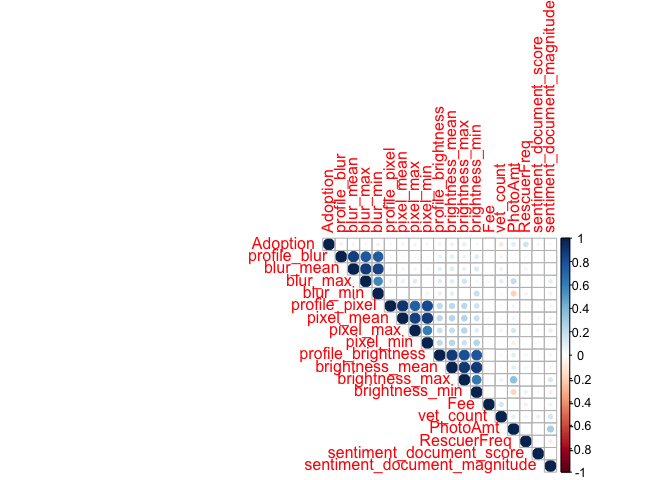

Data Import
================

# Libraries

``` r
library(readxl)
library(caret)
```

    ## Loading required package: lattice

    ## Loading required package: ggplot2

``` r
library(corrplot)
```

    ## corrplot 0.84 loaded

``` r
library(Hmisc)
```

    ## Loading required package: survival

    ## 
    ## Attaching package: 'survival'

    ## The following object is masked from 'package:caret':
    ## 
    ##     cluster

    ## Loading required package: Formula

    ## 
    ## Attaching package: 'Hmisc'

    ## The following objects are masked from 'package:base':
    ## 
    ##     format.pval, units

# Import Data

``` r
train_df <- read_excel("/Users/carinaland/Documents/Thesis/05 Data/train_df.xlsx")
```

    ## New names:
    ## * `` -> ...1

``` r
test_df <- read_excel("/Users/carinaland/Documents/Thesis/05 Data/test_df.xlsx")
```

    ## New names:
    ## * `` -> ...1

# Drop Columns

``` r
train_df <- train_df[,-1]
train_df <- subset(train_df, select = -c(State, Breed1, Breed2, Color1, Color2, Color3,AdoptionSpeed,no_fee,no_photo))
```

``` r
test_df <- test_df[,-1]
test_df <- subset(test_df, select = -c(State, Breed1, Breed2, Color1, Color2, Color3,AdoptionSpeed,no_fee,no_photo))
```

# Correction: Pure\_breed

``` r
train_df$pure_breed[train_df$BreedName1 == "Domestic Short Hair"] <- 0
test_df$pure_breed[test_df$BreedName1 == "Domestic Short Hair"] <- 0
```

# RescuerFreq (Rescuer Experience)

calculated separately for train and test set, won’t be used later
(different
scales)

``` r
Rescuers_train <- data.frame(sort(table(train_df$RescuerID),decreasing=TRUE))
names(Rescuers_train) <- c("RescuerID","RescuerFreq")
train_df <- merge(train_df,Rescuers_train,by="RescuerID")
```

``` r
Rescuers_test <- data.frame(sort(table(test_df$RescuerID),decreasing=TRUE))
names(Rescuers_test) <- c("RescuerID","RescuerFreq")
test_df <- merge(test_df,Rescuers_test,by="RescuerID")
```

``` r
# unbiased RescuerFreq, don't count profile itself
test_df$RescuerFreq <- test_df$RescuerFreq - 1 #rep(1,length(test_df$RescuerFreq))
train_df$RescuerFreq <- train_df$RescuerFreq - 1
```

``` r
# check
head(train_df$RescuerFreq)
```

    ## [1]  0  1  1  0  0 51

``` r
head(test_df$RescuerFreq)
```

    ## [1] 0 6 6 6 6 6

\#RescuerFreq2 calculated on train AND test set (use test set to create
feature… advantages and disadvantages)

``` r
Rescuers_total <- rbind(Rescuers_train,Rescuers_test)
Rescuers_total <- aggregate(RescuerFreq ~ RescuerID, data=Rescuers_total, FUN=sum)
```

``` r
summary(Rescuers_total)
```

    ##                             RescuerID     RescuerFreq     
    ##  fa90fa5b1ee11c86938398b60abc32cb:   1   Min.   :  1.000  
    ##  aa66486163b6cbc25ea62a34b11c9b91:   1   1st Qu.:  1.000  
    ##  b53c34474d9e24574bcec6a3d3306a0d:   1   Median :  1.000  
    ##  c00756f2bdd8fa88fc9f07a8309f7d5d:   1   Mean   :  2.686  
    ##  95481e953f8aed9ec3d16fc4509537e8:   1   3rd Qu.:  2.000  
    ##  ee2747ce26468ec44c7194e7d1d9dad9:   1   Max.   :441.000  
    ##  (Other)                         :4299

``` r
train_df <- merge(train_df,Rescuers_total,by="RescuerID",all.x = TRUE)
test_df <- merge(test_df,Rescuers_total,by="RescuerID",all.x=TRUE)

train_df$RescuerFreq <- train_df$RescuerFreq.x
train_df$RescuerFreq2 <- train_df$RescuerFreq.y
train_df <- subset(train_df,select= -c(RescuerFreq.x,RescuerFreq.y))

test_df$RescuerFreq <- test_df$RescuerFreq.x
test_df$RescuerFreq2 <- test_df$RescuerFreq.y
test_df <- subset(test_df,select= -c(RescuerFreq.x,RescuerFreq.y))
```

``` r
#before
head(table(train_df$RescuerFreq2))
```

    ## 
    ##    1    2    3    4    5    6 
    ## 2356  936  610  407  350  279

``` r
head(table(test_df$RescuerFreq2))
```

    ## 
    ##   1   2   3   4   5   6 
    ## 616 220 131 105  80  69

``` r
# unbiased RescuerFreq, don't count profile itself
test_df$RescuerFreq2 <- test_df$RescuerFreq2 - 1
train_df$RescuerFreq2 <- train_df$RescuerFreq2 - 1
```

``` r
#check after
head(table(train_df$RescuerFreq2))
```

    ## 
    ##    0    1    2    3    4    5 
    ## 2356  936  610  407  350  279

``` r
head(table(test_df$RescuerFreq2))
```

    ## 
    ##   0   1   2   3   4   5 
    ## 616 220 131 105  80  69

# feature correlation in train set

have a look at the correlation of the numeric variables and the target
Adoption

``` r
corr_num_train_df <- subset(train_df, select = c(Adoption,
                                                 profile_blur, blur_mean, blur_max, blur_min,
                                                 profile_pixel, pixel_mean, pixel_max, pixel_min,
                                                 profile_brightness, brightness_mean, brightness_max, brightness_min,
                                                 Fee,vet_count,PhotoAmt,RescuerFreq,
                                                 sentiment_document_score, sentiment_document_magnitude
                                                 ))
```

``` r
str(corr_num_train_df)
```

    ## 'data.frame':    9252 obs. of  19 variables:
    ##  $ Adoption                    : logi  TRUE TRUE TRUE TRUE FALSE FALSE ...
    ##  $ profile_blur                : num  555.7 243.8 87.7 483.9 1135.8 ...
    ##  $ blur_mean                   : num  808 391 284 484 1000 ...
    ##  $ blur_max                    : num  1286 568 638 484 1136 ...
    ##  $ blur_min                    : num  256.6 243.8 87.7 483.9 864.5 ...
    ##  $ profile_pixel               : num  409600 120000 120000 120000 172800 ...
    ##  $ pixel_mean                  : num  265600 120000 120000 120000 172800 ...
    ##  $ pixel_max                   : num  409600 120000 120000 120000 172800 ...
    ##  $ pixel_min                   : num  172800 120000 120000 120000 172800 ...
    ##  $ profile_brightness          : num  117.1 49.3 50 114.9 128.5 ...
    ##  $ brightness_mean             : num  105.6 60 53.4 114.9 129 ...
    ##  $ brightness_max              : num  117.1 67.9 58.3 114.9 129.4 ...
    ##  $ brightness_min              : num  85.4 49.3 50 114.9 128.5 ...
    ##  $ Fee                         : num  0 0 0 0 150 100 120 180 100 200 ...
    ##  $ vet_count                   : num  2 0 0 1 1 3 3 3 3 1 ...
    ##  $ PhotoAmt                    : num  4 3 3 1 2 3 3 3 3 3 ...
    ##  $ RescuerFreq                 : num  0 1 1 0 0 51 51 51 51 51 ...
    ##  $ sentiment_document_score    : num  0 0.2 0.4 0.4 0.3 0.6 0.9 0.7 0.1 0.4 ...
    ##  $ sentiment_document_magnitude: num  1.5 0.2 0.4 0.8 2.7 2.6 1.8 3.5 3.1 1.4 ...

``` r
corr_num_mat <- rcorr(as.matrix(corr_num_train_df))
corr_num_mat
```

    ##                              Adoption profile_blur blur_mean blur_max blur_min
    ## Adoption                         1.00        -0.06     -0.06    -0.04    -0.06
    ## profile_blur                    -0.06         1.00      0.86     0.77     0.74
    ## blur_mean                       -0.06         0.86      1.00     0.88     0.86
    ## blur_max                        -0.04         0.77      0.88     1.00     0.56
    ## blur_min                        -0.06         0.74      0.86     0.56     1.00
    ## profile_pixel                   -0.03         0.03      0.05     0.08     0.01
    ## pixel_mean                      -0.05         0.04      0.05     0.08     0.01
    ## pixel_max                       -0.05         0.04      0.05     0.11    -0.02
    ## pixel_min                       -0.04         0.03      0.04     0.01     0.06
    ## profile_brightness               0.05         0.08      0.10     0.10     0.08
    ## brightness_mean                  0.07         0.09      0.11     0.11     0.09
    ## brightness_max                   0.08         0.06      0.08     0.16    -0.02
    ## brightness_min                   0.03         0.11      0.13     0.04     0.19
    ## Fee                              0.00         0.01      0.02     0.03     0.00
    ## vet_count                       -0.10         0.05      0.06     0.09     0.02
    ## PhotoAmt                         0.11         0.00     -0.01     0.20    -0.19
    ## RescuerFreq                      0.17         0.03      0.04     0.03     0.05
    ## sentiment_document_score        -0.05        -0.01     -0.01    -0.01    -0.01
    ## sentiment_document_magnitude     0.03         0.01      0.01     0.10    -0.07
    ##                              profile_pixel pixel_mean pixel_max pixel_min
    ## Adoption                             -0.03      -0.05     -0.05     -0.04
    ## profile_blur                          0.03       0.04      0.04      0.03
    ## blur_mean                             0.05       0.05      0.05      0.04
    ## blur_max                              0.08       0.08      0.11      0.01
    ## blur_min                              0.01       0.01     -0.02      0.06
    ## profile_pixel                         1.00       0.91      0.73      0.83
    ## pixel_mean                            0.91       1.00      0.86      0.89
    ## pixel_max                             0.73       0.86      1.00      0.60
    ## pixel_min                             0.83       0.89      0.60      1.00
    ## profile_brightness                    0.21       0.23      0.18      0.21
    ## brightness_mean                       0.22       0.24      0.19      0.24
    ## brightness_max                        0.23       0.25      0.23      0.18
    ## brightness_min                        0.17       0.19      0.10      0.25
    ## Fee                                   0.02       0.03      0.03      0.02
    ## vet_count                             0.03       0.03      0.06     -0.01
    ## PhotoAmt                              0.05       0.05      0.14     -0.08
    ## RescuerFreq                          -0.02      -0.02     -0.02     -0.01
    ## sentiment_document_score              0.03       0.03      0.03      0.03
    ## sentiment_document_magnitude          0.06       0.05      0.08     -0.01
    ##                              profile_brightness brightness_mean brightness_max
    ## Adoption                                   0.05            0.07           0.08
    ## profile_blur                               0.08            0.09           0.06
    ## blur_mean                                  0.10            0.11           0.08
    ## blur_max                                   0.10            0.11           0.16
    ## blur_min                                   0.08            0.09          -0.02
    ## profile_pixel                              0.21            0.22           0.23
    ## pixel_mean                                 0.23            0.24           0.25
    ## pixel_max                                  0.18            0.19           0.23
    ## pixel_min                                  0.21            0.24           0.18
    ## profile_brightness                         1.00            0.89           0.80
    ## brightness_mean                            0.89            1.00           0.90
    ## brightness_max                             0.80            0.90           1.00
    ## brightness_min                             0.77            0.88           0.61
    ## Fee                                        0.02            0.02           0.03
    ## vet_count                                  0.03            0.03           0.06
    ## PhotoAmt                                   0.10            0.10           0.34
    ## RescuerFreq                                0.04            0.05           0.01
    ## sentiment_document_score                  -0.03           -0.03          -0.02
    ## sentiment_document_magnitude               0.04            0.04           0.14
    ##                              brightness_min   Fee vet_count PhotoAmt
    ## Adoption                               0.03  0.00     -0.10     0.11
    ## profile_blur                           0.11  0.01      0.05     0.00
    ## blur_mean                              0.13  0.02      0.06    -0.01
    ## blur_max                               0.04  0.03      0.09     0.20
    ## blur_min                               0.19  0.00      0.02    -0.19
    ## profile_pixel                          0.17  0.02      0.03     0.05
    ## pixel_mean                             0.19  0.03      0.03     0.05
    ## pixel_max                              0.10  0.03      0.06     0.14
    ## pixel_min                              0.25  0.02     -0.01    -0.08
    ## profile_brightness                     0.77  0.02      0.03     0.10
    ## brightness_mean                        0.88  0.02      0.03     0.10
    ## brightness_max                         0.61  0.03      0.06     0.34
    ## brightness_min                         1.00  0.00     -0.01    -0.19
    ## Fee                                    0.00  1.00      0.14     0.02
    ## vet_count                             -0.01  0.14      1.00     0.09
    ## PhotoAmt                              -0.19  0.02      0.09     1.00
    ## RescuerFreq                            0.07 -0.07      0.04     0.03
    ## sentiment_document_score              -0.04  0.02      0.07    -0.01
    ## sentiment_document_magnitude          -0.07  0.06      0.15     0.29
    ##                              RescuerFreq sentiment_document_score
    ## Adoption                            0.17                    -0.05
    ## profile_blur                        0.03                    -0.01
    ## blur_mean                           0.04                    -0.01
    ## blur_max                            0.03                    -0.01
    ## blur_min                            0.05                    -0.01
    ## profile_pixel                      -0.02                     0.03
    ## pixel_mean                         -0.02                     0.03
    ## pixel_max                          -0.02                     0.03
    ## pixel_min                          -0.01                     0.03
    ## profile_brightness                  0.04                    -0.03
    ## brightness_mean                     0.05                    -0.03
    ## brightness_max                      0.01                    -0.02
    ## brightness_min                      0.07                    -0.04
    ## Fee                                -0.07                     0.02
    ## vet_count                           0.04                     0.07
    ## PhotoAmt                            0.03                    -0.01
    ## RescuerFreq                         1.00                    -0.02
    ## sentiment_document_score           -0.02                     1.00
    ## sentiment_document_magnitude       -0.08                     0.03
    ##                              sentiment_document_magnitude
    ## Adoption                                             0.03
    ## profile_blur                                         0.01
    ## blur_mean                                            0.01
    ## blur_max                                             0.10
    ## blur_min                                            -0.07
    ## profile_pixel                                        0.06
    ## pixel_mean                                           0.05
    ## pixel_max                                            0.08
    ## pixel_min                                           -0.01
    ## profile_brightness                                   0.04
    ## brightness_mean                                      0.04
    ## brightness_max                                       0.14
    ## brightness_min                                      -0.07
    ## Fee                                                  0.06
    ## vet_count                                            0.15
    ## PhotoAmt                                             0.29
    ## RescuerFreq                                         -0.08
    ## sentiment_document_score                             0.03
    ## sentiment_document_magnitude                         1.00
    ## 
    ## n= 9252 
    ## 
    ## 
    ## P
    ##                              Adoption profile_blur blur_mean blur_max blur_min
    ## Adoption                              0.0000       0.0000    0.0001   0.0000  
    ## profile_blur                 0.0000                0.0000    0.0000   0.0000  
    ## blur_mean                    0.0000   0.0000                 0.0000   0.0000  
    ## blur_max                     0.0001   0.0000       0.0000             0.0000  
    ## blur_min                     0.0000   0.0000       0.0000    0.0000           
    ## profile_pixel                0.0009   0.0095       0.0000    0.0000   0.2274  
    ## pixel_mean                   0.0000   0.0002       0.0000    0.0000   0.2327  
    ## pixel_max                    0.0000   0.0003       0.0000    0.0000   0.0249  
    ## pixel_min                    0.0001   0.0110       0.0004    0.3687   0.0000  
    ## profile_brightness           0.0000   0.0000       0.0000    0.0000   0.0000  
    ## brightness_mean              0.0000   0.0000       0.0000    0.0000   0.0000  
    ## brightness_max               0.0000   0.0000       0.0000    0.0000   0.1121  
    ## brightness_min               0.0010   0.0000       0.0000    0.0006   0.0000  
    ## Fee                          0.9404   0.2856       0.1346    0.0136   0.7364  
    ## vet_count                    0.0000   0.0000       0.0000    0.0000   0.0380  
    ## PhotoAmt                     0.0000   0.9834       0.2078    0.0000   0.0000  
    ## RescuerFreq                  0.0000   0.0027       0.0000    0.0073   0.0000  
    ## sentiment_document_score     0.0000   0.3702       0.1623    0.2320   0.2008  
    ## sentiment_document_magnitude 0.0008   0.5187       0.4546    0.0000   0.0000  
    ##                              profile_pixel pixel_mean pixel_max pixel_min
    ## Adoption                     0.0009        0.0000     0.0000    0.0001   
    ## profile_blur                 0.0095        0.0002     0.0003    0.0110   
    ## blur_mean                    0.0000        0.0000     0.0000    0.0004   
    ## blur_max                     0.0000        0.0000     0.0000    0.3687   
    ## blur_min                     0.2274        0.2327     0.0249    0.0000   
    ## profile_pixel                              0.0000     0.0000    0.0000   
    ## pixel_mean                   0.0000                   0.0000    0.0000   
    ## pixel_max                    0.0000        0.0000               0.0000   
    ## pixel_min                    0.0000        0.0000     0.0000             
    ## profile_brightness           0.0000        0.0000     0.0000    0.0000   
    ## brightness_mean              0.0000        0.0000     0.0000    0.0000   
    ## brightness_max               0.0000        0.0000     0.0000    0.0000   
    ## brightness_min               0.0000        0.0000     0.0000    0.0000   
    ## Fee                          0.0510        0.0076     0.0073    0.0839   
    ## vet_count                    0.0045        0.0064     0.0000    0.2824   
    ## PhotoAmt                     0.0000        0.0000     0.0000    0.0000   
    ## RescuerFreq                  0.0495        0.0189     0.0373    0.1851   
    ## sentiment_document_score     0.0094        0.0012     0.0029    0.0053   
    ## sentiment_document_magnitude 0.0000        0.0000     0.0000    0.3292   
    ##                              profile_brightness brightness_mean brightness_max
    ## Adoption                     0.0000             0.0000          0.0000        
    ## profile_blur                 0.0000             0.0000          0.0000        
    ## blur_mean                    0.0000             0.0000          0.0000        
    ## blur_max                     0.0000             0.0000          0.0000        
    ## blur_min                     0.0000             0.0000          0.1121        
    ## profile_pixel                0.0000             0.0000          0.0000        
    ## pixel_mean                   0.0000             0.0000          0.0000        
    ## pixel_max                    0.0000             0.0000          0.0000        
    ## pixel_min                    0.0000             0.0000          0.0000        
    ## profile_brightness                              0.0000          0.0000        
    ## brightness_mean              0.0000                             0.0000        
    ## brightness_max               0.0000             0.0000                        
    ## brightness_min               0.0000             0.0000          0.0000        
    ## Fee                          0.1438             0.0693          0.0043        
    ## vet_count                    0.0009             0.0012          0.0000        
    ## PhotoAmt                     0.0000             0.0000          0.0000        
    ## RescuerFreq                  0.0003             0.0000          0.3905        
    ## sentiment_document_score     0.0122             0.0020          0.0796        
    ## sentiment_document_magnitude 0.0000             0.0000          0.0000        
    ##                              brightness_min Fee    vet_count PhotoAmt
    ## Adoption                     0.0010         0.9404 0.0000    0.0000  
    ## profile_blur                 0.0000         0.2856 0.0000    0.9834  
    ## blur_mean                    0.0000         0.1346 0.0000    0.2078  
    ## blur_max                     0.0006         0.0136 0.0000    0.0000  
    ## blur_min                     0.0000         0.7364 0.0380    0.0000  
    ## profile_pixel                0.0000         0.0510 0.0045    0.0000  
    ## pixel_mean                   0.0000         0.0076 0.0064    0.0000  
    ## pixel_max                    0.0000         0.0073 0.0000    0.0000  
    ## pixel_min                    0.0000         0.0839 0.2824    0.0000  
    ## profile_brightness           0.0000         0.1438 0.0009    0.0000  
    ## brightness_mean              0.0000         0.0693 0.0012    0.0000  
    ## brightness_max               0.0000         0.0043 0.0000    0.0000  
    ## brightness_min                              0.8610 0.4542    0.0000  
    ## Fee                          0.8610                0.0000    0.0822  
    ## vet_count                    0.4542         0.0000           0.0000  
    ## PhotoAmt                     0.0000         0.0822 0.0000            
    ## RescuerFreq                  0.0000         0.0000 0.0000    0.0038  
    ## sentiment_document_score     0.0007         0.0724 0.0000    0.4582  
    ## sentiment_document_magnitude 0.0000         0.0000 0.0000    0.0000  
    ##                              RescuerFreq sentiment_document_score
    ## Adoption                     0.0000      0.0000                  
    ## profile_blur                 0.0027      0.3702                  
    ## blur_mean                    0.0000      0.1623                  
    ## blur_max                     0.0073      0.2320                  
    ## blur_min                     0.0000      0.2008                  
    ## profile_pixel                0.0495      0.0094                  
    ## pixel_mean                   0.0189      0.0012                  
    ## pixel_max                    0.0373      0.0029                  
    ## pixel_min                    0.1851      0.0053                  
    ## profile_brightness           0.0003      0.0122                  
    ## brightness_mean              0.0000      0.0020                  
    ## brightness_max               0.3905      0.0796                  
    ## brightness_min               0.0000      0.0007                  
    ## Fee                          0.0000      0.0724                  
    ## vet_count                    0.0000      0.0000                  
    ## PhotoAmt                     0.0038      0.4582                  
    ## RescuerFreq                              0.0202                  
    ## sentiment_document_score     0.0202                              
    ## sentiment_document_magnitude 0.0000      0.0042                  
    ##                              sentiment_document_magnitude
    ## Adoption                     0.0008                      
    ## profile_blur                 0.5187                      
    ## blur_mean                    0.4546                      
    ## blur_max                     0.0000                      
    ## blur_min                     0.0000                      
    ## profile_pixel                0.0000                      
    ## pixel_mean                   0.0000                      
    ## pixel_max                    0.0000                      
    ## pixel_min                    0.3292                      
    ## profile_brightness           0.0000                      
    ## brightness_mean              0.0000                      
    ## brightness_max               0.0000                      
    ## brightness_min               0.0000                      
    ## Fee                          0.0000                      
    ## vet_count                    0.0000                      
    ## PhotoAmt                     0.0000                      
    ## RescuerFreq                  0.0000                      
    ## sentiment_document_score     0.0042                      
    ## sentiment_document_magnitude

``` r
corrplot(corr_num_mat$r, type= "upper", p.mat=corr_num_mat$P, sig.level =0.05, insig="blank")
```

<!-- -->

``` r
#corrplot.mixed(corr_num_mat$r, p.mat=corr_num_mat$P, sig.level =0.05, insig="blank")
```

should remove correlated variables correlation: - blur: profile\_blur*,
blur\_min (+) - pixel: pixel\_mean, pixel\_max* (-) - brightness:
brigthness\_max\* first check meaningfulness of variables –\> Data
Exploration

alternatively: perform pca

# Experimenting with PCA

``` r
image_quality <- corr_num_train_df <- subset(train_df, select = c(
                                                 profile_blur, blur_mean, blur_max, blur_min,
                                                 profile_pixel, pixel_mean, pixel_max, pixel_min,
                                                 profile_brightness, brightness_mean, brightness_max, brightness_min                                               ))
img_pca <- preProcess(image_quality,method="pca")
img_pca_df <- predict(img_pca,image_quality)
```

``` r
rcorr(as.matrix(cbind(train_df$Adoption,img_pca_df)))
```

    ##                   train_df$Adoption   PC1  PC2  PC3   PC4  PC5   PC6
    ## train_df$Adoption              1.00 -0.01 0.05 -0.1 -0.04 0.04 -0.03
    ## PC1                           -0.01  1.00 0.00  0.0  0.00 0.00  0.00
    ## PC2                            0.05  0.00 1.00  0.0  0.00 0.00  0.00
    ## PC3                           -0.10  0.00 0.00  1.0  0.00 0.00  0.00
    ## PC4                           -0.04  0.00 0.00  0.0  1.00 0.00  0.00
    ## PC5                            0.04  0.00 0.00  0.0  0.00 1.00  0.00
    ## PC6                           -0.03  0.00 0.00  0.0  0.00 0.00  1.00
    ## 
    ## n= 9252 
    ## 
    ## 
    ## P
    ##                   train_df$Adoption PC1    PC2    PC3    PC4    PC5    PC6   
    ## train_df$Adoption                   0.6155 0.0000 0.0000 0.0003 0.0002 0.0013
    ## PC1               0.6155                   1.0000 1.0000 1.0000 1.0000 1.0000
    ## PC2               0.0000            1.0000        1.0000 1.0000 1.0000 1.0000
    ## PC3               0.0000            1.0000 1.0000        1.0000 1.0000 1.0000
    ## PC4               0.0003            1.0000 1.0000 1.0000        1.0000 1.0000
    ## PC5               0.0002            1.0000 1.0000 1.0000 1.0000        1.0000
    ## PC6               0.0013            1.0000 1.0000 1.0000 1.0000 1.0000

# Data Types - train

``` r
train_df$Type <- factor(train_df$Type, levels=c(1, 2), labels = c('dog', 'cat'))
train_df$BreedName1 <- as.factor(train_df$BreedName1)
train_df$BreedName2 <- as.factor(train_df$BreedName2) 
train_df$ColorName1 <- as.factor(train_df$ColorName1)
train_df$ColorName2 <- as.factor(train_df$ColorName2) 
train_df$ColorName3 <- as.factor(train_df$ColorName3)
train_df$StateName <- as.factor(train_df$StateName)
train_df$RescuerID <- as.factor(train_df$RescuerID)
train_df$Gender <- factor(train_df$Gender, levels=c(1, 2), labels=c('male', 'female'))  # 'mixed'
train_df$Dewormed <- factor(train_df$Dewormed, levels=c(1, 2, 3), labels=c('yes', 'no', 'not sure'))
train_df$Sterilized <- factor(train_df$Sterilized, levels=c(1, 2, 3), labels=c('yes', 'no', 'not sure'))
train_df$Vaccinated <- factor(train_df$Vaccinated, levels=c(1, 2, 3), labels=c('yes', 'no', 'not sure'))
train_df$Health <- factor(train_df$Health, levels=c(1, 2, 3), labels=c('healthy', 'minor injury', 'serious injury'))
train_df$MaturitySize <- factor(train_df$MaturitySize, levels=c(1, 2, 3, 4), labels=c('small', 'medium', 'large', 'extra large'))  # 'not specified'
train_df$FurLength <- factor(train_df$FurLength,levels=c(1, 2, 3), labels=c('short', 'medium', 'long'))   # 'not specified'
train_df$col_count <- as.integer(train_df$col_count)
train_df$VideoAmt <- as.integer(train_df$VideoAmt)
train_df$PhotoAmt <- as.integer(train_df$PhotoAmt)
train_df$vet_count <- as.integer(train_df$vet_count)
train_df$sentiment_document_language <- as.factor(train_df$sentiment_document_language)
```

``` r
summary(train_df)
```

    ##                             RescuerID     Type          Name          
    ##  fa90fa5b1ee11c86938398b60abc32cb: 353   dog:5265   Length:9252       
    ##  aa66486163b6cbc25ea62a34b11c9b91: 206   cat:3987   Class :character  
    ##  b53c34474d9e24574bcec6a3d3306a0d: 175              Mode  :character  
    ##  c00756f2bdd8fa88fc9f07a8309f7d5d: 154                                
    ##  95481e953f8aed9ec3d16fc4509537e8: 107                                
    ##  ee2747ce26468ec44c7194e7d1d9dad9: 100                                
    ##  (Other)                         :8157                                
    ##       Age            Gender          MaturitySize   FurLength   
    ##  Min.   :  0.00   male  :4101   small      :1991   short :5373  
    ##  1st Qu.:  2.00   female:5151   medium     :6398   medium:3303  
    ##  Median :  4.00                 large      : 841   long  : 576  
    ##  Mean   : 11.76                 extra large:  22                
    ##  3rd Qu.: 12.00                                                 
    ##  Max.   :255.00                                                 
    ##                                                                 
    ##     Vaccinated       Dewormed       Sterilized              Health    
    ##  yes     :4092   yes     :5656   yes     :2192   healthy       :8891  
    ##  no      :3937   no      :2446   no      :5975   minor injury  : 336  
    ##  not sure:1223   not sure:1150   not sure:1085   serious injury:  25  
    ##                                                                       
    ##                                                                       
    ##                                                                       
    ##                                                                       
    ##       Fee             VideoAmt       Description           PetID          
    ##  Min.   :   0.00   Min.   :0.00000   Length:9252        Length:9252       
    ##  1st Qu.:   0.00   1st Qu.:0.00000   Class :character   Class :character  
    ##  Median :   0.00   Median :0.00000   Mode  :character   Mode  :character  
    ##  Mean   :  24.25   Mean   :0.05221                                        
    ##  3rd Qu.:   0.00   3rd Qu.:0.00000                                        
    ##  Max.   :2000.00   Max.   :6.00000                                        
    ##                                                                           
    ##     PhotoAmt                     BreedName1                  BreedName2  
    ##  Min.   : 0.000   Mixed Breed         :3670   Mixed Breed         :1031  
    ##  1st Qu.: 2.000   Domestic Short Hair :2109   Domestic Short Hair : 261  
    ##  Median : 3.000   Domestic Medium Hair: 708   Domestic Medium Hair: 168  
    ##  Mean   : 3.597   Tabby               : 195   Tabby               :  74  
    ##  3rd Qu.: 5.000   Domestic Long Hair  : 176   Domestic Long Hair  :  70  
    ##  Max.   :30.000   (Other)             :2392   (Other)             : 823  
    ##                   NA's                :   2   NA's                :6825  
    ##   ColorName1    ColorName2    ColorName3             StateName   
    ##  Black :4185   Brown :1734   Cream : 190   Selangor       :5439  
    ##  Brown :2484   Cream : 637   Golden:  86   Kuala Lumpur   :2366  
    ##  Cream : 625   Golden: 366   Gray  : 150   Pulau Pinang   : 530  
    ##  Golden: 626   Gray  : 542   White :1509   Johor          : 305  
    ##  Gray  : 447   White :2365   Yellow:  88   Perak          : 250  
    ##  White : 471   Yellow: 428   NA's  :7229   Negeri Sembilan: 130  
    ##  Yellow: 414   NA's  :3180                 (Other)        : 232  
    ##  sentiment_document_score sentiment_document_magnitude
    ##  Min.   :-0.9000          Min.   : 0.000              
    ##  1st Qu.: 0.1000          1st Qu.: 0.900              
    ##  Median : 0.3000          Median : 1.700              
    ##  Mean   : 0.2899          Mean   : 2.138              
    ##  3rd Qu.: 0.4000          3rd Qu.: 2.800              
    ##  Max.   : 0.9000          Max.   :32.000              
    ##                                                       
    ##  sentiment_document_language  profile_blur     profile_pixel   
    ##  de     :   2                Min.   :    0.0   Min.   :     0  
    ##  en     :8865                1st Qu.:  234.3   1st Qu.:120000  
    ##  unknown: 306                Median :  535.0   Median :120000  
    ##  zh     :  55                Mean   : 1055.9   Mean   :155192  
    ##  zh-Hant:  24                3rd Qu.: 1228.9   3rd Qu.:172800  
    ##                              Max.   :27061.4   Max.   :409600  
    ##                                                                
    ##  profile_brightness   pixel_mean        blur_mean       brightness_mean
    ##  Min.   :  0.0      Min.   :      0   Min.   :    0.0   Min.   :  0.0  
    ##  1st Qu.:102.6      1st Qu.: 120000   1st Qu.:  302.3   1st Qu.:105.6  
    ##  Median :120.7      Median : 121600   Median :  635.1   Median :120.3  
    ##  Mean   :118.4      Mean   : 155464   Mean   : 1067.0   Mean   :118.2  
    ##  3rd Qu.:137.6      3rd Qu.: 172800   3rd Qu.: 1286.6   3rd Qu.:134.4  
    ##  Max.   :229.3      Max.   :1287066   Max.   :27061.4   Max.   :229.2  
    ##                                                                        
    ##    pixel_min         blur_min       brightness_min     pixel_max      
    ##  Min.   :     0   Min.   :    0.0   Min.   :  0.00   Min.   :      0  
    ##  1st Qu.:112400   1st Qu.:  131.7   1st Qu.: 87.37   1st Qu.: 120000  
    ##  Median :120000   Median :  306.5   Median :106.62   Median : 129600  
    ##  Mean   :138772   Mean   :  656.8   Mean   :104.34   Mean   : 174434  
    ##  3rd Qu.:172800   3rd Qu.:  707.6   3rd Qu.:124.23   3rd Qu.: 230400  
    ##  Max.   :409600   Max.   :27061.4   Max.   :229.21   Max.   :5705728  
    ##                                                                       
    ##     blur_max       brightness_max   no_name        no_description 
    ##  Min.   :    0.0   Min.   :  0.0   Mode :logical   Mode :logical  
    ##  1st Qu.:  417.5   1st Qu.:116.6   FALSE:8695      FALSE:9246     
    ##  Median :  947.8   Median :133.9   TRUE :557       TRUE :6        
    ##  Mean   : 1656.9   Mean   :131.7                                  
    ##  3rd Qu.: 2031.2   3rd Qu.:150.6                                  
    ##  Max.   :27061.4   Max.   :252.8                                  
    ##                                                                   
    ##    pure_breed       vet_count       col_count      Adoption      
    ##  Min.   :0.0000   Min.   :0.000   Min.   :1.000   Mode :logical  
    ##  1st Qu.:0.0000   1st Qu.:0.000   1st Qu.:1.000   FALSE:2461     
    ##  Median :0.0000   Median :1.000   Median :2.000   TRUE :6791     
    ##  Mean   :0.2259   Mean   :1.291   Mean   :1.875                  
    ##  3rd Qu.:0.0000   3rd Qu.:2.000   3rd Qu.:2.000                  
    ##  Max.   :1.0000   Max.   :3.000   Max.   :3.000                  
    ##                                                                  
    ##   RescuerFreq      RescuerFreq2   
    ##  Min.   :  0.00   Min.   :  0.00  
    ##  1st Qu.:  0.00   1st Qu.:  0.00  
    ##  Median :  4.00   Median :  4.00  
    ##  Mean   : 34.98   Mean   : 44.46  
    ##  3rd Qu.: 24.00   3rd Qu.: 31.00  
    ##  Max.   :352.00   Max.   :440.00  
    ## 

# Data Type - Test

``` r
test_df$Type <- factor(test_df$Type, levels=c(1, 2), labels = c('dog', 'cat'))
test_df$BreedName1 <- as.factor(test_df$BreedName1)
test_df$BreedName2 <- as.factor(test_df$BreedName2) 
test_df$ColorName1 <- as.factor(test_df$ColorName1)
test_df$ColorName2 <- as.factor(test_df$ColorName2) 
test_df$ColorName3 <- as.factor(test_df$ColorName3)
test_df$StateName <- as.factor(test_df$StateName)
test_df$RescuerID <- as.factor(test_df$RescuerID)
test_df$Gender <- factor(test_df$Gender, levels=c(1, 2), labels=c('male', 'female'))  # 'mixed'
test_df$Dewormed <- factor(test_df$Dewormed, levels=c(1, 2, 3), labels=c('yes', 'no', 'not sure'))
test_df$Sterilized <- factor(test_df$Sterilized, levels=c(1, 2, 3), labels=c('yes', 'no', 'not sure'))
test_df$Vaccinated <- factor(test_df$Vaccinated, levels=c(1, 2, 3), labels=c('yes', 'no', 'not sure'))
test_df$Health <- factor(test_df$Health, levels=c(1, 2, 3), labels=c('healthy', 'minor injury', 'serious injury'))
test_df$MaturitySize <- factor(test_df$MaturitySize, levels=c(1, 2, 3, 4), labels=c('small', 'medium', 'large', 'extra large'))  # 'not specified'
test_df$FurLength <- factor(test_df$FurLength,levels=c(1, 2, 3), labels=c('short', 'medium', 'long'))   # 'not specified'
test_df$col_count <- as.integer(test_df$col_count)
test_df$VideoAmt <- as.integer(test_df$VideoAmt)
test_df$PhotoAmt <- as.integer(test_df$PhotoAmt)
test_df$vet_count <- as.integer(test_df$vet_count)
test_df$sentiment_document_language <- as.factor(test_df$sentiment_document_language)
```

``` r
summary(test_df)
```

    ##                             RescuerID     Type          Name          
    ##  fa90fa5b1ee11c86938398b60abc32cb:  88   dog:1357   Length:2313       
    ##  aa66486163b6cbc25ea62a34b11c9b91:  71   cat: 956   Class :character  
    ##  b53c34474d9e24574bcec6a3d3306a0d:  53              Mode  :character  
    ##  c00756f2bdd8fa88fc9f07a8309f7d5d:  52                                
    ##  95481e953f8aed9ec3d16fc4509537e8:  27                                
    ##  b770bac0ca797cf1433c48a35d30c4cb:  24                                
    ##  (Other)                         :1998                                
    ##       Age            Gender          MaturitySize   FurLength   
    ##  Min.   :  0.00   male  : 986   small      : 489   short :1314  
    ##  1st Qu.:  2.00   female:1327   medium     :1618   medium: 862  
    ##  Median :  4.00                 large      : 200   long  : 137  
    ##  Mean   : 11.86                 extra large:   6                
    ##  3rd Qu.: 12.00                                                 
    ##  Max.   :255.00                                                 
    ##                                                                 
    ##     Vaccinated       Dewormed       Sterilized              Health    
    ##  yes     : 990   yes     :1418   yes     : 517   healthy       :2232  
    ##  no      :1027   no      : 624   no      :1535   minor injury  :  76  
    ##  not sure: 296   not sure: 271   not sure: 261   serious injury:   5  
    ##                                                                       
    ##                                                                       
    ##                                                                       
    ##                                                                       
    ##       Fee            VideoAmt       Description           PetID          
    ##  Min.   :  0.00   Min.   :0.00000   Length:2313        Length:2313       
    ##  1st Qu.:  0.00   1st Qu.:0.00000   Class :character   Class :character  
    ##  Median :  0.00   Median :0.00000   Mode  :character   Mode  :character  
    ##  Mean   : 23.01   Mean   :0.05923                                        
    ##  3rd Qu.:  0.00   3rd Qu.:0.00000                                        
    ##  Max.   :750.00   Max.   :6.00000                                        
    ##                                                                          
    ##     PhotoAmt                     BreedName1                 BreedName2  
    ##  Min.   : 0.000   Mixed Breed         :960   Mixed Breed         : 284  
    ##  1st Qu.: 1.000   Domestic Short Hair :498   Domestic Short Hair :  71  
    ##  Median : 3.000   Domestic Medium Hair:157   Domestic Medium Hair:  31  
    ##  Mean   : 3.652   Tabby               : 49   Tabby               :  27  
    ##  3rd Qu.: 5.000   Domestic Long Hair  : 47   Terrier             :  17  
    ##  Max.   :30.000   (Other)             :600   (Other)             : 217  
    ##                   NA's                :  2   NA's                :1666  
    ##   ColorName1    ColorName2   ColorName3             StateName   
    ##  Black :1076   Brown :480   Cream :  45   Selangor       :1396  
    ##  Brown : 594   Cream :151   Golden:  25   Kuala Lumpur   : 561  
    ##  Cream : 141   Golden: 98   Gray  :  48   Pulau Pinang   : 124  
    ##  Golden: 165   Gray  :118   White : 359   Perak          :  66  
    ##  Gray  : 129   White :560   Yellow:  36   Johor          :  54  
    ##  White : 122   Yellow:108   NA's  :1800   Negeri Sembilan:  37  
    ##  Yellow:  86   NA's  :798                 (Other)        :  75  
    ##  sentiment_document_score sentiment_document_magnitude
    ##  Min.   :-0.8000          Min.   : 0.000              
    ##  1st Qu.: 0.1000          1st Qu.: 0.900              
    ##  Median : 0.3000          Median : 1.700              
    ##  Mean   : 0.3016          Mean   : 2.177              
    ##  3rd Qu.: 0.5000          3rd Qu.: 2.900              
    ##  Max.   : 0.9000          Max.   :20.500              
    ##                                                       
    ##  sentiment_document_language  profile_blur     profile_pixel   
    ##  en     :2226                Min.   :    0.0   Min.   :     0  
    ##  unknown:  60                1st Qu.:  245.5   1st Qu.:120000  
    ##  zh     :  20                Median :  525.8   Median :120000  
    ##  zh-Hant:   7                Mean   : 1057.7   Mean   :153009  
    ##                              3rd Qu.: 1154.2   3rd Qu.:172800  
    ##                              Max.   :19958.8   Max.   :409600  
    ##                                                                
    ##  profile_brightness   pixel_mean       blur_mean       brightness_mean
    ##  Min.   :  0.0      Min.   :     0   Min.   :    0.0   Min.   :  0.0  
    ##  1st Qu.:101.9      1st Qu.:119829   1st Qu.:  301.8   1st Qu.:105.5  
    ##  Median :120.0      Median :120400   Median :  604.2   Median :120.4  
    ##  Mean   :118.5      Mean   :153414   Mean   : 1069.5   Mean   :118.3  
    ##  3rd Qu.:137.2      3rd Qu.:172800   3rd Qu.: 1229.0   3rd Qu.:134.6  
    ##  Max.   :222.0      Max.   :409600   Max.   :19958.8   Max.   :198.6  
    ##                                                                       
    ##    pixel_min         blur_min       brightness_min    pixel_max     
    ##  Min.   :     0   Min.   :    0.0   Min.   :  0.0   Min.   :     0  
    ##  1st Qu.:107600   1st Qu.:  140.6   1st Qu.: 87.8   1st Qu.:120000  
    ##  Median :120000   Median :  306.4   Median :106.6   Median :129600  
    ##  Mean   :137558   Mean   :  665.6   Mean   :104.6   Mean   :170767  
    ##  3rd Qu.:172320   3rd Qu.:  665.2   3rd Qu.:123.9   3rd Qu.:209280  
    ##  Max.   :409600   Max.   :19958.8   Max.   :198.6   Max.   :409600  
    ##                                                                     
    ##     blur_max       brightness_max   no_name        no_description 
    ##  Min.   :    0.0   Min.   :  0.0   Mode :logical   Mode :logical  
    ##  1st Qu.:  424.0   1st Qu.:116.8   FALSE:2190      FALSE:2310     
    ##  Median :  913.9   Median :134.3   TRUE :123       TRUE :3        
    ##  Mean   : 1666.8   Mean   :131.8                                  
    ##  3rd Qu.: 1977.7   3rd Qu.:151.4                                  
    ##  Max.   :19958.8   Max.   :223.8                                  
    ##                                                                   
    ##    pure_breed      vet_count       col_count      Adoption      
    ##  Min.   :0.000   Min.   :0.000   Min.   :1.000   Mode :logical  
    ##  1st Qu.:0.000   1st Qu.:0.000   1st Qu.:1.000   FALSE:619      
    ##  Median :0.000   Median :1.000   Median :2.000   TRUE :1694     
    ##  Mean   :0.224   Mean   :1.265   Mean   :1.877                  
    ##  3rd Qu.:0.000   3rd Qu.:2.000   3rd Qu.:2.000                  
    ##  Max.   :1.000   Max.   :3.000   Max.   :3.000                  
    ##                                                                 
    ##   RescuerFreq     RescuerFreq2   
    ##  Min.   : 0.00   Min.   :  0.00  
    ##  1st Qu.: 0.00   1st Qu.:  0.00  
    ##  Median : 1.00   Median :  5.00  
    ##  Mean   :10.41   Mean   : 48.36  
    ##  3rd Qu.: 6.00   3rd Qu.: 33.00  
    ##  Max.   :87.00   Max.   :440.00  
    ## 

``` r
# Fill missing BreedName1 with 'Mixed Breed'
train_df$PetID[is.na(train_df$BreedName1)] # Petids of pets with missing Breed1 in TrainSet
```

    ## [1] "375905770" "7b5bee232"

``` r
train_df$Type[is.na(train_df$BreedName1)]
```

    ## [1] dog dog
    ## Levels: dog cat

``` r
train_df$BreedName1[is.na(train_df$BreedName1)] <- "Mixed Breed"

test_df$PetID[is.na(test_df$BreedName1)] # Petids of pets with missing Breed1 in TestSet
```

    ## [1] "da8d4a273" "0327b8e94"

``` r
test_df$Type[is.na(test_df$BreedName1)]
```

    ## [1] dog dog
    ## Levels: dog cat

``` r
test_df$BreedName1[is.na(test_df$BreedName1)] <- "Mixed Breed"
```

## Remove variables we don’t need anymore

``` r
rm(corr_num_mat, corr_num_train_df, image_quality, img_pca, img_pca_df, Rescuers_test, Rescuers_train, Rescuers_total)
```

# Save train\_bin and test\_bin

``` r
write.csv(train_df, file="/Users/carinaland/Documents/Thesis/05 Data/train_df_v2.csv")
write.csv(test_df, "/Users/carinaland/Documents/Thesis/05 Data/test_df_v2.csv")
```
