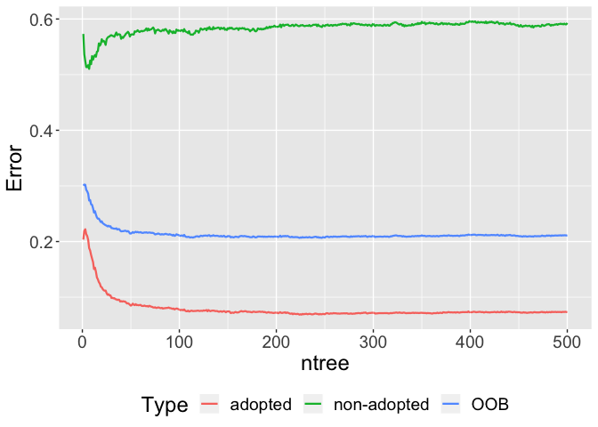
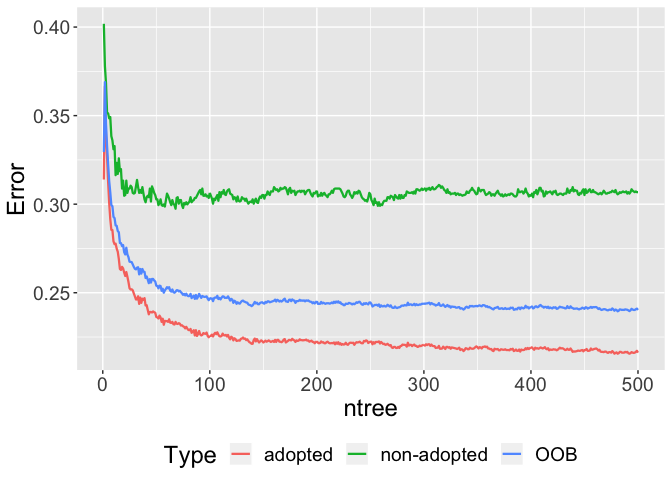
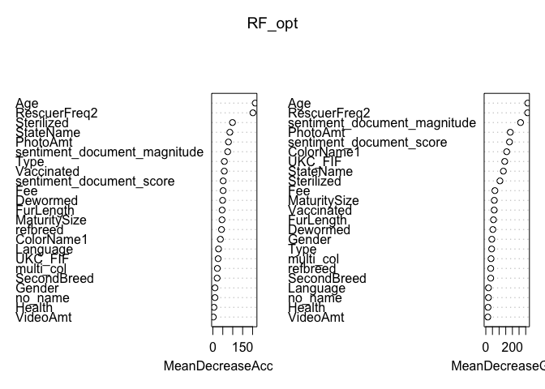
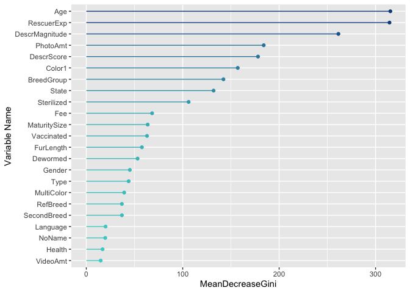
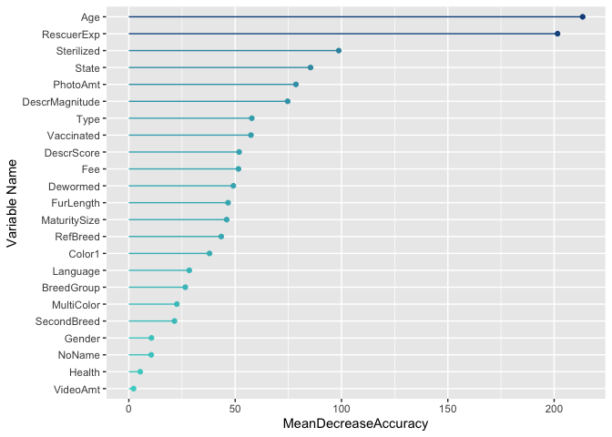
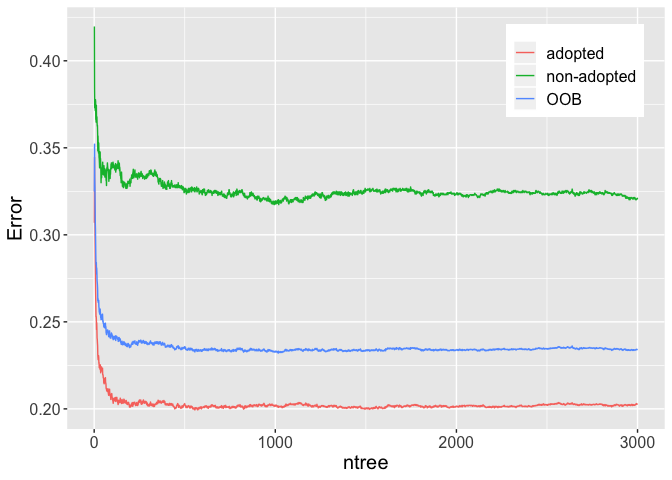
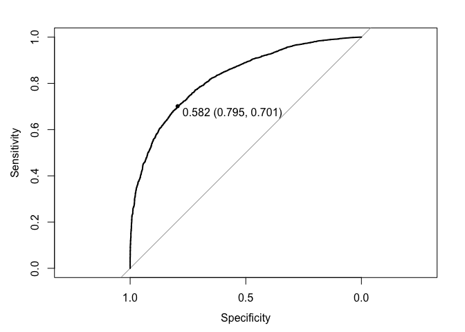

RandomForest
================

\#Libraries

``` r
library(randomForest)
```

    ## randomForest 4.6-14

    ## Type rfNews() to see new features/changes/bug fixes.

``` r
library(ggplot2)
```

    ## 
    ## Attaching package: 'ggplot2'

    ## The following object is masked from 'package:randomForest':
    ## 
    ##     margin

``` r
library(cowplot)
```

    ## 
    ## ********************************************************

    ## Note: As of version 1.0.0, cowplot does not change the

    ##   default ggplot2 theme anymore. To recover the previous

    ##   behavior, execute:
    ##   theme_set(theme_cowplot())

    ## ********************************************************

``` r
library(Metrics)
library(dplyr)
```

    ## 
    ## Attaching package: 'dplyr'

    ## The following object is masked from 'package:randomForest':
    ## 
    ##     combine

    ## The following objects are masked from 'package:stats':
    ## 
    ##     filter, lag

    ## The following objects are masked from 'package:base':
    ## 
    ##     intersect, setdiff, setequal, union

``` r
library(caret)
```

    ## Loading required package: lattice

    ## 
    ## Attaching package: 'caret'

    ## The following objects are masked from 'package:Metrics':
    ## 
    ##     precision, recall

Data from
DataExploration\_v4.Rmd

``` r
train_bin <- read.csv("/Users/carinaland/Documents/Thesis/05 Data/train_bin_v4.csv")[,-1]
test_bin <- read.csv("/Users/carinaland/Documents/Thesis/05 Data/test_bin_v4.csv")[,-1]
```

# relevel

``` r
train_bin$Gender <- relevel(train_bin$Gender,"male")
train_bin$Type <- relevel(train_bin$Type,"dog")
train_bin$Vaccinated <- relevel(train_bin$Vaccinated, "yes")
train_bin$Dewormed <- relevel(train_bin$Dewormed, "yes")
train_bin$Sterilized <- relevel(train_bin$Sterilized, "no")
train_bin$MaturitySize <- relevel(train_bin$MaturitySize, "medium")
train_bin$UKC_FIF <- relevel(train_bin$UKC_FIF, "RefBreed")
train_bin$Language <- relevel(train_bin$Language, "English")

test_bin$Gender <- relevel(test_bin$Gender,"male")
test_bin$Type <- relevel(test_bin$Type,"dog")
test_bin$Vaccinated <- relevel(test_bin$Vaccinated, "yes")
test_bin$Dewormed <- relevel(test_bin$Dewormed, "yes")
test_bin$Sterilized <- relevel(test_bin$Sterilized, "no")
test_bin$MaturitySize <- relevel(test_bin$MaturitySize, "medium")
test_bin$UKC_FIF <- relevel(test_bin$UKC_FIF, "RefBreed")
test_bin$Language <- relevel(test_bin$Language, "English")
```

``` r
str(train_bin)
```

    ## 'data.frame':    9252 obs. of  26 variables:
    ##  $ Type                        : Factor w/ 2 levels "dog","cat": 2 2 2 2 2 2 2 2 2 2 ...
    ##  $ Age                         : int  1 2 12 18 1 7 2 3 1 3 ...
    ##  $ Gender                      : Factor w/ 2 levels "male","female": 2 1 1 2 2 1 2 1 2 2 ...
    ##  $ MaturitySize                : Factor w/ 4 levels "medium","extra large",..: 1 1 1 1 4 4 1 4 4 1 ...
    ##  $ Vaccinated                  : Factor w/ 3 levels "yes","no","not sure": 3 2 1 2 3 2 2 2 1 2 ...
    ##  $ Dewormed                    : Factor w/ 3 levels "yes","no","not sure": 3 2 1 1 1 1 2 1 1 2 ...
    ##  $ Sterilized                  : Factor w/ 3 levels "no","not sure",..: 2 1 3 3 2 3 1 1 1 1 ...
    ##  $ Fee                         : int  0 0 0 0 20 0 0 0 0 0 ...
    ##  $ VideoAmt                    : int  0 0 0 0 0 0 0 0 0 0 ...
    ##  $ PetID                       : Factor w/ 9252 levels "0008c5398","000a290e4",..: 952 4 6523 3648 1888 350 2563 2165 8831 5962 ...
    ##  $ PhotoAmt                    : int  3 3 3 2 4 1 1 3 2 3 ...
    ##  $ ColorName1                  : Factor w/ 7 levels "Black","Brown",..: 7 1 2 2 3 1 1 5 1 5 ...
    ##  $ StateName                   : Factor w/ 8 levels "Johor","Kedah|Kelantan|Pahang|Terengganu",..: 8 8 8 3 8 1 3 8 8 3 ...
    ##  $ sentiment_document_score    : num  0 0.8 0.2 0.6 0 0.7 0.3 0.1 -0.1 0.6 ...
    ##  $ sentiment_document_magnitude: num  0 0.8 1.1 4.6 3.2 0.7 0.9 1.6 1.7 0.6 ...
    ##  $ brightness_max              : num  141 135 143 101 117 ...
    ##  $ no_name                     : logi  FALSE FALSE FALSE FALSE FALSE FALSE ...
    ##  $ Adoption                    : logi  TRUE TRUE TRUE TRUE FALSE TRUE ...
    ##  $ RescuerFreq2                : int  2 1 11 0 0 3 33 1 0 16 ...
    ##  $ refbreed                    : logi  FALSE FALSE FALSE FALSE FALSE FALSE ...
    ##  $ SecondBreed                 : logi  TRUE TRUE TRUE TRUE FALSE TRUE ...
    ##  $ UKC_FIF                     : Factor w/ 13 levels "RefBreed","Cat1_2",..: 4 4 4 4 4 4 4 4 4 4 ...
    ##  $ Language                    : Factor w/ 3 levels "English","Chinese",..: 1 1 1 1 1 1 1 1 1 1 ...
    ##  $ Health_num                  : int  1 1 1 1 1 1 1 1 1 1 ...
    ##  $ multi_col                   : logi  TRUE TRUE FALSE TRUE FALSE TRUE ...
    ##  $ FurLength_num               : int  1 4 4 4 4 4 1 4 4 2 ...

# adjusting datatypes

``` r
rf.train <- subset(train_bin, select=-c(PetID,brightness_max))
rf.train$Health <- factor(train_bin$Health_num, levels=c(1, 3, 4), labels=c('healthy', 'minor injury', 'serious injury')) 
rf.train$FurLength <- factor(train_bin$FurLength_num,levels=c(1, 2, 4), labels=c('short', 'medium', 'long')) 
rf.train <- subset(rf.train,select=-c(FurLength_num, Health_num))
rf.train$Adoption <- as.factor(rf.train$Adoption)
rf.train$no_name <- as.factor(rf.train$no_name)
rf.train$SecondBreed<- as.factor(rf.train$SecondBreed)
rf.train$refbreed <- as.factor(rf.train$refbreed)
rf.train$multi_col <- as.factor(rf.train$multi_col)

rf.test <- subset(test_bin, select=-c(PetID,brightness_max))
rf.test$Health <- factor(test_bin$Health_num, levels=c(1, 3, 4), labels=c('healthy', 'minor injury', 'serious injury')) 
rf.test$FurLength <- factor(test_bin$FurLength_num, levels=c(1, 2, 4), labels=c('short', 'medium', 'long')) 
rf.test <- subset(rf.test,select=-c(FurLength_num, Health_num))
rf.test$Adoption <- as.factor(rf.test$Adoption)
rf.test$no_name <- as.factor(rf.test$no_name)
rf.test$SecondBreed<- as.factor(rf.test$SecondBreed)
rf.test$refbreed <- as.factor(rf.test$refbreed)
rf.test$multi_col <- as.factor(rf.test$multi_col)
```

``` r
str(rf.train)
```

    ## 'data.frame':    9252 obs. of  24 variables:
    ##  $ Type                        : Factor w/ 2 levels "dog","cat": 2 2 2 2 2 2 2 2 2 2 ...
    ##  $ Age                         : int  1 2 12 18 1 7 2 3 1 3 ...
    ##  $ Gender                      : Factor w/ 2 levels "male","female": 2 1 1 2 2 1 2 1 2 2 ...
    ##  $ MaturitySize                : Factor w/ 4 levels "medium","extra large",..: 1 1 1 1 4 4 1 4 4 1 ...
    ##  $ Vaccinated                  : Factor w/ 3 levels "yes","no","not sure": 3 2 1 2 3 2 2 2 1 2 ...
    ##  $ Dewormed                    : Factor w/ 3 levels "yes","no","not sure": 3 2 1 1 1 1 2 1 1 2 ...
    ##  $ Sterilized                  : Factor w/ 3 levels "no","not sure",..: 2 1 3 3 2 3 1 1 1 1 ...
    ##  $ Fee                         : int  0 0 0 0 20 0 0 0 0 0 ...
    ##  $ VideoAmt                    : int  0 0 0 0 0 0 0 0 0 0 ...
    ##  $ PhotoAmt                    : int  3 3 3 2 4 1 1 3 2 3 ...
    ##  $ ColorName1                  : Factor w/ 7 levels "Black","Brown",..: 7 1 2 2 3 1 1 5 1 5 ...
    ##  $ StateName                   : Factor w/ 8 levels "Johor","Kedah|Kelantan|Pahang|Terengganu",..: 8 8 8 3 8 1 3 8 8 3 ...
    ##  $ sentiment_document_score    : num  0 0.8 0.2 0.6 0 0.7 0.3 0.1 -0.1 0.6 ...
    ##  $ sentiment_document_magnitude: num  0 0.8 1.1 4.6 3.2 0.7 0.9 1.6 1.7 0.6 ...
    ##  $ no_name                     : Factor w/ 2 levels "FALSE","TRUE": 1 1 1 1 1 1 1 1 1 2 ...
    ##  $ Adoption                    : Factor w/ 2 levels "FALSE","TRUE": 2 2 2 2 1 2 2 2 2 2 ...
    ##  $ RescuerFreq2                : int  2 1 11 0 0 3 33 1 0 16 ...
    ##  $ refbreed                    : Factor w/ 2 levels "FALSE","TRUE": 1 1 1 1 1 1 1 1 1 1 ...
    ##  $ SecondBreed                 : Factor w/ 2 levels "FALSE","TRUE": 2 2 2 2 1 2 2 2 2 1 ...
    ##  $ UKC_FIF                     : Factor w/ 13 levels "RefBreed","Cat1_2",..: 4 4 4 4 4 4 4 4 4 4 ...
    ##  $ Language                    : Factor w/ 3 levels "English","Chinese",..: 1 1 1 1 1 1 1 1 1 1 ...
    ##  $ multi_col                   : Factor w/ 2 levels "FALSE","TRUE": 2 2 1 2 1 2 2 2 2 1 ...
    ##  $ Health                      : Factor w/ 3 levels "healthy","minor injury",..: 1 1 1 1 1 1 1 1 1 1 ...
    ##  $ FurLength                   : Factor w/ 3 levels "short","medium",..: 1 3 3 3 3 3 1 3 3 2 ...

``` r
summary(rf.test)
```

    ##   Type           Age            Gender          MaturitySize     Vaccinated  
    ##  dog:1357   Min.   :  0.00   male  : 986   medium     :1618   yes     : 990  
    ##  cat: 956   1st Qu.:  2.00   female:1327   extra large:   6   no      :1027  
    ##             Median :  4.00                 large      : 200   not sure: 296  
    ##             Mean   : 11.86                 small      : 489                  
    ##             3rd Qu.: 12.00                                                   
    ##             Max.   :255.00                                                   
    ##                                                                              
    ##      Dewormed       Sterilized        Fee            VideoAmt      
    ##  yes     :1418   no      :1535   Min.   :  0.00   Min.   :0.00000  
    ##  no      : 624   not sure: 261   1st Qu.:  0.00   1st Qu.:0.00000  
    ##  not sure: 271   yes     : 517   Median :  0.00   Median :0.00000  
    ##                                  Mean   : 23.01   Mean   :0.05923  
    ##                                  3rd Qu.:  0.00   3rd Qu.:0.00000  
    ##                                  Max.   :750.00   Max.   :6.00000  
    ##                                                                    
    ##     PhotoAmt       ColorName1                              StateName   
    ##  Min.   : 0.000   Black :1076   Selangor                        :1396  
    ##  1st Qu.: 1.000   Brown : 594   Kuala Lumpur                    : 561  
    ##  Median : 3.000   Cream : 141   Pulau Pinang                    : 124  
    ##  Mean   : 3.652   Golden: 165   Perak                           :  66  
    ##  3rd Qu.: 5.000   Gray  : 129   Johor                           :  54  
    ##  Max.   :30.000   White : 122   Kedah|Kelantan|Pahang|Terengganu:  44  
    ##                   Yellow:  86   (Other)                         :  68  
    ##  sentiment_document_score sentiment_document_magnitude  no_name    
    ##  Min.   :-0.8000          Min.   : 0.000               FALSE:2190  
    ##  1st Qu.: 0.1000          1st Qu.: 0.900               TRUE : 123  
    ##  Median : 0.3000          Median : 1.700                           
    ##  Mean   : 0.3016          Mean   : 2.177                           
    ##  3rd Qu.: 0.5000          3rd Qu.: 2.900                           
    ##  Max.   : 0.9000          Max.   :20.500                           
    ##                                                                    
    ##   Adoption     RescuerFreq2     refbreed    SecondBreed       UKC_FIF    
    ##  FALSE: 619   Min.   :  0.00   FALSE: 853   FALSE:1666   RefBreed :1460  
    ##  TRUE :1694   1st Qu.:  0.00   TRUE :1460   TRUE : 647   Cat5     : 204  
    ##               Median :  5.00                             Companion: 109  
    ##               Mean   : 48.36                             Cat6     :  83  
    ##               3rd Qu.: 33.00                             Gun      :  73  
    ##               Max.   :440.00                             Cat4     :  67  
    ##                                                          (Other)  : 317  
    ##     Language    multi_col               Health      FurLength   
    ##  English:2226   FALSE: 798   healthy       :2232   short : 137  
    ##  Chinese:  27   TRUE :1515   minor injury  :  76   medium: 862  
    ##  Other  :  60                serious injury:   5   long  :1314  
    ##                                                                 
    ##                                                                 
    ##                                                                 
    ## 

# Testdrives Train Model using default settings

testdrives: \#\# using default settings: imbalanced

``` r
set.seed(42)
rf_def <- randomForest(Adoption ~ ., data=rf.train)
rf_def
```

    ## 
    ## Call:
    ##  randomForest(formula = Adoption ~ ., data = rf.train) 
    ##                Type of random forest: classification
    ##                      Number of trees: 500
    ## No. of variables tried at each split: 4
    ## 
    ##         OOB estimate of  error rate: 21.14%
    ## Confusion matrix:
    ##       FALSE TRUE class.error
    ## FALSE  1002 1459   0.5928484
    ## TRUE    497 6294   0.0731851

Now check to see if the random forest is actually big enough… Up to a
point, the more trees in the forest, the better. You can tell when
you’ve made enough when the OOB no longer improves.

``` r
oob.error.data.def <- data.frame(
  Trees=rep(1:nrow(rf_def$err.rate), times=3),
  Type=rep(c("OOB", "non-adopted", "adopted"), each=nrow(rf_def$err.rate)),
  Error=c(rf_def$err.rate[,"OOB"], 
    rf_def$err.rate[,"FALSE"], 
    rf_def$err.rate[,"TRUE"]))

ggplot(data=oob.error.data.def, aes(x=Trees, y=Error)) +
  geom_line(aes(color=Type),size=0.8)+
  theme(legend.position="bottom",text=element_text(size=18))+xlab("ntree")
```

<!-- -->
problem: true went down but false went up –\> inbalanced dataset –\>
weighted RF in R inherent bias toward classification of the majority
class in this unbalanced data set. Clearly, the false negative rate is
much higher than the false positive rate. This demonstrates the inherent
bias toward classification of the majority class in this unbalanced data
set.

## balanced default

``` r
set.seed(42)
rf_defb <- randomForest(Adoption ~ ., data=rf.train, sampsize=c(2000,2000),strata=rf.train$Adoption)
rf_defb
```

    ## 
    ## Call:
    ##  randomForest(formula = Adoption ~ ., data = rf.train, sampsize = c(2000,      2000), strata = rf.train$Adoption) 
    ##                Type of random forest: classification
    ##                      Number of trees: 500
    ## No. of variables tried at each split: 4
    ## 
    ##         OOB estimate of  error rate: 24.03%
    ## Confusion matrix:
    ##       FALSE TRUE class.error
    ## FALSE  1706  755   0.3067859
    ## TRUE   1468 5323   0.2161685

``` r
oob.error.data.defb <- data.frame(
  Trees=rep(1:nrow(rf_defb$err.rate), times=3),
  Type=rep(c("OOB", "non-adopted", "adopted"), each=nrow(rf_defb$err.rate)),
  Error=c(rf_defb$err.rate[,"OOB"], 
    rf_defb$err.rate[,"FALSE"], 
    rf_defb$err.rate[,"TRUE"]))

ggplot(data=oob.error.data.defb, aes(x=Trees, y=Error)) +
  geom_line(aes(color=Type),size=0.8)+
  theme(legend.position="bottom",text=element_text(size=18))+xlab("ntree")
```

<!-- -->

# Train Model

default setting: sampsize: 63.2% of training set –\> stratified
sampling: balanced dataset 2000,2000 ( –\> 63.2% of 2500 (not-adopted)
no oversampling, additional randomness) nodesize: default unpruned mtry:
default 4 (sqrt of feature set size) ntree: default 500 nodesize:
default 1 maxnode: default none

train hypergrid

## Tuning a RF via tree depth - manual grid search

``` r
set.seed(42)
# model has 23 features available to use for prediction
# Establish a list of possible values for mtry(, nodesize) and sampsize
mtry <- seq(4,15,2)
#nodesize <- seq(3, 8, 2) tried it seperately (no improvement), use default value
sampsize <- c(1800, 2000, 2400)

# Create a data frame containing all combinations 
hyper_grid <- expand.grid(mtry = mtry, sampsize = sampsize)

# Create an empty vector to store OOB error values
oob_err <- c()
oob_false <- c()
oob_true <- c()
auc_est <- c()

# Write a loop over the rows of hyper_grid to train the grid of models

for (i in 1:nrow(hyper_grid)) {

    # Train a Random Forest model
    model <- randomForest(formula = Adoption~., 
                          data = rf.train,
                          mtry = hyper_grid$mtry[i],
                          sampsize = c(hyper_grid$sampsize[i],hyper_grid$sampsize[i]),
                          strata = rf.train$Adoption,
                          ntree= 3000)
                          
    # Store OOB error for the model                      
    oob_err[i] <- model$err.rate[nrow(model$err.rate), "OOB"]
    oob_true[i] <- model$err.rate[nrow(model$err.rate), "TRUE"]
    oob_false[i] <- model$err.rate[nrow(model$err.rate), "FALSE"]
    auc_est[i] <- auc(actual=ifelse(rf.train$Adoption == "TRUE",1,0), predicted=predict(object=model, type="prob")[,"TRUE"])
    print(i)
}
```

    ## [1] 1
    ## [1] 2
    ## [1] 3
    ## [1] 4
    ## [1] 5
    ## [1] 6
    ## [1] 7
    ## [1] 8
    ## [1] 9
    ## [1] 10
    ## [1] 11
    ## [1] 12
    ## [1] 13
    ## [1] 14
    ## [1] 15
    ## [1] 16
    ## [1] 17
    ## [1] 18

``` r
# Identify optimal set of hyperparmeters based on OOB error
results <- hyper_grid
results$OOB <- oob_err
results$True <- oob_true
results$False <- oob_false
results$AUC <- auc_est

opt_oob_i <- which.min(oob_err)
print(hyper_grid[opt_oob_i,])
```

    ##    mtry sampsize
    ## 14    6     2400

``` r
results
```

    ##    mtry sampsize       OOB      True     False       AUC
    ## 1     4     1800 0.2404885 0.2202916 0.2962210 0.8235511
    ## 2     6     1800 0.2382188 0.2139597 0.3051605 0.8251172
    ## 3     8     1800 0.2374622 0.2152849 0.2986591 0.8238581
    ## 4    10     1800 0.2408128 0.2183773 0.3027225 0.8245671
    ## 5    12     1800 0.2408128 0.2182300 0.3031288 0.8235553
    ## 6    14     1800 0.2402724 0.2176410 0.3027225 0.8231505
    ## 7     4     2000 0.2389754 0.2161685 0.3019098 0.8239187
    ## 8     6     2000 0.2356247 0.2088058 0.3096302 0.8254246
    ## 9     8     2000 0.2369217 0.2098365 0.3116619 0.8248722
    ## 10   10     2000 0.2368137 0.2108673 0.3084112 0.8240070
    ## 11   12     2000 0.2396239 0.2144014 0.3092239 0.8243129
    ## 12   14     2000 0.2388673 0.2139597 0.3075985 0.8235105
    ## 13    4     2400 0.2338954 0.2030629 0.3189760 0.8253224
    ## 14    6     2400 0.2337873 0.2005596 0.3254774 0.8268776
    ## 15    8     2400 0.2345439 0.2026211 0.3226331 0.8264117
    ## 16   10     2400 0.2359490 0.2046827 0.3222267 0.8254170
    ## 17   12     2400 0.2353005 0.2040937 0.3214141 0.8247131
    ## 18   14     2400 0.2372460 0.2070387 0.3206014 0.8240895

–\> RFopt\_1: sampsize 2400, mtry 6 (–\> RFopt\_2: sampsize 2000, mtry
8)

# RF opt

``` r
set.seed(42)
RF_opt <- randomForest(formula = Adoption~., 
                          data = rf.train,
                          mtry = 6,
                          sampsize = c(2400,2400),
                          strata = rf.train$Adoption,
                          importance = TRUE,
                          ntree= 3000)
```

``` r
print(RF_opt) # balanced 2400, mtry 6
```

    ## 
    ## Call:
    ##  randomForest(formula = Adoption ~ ., data = rf.train, mtry = 6,      sampsize = c(2400, 2400), strata = rf.train$Adoption, importance = TRUE,      ntree = 3000) 
    ##                Type of random forest: classification
    ##                      Number of trees: 3000
    ## No. of variables tried at each split: 6
    ## 
    ##         OOB estimate of  error rate: 23.4%
    ## Confusion matrix:
    ##       FALSE TRUE class.error
    ## FALSE  1672  789   0.3206014
    ## TRUE   1376 5415   0.2026211

# Variable Importance

type 2 is biased, use type1
<https://explained.ai/rf-importance/index.html#6.1>
<https://stats.stackexchange.com/questions/197827/how-to-interpret-mean-decrease-in-accuracy-and-mean-decrease-gini-in-random-fore>

``` r
imp <- varImpPlot(RF_opt) # save the varImp object
```

<!-- -->

``` r
# create the data.frame for the plots
imp <- as.data.frame(imp)
imp$varnames <- rownames(imp) # row names to column

imp$varnames2 <- c("Type", "Age", "Gender", "MaturitySize", "Vaccinated", "Dewormed", "Sterilized", "Fee", "VideoAmt", "PhotoAmt","Color1","State","DescrScore","DescrMagnitude","NoName", "RescuerExp", "RefBreed","SecondBreed","BreedGroup", "Language","MultiColor","Health","FurLength")

rownames(imp) <- NULL
```

create more modern plots with ggplot

``` r
#newnames
#plot1

ggplot(imp, aes(x=reorder(varnames2, MeanDecreaseGini), y=MeanDecreaseGini,color=MeanDecreaseGini)) + 
  geom_point() +
  geom_segment(aes(x=varnames2,xend=varnames2,y=0,yend=MeanDecreaseGini)) +
  scale_color_gradient(low="mediumturquoise",high="dodgerblue4") +
  ylab("MeanDecreaseGini") +
  xlab("Variable Name") +
  coord_flip() +
  theme(legend.position = "none")
```

<!-- -->

``` r
#plot2
ggplot(imp, aes(x=reorder(varnames2, MeanDecreaseAccuracy), y=MeanDecreaseAccuracy,color=MeanDecreaseAccuracy)) + 
  geom_point() +
  geom_segment(aes(x=varnames2,xend=varnames2,y=0,yend=MeanDecreaseAccuracy)) +
  scale_color_gradient(low="mediumturquoise",high="dodgerblue4") +
  ylab("MeanDecreaseAccuracy") +
  xlab("Variable Name") +
  theme(legend.position = "none")+
  coord_flip()
```

<!-- -->

enough trees?

``` r
oob.error.data <- data.frame(
  Trees=rep(1:nrow(RF_opt$err.rate), times=3),
  Type=rep(c("OOB", "non-adopted", "adopted"), each=nrow(RF_opt$err.rate)),
  Error=c(RF_opt$err.rate[,"OOB"], 
    RF_opt$err.rate[,"FALSE"], 
    RF_opt$err.rate[,"TRUE"]))

ggplot(data=oob.error.data, aes(x=Trees, y=Error)) +
  geom_line(aes(color=Type))+
  theme(text=element_text(size=15),legend.title = element_blank(), legend.position = c(0.85,0.85)) + xlab("ntree")
```

<!-- -->
1500 or 2000 trees would be enough, saves computation time

# evaluate performance on training set

be careful\! not a validation set, partially trained on those samples,
no OOB estimates

``` r
RFtrain_cl <- predict(object=RF_opt, type="class")
RFtrain_prob <- predict(object=RF_opt, type="prob")
RFtrain_cl <- relevel(RFtrain_cl,"TRUE","FALSE")

#Compute the AUC ('actual' must be a binary 1/0 numeric vector)
train_auc <- auc(actual=ifelse(rf.train$Adoption == "TRUE",1,0),predicted=RFtrain_prob[,"TRUE"])
print(train_auc)
```

    ## [1] 0.8263751

``` r
#Confusion matrix
#library(caret)
train_cm <- confusionMatrix(data=RFtrain_cl, reference=relevel(rf.train$Adoption,"TRUE","FALSE"))
print(train_cm)
```

    ## Confusion Matrix and Statistics
    ## 
    ##           Reference
    ## Prediction TRUE FALSE
    ##      TRUE  5415   789
    ##      FALSE 1376  1672
    ##                                           
    ##                Accuracy : 0.766           
    ##                  95% CI : (0.7572, 0.7746)
    ##     No Information Rate : 0.734           
    ##     P-Value [Acc > NIR] : 9.225e-13       
    ##                                           
    ##                   Kappa : 0.4431          
    ##                                           
    ##  Mcnemar's Test P-Value : < 2.2e-16       
    ##                                           
    ##             Sensitivity : 0.7974          
    ##             Specificity : 0.6794          
    ##          Pos Pred Value : 0.8728          
    ##          Neg Pred Value : 0.5486          
    ##              Prevalence : 0.7340          
    ##          Detection Rate : 0.5853          
    ##    Detection Prevalence : 0.6706          
    ##       Balanced Accuracy : 0.7384          
    ##                                           
    ##        'Positive' Class : TRUE            
    ## 

``` r
library(pROC)
```

    ## Type 'citation("pROC")' for a citation.

    ## 
    ## Attaching package: 'pROC'

    ## The following object is masked from 'package:Metrics':
    ## 
    ##     auc

    ## The following objects are masked from 'package:stats':
    ## 
    ##     cov, smooth, var

``` r
rocTrain_RF <- roc(rf.train$Adoption,RFtrain_prob[,"TRUE"])
```

    ## Setting levels: control = FALSE, case = TRUE

    ## Setting direction: controls < cases

``` r
plot(rocTrain_RF,print.thres = "best") #0.582
```

<!-- -->

``` r
auc(rocTrain_RF)
```

    ## Area under the curve: 0.8264

\#evaluate performance on test set

``` r
detach("package:pROC", unload = TRUE)
```

    ## Warning: 'pROC' namespace cannot be unloaded:
    ##   namespace 'pROC' is imported by 'caret' so cannot be unloaded

``` r
library(Metrics)
RFtest_cl <- predict(object=RF_opt, type="class", newdata=rf.test)
RFtest_prob <- predict(object=RF_opt, type="prob", newdata=rf.test)

#Compute the AUC ('actual' must be a binary 1/0 numeric vector)
library(Metrics)
test_auc <- auc(actual=ifelse(rf.test$Adoption == "TRUE",1,0),predicted=RFtest_prob[,"TRUE"])
print(test_auc)
```

    ## [1] 0.8252861

``` r
#Confusion matrix
test_cm <- confusionMatrix(data=RFtest_cl, reference=rf.test$Adoption)
print(test_cm)
```

    ## Confusion Matrix and Statistics
    ## 
    ##           Reference
    ## Prediction FALSE TRUE
    ##      FALSE   418  324
    ##      TRUE    201 1370
    ##                                         
    ##                Accuracy : 0.773         
    ##                  95% CI : (0.7554, 0.79)
    ##     No Information Rate : 0.7324        
    ##     P-Value [Acc > NIR] : 4.022e-06     
    ##                                         
    ##                   Kappa : 0.4553        
    ##                                         
    ##  Mcnemar's Test P-Value : 1.012e-07     
    ##                                         
    ##             Sensitivity : 0.6753        
    ##             Specificity : 0.8087        
    ##          Pos Pred Value : 0.5633        
    ##          Neg Pred Value : 0.8721        
    ##              Prevalence : 0.2676        
    ##          Detection Rate : 0.1807        
    ##    Detection Prevalence : 0.3208        
    ##       Balanced Accuracy : 0.7420        
    ##                                         
    ##        'Positive' Class : FALSE         
    ## 

``` r
#Compare test set accuracy to OOB accuracy
paste0("Test Accuracy: ", test_cm$overall[1])
```

    ## [1] "Test Accuracy: 0.773022049286641"

``` r
paste0("OOB Accuracy: ",  1-RF_opt$err.rate[nrow(RF_opt$err.rate),"OOB"])
```

    ## [1] "OOB Accuracy: 0.76599654128837"

# new threshold: 0.582

``` r
threshold <- 0.582
RFtest_cl2   <- factor(ifelse(RFtest_prob[,"TRUE"] > threshold, "TRUE", "FALSE") )
RFtest_cl2     <- relevel(RFtest_cl2 , "TRUE")   # you may or may not need this; I did


confusionMatrix(RFtest_cl2, relevel(rf.test$Adoption,"TRUE","FALSE")) 
```

    ## Confusion Matrix and Statistics
    ## 
    ##           Reference
    ## Prediction TRUE FALSE
    ##      TRUE  1194   126
    ##      FALSE  500   493
    ##                                           
    ##                Accuracy : 0.7294          
    ##                  95% CI : (0.7108, 0.7474)
    ##     No Information Rate : 0.7324          
    ##     P-Value [Acc > NIR] : 0.6389          
    ##                                           
    ##                   Kappa : 0.4206          
    ##                                           
    ##  Mcnemar's Test P-Value : <2e-16          
    ##                                           
    ##             Sensitivity : 0.7048          
    ##             Specificity : 0.7964          
    ##          Pos Pred Value : 0.9045          
    ##          Neg Pred Value : 0.4965          
    ##              Prevalence : 0.7324          
    ##          Detection Rate : 0.5162          
    ##    Detection Prevalence : 0.5707          
    ##       Balanced Accuracy : 0.7506          
    ##                                           
    ##        'Positive' Class : TRUE            
    ##
