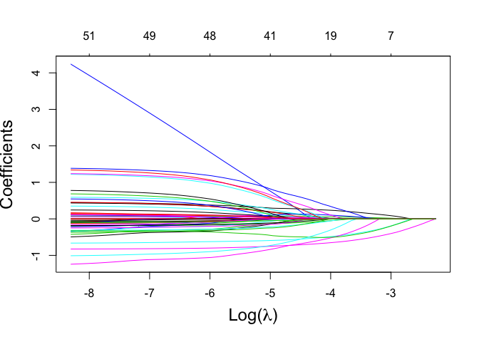
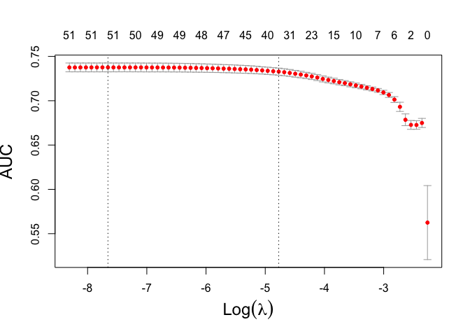
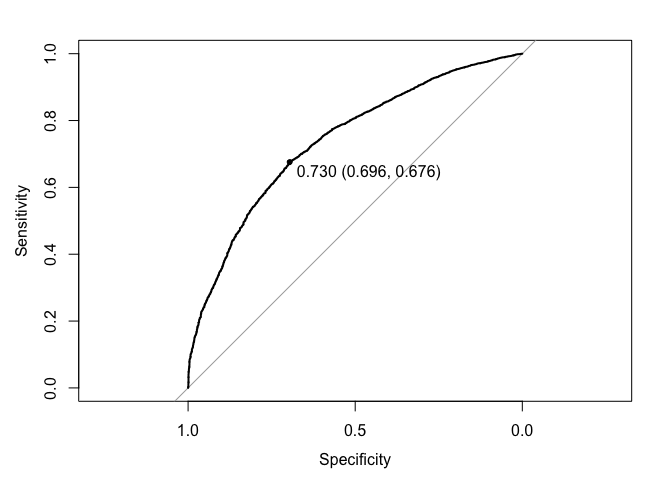

Lasso Ridge ElasticNet
================

Logistic regression with the new data set

In this day and age of artificial intelligence and deep learning, it is
easy to forget that simple algorithms can work well for a surprisingly
large range of practical business problems. And the simplest place to
start is with the granddaddy of data science algorithms: linear
regression and its close cousin, logistic regression. Linear methods are
not only a good way to learn the key principles of machine learning,
they can also be remarkably helpful in zeroing in on the most important
predictors.

# Libraries

``` r
library(caret)
```

    ## Loading required package: lattice

    ## Loading required package: ggplot2

``` r
library(glmnet)
```

    ## Loading required package: Matrix

    ## Loaded glmnet 3.0-2

``` r
library(pROC)
```

    ## Type 'citation("pROC")' for a citation.

    ## 
    ## Attaching package: 'pROC'

    ## The following objects are masked from 'package:stats':
    ## 
    ##     cov, smooth, var

Data from DataExploration\_v3.Rmd dataframes are also saved in
“/Users/carinaland/Documents/Thesis/05 Data/train\_bin\_v3.csv” and
“/Users/carinaland/Documents/Thesis/05
Data/test\_bin\_v3.csv”

``` r
train_bin <- read.csv("/Users/carinaland/Documents/Thesis/05 Data/train_bin_v4.csv")[,-1]
test_bin <- read.csv("/Users/carinaland/Documents/Thesis/05 Data/test_bin_v4.csv")[,-1]
```

# relevel

``` r
train_bin$Gender <- relevel(train_bin$Gender,"male")
train_bin$Type <- relevel(train_bin$Type,"dog")
train_bin$Vaccinated <- relevel(train_bin$Vaccinated, "yes")
train_bin$Dewormed <- relevel(train_bin$Dewormed, "yes")
train_bin$Sterilized <- relevel(train_bin$Sterilized, "no")
train_bin$MaturitySize <- relevel(train_bin$MaturitySize, "medium")
train_bin$UKC_FIF <- relevel(train_bin$UKC_FIF, "RefBreed")
train_bin$Language <- relevel(train_bin$Language, "English")

test_bin$Gender <- relevel(test_bin$Gender,"male")
test_bin$Type <- relevel(test_bin$Type,"dog")
test_bin$Vaccinated <- relevel(test_bin$Vaccinated, "yes")
test_bin$Dewormed <- relevel(test_bin$Dewormed, "yes")
test_bin$Sterilized <- relevel(test_bin$Sterilized, "no")
test_bin$MaturitySize <- relevel(test_bin$MaturitySize, "medium")
test_bin$UKC_FIF <- relevel(test_bin$UKC_FIF, "RefBreed")
test_bin$Language <- relevel(test_bin$Language, "English")
```

# Dataset Xlog.train, ylog.train, Xlog.test, ylog.test

``` r
Xlog.train <- model.matrix(Adoption~.,subset(train_bin,select=-c(PetID,brightness_max)))[,-1]
Xlog.train <- as.data.frame(Xlog.train)
ylog.train <- train_bin$Adoption #factor
ylog.train <- factor(as.numeric(ylog.train),labels=c("no","yes"))
#ylog.train <- relevel(ylog.train,"yes")

Xlog.test <- model.matrix(Adoption~.,subset(test_bin,select=-c(PetID,brightness_max)))[,-1]
Xlog.test <- as.data.frame(Xlog.test)
ylog.test <- test_bin$Adoption
ylog.test <- factor(as.numeric(ylog.test),labels=c("no","yes"))
#ylog.test <- relevel(ylog.test,"yes")
```

``` r
prop.table(table(ylog.train))
```

    ## ylog.train
    ##        no       yes 
    ## 0.2659965 0.7340035

``` r
table(ylog.train)
```

    ## ylog.train
    ##   no  yes 
    ## 2461 6791

``` r
cat('\n')
```

``` r
cat('\n')
```

``` r
prop.table(table(ylog.test))
```

    ## ylog.test
    ##        no       yes 
    ## 0.2676178 0.7323822

``` r
table(ylog.test)
```

    ## ylog.test
    ##   no  yes 
    ##  619 1694

# Helper Function

extract the row with the best tuning parameters

``` r
get_best_result = function(caret_fit) {
  best = which(rownames(caret_fit$results) == rownames(caret_fit$bestTune))
  best_result = caret_fit$results[best, ]
  rownames(best_result) = NULL
  best_result
}
```

# Elastic net

choose best values for lambda und alpha

Like lasso and ridge, the intercept is not penalized and glment takes
care of standardization internally. Also reported coefficients are on
the original scale.

The new penalty is λ⋅(1−α)/2 times the ridge penalty plus λ⋅α times the
lasso lasso penalty. Dividing the ridge penalty by 2 is a mathematical
convenience for optimization. Essentially, with the correct choice of λ
and α these two “penalty coefficients” can be any positive numbers.

Often it is more useful to simply think of α as controlling the mixing
between the two penalties and λ controlling the amount of penalization.
α takes values between 0 and 1. Using α = 1 gives the lasso that we
have seen before. Similarly, α = 0 gives ridge. We used these two before
with glmnet() to specify which to method we wanted. Now we also allow
for α values in between.

Now we try a much larger model search. First, we’re expanding the
feature space to include all interactions. Since we are using penalized
regression, we don’t have to worry as much about overfitting. If many of
the added variables are not useful, we will likely use a model close to
lasso which makes many of them 0.

We’re also using a larger tuning grid. By setting tuneLength = 10, we
will search 10 α-values and 10 λ-values for each. Because of this larger
tuning grid, the results will be very large.

With α=1, many of the added interaction coefficients are likely set to
zero. (Unfortunately, obtaining this information after using caret with
glmnet isn’t easy. The two don’t actually play very nice together. We’ll
use cv.glmnet() with the expanded feature space to explore this.)

perform a quick analysis using cv.glmnet() instead. Due in part to
randomness in cross validation, and differences in how cv.glmnet() and
train() search for λ, the results are slightly different.

``` r
ylog.train2 <- relevel(ylog.train, "yes") 
ylog.test2 <- relevel(ylog.test,"yes")

log.train <- Xlog.train
log.train$Adoption <- ylog.train2
log.test <- Xlog.test
log.test$Adoption <- ylog.test2
```

## Train Model (Caret)

determine alpha AUC performance metric

chooses classification (family=“binomial”) automatically when using
factor for target log reg doesnt need standardization (only faster
convergence)

``` r
set.seed(42)

ctrl <- trainControl(method="cv", number=5,
                     summaryFunction = twoClassSummary,
                     classProbs = TRUE,
                     returnResamp= "all")

elnet_auc_caret <- train(Adoption~., data=log.train,
  method = "glmnet",
  metric = "ROC",
  trControl = ctrl,
  tuneLength = 10)
```

``` r
get_best_result(elnet_auc_caret)
```

    ##   alpha       lambda       ROC      Sens      Spec       ROCSD     SensSD
    ## 1   0.7 0.0009608341 0.7388838 0.9387419 0.2332303 0.006894115 0.01019955
    ##       SpecSD
    ## 1 0.01959246

``` r
set.seed(42) #performing cv, make results reproducable

elnet_auc <- glmnet(as.matrix(Xlog.train), ylog.train, type.measure = "auc", alpha=0.7, family="binomial")
plot(elnet_auc, xvar="lambda", cex.lab=1.5, xlab=expression(paste("Log(", lambda, ")"))) #label=TRUE, main="Elastic Net"
```

<!-- -->

``` r
elnet_auc = cv.glmnet(as.matrix(Xlog.train), ylog.train, type.measure = "auc", alpha=0.7, family="binomial", nfolds=5) #vgl mit caret: 0.0009608341

plot(elnet_auc, cex.lab=1.5) #, main="Elastic net")
```

<!-- --> Plot1:
shows from left to right the number of nonzero coefficients (Df), the
percent (of null) deviance explained (%dev) and the value of λ (Lambda).
Although by default glmnet calls for 100 values of lambda the program
stops early if \`%dev% does not change sufficently from one lambda to
the next (typically near the end of the path.) should actually use
cv.glmnet() when choosing lambda

Plot2: It includes the cross-validation curve (red dotted line), and
upper and lower standard deviation curves along the λ sequence (error
bars). Two selected λ’s are indicated by the vertical dotted lines. left
line: corresponds to lambda that gives minimum misclassification error
(“class”), maximum AUC (“auc”), minimum deviance “deviance” right
line: corresponds to most highly regularized model that is still within
1ste of minimal error model

``` r
print("Lambda Min: ")
```

    ## [1] "Lambda Min: "

``` r
elnet_auc$lambda.min # close to caret value
```

    ## [1] 0.000473047

``` r
print("Lambda 1SE: ")
```

    ## [1] "Lambda 1SE: "

``` r
elnet_auc$lambda.1se
```

    ## [1] 0.008461152

``` r
diff(coef(elnet_auc, s="lambda.1se")@p) #number of nonzero entries
```

    ## [1] 36

``` r
print("Number of Predictors for Lambda 1SE: ")
```

    ## [1] "Number of Predictors for Lambda 1SE: "

``` r
coef(elnet_auc, s="lambda.1se") # 36
```

    ## 52 x 1 sparse Matrix of class "dgCMatrix"
    ##                                                       1
    ## (Intercept)                                1.2374881738
    ## Typecat                                    0.1551301096
    ## Age                                       -0.0076625758
    ## Genderfemale                              -0.1224714357
    ## MaturitySizeextra large                    0.5173382823
    ## MaturitySizelarge                          .           
    ## MaturitySizesmall                          0.0682535004
    ## Vaccinatedno                               0.2857489454
    ## Vaccinatednot sure                         .           
    ## Dewormedno                                 .           
    ## Dewormednot sure                          -0.0005340662
    ## Sterilizednot sure                        -0.5796717803
    ## Sterilizedyes                             -0.7333265802
    ## Fee                                        .           
    ## VideoAmt                                   0.0067378507
    ## PhotoAmt                                   0.0668519656
    ## ColorName1Brown                            .           
    ## ColorName1Cream                            0.0995663230
    ## ColorName1Golden                           .           
    ## ColorName1Gray                             0.0401807047
    ## ColorName1White                            0.1323447451
    ## ColorName1Yellow                           .           
    ## StateNameKedah|Kelantan|Pahang|Terengganu  .           
    ## StateNameKuala Lumpur                     -0.0215157562
    ## StateNameMelaka|Labuan|Sabah|Sarawak      -0.7595437266
    ## StateNameNegeri Sembilan                  -0.0730232914
    ## StateNamePerak                             .           
    ## StateNamePulau Pinang                     -0.0774008002
    ## StateNameSelangor                          0.1246249422
    ## sentiment_document_score                  -0.1940620763
    ## sentiment_document_magnitude               0.0403611527
    ## no_nameTRUE                                .           
    ## RescuerFreq2                               0.0055343140
    ## refbreedTRUE                              -0.4806581407
    ## SecondBreedTRUE                            .           
    ## UKC_FIFCat1_2                              0.1924488746
    ## UKC_FIFCat3                               -0.1175348205
    ## UKC_FIFCat4                                .           
    ## UKC_FIFCat5                                .           
    ## UKC_FIFCat6                               -0.2222963790
    ## UKC_FIFCompanion                           0.7065366362
    ## UKC_FIFGuardian                            0.4110401344
    ## UKC_FIFGun                                 0.5315647993
    ## UKC_FIFHerding                             0.0461596016
    ## UKC_FIFHound                               0.4371721905
    ## UKC_FIFNorthern                            .           
    ## UKC_FIFTerrier                             .           
    ## LanguageChinese                           -0.6579612853
    ## LanguageOther                              .           
    ## Health_num                                -0.0960134615
    ## multi_colTRUE                              0.0265581574
    ## FurLength_num                             -0.0429026605

``` r
print("Number of Predictors for Lambda Min: ")
```

    ## [1] "Number of Predictors for Lambda Min: "

``` r
coef(elnet_auc, s="lambda.min") # 50
```

    ## 52 x 1 sparse Matrix of class "dgCMatrix"
    ##                                                       1
    ## (Intercept)                                1.3788877733
    ## Typecat                                    0.4251714915
    ## Age                                       -0.0121254278
    ## Genderfemale                              -0.1839741451
    ## MaturitySizeextra large                    3.5798690729
    ## MaturitySizelarge                          0.0569539361
    ## MaturitySizesmall                          0.1143978398
    ## Vaccinatedno                               0.4387828584
    ## Vaccinatednot sure                         0.1478384353
    ## Dewormedno                                -0.1855819205
    ## Dewormednot sure                          -0.1966624816
    ## Sterilizednot sure                        -0.6585801263
    ## Sterilizedyes                             -0.8228220067
    ## Fee                                       -0.0009413912
    ## VideoAmt                                   0.1182412995
    ## PhotoAmt                                   0.0764305532
    ## ColorName1Brown                            0.0969734693
    ## ColorName1Cream                            0.3405875674
    ## ColorName1Golden                           0.1075864092
    ## ColorName1Gray                             0.2359133906
    ## ColorName1White                            0.4439383622
    ## ColorName1Yellow                          -0.0687328903
    ## StateNameKedah|Kelantan|Pahang|Terengganu -0.2836055374
    ## StateNameKuala Lumpur                     -0.2941224485
    ## StateNameMelaka|Labuan|Sabah|Sarawak      -1.1873656801
    ## StateNameNegeri Sembilan                  -0.4411848256
    ## StateNamePerak                            -0.0431533165
    ## StateNamePulau Pinang                     -0.3739244528
    ## StateNameSelangor                         -0.0615930790
    ## sentiment_document_score                  -0.3117256771
    ## sentiment_document_magnitude               0.0581852952
    ## no_nameTRUE                               -0.0783014316
    ## RescuerFreq2                               0.0069383076
    ## refbreedTRUE                              -0.3266398070
    ## SecondBreedTRUE                           -0.1169349766
    ## UKC_FIFCat1_2                              0.5823925204
    ## UKC_FIFCat3                               -0.2428237987
    ## UKC_FIFCat4                               -0.0418952341
    ## UKC_FIFCat5                               -0.1180476295
    ## UKC_FIFCat6                               -0.3603052219
    ## UKC_FIFCompanion                           1.3653225423
    ## UKC_FIFGuardian                            1.1965051739
    ## UKC_FIFGun                                 1.2194055730
    ## UKC_FIFHerding                             0.7543883834
    ## UKC_FIFHound                               1.3121803477
    ## UKC_FIFNorthern                            0.6645618997
    ## UKC_FIFTerrier                             0.5298137271
    ## LanguageChinese                           -0.9932920971
    ## LanguageOther                             -0.1559788258
    ## Health_num                                -0.1809785758
    ## multi_colTRUE                              0.1409996425
    ## FurLength_num                             -0.0991468634

### Performance on training set

``` r
probTrain_elnet_auc <- predict(elnet_auc, s=elnet_auc$lambda.1se, type="response", newx=as.matrix(Xlog.train))
```

#### using default threshold

``` r
threshold <- 0.5
classTrain_elnet_auc <- factor(ifelse(probTrain_elnet_auc >= threshold, "yes", "no") )

#relevel to be able to compare with knn model
classTrain_elnet_auc <- relevel(classTrain_elnet_auc, "yes")
ylog.train2 <- relevel(ylog.train, "yes") 

confusionMatrix(classTrain_elnet_auc, ylog.train2)
```

    ## Confusion Matrix and Statistics
    ## 
    ##           Reference
    ## Prediction  yes   no
    ##        yes 6538 2065
    ##        no   253  396
    ##                                           
    ##                Accuracy : 0.7495          
    ##                  95% CI : (0.7405, 0.7583)
    ##     No Information Rate : 0.734           
    ##     P-Value [Acc > NIR] : 0.0003728       
    ##                                           
    ##                   Kappa : 0.1616          
    ##                                           
    ##  Mcnemar's Test P-Value : < 2.2e-16       
    ##                                           
    ##             Sensitivity : 0.9627          
    ##             Specificity : 0.1609          
    ##          Pos Pred Value : 0.7600          
    ##          Neg Pred Value : 0.6102          
    ##              Prevalence : 0.7340          
    ##          Detection Rate : 0.7067          
    ##    Detection Prevalence : 0.9299          
    ##       Balanced Accuracy : 0.5618          
    ##                                           
    ##        'Positive' Class : yes             
    ## 

#### choose best threshold

``` r
rocTrain_elnet_auc <- roc(ylog.train,probTrain_elnet_auc)
```

    ## Setting levels: control = no, case = yes

    ## Warning in roc.default(ylog.train, probTrain_elnet_auc): Deprecated use a matrix
    ## as predictor. Unexpected results may be produced, please pass a numeric vector.

    ## Setting direction: controls < cases

``` r
plot(rocTrain_elnet_auc,print.thres = "best")
```

<!-- -->

``` r
paste0("Best threshold: ", as.character(rocTrain_elnet_auc$thresholds[which(rocTrain_elnet_auc$sensitivities + rocTrain_elnet_auc$specificities == max(rocTrain_elnet_auc$sensitivities + rocTrain_elnet_auc$specificities))]))
```

    ## [1] "Best threshold: 0.72950655542455"

``` r
auc(rocTrain_elnet_auc)
```

    ## Area under the curve: 0.7397

### performance on test set

``` r
probTest_elnet_auc <- predict(elnet_auc, s=elnet_auc$lambda.1se, newx=as.matrix(Xlog.test), type="response")
```

``` r
rocTest_elnet_auc <- roc(ylog.test,probTest_elnet_auc)
```

    ## Setting levels: control = no, case = yes

    ## Warning in roc.default(ylog.test, probTest_elnet_auc): Deprecated use a matrix
    ## as predictor. Unexpected results may be produced, please pass a numeric vector.

    ## Setting direction: controls < cases

``` r
auc(rocTest_elnet_auc)
```

    ## Area under the curve: 0.7406

#### with 0.5 threshold

``` r
threshold <- 0.5
classTest_elnet_auc <- factor(ifelse(probTest_elnet_auc >= threshold, "yes", "no") )

#relevel to be able to compare with knn model
classTest_elnet_auc <- relevel(classTest_elnet_auc, "yes")

confusionMatrix(classTest_elnet_auc, ylog.test2)
```

    ## Confusion Matrix and Statistics
    ## 
    ##           Reference
    ## Prediction  yes   no
    ##        yes 1637  487
    ##        no    57  132
    ##                                         
    ##                Accuracy : 0.7648        
    ##                  95% CI : (0.747, 0.782)
    ##     No Information Rate : 0.7324        
    ##     P-Value [Acc > NIR] : 0.0001979     
    ##                                         
    ##                   Kappa : 0.2304        
    ##                                         
    ##  Mcnemar's Test P-Value : < 2.2e-16     
    ##                                         
    ##             Sensitivity : 0.9664        
    ##             Specificity : 0.2132        
    ##          Pos Pred Value : 0.7707        
    ##          Neg Pred Value : 0.6984        
    ##              Prevalence : 0.7324        
    ##          Detection Rate : 0.7077        
    ##    Detection Prevalence : 0.9183        
    ##       Balanced Accuracy : 0.5898        
    ##                                         
    ##        'Positive' Class : yes           
    ## 

#### with best threshhold: 0.72950655542455

``` r
threshold <- 0.72950655542455
classTest_elnet_auc <- factor(ifelse(probTest_elnet_auc >= threshold, "yes", "no") )

#relevel to be able to compare with knn model
classTest_elnet_auc <- relevel(classTest_elnet_auc, "yes")

confusionMatrix(classTest_elnet_auc, ylog.test2)
```

    ## Confusion Matrix and Statistics
    ## 
    ##           Reference
    ## Prediction  yes   no
    ##        yes 1170  205
    ##        no   524  414
    ##                                           
    ##                Accuracy : 0.6848          
    ##                  95% CI : (0.6655, 0.7037)
    ##     No Information Rate : 0.7324          
    ##     P-Value [Acc > NIR] : 1               
    ##                                           
    ##                   Kappa : 0.309           
    ##                                           
    ##  Mcnemar's Test P-Value : <2e-16          
    ##                                           
    ##             Sensitivity : 0.6907          
    ##             Specificity : 0.6688          
    ##          Pos Pred Value : 0.8509          
    ##          Neg Pred Value : 0.4414          
    ##              Prevalence : 0.7324          
    ##          Detection Rate : 0.5058          
    ##    Detection Prevalence : 0.5945          
    ##       Balanced Accuracy : 0.6797          
    ##                                           
    ##        'Positive' Class : yes             
    ## 

why isn’t it possible to achieve better results? not designed for
categorical variables, we did one-hot encoding large fraction of
categorical variables still many features (36) after feature selection
feature importance/significance not included in library

better approach: BIC stepwise model next: decision tree based models,
handles categorical variables well
