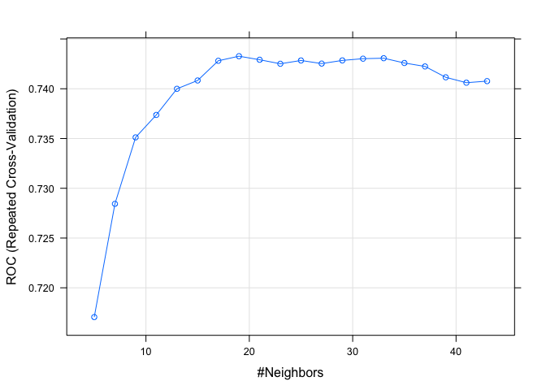

R Notebook
================

Data from FeatureBinning.Rmd dataframes are also saved in
“/Users/carinaland/Documents/Thesis/05 Data/train\_bin.csv” and
“/Users/carinaland/Documents/Thesis/05
Data/test\_bin.csv”

``` r
train_bin <- read.csv("/Users/carinaland/Documents/Thesis/05 Data/train_bin_v4.csv")[,-1]
test_bin <- read.csv("/Users/carinaland/Documents/Thesis/05 Data/test_bin_v4.csv")[,-1]
```

One-hot-Encoding by model.matrix() correlation plot with Adoption build
model (cv for param k, and how many features) also try building own
model based on correlation visualize plots for k feature importance –\>
test, auc measure can change threshold to improve specificity

try SMOTE: random sampling same procedure, improved specifity, didn’t
help much could try metric kappa –\> logreg

``` r
str(train_bin)
```

    ## 'data.frame':    9252 obs. of  26 variables:
    ##  $ Type                        : Factor w/ 2 levels "cat","dog": 1 1 1 1 1 1 1 1 1 1 ...
    ##  $ Age                         : int  1 2 12 18 1 7 2 3 1 3 ...
    ##  $ Gender                      : Factor w/ 2 levels "female","male": 1 2 2 1 1 2 1 2 1 1 ...
    ##  $ MaturitySize                : Factor w/ 4 levels "extra large",..: 3 3 3 3 4 4 3 4 4 3 ...
    ##  $ Vaccinated                  : Factor w/ 3 levels "no","not sure",..: 2 1 3 1 2 1 1 1 3 1 ...
    ##  $ Dewormed                    : Factor w/ 3 levels "no","not sure",..: 2 1 3 3 3 3 1 3 3 1 ...
    ##  $ Sterilized                  : Factor w/ 3 levels "no","not sure",..: 2 1 3 3 2 3 1 1 1 1 ...
    ##  $ Fee                         : int  0 0 0 0 20 0 0 0 0 0 ...
    ##  $ VideoAmt                    : int  0 0 0 0 0 0 0 0 0 0 ...
    ##  $ PetID                       : Factor w/ 9252 levels "0008c5398","000a290e4",..: 952 4 6523 3648 1888 350 2563 2165 8831 5962 ...
    ##  $ PhotoAmt                    : int  3 3 3 2 4 1 1 3 2 3 ...
    ##  $ ColorName1                  : Factor w/ 7 levels "Black","Brown",..: 7 1 2 2 3 1 1 5 1 5 ...
    ##  $ StateName                   : Factor w/ 8 levels "Johor","Kedah|Kelantan|Pahang|Terengganu",..: 8 8 8 3 8 1 3 8 8 3 ...
    ##  $ sentiment_document_score    : num  0 0.8 0.2 0.6 0 0.7 0.3 0.1 -0.1 0.6 ...
    ##  $ sentiment_document_magnitude: num  0 0.8 1.1 4.6 3.2 0.7 0.9 1.6 1.7 0.6 ...
    ##  $ brightness_max              : num  141 135 143 101 117 ...
    ##  $ no_name                     : logi  FALSE FALSE FALSE FALSE FALSE FALSE ...
    ##  $ Adoption                    : logi  TRUE TRUE TRUE TRUE FALSE TRUE ...
    ##  $ RescuerFreq2                : int  2 1 11 0 0 3 33 1 0 16 ...
    ##  $ refbreed                    : logi  FALSE FALSE FALSE FALSE FALSE FALSE ...
    ##  $ SecondBreed                 : logi  TRUE TRUE TRUE TRUE FALSE TRUE ...
    ##  $ UKC_FIF                     : Factor w/ 13 levels "Cat1_2","Cat3",..: 3 3 3 3 3 3 3 3 3 3 ...
    ##  $ Language                    : Factor w/ 3 levels "Chinese","English",..: 2 2 2 2 2 2 2 2 2 2 ...
    ##  $ Health_num                  : int  1 1 1 1 1 1 1 1 1 1 ...
    ##  $ multi_col                   : logi  TRUE TRUE FALSE TRUE FALSE TRUE ...
    ##  $ FurLength_num               : int  1 4 4 4 4 4 1 4 4 2 ...

\#relevel needs to be redone after dataimport

``` r
train_bin$Gender <- relevel(train_bin$Gender,"male")
train_bin$Type <- relevel(train_bin$Type,"dog")
train_bin$Vaccinated <- relevel(train_bin$Vaccinated, "yes")
train_bin$Dewormed <- relevel(train_bin$Dewormed, "yes")
train_bin$Sterilized <- relevel(train_bin$Sterilized, "no")
train_bin$MaturitySize <- relevel(train_bin$MaturitySize, "medium")
train_bin$UKC_FIF <- relevel(train_bin$UKC_FIF, "RefBreed")
train_bin$Language <- relevel(train_bin$Language, "English")

test_bin$Gender <- relevel(test_bin$Gender,"male")
test_bin$Type <- relevel(test_bin$Type,"dog")
test_bin$Vaccinated <- relevel(test_bin$Vaccinated, "yes")
test_bin$Dewormed <- relevel(test_bin$Dewormed, "yes")
test_bin$Sterilized <- relevel(test_bin$Sterilized, "no")
test_bin$MaturitySize <- relevel(test_bin$MaturitySize, "medium")
test_bin$UKC_FIF <- relevel(test_bin$UKC_FIF, "RefBreed")
test_bin$Language <- relevel(test_bin$Language, "English")
```

# Library

``` r
library(caret)
```

    ## Loading required package: lattice

    ## Loading required package: ggplot2

``` r
library(corrplot)
```

    ## corrplot 0.84 loaded

``` r
library(DMwR)
```

    ## Loading required package: grid

    ## Registered S3 method overwritten by 'quantmod':
    ##   method            from
    ##   as.zoo.data.frame zoo

``` r
library(pROC)
```

    ## Type 'citation("pROC")' for a citation.

    ## 
    ## Attaching package: 'pROC'

    ## The following objects are masked from 'package:stats':
    ## 
    ##     cov, smooth, var

# Dataset Xknn.train, yknn.train

``` r
Xknn.train <- model.matrix(Adoption~.,subset(train_bin,select=-c(PetID)))[,-1]
Xknn.train <- as.data.frame(Xknn.train)
yknn.train <- train_bin$Adoption #factor

Xknn.test <- model.matrix(Adoption~.,subset(test_bin,select=-c(PetID)))[,-1]
Xknn.test <- as.data.frame(Xknn.test)
yknn.test <- test_bin$Adoption
yknn.test <- factor(as.numeric(yknn.test),labels=c("no","yes"))
yknn.test <- relevel(yknn.test,"yes")
```

``` r
prop.table(table(yknn.train))
```

    ## yknn.train
    ##     FALSE      TRUE 
    ## 0.2659965 0.7340035

``` r
table(yknn.train)
```

    ## yknn.train
    ## FALSE  TRUE 
    ##  2461  6791

``` r
cat('\n')
```

``` r
prop.table(table(yknn.test))
```

    ## yknn.test
    ##       yes        no 
    ## 0.7323822 0.2676178

``` r
table(yknn.test)
```

    ## yknn.test
    ##  yes   no 
    ## 1694  619

``` r
colnames(Xknn.train)
```

    ##  [1] "Typecat"                                  
    ##  [2] "Age"                                      
    ##  [3] "Genderfemale"                             
    ##  [4] "MaturitySizeextra large"                  
    ##  [5] "MaturitySizelarge"                        
    ##  [6] "MaturitySizesmall"                        
    ##  [7] "Vaccinatedno"                             
    ##  [8] "Vaccinatednot sure"                       
    ##  [9] "Dewormedno"                               
    ## [10] "Dewormednot sure"                         
    ## [11] "Sterilizednot sure"                       
    ## [12] "Sterilizedyes"                            
    ## [13] "Fee"                                      
    ## [14] "VideoAmt"                                 
    ## [15] "PhotoAmt"                                 
    ## [16] "ColorName1Brown"                          
    ## [17] "ColorName1Cream"                          
    ## [18] "ColorName1Golden"                         
    ## [19] "ColorName1Gray"                           
    ## [20] "ColorName1White"                          
    ## [21] "ColorName1Yellow"                         
    ## [22] "StateNameKedah|Kelantan|Pahang|Terengganu"
    ## [23] "StateNameKuala Lumpur"                    
    ## [24] "StateNameMelaka|Labuan|Sabah|Sarawak"     
    ## [25] "StateNameNegeri Sembilan"                 
    ## [26] "StateNamePerak"                           
    ## [27] "StateNamePulau Pinang"                    
    ## [28] "StateNameSelangor"                        
    ## [29] "sentiment_document_score"                 
    ## [30] "sentiment_document_magnitude"             
    ## [31] "brightness_max"                           
    ## [32] "no_nameTRUE"                              
    ## [33] "RescuerFreq2"                             
    ## [34] "refbreedTRUE"                             
    ## [35] "SecondBreedTRUE"                          
    ## [36] "UKC_FIFCat1_2"                            
    ## [37] "UKC_FIFCat3"                              
    ## [38] "UKC_FIFCat4"                              
    ## [39] "UKC_FIFCat5"                              
    ## [40] "UKC_FIFCat6"                              
    ## [41] "UKC_FIFCompanion"                         
    ## [42] "UKC_FIFGuardian"                          
    ## [43] "UKC_FIFGun"                               
    ## [44] "UKC_FIFHerding"                           
    ## [45] "UKC_FIFHound"                             
    ## [46] "UKC_FIFNorthern"                          
    ## [47] "UKC_FIFTerrier"                           
    ## [48] "LanguageChinese"                          
    ## [49] "LanguageOther"                            
    ## [50] "Health_num"                               
    ## [51] "multi_colTRUE"                            
    ## [52] "FurLength_num"

``` r
str(Xknn.train)
```

    ## 'data.frame':    9252 obs. of  52 variables:
    ##  $ Typecat                                  : num  1 1 1 1 1 1 1 1 1 1 ...
    ##  $ Age                                      : num  1 2 12 18 1 7 2 3 1 3 ...
    ##  $ Genderfemale                             : num  1 0 0 1 1 0 1 0 1 1 ...
    ##  $ MaturitySizeextra large                  : num  0 0 0 0 0 0 0 0 0 0 ...
    ##  $ MaturitySizelarge                        : num  0 0 0 0 0 0 0 0 0 0 ...
    ##  $ MaturitySizesmall                        : num  0 0 0 0 1 1 0 1 1 0 ...
    ##  $ Vaccinatedno                             : num  0 1 0 1 0 1 1 1 0 1 ...
    ##  $ Vaccinatednot sure                       : num  1 0 0 0 1 0 0 0 0 0 ...
    ##  $ Dewormedno                               : num  0 1 0 0 0 0 1 0 0 1 ...
    ##  $ Dewormednot sure                         : num  1 0 0 0 0 0 0 0 0 0 ...
    ##  $ Sterilizednot sure                       : num  1 0 0 0 1 0 0 0 0 0 ...
    ##  $ Sterilizedyes                            : num  0 0 1 1 0 1 0 0 0 0 ...
    ##  $ Fee                                      : num  0 0 0 0 20 0 0 0 0 0 ...
    ##  $ VideoAmt                                 : num  0 0 0 0 0 0 0 0 0 0 ...
    ##  $ PhotoAmt                                 : num  3 3 3 2 4 1 1 3 2 3 ...
    ##  $ ColorName1Brown                          : num  0 0 1 1 0 0 0 0 0 0 ...
    ##  $ ColorName1Cream                          : num  0 0 0 0 1 0 0 0 0 0 ...
    ##  $ ColorName1Golden                         : num  0 0 0 0 0 0 0 0 0 0 ...
    ##  $ ColorName1Gray                           : num  0 0 0 0 0 0 0 1 0 1 ...
    ##  $ ColorName1White                          : num  0 0 0 0 0 0 0 0 0 0 ...
    ##  $ ColorName1Yellow                         : num  1 0 0 0 0 0 0 0 0 0 ...
    ##  $ StateNameKedah|Kelantan|Pahang|Terengganu: num  0 0 0 0 0 0 0 0 0 0 ...
    ##  $ StateNameKuala Lumpur                    : num  0 0 0 1 0 0 1 0 0 1 ...
    ##  $ StateNameMelaka|Labuan|Sabah|Sarawak     : num  0 0 0 0 0 0 0 0 0 0 ...
    ##  $ StateNameNegeri Sembilan                 : num  0 0 0 0 0 0 0 0 0 0 ...
    ##  $ StateNamePerak                           : num  0 0 0 0 0 0 0 0 0 0 ...
    ##  $ StateNamePulau Pinang                    : num  0 0 0 0 0 0 0 0 0 0 ...
    ##  $ StateNameSelangor                        : num  1 1 1 0 1 0 0 1 1 0 ...
    ##  $ sentiment_document_score                 : num  0 0.8 0.2 0.6 0 0.7 0.3 0.1 -0.1 0.6 ...
    ##  $ sentiment_document_magnitude             : num  0 0.8 1.1 4.6 3.2 0.7 0.9 1.6 1.7 0.6 ...
    ##  $ brightness_max                           : num  141 135 143 101 117 ...
    ##  $ no_nameTRUE                              : num  0 0 0 0 0 0 0 0 0 1 ...
    ##  $ RescuerFreq2                             : num  2 1 11 0 0 3 33 1 0 16 ...
    ##  $ refbreedTRUE                             : num  0 0 0 0 0 0 0 0 0 0 ...
    ##  $ SecondBreedTRUE                          : num  1 1 1 1 0 1 1 1 1 0 ...
    ##  $ UKC_FIFCat1_2                            : num  0 0 0 0 0 0 0 0 0 0 ...
    ##  $ UKC_FIFCat3                              : num  0 0 0 0 0 0 0 0 0 0 ...
    ##  $ UKC_FIFCat4                              : num  1 1 1 1 1 1 1 1 1 1 ...
    ##  $ UKC_FIFCat5                              : num  0 0 0 0 0 0 0 0 0 0 ...
    ##  $ UKC_FIFCat6                              : num  0 0 0 0 0 0 0 0 0 0 ...
    ##  $ UKC_FIFCompanion                         : num  0 0 0 0 0 0 0 0 0 0 ...
    ##  $ UKC_FIFGuardian                          : num  0 0 0 0 0 0 0 0 0 0 ...
    ##  $ UKC_FIFGun                               : num  0 0 0 0 0 0 0 0 0 0 ...
    ##  $ UKC_FIFHerding                           : num  0 0 0 0 0 0 0 0 0 0 ...
    ##  $ UKC_FIFHound                             : num  0 0 0 0 0 0 0 0 0 0 ...
    ##  $ UKC_FIFNorthern                          : num  0 0 0 0 0 0 0 0 0 0 ...
    ##  $ UKC_FIFTerrier                           : num  0 0 0 0 0 0 0 0 0 0 ...
    ##  $ LanguageChinese                          : num  0 0 0 0 0 0 0 0 0 0 ...
    ##  $ LanguageOther                            : num  0 0 0 0 0 0 0 0 0 0 ...
    ##  $ Health_num                               : num  1 1 1 1 1 1 1 1 1 1 ...
    ##  $ multi_colTRUE                            : num  1 1 0 1 0 1 1 1 1 0 ...
    ##  $ FurLength_num                            : num  1 4 4 4 4 4 1 4 4 2 ...

# Correlation for handselected model

too large, make one for those with highest correlation

``` r
l <- 0
for (i in 1:length(colnames(Xknn.train))){
  l[i] <- abs(cor(Xknn.train[,i],yknn.train))
}
```

``` r
l
```

    ##  [1] 0.0376715322 0.1162382292 0.0442434669 0.0293899895 0.0045072706
    ##  [6] 0.0307129368 0.1183562823 0.0394954421 0.0452767726 0.0519769237
    ## [11] 0.1029355598 0.1621960284 0.0007770797 0.0281413895 0.1072301958
    ## [16] 0.0255361672 0.0226582112 0.0131613266 0.0204201325 0.0114448009
    ## [21] 0.0140526533 0.0043554054 0.0480242411 0.0719173160 0.0341256779
    ## [26] 0.0098071895 0.0379168967 0.0868460555 0.0491583370 0.0347341030
    ## [31] 0.0846249629 0.0317149401 0.1652530933 0.1087616357 0.0498088819
    ## [36] 0.0402168295 0.0120888578 0.0096645960 0.0408902217 0.0078430415
    ## [41] 0.0529529446 0.0329530521 0.0513633739 0.0271561003 0.0250257164
    ## [46] 0.0147588984 0.0151661354 0.0531343693 0.0026274756 0.0419790254
    ## [51] 0.0376647436 0.0653467466

``` r
sorted <- sort(l, index.return=TRUE, decreasing=TRUE)
sorted
```

    ## $x
    ##  [1] 0.1652530933 0.1621960284 0.1183562823 0.1162382292 0.1087616357
    ##  [6] 0.1072301958 0.1029355598 0.0868460555 0.0846249629 0.0719173160
    ## [11] 0.0653467466 0.0531343693 0.0529529446 0.0519769237 0.0513633739
    ## [16] 0.0498088819 0.0491583370 0.0480242411 0.0452767726 0.0442434669
    ## [21] 0.0419790254 0.0408902217 0.0402168295 0.0394954421 0.0379168967
    ## [26] 0.0376715322 0.0376647436 0.0347341030 0.0341256779 0.0329530521
    ## [31] 0.0317149401 0.0307129368 0.0293899895 0.0281413895 0.0271561003
    ## [36] 0.0255361672 0.0250257164 0.0226582112 0.0204201325 0.0151661354
    ## [41] 0.0147588984 0.0140526533 0.0131613266 0.0120888578 0.0114448009
    ## [46] 0.0098071895 0.0096645960 0.0078430415 0.0045072706 0.0043554054
    ## [51] 0.0026274756 0.0007770797
    ## 
    ## $ix
    ##  [1] 33 12  7  2 34 15 11 28 31 24 52 48 41 10 43 35 29 23  9  3 50 39 36  8 27
    ## [26]  1 51 30 25 42 32  6  4 14 44 16 45 17 19 47 46 21 18 37 20 26 38 40  5 22
    ## [51] 49 13

## Vector sorted with correlation top15

``` r
head(colnames(Xknn.train[,sorted$ix]),15)
```

    ##  [1] "RescuerFreq2"                        
    ##  [2] "Sterilizedyes"                       
    ##  [3] "Vaccinatedno"                        
    ##  [4] "Age"                                 
    ##  [5] "refbreedTRUE"                        
    ##  [6] "PhotoAmt"                            
    ##  [7] "Sterilizednot sure"                  
    ##  [8] "StateNameSelangor"                   
    ##  [9] "brightness_max"                      
    ## [10] "StateNameMelaka|Labuan|Sabah|Sarawak"
    ## [11] "FurLength_num"                       
    ## [12] "LanguageChinese"                     
    ## [13] "UKC_FIFCompanion"                    
    ## [14] "Dewormednot sure"                    
    ## [15] "UKC_FIFGun"

## correlation plot

Adoption ~ RescuerFreq2 + Sterilizedyes + Vaccinatedno + Age +
refbreedTRUE + PhotoAmt + Sterilizednot
sure

``` r
corrvars <- c("RescuerFreq2", "Sterilizedyes","Vaccinatedno", "Age","refbreedTRUE", "PhotoAmt", "Sterilizednot sure")
corr_knnhand <- Xknn.train[corrvars] 
corr_knnhand$Adoption <- yknn.train

corr_knnhand$Adoption <- ifelse(corr_knnhand$Adoption == TRUE ,1,0)
corr_knnhand_mat <- cor(as.matrix(corr_knnhand))
# Plot 1
corrplot.mixed(corr_knnhand_mat,lower.col = "black", tl.pos="lt", tl.col="black")
```

<!-- -->

``` r
#Plot 3 
res2 <- cor.mtest(corr_knnhand, conf.level = .99)
corrplot(corr_knnhand_mat, p.mat = res2$p, sig.level = .01, tl.pos="lt")
```

<!-- -->

# knn\_autoselect

searches for best number of independent variables (CV 5) searches for
best k (CV 5) metric: ROC predict: Probs

``` r
set.seed(42)
yknn.train <- factor(as.numeric(train_bin$Adoption),labels=c("no","yes"))
yknn.train <- relevel(yknn.train, "yes")

# compute measures specific to two-class problems, such as the area under the ROC curve, the sensitivity and specificity
caretFuncs$summary <- twoClassSummary  

rctrl <- rfeControl(method = "cv",
                    number = 5,
                    returnResamp = "all", 
                    functions=caretFuncs,
                    saveDetails=TRUE)

ctrl <- trainControl(method="cv",number=5,
                     summaryFunction = twoClassSummary,
                     classProbs = TRUE,
                     returnResamp= "all")

knn_autoselect <- rfe(x=Xknn.train, y=yknn.train,  
             method = "knn",
             trControl = ctrl,
             size=c(5:20),
             metric="ROC",
             rfeControl = rctrl,
             preProc = c("center", "scale"))
```

    ## Warning in train.default(x, y, ...): The metric "Accuracy" was not in the result
    ## set. ROC will be used instead.
    
    ## Warning in train.default(x, y, ...): The metric "Accuracy" was not in the result
    ## set. ROC will be used instead.
    
    ## Warning in train.default(x, y, ...): The metric "Accuracy" was not in the result
    ## set. ROC will be used instead.
    
    ## Warning in train.default(x, y, ...): The metric "Accuracy" was not in the result
    ## set. ROC will be used instead.
    
    ## Warning in train.default(x, y, ...): The metric "Accuracy" was not in the result
    ## set. ROC will be used instead.
    
    ## Warning in train.default(x, y, ...): The metric "Accuracy" was not in the result
    ## set. ROC will be used instead.
    
    ## Warning in train.default(x, y, ...): The metric "Accuracy" was not in the result
    ## set. ROC will be used instead.
    
    ## Warning in train.default(x, y, ...): The metric "Accuracy" was not in the result
    ## set. ROC will be used instead.
    
    ## Warning in train.default(x, y, ...): The metric "Accuracy" was not in the result
    ## set. ROC will be used instead.
    
    ## Warning in train.default(x, y, ...): The metric "Accuracy" was not in the result
    ## set. ROC will be used instead.
    
    ## Warning in train.default(x, y, ...): The metric "Accuracy" was not in the result
    ## set. ROC will be used instead.
    
    ## Warning in train.default(x, y, ...): The metric "Accuracy" was not in the result
    ## set. ROC will be used instead.
    
    ## Warning in train.default(x, y, ...): The metric "Accuracy" was not in the result
    ## set. ROC will be used instead.
    
    ## Warning in train.default(x, y, ...): The metric "Accuracy" was not in the result
    ## set. ROC will be used instead.
    
    ## Warning in train.default(x, y, ...): The metric "Accuracy" was not in the result
    ## set. ROC will be used instead.
    
    ## Warning in train.default(x, y, ...): The metric "Accuracy" was not in the result
    ## set. ROC will be used instead.
    
    ## Warning in train.default(x, y, ...): The metric "Accuracy" was not in the result
    ## set. ROC will be used instead.
    
    ## Warning in train.default(x, y, ...): The metric "Accuracy" was not in the result
    ## set. ROC will be used instead.
    
    ## Warning in train.default(x, y, ...): The metric "Accuracy" was not in the result
    ## set. ROC will be used instead.
    
    ## Warning in train.default(x, y, ...): The metric "Accuracy" was not in the result
    ## set. ROC will be used instead.
    
    ## Warning in train.default(x, y, ...): The metric "Accuracy" was not in the result
    ## set. ROC will be used instead.
    
    ## Warning in train.default(x, y, ...): The metric "Accuracy" was not in the result
    ## set. ROC will be used instead.
    
    ## Warning in train.default(x, y, ...): The metric "Accuracy" was not in the result
    ## set. ROC will be used instead.
    
    ## Warning in train.default(x, y, ...): The metric "Accuracy" was not in the result
    ## set. ROC will be used instead.
    
    ## Warning in train.default(x, y, ...): The metric "Accuracy" was not in the result
    ## set. ROC will be used instead.
    
    ## Warning in train.default(x, y, ...): The metric "Accuracy" was not in the result
    ## set. ROC will be used instead.
    
    ## Warning in train.default(x, y, ...): The metric "Accuracy" was not in the result
    ## set. ROC will be used instead.
    
    ## Warning in train.default(x, y, ...): The metric "Accuracy" was not in the result
    ## set. ROC will be used instead.
    
    ## Warning in train.default(x, y, ...): The metric "Accuracy" was not in the result
    ## set. ROC will be used instead.
    
    ## Warning in train.default(x, y, ...): The metric "Accuracy" was not in the result
    ## set. ROC will be used instead.
    
    ## Warning in train.default(x, y, ...): The metric "Accuracy" was not in the result
    ## set. ROC will be used instead.
    
    ## Warning in train.default(x, y, ...): The metric "Accuracy" was not in the result
    ## set. ROC will be used instead.
    
    ## Warning in train.default(x, y, ...): The metric "Accuracy" was not in the result
    ## set. ROC will be used instead.
    
    ## Warning in train.default(x, y, ...): The metric "Accuracy" was not in the result
    ## set. ROC will be used instead.
    
    ## Warning in train.default(x, y, ...): The metric "Accuracy" was not in the result
    ## set. ROC will be used instead.
    
    ## Warning in train.default(x, y, ...): The metric "Accuracy" was not in the result
    ## set. ROC will be used instead.
    
    ## Warning in train.default(x, y, ...): The metric "Accuracy" was not in the result
    ## set. ROC will be used instead.
    
    ## Warning in train.default(x, y, ...): The metric "Accuracy" was not in the result
    ## set. ROC will be used instead.
    
    ## Warning in train.default(x, y, ...): The metric "Accuracy" was not in the result
    ## set. ROC will be used instead.
    
    ## Warning in train.default(x, y, ...): The metric "Accuracy" was not in the result
    ## set. ROC will be used instead.
    
    ## Warning in train.default(x, y, ...): The metric "Accuracy" was not in the result
    ## set. ROC will be used instead.
    
    ## Warning in train.default(x, y, ...): The metric "Accuracy" was not in the result
    ## set. ROC will be used instead.
    
    ## Warning in train.default(x, y, ...): The metric "Accuracy" was not in the result
    ## set. ROC will be used instead.
    
    ## Warning in train.default(x, y, ...): The metric "Accuracy" was not in the result
    ## set. ROC will be used instead.
    
    ## Warning in train.default(x, y, ...): The metric "Accuracy" was not in the result
    ## set. ROC will be used instead.
    
    ## Warning in train.default(x, y, ...): The metric "Accuracy" was not in the result
    ## set. ROC will be used instead.
    
    ## Warning in train.default(x, y, ...): The metric "Accuracy" was not in the result
    ## set. ROC will be used instead.
    
    ## Warning in train.default(x, y, ...): The metric "Accuracy" was not in the result
    ## set. ROC will be used instead.
    
    ## Warning in train.default(x, y, ...): The metric "Accuracy" was not in the result
    ## set. ROC will be used instead.
    
    ## Warning in train.default(x, y, ...): The metric "Accuracy" was not in the result
    ## set. ROC will be used instead.
    
    ## Warning in train.default(x, y, ...): The metric "Accuracy" was not in the result
    ## set. ROC will be used instead.
    
    ## Warning in train.default(x, y, ...): The metric "Accuracy" was not in the result
    ## set. ROC will be used instead.
    
    ## Warning in train.default(x, y, ...): The metric "Accuracy" was not in the result
    ## set. ROC will be used instead.
    
    ## Warning in train.default(x, y, ...): The metric "Accuracy" was not in the result
    ## set. ROC will be used instead.
    
    ## Warning in train.default(x, y, ...): The metric "Accuracy" was not in the result
    ## set. ROC will be used instead.
    
    ## Warning in train.default(x, y, ...): The metric "Accuracy" was not in the result
    ## set. ROC will be used instead.
    
    ## Warning in train.default(x, y, ...): The metric "Accuracy" was not in the result
    ## set. ROC will be used instead.
    
    ## Warning in train.default(x, y, ...): The metric "Accuracy" was not in the result
    ## set. ROC will be used instead.
    
    ## Warning in train.default(x, y, ...): The metric "Accuracy" was not in the result
    ## set. ROC will be used instead.
    
    ## Warning in train.default(x, y, ...): The metric "Accuracy" was not in the result
    ## set. ROC will be used instead.
    
    ## Warning in train.default(x, y, ...): The metric "Accuracy" was not in the result
    ## set. ROC will be used instead.
    
    ## Warning in train.default(x, y, ...): The metric "Accuracy" was not in the result
    ## set. ROC will be used instead.
    
    ## Warning in train.default(x, y, ...): The metric "Accuracy" was not in the result
    ## set. ROC will be used instead.
    
    ## Warning in train.default(x, y, ...): The metric "Accuracy" was not in the result
    ## set. ROC will be used instead.
    
    ## Warning in train.default(x, y, ...): The metric "Accuracy" was not in the result
    ## set. ROC will be used instead.
    
    ## Warning in train.default(x, y, ...): The metric "Accuracy" was not in the result
    ## set. ROC will be used instead.
    
    ## Warning in train.default(x, y, ...): The metric "Accuracy" was not in the result
    ## set. ROC will be used instead.
    
    ## Warning in train.default(x, y, ...): The metric "Accuracy" was not in the result
    ## set. ROC will be used instead.
    
    ## Warning in train.default(x, y, ...): The metric "Accuracy" was not in the result
    ## set. ROC will be used instead.
    
    ## Warning in train.default(x, y, ...): The metric "Accuracy" was not in the result
    ## set. ROC will be used instead.
    
    ## Warning in train.default(x, y, ...): The metric "Accuracy" was not in the result
    ## set. ROC will be used instead.
    
    ## Warning in train.default(x, y, ...): The metric "Accuracy" was not in the result
    ## set. ROC will be used instead.
    
    ## Warning in train.default(x, y, ...): The metric "Accuracy" was not in the result
    ## set. ROC will be used instead.
    
    ## Warning in train.default(x, y, ...): The metric "Accuracy" was not in the result
    ## set. ROC will be used instead.
    
    ## Warning in train.default(x, y, ...): The metric "Accuracy" was not in the result
    ## set. ROC will be used instead.
    
    ## Warning in train.default(x, y, ...): The metric "Accuracy" was not in the result
    ## set. ROC will be used instead.
    
    ## Warning in train.default(x, y, ...): The metric "Accuracy" was not in the result
    ## set. ROC will be used instead.
    
    ## Warning in train.default(x, y, ...): The metric "Accuracy" was not in the result
    ## set. ROC will be used instead.
    
    ## Warning in train.default(x, y, ...): The metric "Accuracy" was not in the result
    ## set. ROC will be used instead.
    
    ## Warning in train.default(x, y, ...): The metric "Accuracy" was not in the result
    ## set. ROC will be used instead.
    
    ## Warning in train.default(x, y, ...): The metric "Accuracy" was not in the result
    ## set. ROC will be used instead.
    
    ## Warning in train.default(x, y, ...): The metric "Accuracy" was not in the result
    ## set. ROC will be used instead.
    
    ## Warning in train.default(x, y, ...): The metric "Accuracy" was not in the result
    ## set. ROC will be used instead.
    
    ## Warning in train.default(x, y, ...): The metric "Accuracy" was not in the result
    ## set. ROC will be used instead.
    
    ## Warning in train.default(x, y, ...): The metric "Accuracy" was not in the result
    ## set. ROC will be used instead.
    
    ## Warning in train.default(x, y, ...): The metric "Accuracy" was not in the result
    ## set. ROC will be used instead.

``` r
knn_autoselect
```

    ## 
    ## Recursive feature selection
    ## 
    ## Outer resampling method: Cross-Validated (5 fold) 
    ## 
    ## Resampling performance over subset size:
    ## 
    ##  Variables    ROC   Sens   Spec    ROCSD   SensSD  SpecSD Selected
    ##          5 0.7065 0.8868 0.2918 0.009815 0.005257 0.02171         
    ##          6 0.7371 0.8907 0.3478 0.014232 0.004009 0.01999         
    ##          7 0.7373 0.8872 0.3421 0.015713 0.011559 0.03342        *
    ##          8 0.7291 0.8890 0.3348 0.023574 0.013527 0.03515         
    ##          9 0.7183 0.8879 0.3113 0.017440 0.013643 0.01115         
    ##         10 0.7016 0.9021 0.2938 0.008110 0.008493 0.01598         
    ##         11 0.6951 0.8971 0.2861 0.010972 0.007583 0.02278         
    ##         12 0.6902 0.9015 0.2808 0.013530 0.007134 0.02101         
    ##         13 0.6925 0.9013 0.2609 0.011863 0.007027 0.02421         
    ##         14 0.7001 0.9068 0.2739 0.011483 0.005044 0.02840         
    ##         15 0.6960 0.9078 0.2662 0.011120 0.008443 0.02309         
    ##         16 0.6939 0.9072 0.2532 0.010776 0.009915 0.02180         
    ##         17 0.6962 0.9111 0.2519 0.013680 0.008174 0.02829         
    ##         18 0.6919 0.9093 0.2548 0.014154 0.007128 0.02764         
    ##         19 0.6963 0.9080 0.2548 0.011192 0.003944 0.02622         
    ##         20 0.6926 0.9069 0.2446 0.014662 0.008977 0.03542         
    ##         52 0.6915 0.9178 0.2588 0.017384 0.007734 0.01358         
    ## 
    ## The top 5 variables (out of 7):
    ##    Age, RescuerFreq2, PhotoAmt, Sterilizedyes, Vaccinatedno

``` r
plot(knn_autoselect, type = c("g", "o"))
```

<!-- -->

``` r
xyplot(knn_autoselect,type = c("g", "p", "smooth"), ylab = "ROC CV Estimates")
```

<!-- -->

``` r
# note: SD standard deviation, The value of 1.96 is based on the fact that 95% of the area of a normal distribution is within 1.96 standard deviations of the mean

ggplot(knn_autoselect$results, aes(x=Variables, y=ROC)) +
  geom_line() + 
  geom_ribbon(aes(ymin=ROC - ROCSD*1.96,
                  ymax=ROC + ROCSD*1.96), alpha=0.2) + 
  geom_vline(xintercept=7, color="blue") + 
  xlab("Number of variables, optimal = 7") + ylab("AUC") + theme(text=element_text(size=12))
```

<!-- -->

``` r
densityplot(knn_autoselect, 
            adjust = 1.25, 
            as.table = TRUE, 
            xlab = "ROC CV Estimates", 
            pch = "|")
```

<!-- -->

``` r
knn_autoselect$optVariables
```

    ## [1] "Age"               "RescuerFreq2"      "PhotoAmt"         
    ## [4] "Sterilizedyes"     "Vaccinatedno"      "refbreedTRUE"     
    ## [7] "StateNameSelangor"

``` r
importance <- varImp(knn_autoselect, scale=FALSE)
print(importance)
```

    ##                     Overall
    ## Age               0.6554396
    ## RescuerFreq2      0.6422341
    ## PhotoAmt          0.5816213
    ## Sterilizedyes     0.5780388
    ## Vaccinatedno      0.5662177
    ## refbreedTRUE      0.5595871
    ## StateNameSelangor 0.5483719

``` r
knn_autoselect_pred <- predict(knn_autoselect,newdata=Xknn.test) 
```

``` r
roc_knn <- roc(response=yknn.test, predictor=knn_autoselect_pred$yes)
```

    ## Setting levels: control = yes, case = no

    ## Setting direction: controls > cases

``` r
auc(roc_knn)
```

    ## Area under the curve: 0.7406

accuracy depends on selected threshold, want to use probabilities, use
ROC curve

``` r
threshold <- 0.5
probsTest_knn_auto    <- factor(ifelse(knn_autoselect_pred[,"yes"] >= threshold, "yes", "no") )
probsTest_knn_auto    <- relevel(probsTest_knn_auto, "yes")   # you may or may not need this; I did
confusionMatrix(probsTest_knn_auto, yknn.test)
```

    ## Confusion Matrix and Statistics
    ## 
    ##           Reference
    ## Prediction  yes   no
    ##        yes 1537  396
    ##        no   157  223
    ##                                          
    ##                Accuracy : 0.7609         
    ##                  95% CI : (0.743, 0.7782)
    ##     No Information Rate : 0.7324         
    ##     P-Value [Acc > NIR] : 0.0009384      
    ##                                          
    ##                   Kappa : 0.3049         
    ##                                          
    ##  Mcnemar's Test P-Value : < 2.2e-16      
    ##                                          
    ##             Sensitivity : 0.9073         
    ##             Specificity : 0.3603         
    ##          Pos Pred Value : 0.7951         
    ##          Neg Pred Value : 0.5868         
    ##              Prevalence : 0.7324         
    ##          Detection Rate : 0.6645         
    ##    Detection Prevalence : 0.8357         
    ##       Balanced Accuracy : 0.6338         
    ##                                          
    ##        'Positive' Class : yes            
    ## 

specificity only at 36%. irreführend\! wir 90% der richtigen fälle
richtig vorher, dass sie adoptiert werden. Aber nur 36%. Es geht aber
gerade darum, die Profile zu beurteilen die nicht adoptiert werden und
diese dann zu verbessern. Dementsprechend wäre es von größerere
Bedeutung diese Fälle richtig vorherzusagen. Wir können andere Threshold
verwenden (habe probabilities vorhergesagt).

\#pick best threshold based on training set:

``` r
probsTrain_auto <- predict(knn_autoselect, Xknn.train)
rocCurve   <- roc(response = yknn.train,
                      predictor = probsTrain_auto[, "yes"],
                      levels = rev(levels(yknn.train)))
```

    ## Setting direction: controls < cases

``` r
plot(rocCurve, print.thres = "best")
```

<!-- -->

``` r
rocCurve$thresholds[which(rocCurve$sensitivities + rocCurve$specificities == max(rocCurve$sensitivities + rocCurve$specificities))]
```

    ## [1] 0.730303

check how it works on test set:

``` r
threshold <- 0.73
probsTest_knn_auto    <- factor(ifelse(knn_autoselect_pred[,"yes"] > threshold, "yes", "no") )
probsTest_knn_auto   <- relevel(probsTest_knn_auto, "yes")   # you may or may not need this; I did
confusionMatrix(probsTest_knn_auto, yknn.test) 
```

    ## Confusion Matrix and Statistics
    ## 
    ##           Reference
    ## Prediction  yes   no
    ##        yes 1105  190
    ##        no   589  429
    ##                                           
    ##                Accuracy : 0.6632          
    ##                  95% CI : (0.6435, 0.6825)
    ##     No Information Rate : 0.7324          
    ##     P-Value [Acc > NIR] : 1               
    ##                                           
    ##                   Kappa : 0.2867          
    ##                                           
    ##  Mcnemar's Test P-Value : <2e-16          
    ##                                           
    ##             Sensitivity : 0.6523          
    ##             Specificity : 0.6931          
    ##          Pos Pred Value : 0.8533          
    ##          Neg Pred Value : 0.4214          
    ##              Prevalence : 0.7324          
    ##          Detection Rate : 0.4777          
    ##    Detection Prevalence : 0.5599          
    ##       Balanced Accuracy : 0.6727          
    ##                                           
    ##        'Positive' Class : yes             
    ## 

accuracy worse, but misleading. specificity is up at 69%, sensitivity at
65%

# which knn was chosen in the model? kNN hand

optVar \[1\] “Age” “RescuerFreq2” “PhotoAmt” “Sterilizedyes”
“Vaccinatedno”  
\[6\] “refbreedTRUE” “StateNameSelangor”

``` r
set.seed(42)
knn.train <- as.data.frame(Xknn.train)
knn.train$Adoption <- yknn.train

ctrl <- trainControl(method="repeatedcv",repeats=3,number=5,
                     summaryFunction = twoClassSummary,
                     classProbs = TRUE
                     )

knn_hand <- train(Adoption ~ Age+RescuerFreq2+PhotoAmt+Sterilizedyes+Vaccinatedno+refbreedTRUE+StateNameSelangor, data= knn.train, 
             method = "knn",
             trControl = ctrl,
             tuneLength=20,
             preProc = c("center","scale"))
```

    ## Warning in train.default(x, y, weights = w, ...): The metric "Accuracy" was not
    ## in the result set. ROC will be used instead.

``` r
knn_hand
```

    ## k-Nearest Neighbors 
    ## 
    ## 9252 samples
    ##    7 predictor
    ##    2 classes: 'yes', 'no' 
    ## 
    ## Pre-processing: centered (7), scaled (7) 
    ## Resampling: Cross-Validated (5 fold, repeated 3 times) 
    ## Summary of sample sizes: 7402, 7402, 7401, 7402, 7401, 7402, ... 
    ## Resampling results across tuning parameters:
    ## 
    ##   k   ROC        Sens       Spec     
    ##    5  0.7170593  0.8586366  0.3709854
    ##    7  0.7284379  0.8738035  0.3548629
    ##    9  0.7351140  0.8864678  0.3392926
    ##   11  0.7373719  0.8929950  0.3241223
    ##   13  0.7399966  0.8997693  0.3162679
    ##   15  0.7408332  0.9046286  0.3047535
    ##   17  0.7428129  0.9095859  0.2964926
    ##   19  0.7432733  0.9140523  0.2889087
    ##   21  0.7429153  0.9163099  0.2784784
    ##   23  0.7425126  0.9192058  0.2736028
    ##   25  0.7428427  0.9215624  0.2656112
    ##   27  0.7425311  0.9240164  0.2601909
    ##   29  0.7428487  0.9269613  0.2572093
    ##   31  0.7430235  0.9287774  0.2492219
    ##   33  0.7430706  0.9297590  0.2508474
    ##   35  0.7425893  0.9309861  0.2433970
    ##   37  0.7422431  0.9315260  0.2420409
    ##   39  0.7411508  0.9323113  0.2390629
    ##   41  0.7406086  0.9331458  0.2354060
    ##   43  0.7407678  0.9344712  0.2336456
    ## 
    ## ROC was used to select the optimal model using the largest value.
    ## The final value used for the model was k = 19.

with different k, with higher specifity would have been better, almost
same roc. better to use different metric

``` r
knn_hand
```

    ## k-Nearest Neighbors 
    ## 
    ## 9252 samples
    ##    7 predictor
    ##    2 classes: 'yes', 'no' 
    ## 
    ## Pre-processing: centered (7), scaled (7) 
    ## Resampling: Cross-Validated (5 fold, repeated 3 times) 
    ## Summary of sample sizes: 7402, 7402, 7401, 7402, 7401, 7402, ... 
    ## Resampling results across tuning parameters:
    ## 
    ##   k   ROC        Sens       Spec     
    ##    5  0.7170593  0.8586366  0.3709854
    ##    7  0.7284379  0.8738035  0.3548629
    ##    9  0.7351140  0.8864678  0.3392926
    ##   11  0.7373719  0.8929950  0.3241223
    ##   13  0.7399966  0.8997693  0.3162679
    ##   15  0.7408332  0.9046286  0.3047535
    ##   17  0.7428129  0.9095859  0.2964926
    ##   19  0.7432733  0.9140523  0.2889087
    ##   21  0.7429153  0.9163099  0.2784784
    ##   23  0.7425126  0.9192058  0.2736028
    ##   25  0.7428427  0.9215624  0.2656112
    ##   27  0.7425311  0.9240164  0.2601909
    ##   29  0.7428487  0.9269613  0.2572093
    ##   31  0.7430235  0.9287774  0.2492219
    ##   33  0.7430706  0.9297590  0.2508474
    ##   35  0.7425893  0.9309861  0.2433970
    ##   37  0.7422431  0.9315260  0.2420409
    ##   39  0.7411508  0.9323113  0.2390629
    ##   41  0.7406086  0.9331458  0.2354060
    ##   43  0.7407678  0.9344712  0.2336456
    ## 
    ## ROC was used to select the optimal model using the largest value.
    ## The final value used for the model was k = 19.

``` r
plot(knn_hand)
```

<!-- -->

``` r
importance <- varImp(knn_hand, scale=FALSE)
print(importance)
```

    ## ROC curve variable importance
    ## 
    ##                   Importance
    ## Age                   0.6554
    ## RescuerFreq2          0.6422
    ## PhotoAmt              0.5816
    ## Sterilizedyes         0.5780
    ## Vaccinatedno          0.5662
    ## refbreedTRUE          0.5596
    ## StateNameSelangor     0.5484

``` r
plot(importance)
```

<!-- -->

``` r
ggplot(knn_hand$results, aes(x=k, y=ROC)) +
  geom_line() + 
  geom_ribbon(aes(ymin=ROC - ROCSD*1.96,
                  ymax=ROC + ROCSD*1.96), alpha=0.2) + 
  geom_vline(xintercept=19, color="blue") + 
  xlab("k, optimal = 19")+ylab("AUC")+
  theme(text=element_text(size=12))
```

<!-- -->

## SMOTE

balance the classes by increasing minority class or decreasing majority
class Random Undersamling: - randomly remove majority class observations
- helps balance the dataset - discarded information could have important
information - may lead to bias

Random Oversampling - randomly add more minority observations by
replication - no information loss - prone to overfitting due to copying
same information

SMOTE (synthetic minority oversampling technique) - creates new
“synthetic” observations using k-nearest neighbors

``` r
set.seed(42)
knn.train.smote <- SMOTE(Adoption ~ ., knn.train, k=19, perc.over=100, perc.under=200) #results in balanced dataset

prop.table(table(knn.train.smote$Adoption))
```

    ## 
    ## yes  no 
    ## 0.5 0.5

``` r
table(knn.train.smote$Adoption)
```

    ## 
    ##  yes   no 
    ## 4922 4922

``` r
set.seed(42)

caretFuncs$summary <- twoClassSummary  

rctrl <- rfeControl(method = "cv",
                    number = 5,
                    returnResamp = "all", 
                    functions=caretFuncs,
                    saveDetails=TRUE)

ctrl <- trainControl(method="cv",number=5,
                     summaryFunction = twoClassSummary,
                     classProbs = TRUE,
                     returnResamp= "all"
                     )

knn_autoselect_smote <- rfe(x=subset(knn.train.smote,select=-Adoption), y=knn.train.smote$Adoption, 
             method = "knn",
             trControl = ctrl,
             size = c(5:20),
             metric="ROC",
             rfeControl = rctrl,
             preProc = c("center", "scale"))
```

    ## Warning in train.default(x, y, ...): The metric "Accuracy" was not in the result
    ## set. ROC will be used instead.
    
    ## Warning in train.default(x, y, ...): The metric "Accuracy" was not in the result
    ## set. ROC will be used instead.
    
    ## Warning in train.default(x, y, ...): The metric "Accuracy" was not in the result
    ## set. ROC will be used instead.
    
    ## Warning in train.default(x, y, ...): The metric "Accuracy" was not in the result
    ## set. ROC will be used instead.
    
    ## Warning in train.default(x, y, ...): The metric "Accuracy" was not in the result
    ## set. ROC will be used instead.
    
    ## Warning in train.default(x, y, ...): The metric "Accuracy" was not in the result
    ## set. ROC will be used instead.
    
    ## Warning in train.default(x, y, ...): The metric "Accuracy" was not in the result
    ## set. ROC will be used instead.
    
    ## Warning in train.default(x, y, ...): The metric "Accuracy" was not in the result
    ## set. ROC will be used instead.
    
    ## Warning in train.default(x, y, ...): The metric "Accuracy" was not in the result
    ## set. ROC will be used instead.
    
    ## Warning in train.default(x, y, ...): The metric "Accuracy" was not in the result
    ## set. ROC will be used instead.
    
    ## Warning in train.default(x, y, ...): The metric "Accuracy" was not in the result
    ## set. ROC will be used instead.
    
    ## Warning in train.default(x, y, ...): The metric "Accuracy" was not in the result
    ## set. ROC will be used instead.
    
    ## Warning in train.default(x, y, ...): The metric "Accuracy" was not in the result
    ## set. ROC will be used instead.
    
    ## Warning in train.default(x, y, ...): The metric "Accuracy" was not in the result
    ## set. ROC will be used instead.
    
    ## Warning in train.default(x, y, ...): The metric "Accuracy" was not in the result
    ## set. ROC will be used instead.
    
    ## Warning in train.default(x, y, ...): The metric "Accuracy" was not in the result
    ## set. ROC will be used instead.
    
    ## Warning in train.default(x, y, ...): The metric "Accuracy" was not in the result
    ## set. ROC will be used instead.
    
    ## Warning in train.default(x, y, ...): The metric "Accuracy" was not in the result
    ## set. ROC will be used instead.
    
    ## Warning in train.default(x, y, ...): The metric "Accuracy" was not in the result
    ## set. ROC will be used instead.
    
    ## Warning in train.default(x, y, ...): The metric "Accuracy" was not in the result
    ## set. ROC will be used instead.
    
    ## Warning in train.default(x, y, ...): The metric "Accuracy" was not in the result
    ## set. ROC will be used instead.
    
    ## Warning in train.default(x, y, ...): The metric "Accuracy" was not in the result
    ## set. ROC will be used instead.
    
    ## Warning in train.default(x, y, ...): The metric "Accuracy" was not in the result
    ## set. ROC will be used instead.
    
    ## Warning in train.default(x, y, ...): The metric "Accuracy" was not in the result
    ## set. ROC will be used instead.
    
    ## Warning in train.default(x, y, ...): The metric "Accuracy" was not in the result
    ## set. ROC will be used instead.
    
    ## Warning in train.default(x, y, ...): The metric "Accuracy" was not in the result
    ## set. ROC will be used instead.
    
    ## Warning in train.default(x, y, ...): The metric "Accuracy" was not in the result
    ## set. ROC will be used instead.
    
    ## Warning in train.default(x, y, ...): The metric "Accuracy" was not in the result
    ## set. ROC will be used instead.
    
    ## Warning in train.default(x, y, ...): The metric "Accuracy" was not in the result
    ## set. ROC will be used instead.
    
    ## Warning in train.default(x, y, ...): The metric "Accuracy" was not in the result
    ## set. ROC will be used instead.
    
    ## Warning in train.default(x, y, ...): The metric "Accuracy" was not in the result
    ## set. ROC will be used instead.
    
    ## Warning in train.default(x, y, ...): The metric "Accuracy" was not in the result
    ## set. ROC will be used instead.
    
    ## Warning in train.default(x, y, ...): The metric "Accuracy" was not in the result
    ## set. ROC will be used instead.
    
    ## Warning in train.default(x, y, ...): The metric "Accuracy" was not in the result
    ## set. ROC will be used instead.
    
    ## Warning in train.default(x, y, ...): The metric "Accuracy" was not in the result
    ## set. ROC will be used instead.
    
    ## Warning in train.default(x, y, ...): The metric "Accuracy" was not in the result
    ## set. ROC will be used instead.
    
    ## Warning in train.default(x, y, ...): The metric "Accuracy" was not in the result
    ## set. ROC will be used instead.
    
    ## Warning in train.default(x, y, ...): The metric "Accuracy" was not in the result
    ## set. ROC will be used instead.
    
    ## Warning in train.default(x, y, ...): The metric "Accuracy" was not in the result
    ## set. ROC will be used instead.
    
    ## Warning in train.default(x, y, ...): The metric "Accuracy" was not in the result
    ## set. ROC will be used instead.
    
    ## Warning in train.default(x, y, ...): The metric "Accuracy" was not in the result
    ## set. ROC will be used instead.
    
    ## Warning in train.default(x, y, ...): The metric "Accuracy" was not in the result
    ## set. ROC will be used instead.
    
    ## Warning in train.default(x, y, ...): The metric "Accuracy" was not in the result
    ## set. ROC will be used instead.
    
    ## Warning in train.default(x, y, ...): The metric "Accuracy" was not in the result
    ## set. ROC will be used instead.
    
    ## Warning in train.default(x, y, ...): The metric "Accuracy" was not in the result
    ## set. ROC will be used instead.
    
    ## Warning in train.default(x, y, ...): The metric "Accuracy" was not in the result
    ## set. ROC will be used instead.
    
    ## Warning in train.default(x, y, ...): The metric "Accuracy" was not in the result
    ## set. ROC will be used instead.
    
    ## Warning in train.default(x, y, ...): The metric "Accuracy" was not in the result
    ## set. ROC will be used instead.
    
    ## Warning in train.default(x, y, ...): The metric "Accuracy" was not in the result
    ## set. ROC will be used instead.
    
    ## Warning in train.default(x, y, ...): The metric "Accuracy" was not in the result
    ## set. ROC will be used instead.
    
    ## Warning in train.default(x, y, ...): The metric "Accuracy" was not in the result
    ## set. ROC will be used instead.
    
    ## Warning in train.default(x, y, ...): The metric "Accuracy" was not in the result
    ## set. ROC will be used instead.
    
    ## Warning in train.default(x, y, ...): The metric "Accuracy" was not in the result
    ## set. ROC will be used instead.
    
    ## Warning in train.default(x, y, ...): The metric "Accuracy" was not in the result
    ## set. ROC will be used instead.
    
    ## Warning in train.default(x, y, ...): The metric "Accuracy" was not in the result
    ## set. ROC will be used instead.
    
    ## Warning in train.default(x, y, ...): The metric "Accuracy" was not in the result
    ## set. ROC will be used instead.
    
    ## Warning in train.default(x, y, ...): The metric "Accuracy" was not in the result
    ## set. ROC will be used instead.
    
    ## Warning in train.default(x, y, ...): The metric "Accuracy" was not in the result
    ## set. ROC will be used instead.
    
    ## Warning in train.default(x, y, ...): The metric "Accuracy" was not in the result
    ## set. ROC will be used instead.
    
    ## Warning in train.default(x, y, ...): The metric "Accuracy" was not in the result
    ## set. ROC will be used instead.
    
    ## Warning in train.default(x, y, ...): The metric "Accuracy" was not in the result
    ## set. ROC will be used instead.
    
    ## Warning in train.default(x, y, ...): The metric "Accuracy" was not in the result
    ## set. ROC will be used instead.
    
    ## Warning in train.default(x, y, ...): The metric "Accuracy" was not in the result
    ## set. ROC will be used instead.
    
    ## Warning in train.default(x, y, ...): The metric "Accuracy" was not in the result
    ## set. ROC will be used instead.
    
    ## Warning in train.default(x, y, ...): The metric "Accuracy" was not in the result
    ## set. ROC will be used instead.
    
    ## Warning in train.default(x, y, ...): The metric "Accuracy" was not in the result
    ## set. ROC will be used instead.
    
    ## Warning in train.default(x, y, ...): The metric "Accuracy" was not in the result
    ## set. ROC will be used instead.
    
    ## Warning in train.default(x, y, ...): The metric "Accuracy" was not in the result
    ## set. ROC will be used instead.
    
    ## Warning in train.default(x, y, ...): The metric "Accuracy" was not in the result
    ## set. ROC will be used instead.
    
    ## Warning in train.default(x, y, ...): The metric "Accuracy" was not in the result
    ## set. ROC will be used instead.
    
    ## Warning in train.default(x, y, ...): The metric "Accuracy" was not in the result
    ## set. ROC will be used instead.
    
    ## Warning in train.default(x, y, ...): The metric "Accuracy" was not in the result
    ## set. ROC will be used instead.
    
    ## Warning in train.default(x, y, ...): The metric "Accuracy" was not in the result
    ## set. ROC will be used instead.
    
    ## Warning in train.default(x, y, ...): The metric "Accuracy" was not in the result
    ## set. ROC will be used instead.
    
    ## Warning in train.default(x, y, ...): The metric "Accuracy" was not in the result
    ## set. ROC will be used instead.
    
    ## Warning in train.default(x, y, ...): The metric "Accuracy" was not in the result
    ## set. ROC will be used instead.
    
    ## Warning in train.default(x, y, ...): The metric "Accuracy" was not in the result
    ## set. ROC will be used instead.
    
    ## Warning in train.default(x, y, ...): The metric "Accuracy" was not in the result
    ## set. ROC will be used instead.
    
    ## Warning in train.default(x, y, ...): The metric "Accuracy" was not in the result
    ## set. ROC will be used instead.
    
    ## Warning in train.default(x, y, ...): The metric "Accuracy" was not in the result
    ## set. ROC will be used instead.
    
    ## Warning in train.default(x, y, ...): The metric "Accuracy" was not in the result
    ## set. ROC will be used instead.
    
    ## Warning in train.default(x, y, ...): The metric "Accuracy" was not in the result
    ## set. ROC will be used instead.
    
    ## Warning in train.default(x, y, ...): The metric "Accuracy" was not in the result
    ## set. ROC will be used instead.
    
    ## Warning in train.default(x, y, ...): The metric "Accuracy" was not in the result
    ## set. ROC will be used instead.
    
    ## Warning in train.default(x, y, ...): The metric "Accuracy" was not in the result
    ## set. ROC will be used instead.
    
    ## Warning in train.default(x, y, ...): The metric "Accuracy" was not in the result
    ## set. ROC will be used instead.

``` r
knn_autoselect_smote
```

    ## 
    ## Recursive feature selection
    ## 
    ## Outer resampling method: Cross-Validated (5 fold) 
    ## 
    ## Resampling performance over subset size:
    ## 
    ##  Variables    ROC   Sens   Spec    ROCSD   SensSD   SpecSD Selected
    ##          5 0.8383 0.7981 0.6859 0.012391 0.024503 0.017091         
    ##          6 0.8437 0.8019 0.7009 0.011252 0.020994 0.019541        *
    ##          7 0.8418 0.8098 0.6896 0.009423 0.014900 0.026193         
    ##          8 0.8384 0.8048 0.6973 0.009613 0.017025 0.017256         
    ##          9 0.8343 0.8062 0.6857 0.010845 0.013934 0.017557         
    ##         10 0.8352 0.8076 0.6869 0.009774 0.012628 0.013888         
    ##         11 0.8350 0.8009 0.6875 0.012684 0.007771 0.017329         
    ##         12 0.8336 0.8001 0.6910 0.011663 0.012248 0.009585         
    ##         13 0.8253 0.7987 0.6900 0.011403 0.009069 0.009507         
    ##         14 0.8239 0.7853 0.6796 0.006622 0.004197 0.013001         
    ##         15 0.8311 0.7966 0.7013 0.003940 0.014469 0.014751         
    ##         16 0.8334 0.8039 0.6963 0.007572 0.015695 0.013744         
    ##         17 0.8371 0.8129 0.7009 0.010590 0.020116 0.011041         
    ##         18 0.8340 0.8015 0.6969 0.009967 0.011937 0.018500         
    ##         19 0.8363 0.8068 0.7064 0.008784 0.007513 0.016882         
    ##         20 0.8364 0.8068 0.7109 0.011359 0.008465 0.019760         
    ##         52 0.8303 0.7901 0.7054 0.011758 0.013551 0.014888         
    ## 
    ## The top 5 variables (out of 6):
    ##    Age, UKC_FIFCat3, RescuerFreq2, PhotoAmt, Sterilizedyes

``` r
knn_autoselect_smote$optVariables
```

    ## [1] "Age"                "UKC_FIFCat3"        "RescuerFreq2"      
    ## [4] "PhotoAmt"           "Sterilizedyes"      "Sterilizednot sure"

``` r
knn_autoselect_smote
```

    ## 
    ## Recursive feature selection
    ## 
    ## Outer resampling method: Cross-Validated (5 fold) 
    ## 
    ## Resampling performance over subset size:
    ## 
    ##  Variables    ROC   Sens   Spec    ROCSD   SensSD   SpecSD Selected
    ##          5 0.8383 0.7981 0.6859 0.012391 0.024503 0.017091         
    ##          6 0.8437 0.8019 0.7009 0.011252 0.020994 0.019541        *
    ##          7 0.8418 0.8098 0.6896 0.009423 0.014900 0.026193         
    ##          8 0.8384 0.8048 0.6973 0.009613 0.017025 0.017256         
    ##          9 0.8343 0.8062 0.6857 0.010845 0.013934 0.017557         
    ##         10 0.8352 0.8076 0.6869 0.009774 0.012628 0.013888         
    ##         11 0.8350 0.8009 0.6875 0.012684 0.007771 0.017329         
    ##         12 0.8336 0.8001 0.6910 0.011663 0.012248 0.009585         
    ##         13 0.8253 0.7987 0.6900 0.011403 0.009069 0.009507         
    ##         14 0.8239 0.7853 0.6796 0.006622 0.004197 0.013001         
    ##         15 0.8311 0.7966 0.7013 0.003940 0.014469 0.014751         
    ##         16 0.8334 0.8039 0.6963 0.007572 0.015695 0.013744         
    ##         17 0.8371 0.8129 0.7009 0.010590 0.020116 0.011041         
    ##         18 0.8340 0.8015 0.6969 0.009967 0.011937 0.018500         
    ##         19 0.8363 0.8068 0.7064 0.008784 0.007513 0.016882         
    ##         20 0.8364 0.8068 0.7109 0.011359 0.008465 0.019760         
    ##         52 0.8303 0.7901 0.7054 0.011758 0.013551 0.014888         
    ## 
    ## The top 5 variables (out of 6):
    ##    Age, UKC_FIFCat3, RescuerFreq2, PhotoAmt, Sterilizedyes

``` r
knn_autoselect_smote$optVariables
```

    ## [1] "Age"                "UKC_FIFCat3"        "RescuerFreq2"      
    ## [4] "PhotoAmt"           "Sterilizedyes"      "Sterilizednot sure"

``` r
knn_autoselect_smote$optsize
```

    ## [1] 6

``` r
plot(knn_autoselect_smote, type=c("g","o"))
```

<!-- -->

``` r
ggplot(knn_autoselect_smote$results, aes(x=Variables, y=ROC)) +
  geom_line() + 
  geom_ribbon(aes(ymin=ROC - ROCSD*1.96,
                  ymax=ROC + ROCSD*1.96), alpha=0.2) + 
  geom_vline(xintercept=6, color="blue") + 
  xlab("Variables, optimal = 6")
```

<!-- -->

``` r
densityplot(knn_autoselect_smote, 
            adjust = 1.25, 
            as.table = TRUE, 
            xlab = "ROC CV Estimates", 
            pch = "|")
```

<!-- -->

``` r
xyplot(knn_autoselect_smote, type = c("g", "p", "smooth"), 
                ylab = "ROC CV Estimates")
```

<!-- -->

``` r
knn_auto_smote_pred <- predict(knn_autoselect_smote,newdata=Xknn.test) 
```

``` r
threshold <- 0.5
probsTest_knn_auto_smote    <- factor(ifelse(knn_auto_smote_pred[,"yes"] > threshold, "yes", "no") )
probsTest_knn_auto_smote    <- relevel(probsTest_knn_auto_smote, "yes")   # you may or may not need this; I did
confusionMatrix(probsTest_knn_auto_smote, yknn.test) 
```

    ## Confusion Matrix and Statistics
    ## 
    ##           Reference
    ## Prediction  yes   no
    ##        yes 1272  314
    ##        no   422  305
    ##                                           
    ##                Accuracy : 0.6818          
    ##                  95% CI : (0.6624, 0.7008)
    ##     No Information Rate : 0.7324          
    ##     P-Value [Acc > NIR] : 1               
    ##                                           
    ##                   Kappa : 0.2308          
    ##                                           
    ##  Mcnemar's Test P-Value : 8.011e-05       
    ##                                           
    ##             Sensitivity : 0.7509          
    ##             Specificity : 0.4927          
    ##          Pos Pred Value : 0.8020          
    ##          Neg Pred Value : 0.4195          
    ##              Prevalence : 0.7324          
    ##          Detection Rate : 0.5499          
    ##    Detection Prevalence : 0.6857          
    ##       Balanced Accuracy : 0.6218          
    ##                                           
    ##        'Positive' Class : yes             
    ## 

# select best threshold based on training set

``` r
library(pROC)
probsTrain_auto_smote <- predict(knn_autoselect_smote, Xknn.train)
rocCurve_smote   <- roc(response = yknn.train,
                      predictor = probsTrain_auto_smote[, "yes"],
                      levels = rev(levels(yknn.train)))
```

    ## Setting direction: controls < cases

``` r
plot(rocCurve_smote, print.thres = "best", ylim=c(0,1), xlim=c(1,0), main= "ROC")
abline(h=1,col='blue',lwd=2)
abline(h=0,col='red',lwd=2)
```

<!-- -->

``` r
rocCurve_smote$thresholds[which(rocCurve_smote$sensitivities + rocCurve_smote$specificities == max(rocCurve_smote$sensitivities + rocCurve_smote$specificities))]
```

    ## [1] 0.6396104

``` r
roc_knnsmote <- roc(response=yknn.test, predictor=knn_auto_smote_pred$yes)
```

    ## Setting levels: control = yes, case = no

    ## Setting direction: controls > cases

``` r
auc(roc_knnsmote)
```

    ## Area under the curve: 0.6981

lost important information?

``` r
threshold <- 0.640
probsTest_knn_auto_smote    <- factor(ifelse(knn_auto_smote_pred[,"yes"] > threshold, "yes", "no") )
probsTest_knn_auto_smote    <- relevel(probsTest_knn_auto_smote, "yes")   # you may or may not need this; I did
confusionMatrix(probsTest_knn_auto_smote, yknn.test) 
```

    ## Confusion Matrix and Statistics
    ## 
    ##           Reference
    ## Prediction  yes   no
    ##        yes 1018  209
    ##        no   676  410
    ##                                           
    ##                Accuracy : 0.6174          
    ##                  95% CI : (0.5972, 0.6372)
    ##     No Information Rate : 0.7324          
    ##     P-Value [Acc > NIR] : 1               
    ##                                           
    ##                   Kappa : 0.2124          
    ##                                           
    ##  Mcnemar's Test P-Value : <2e-16          
    ##                                           
    ##             Sensitivity : 0.6009          
    ##             Specificity : 0.6624          
    ##          Pos Pred Value : 0.8297          
    ##          Neg Pred Value : 0.3775          
    ##              Prevalence : 0.7324          
    ##          Detection Rate : 0.4401          
    ##    Detection Prevalence : 0.5305          
    ##       Balanced Accuracy : 0.6317          
    ##                                           
    ##        'Positive' Class : yes             
    ## 

threshold that works best on training set performs worse on testing set.

``` r
set.seed(42)
ctrl <- trainControl(method="repeatedcv",repeats=3,number=5,
                     summaryFunction = twoClassSummary,
                     classProbs = TRUE
                     )

knn_hand_smote <- train(Adoption ~ Age+RescuerFreq2+PhotoAmt+Sterilizedyes+`Sterilizednot sure`+ UKC_FIFCat3 +StateNameSelangor, data= knn.train.smote, 
             method = "knn",
             trControl = ctrl,
             tuneLength=20,
             preProc = c("center","scale"))
```

    ## Warning in train.default(x, y, weights = w, ...): The metric "Accuracy" was not
    ## in the result set. ROC will be used instead.

``` r
knn_hand_smote
```

    ## k-Nearest Neighbors 
    ## 
    ## 9844 samples
    ##    7 predictor
    ##    2 classes: 'yes', 'no' 
    ## 
    ## Pre-processing: centered (7), scaled (7) 
    ## Resampling: Cross-Validated (5 fold, repeated 3 times) 
    ## Summary of sample sizes: 7876, 7876, 7874, 7876, 7874, 7875, ... 
    ## Resampling results across tuning parameters:
    ## 
    ##   k   ROC        Sens       Spec     
    ##    5  0.8413940  0.8090212  0.7000537
    ##    7  0.8420042  0.8114583  0.6961266
    ##    9  0.8411947  0.8086142  0.6936872
    ##   11  0.8407046  0.8054321  0.6950419
    ##   13  0.8403115  0.8008286  0.6895564
    ##   15  0.8402129  0.7995416  0.6870505
    ##   17  0.8393945  0.7998126  0.6882701
    ##   19  0.8382880  0.8008282  0.6823777
    ##   21  0.8375441  0.8004210  0.6812947
    ##   23  0.8359618  0.7985926  0.6785171
    ##   25  0.8350049  0.7945276  0.6768941
    ##   27  0.8343724  0.7918866  0.6762147
    ##   29  0.8340376  0.7933084  0.6775027
    ##   31  0.8329480  0.7915468  0.6752014
    ##   33  0.8328052  0.7943917  0.6741173
    ##   35  0.8325635  0.7953394  0.6715421
    ##   37  0.8319982  0.7969655  0.6711355
    ##   39  0.8317457  0.7989973  0.6683586
    ##   41  0.8313707  0.7985221  0.6722194
    ##   43  0.8306784  0.7975057  0.6730310
    ## 
    ## ROC was used to select the optimal model using the largest value.
    ## The final value used for the model was k = 7.

# SMOTE - both OVER

``` r
set.seed(42)
knn.train.smote2 <- SMOTE(Adoption ~ ., knn.train, k=31, perc.over=200,perc.under=200)

prop.table(table(knn.train.smote2$Adoption))
```

    ## 
    ##       yes        no 
    ## 0.5714286 0.4285714

``` r
table(knn.train.smote2$Adoption)
```

    ## 
    ##  yes   no 
    ## 9844 7383

``` r
set.seed(42)

caretFuncs$summary <- twoClassSummary  

rctrl <- rfeControl(method = "cv",
                    number = 5,
                    returnResamp = "all", 
                    functions=caretFuncs,
                    saveDetails=TRUE)

ctrl <- trainControl(method="cv",number=5,
                     summaryFunction = twoClassSummary,
                     classProbs = TRUE,
                     returnResamp= "all"
                     )

knn_autoselect_smote2 <- rfe(x=subset(knn.train.smote2,select=-Adoption), y=knn.train.smote2$Adoption, 
             method = "knn",
             trControl = ctrl,
             size = c(5:15),
             metric="ROC",
             rfeControl = rctrl,
             preProc = c("center", "scale"))
```

    ## Warning in train.default(x, y, ...): The metric "Accuracy" was not in the result
    ## set. ROC will be used instead.
    
    ## Warning in train.default(x, y, ...): The metric "Accuracy" was not in the result
    ## set. ROC will be used instead.
    
    ## Warning in train.default(x, y, ...): The metric "Accuracy" was not in the result
    ## set. ROC will be used instead.
    
    ## Warning in train.default(x, y, ...): The metric "Accuracy" was not in the result
    ## set. ROC will be used instead.
    
    ## Warning in train.default(x, y, ...): The metric "Accuracy" was not in the result
    ## set. ROC will be used instead.
    
    ## Warning in train.default(x, y, ...): The metric "Accuracy" was not in the result
    ## set. ROC will be used instead.
    
    ## Warning in train.default(x, y, ...): The metric "Accuracy" was not in the result
    ## set. ROC will be used instead.
    
    ## Warning in train.default(x, y, ...): The metric "Accuracy" was not in the result
    ## set. ROC will be used instead.
    
    ## Warning in train.default(x, y, ...): The metric "Accuracy" was not in the result
    ## set. ROC will be used instead.
    
    ## Warning in train.default(x, y, ...): The metric "Accuracy" was not in the result
    ## set. ROC will be used instead.
    
    ## Warning in train.default(x, y, ...): The metric "Accuracy" was not in the result
    ## set. ROC will be used instead.
    
    ## Warning in train.default(x, y, ...): The metric "Accuracy" was not in the result
    ## set. ROC will be used instead.
    
    ## Warning in train.default(x, y, ...): The metric "Accuracy" was not in the result
    ## set. ROC will be used instead.
    
    ## Warning in train.default(x, y, ...): The metric "Accuracy" was not in the result
    ## set. ROC will be used instead.
    
    ## Warning in train.default(x, y, ...): The metric "Accuracy" was not in the result
    ## set. ROC will be used instead.
    
    ## Warning in train.default(x, y, ...): The metric "Accuracy" was not in the result
    ## set. ROC will be used instead.
    
    ## Warning in train.default(x, y, ...): The metric "Accuracy" was not in the result
    ## set. ROC will be used instead.
    
    ## Warning in train.default(x, y, ...): The metric "Accuracy" was not in the result
    ## set. ROC will be used instead.
    
    ## Warning in train.default(x, y, ...): The metric "Accuracy" was not in the result
    ## set. ROC will be used instead.
    
    ## Warning in train.default(x, y, ...): The metric "Accuracy" was not in the result
    ## set. ROC will be used instead.
    
    ## Warning in train.default(x, y, ...): The metric "Accuracy" was not in the result
    ## set. ROC will be used instead.
    
    ## Warning in train.default(x, y, ...): The metric "Accuracy" was not in the result
    ## set. ROC will be used instead.
    
    ## Warning in train.default(x, y, ...): The metric "Accuracy" was not in the result
    ## set. ROC will be used instead.
    
    ## Warning in train.default(x, y, ...): The metric "Accuracy" was not in the result
    ## set. ROC will be used instead.
    
    ## Warning in train.default(x, y, ...): The metric "Accuracy" was not in the result
    ## set. ROC will be used instead.
    
    ## Warning in train.default(x, y, ...): The metric "Accuracy" was not in the result
    ## set. ROC will be used instead.
    
    ## Warning in train.default(x, y, ...): The metric "Accuracy" was not in the result
    ## set. ROC will be used instead.
    
    ## Warning in train.default(x, y, ...): The metric "Accuracy" was not in the result
    ## set. ROC will be used instead.
    
    ## Warning in train.default(x, y, ...): The metric "Accuracy" was not in the result
    ## set. ROC will be used instead.
    
    ## Warning in train.default(x, y, ...): The metric "Accuracy" was not in the result
    ## set. ROC will be used instead.
    
    ## Warning in train.default(x, y, ...): The metric "Accuracy" was not in the result
    ## set. ROC will be used instead.
    
    ## Warning in train.default(x, y, ...): The metric "Accuracy" was not in the result
    ## set. ROC will be used instead.
    
    ## Warning in train.default(x, y, ...): The metric "Accuracy" was not in the result
    ## set. ROC will be used instead.
    
    ## Warning in train.default(x, y, ...): The metric "Accuracy" was not in the result
    ## set. ROC will be used instead.
    
    ## Warning in train.default(x, y, ...): The metric "Accuracy" was not in the result
    ## set. ROC will be used instead.
    
    ## Warning in train.default(x, y, ...): The metric "Accuracy" was not in the result
    ## set. ROC will be used instead.
    
    ## Warning in train.default(x, y, ...): The metric "Accuracy" was not in the result
    ## set. ROC will be used instead.
    
    ## Warning in train.default(x, y, ...): The metric "Accuracy" was not in the result
    ## set. ROC will be used instead.
    
    ## Warning in train.default(x, y, ...): The metric "Accuracy" was not in the result
    ## set. ROC will be used instead.
    
    ## Warning in train.default(x, y, ...): The metric "Accuracy" was not in the result
    ## set. ROC will be used instead.
    
    ## Warning in train.default(x, y, ...): The metric "Accuracy" was not in the result
    ## set. ROC will be used instead.
    
    ## Warning in train.default(x, y, ...): The metric "Accuracy" was not in the result
    ## set. ROC will be used instead.
    
    ## Warning in train.default(x, y, ...): The metric "Accuracy" was not in the result
    ## set. ROC will be used instead.
    
    ## Warning in train.default(x, y, ...): The metric "Accuracy" was not in the result
    ## set. ROC will be used instead.
    
    ## Warning in train.default(x, y, ...): The metric "Accuracy" was not in the result
    ## set. ROC will be used instead.
    
    ## Warning in train.default(x, y, ...): The metric "Accuracy" was not in the result
    ## set. ROC will be used instead.
    
    ## Warning in train.default(x, y, ...): The metric "Accuracy" was not in the result
    ## set. ROC will be used instead.
    
    ## Warning in train.default(x, y, ...): The metric "Accuracy" was not in the result
    ## set. ROC will be used instead.
    
    ## Warning in train.default(x, y, ...): The metric "Accuracy" was not in the result
    ## set. ROC will be used instead.
    
    ## Warning in train.default(x, y, ...): The metric "Accuracy" was not in the result
    ## set. ROC will be used instead.
    
    ## Warning in train.default(x, y, ...): The metric "Accuracy" was not in the result
    ## set. ROC will be used instead.
    
    ## Warning in train.default(x, y, ...): The metric "Accuracy" was not in the result
    ## set. ROC will be used instead.
    
    ## Warning in train.default(x, y, ...): The metric "Accuracy" was not in the result
    ## set. ROC will be used instead.
    
    ## Warning in train.default(x, y, ...): The metric "Accuracy" was not in the result
    ## set. ROC will be used instead.
    
    ## Warning in train.default(x, y, ...): The metric "Accuracy" was not in the result
    ## set. ROC will be used instead.
    
    ## Warning in train.default(x, y, ...): The metric "Accuracy" was not in the result
    ## set. ROC will be used instead.
    
    ## Warning in train.default(x, y, ...): The metric "Accuracy" was not in the result
    ## set. ROC will be used instead.
    
    ## Warning in train.default(x, y, ...): The metric "Accuracy" was not in the result
    ## set. ROC will be used instead.
    
    ## Warning in train.default(x, y, ...): The metric "Accuracy" was not in the result
    ## set. ROC will be used instead.
    
    ## Warning in train.default(x, y, ...): The metric "Accuracy" was not in the result
    ## set. ROC will be used instead.
    
    ## Warning in train.default(x, y, ...): The metric "Accuracy" was not in the result
    ## set. ROC will be used instead.

``` r
knn_autoselect_smote2
```

    ## 
    ## Recursive feature selection
    ## 
    ## Outer resampling method: Cross-Validated (5 fold) 
    ## 
    ## Resampling performance over subset size:
    ## 
    ##  Variables    ROC   Sens   Spec    ROCSD   SensSD   SpecSD Selected
    ##          5 0.8803 0.9281 0.6507 0.005617 0.006624 0.018519         
    ##          6 0.8849 0.9251 0.6615 0.006749 0.007600 0.014031         
    ##          7 0.8872 0.9213 0.6753 0.006351 0.009060 0.013747         
    ##          8 0.8883 0.9213 0.6772 0.004845 0.011572 0.006197         
    ##          9 0.8963 0.9238 0.7047 0.004849 0.011088 0.011707        *
    ##         10 0.8908 0.9210 0.7005 0.007973 0.006839 0.017982         
    ##         11 0.8842 0.9184 0.6920 0.005769 0.006782 0.018653         
    ##         12 0.8854 0.9125 0.7000 0.005571 0.004784 0.011671         
    ##         13 0.8873 0.9153 0.7070 0.006220 0.003852 0.009817         
    ##         14 0.8879 0.9122 0.6913 0.003568 0.007890 0.013401         
    ##         15 0.8873 0.9151 0.6844 0.003681 0.007280 0.012693         
    ##         52 0.8937 0.8962 0.7236 0.003392 0.007593 0.005715         
    ## 
    ## The top 5 variables (out of 9):
    ##    UKC_FIFCat3, Age, RescuerFreq2, PhotoAmt, StateNameSelangor
